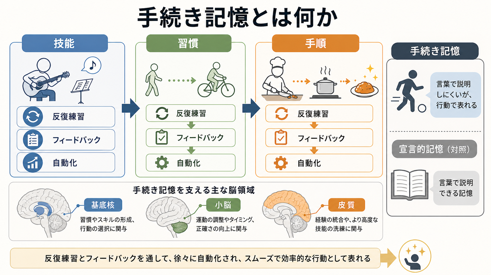
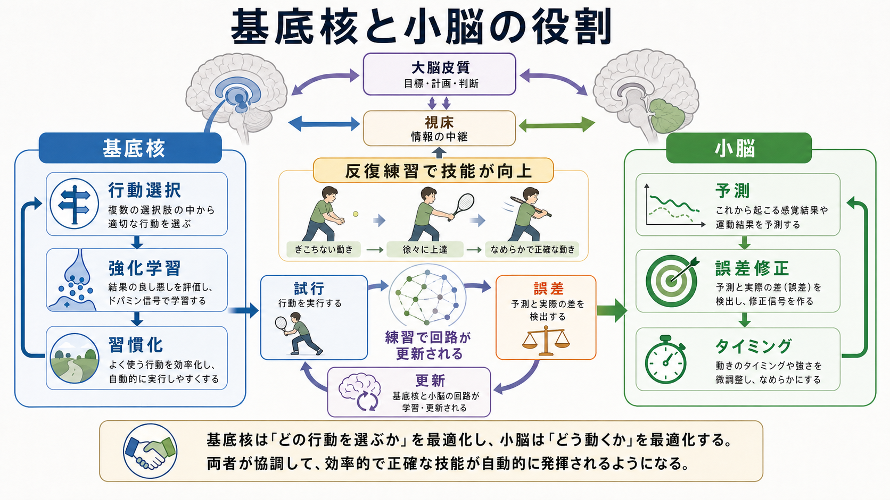
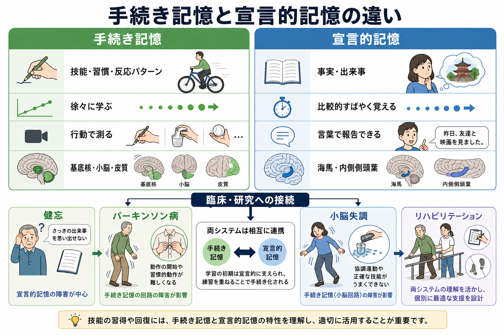

# 手続き記憶とは何か

## 要点

- 手続き記憶は、技能、習慣、反応パターン、系列動作のように、「何を知っているか」よりも「どう行うか」として表れる記憶である。
- 代表例は、自転車に乗る、楽器を弾く、キーボードを打つ、スポーツ動作を調整する、決まった手順を半自動的に実行する、といった技能である。
- 宣言的記憶が事実や出来事を言葉で報告しやすいのに対し、手続き記憶は行動成績、反応時間、誤差の減少、習慣化として測られることが多い[1][2]。
- 基底核は行動選択、強化学習、習慣化に深く関わり、小脳は予測、タイミング、誤差修正に深く関わる[4][5][6]。
- 手続き記憶は単一の場所に保存されるものではなく、皮質、基底核、小脳、視床、感覚運動系が作る複数の[[神経回路とは何か|神経回路]]の変化として理解する方がよい。

## この記事で答える問い

1. 手続き記憶は、宣言的記憶やエピソード記憶と何が違うのか。
2. 技能や習慣は、どのように反復練習から自動化へ移るのか。
3. 基底核と小脳は、手続き記憶の中でそれぞれ何を担うのか。
4. 健忘、パーキンソン病、小脳失調、リハビリテーション研究とどう接続するのか。

## まず結論

手続き記憶とは、行為のやり方が反復経験によって身体化され、意識的に細部を言語化しなくても実行できるようになる記憶システムである。ここでいう「身体化」は、記憶が筋肉に保存されるという意味ではない。実際には、感覚入力、運動計画、行動選択、報酬、誤差修正、皮質-基底核-小脳ループの可塑性が、行動を少しずつ効率化する[1][4][5]。

重要なのは、手続き記憶が「意識に上らない記憶」と完全に同義ではない点である。新しい技能を学び始めるときには、言葉で手順を確認したり、注意を向けたり、失敗理由を考えたりする。練習が進むにつれて、宣言的な説明への依存が下がり、感覚運動ループや習慣ループが行動を支えやすくなる[1][8]。

## 背景

記憶研究では、長期記憶を大きく「宣言的記憶」と「非宣言的記憶」に分ける整理がよく使われる。宣言的記憶は、事実、出来事、概念、エピソードのように、意識的に思い出して言語報告しやすい記憶である。非宣言的記憶には、手続き記憶、プライミング、条件づけ、非連合学習などが含まれる[1]。

この区別を強く印象づけたのが、内側側頭葉損傷による重い健忘を示した H.M. 症例である。H.M. は新しい出来事や事実を覚えることが著しく難しかった一方、鏡映描写のような運動技能課題では、本人が練習経験を明確に覚えていなくても成績が改善した[2][3]。この発見は、記憶が単一の貯蔵庫ではなく、複数の学習システムから成るという考えを支えた。

ただし、現代的には「宣言的記憶は海馬、手続き記憶は基底核」という一対一対応で終わらせない方がよい。技能学習の初期には、課題の理解、注意、作業記憶、視覚情報、言語的方略も働く。熟練に近づくほど、基底核、小脳、運動野、感覚野の分散したネットワーク変化が前面に出る[4][5][8]。この意味で、手続き記憶は[[神経可塑性は発達と学習をどう支えるのか|神経可塑性]]の行動レベルの現れでもある。

## 基本概念

### 手続き記憶

手続き記憶は、手順、技能、習慣、認知的ルールの実行、感覚運動マッピングなどを支える長期記憶である。内容は「説明文」として保存されるというより、特定の状況でどの反応が出やすいか、どの動きがなめらかに実行されるか、どの誤差が次回に反映されるかとして表れる。

### 宣言的記憶

宣言的記憶は、事実記憶とエピソード記憶を含む。たとえば「小脳は運動学習に関わる」と知っていることや、「昨日ピアノを練習した」と思い出せることは宣言的記憶に近い。[[海馬回路は記憶をどう形成するのか|海馬回路]]と内側側頭葉は、この種の記憶形成に重要である[1][2]。

### 技能学習

技能学習では、反復試行により成績が改善する。改善は、反応時間の短縮、誤差の減少、動作のばらつき低下、二重課題への耐性、注意負荷の低下として観察される。ここには、[[運動ネットワークは随意運動をどう生み出すのか|運動ネットワーク]]だけでなく、課題目標、報酬、感覚フィードバック、予測誤差が関わる。

### 習慣

習慣は、状況手がかりによって特定の行動が自動的に呼び出されやすくなる状態である。基底核、とくに線条体を含む回路は、報酬や文脈に応じた行動選択から、反復により省力化された反応パターンへ移る過程に関わる[6][7]。

## 仕組み

### 1. 初期学習では、意識的な方略も使われる

新しい技能を学び始めるとき、人はまずルールや手順を言葉で理解しようとする。楽器なら「指をどこに置くか」、スポーツなら「重心をどこに置くか」、タイピングなら「どのキーをどの指で押すか」を意識する。この段階では、宣言的知識、注意、作業記憶、視覚的手がかりが大きな役割を持つ[1][8]。

しかし、意識的な説明だけでは技能は安定しない。実際の行動では、タイミング、力、姿勢、視覚と体性感覚のずれ、次の動きへの準備が連続的に調整される。したがって、手続き記憶の形成には、説明を覚えるだけでなく、試行、結果、フィードバック、修正の循環が必要になる。

### 2. 基底核は「どの行動を通すか」を学習する

基底核は、候補行動の選択、競合行動の抑制、行動価値に基づく学習に関わる。強化学習の観点では、ある状況である行動を選んだ結果が良かったか悪かったかが、次に同じ状況でその行動が出やすいかどうかを変える。[[ドパミンは報酬だけの物質なのか|ドパミン]]信号は、この価値更新や予測誤差の議論で中心的に扱われる[6][7]。

確率的分類学習課題では、健忘患者が明示的な知識を十分に報告できなくても課題成績を改善できる一方、パーキンソン病やハンチントン病の患者ではこの種の習慣的・線条体系学習が障害されることが示された[6]。これは、手続き学習が内側側頭葉だけに依存しないこと、そして基底核が行動パターンの獲得に重要であることを示す代表的証拠である。

### 3. 小脳は「どう動くか」を予測し、誤差で修正する

小脳は、運動指令から次に生じる感覚結果を予測し、実際のフィードバックとの差を使って制御を更新する。たとえばプリズム適応や到達運動の力場適応では、最初は手先がずれるが、反復により予測が修正され、誤差が減る。この誤差ベース学習は、小脳の内部モデルという考え方で説明されることが多い[5]。

小脳の役割は、バランスや姿勢だけに限られない。タイミング、運動の滑らかさ、系列化、感覚予測、認知課題の時間構造にも関わる。したがって、手続き記憶を「基底核だけの習慣記憶」と見ると、小脳が担う予測と誤差修正の側面を見落とす。

### 4. 皮質は表現を洗練し、技能を文脈へ結びつける

反復練習により、運動野、前運動野、補足運動野、頭頂葉、感覚野などの活動パターンも変化する。初期には広いネットワークが動員され、熟練に伴って課題に必要な表現が効率化される。シナプスレベルでは、[[シナプス可塑性とは何か|シナプス可塑性]]や[[長期増強LTPとは何か|長期増強]]のような仕組みが、経験依存的変化の候補として議論される。

ただし、特定の技能が「一つのシナプス変化」に対応するわけではない。手続き記憶は、感覚、運動、報酬、誤差、文脈をつなぐ[[脳内ネットワークとは何か|脳内ネットワーク]]全体の再編として現れる。

## 図解

この記事の図は、次の 3 つの水準を分けて読むと理解しやすい。

| 図 | 主題 | 読み方 |
|---|---|---|
| 図1 | 手続き記憶の全体像 | 技能、習慣、手順が反復練習とフィードバックを通じて自動化される。 |
| 図2 | 基底核と小脳の役割 | 基底核は行動選択と強化学習、小脳は予測と誤差修正に強く関わる。 |
| 図3 | 宣言的記憶との比較 | 手続き記憶は行動で測られやすく、宣言的記憶は言語報告されやすい。 |

## 臨床・研究との接続

健忘研究では、宣言的記憶が重く障害されても、一部の技能学習が残ることが示された[2][3]。これは、患者本人が「練習した」と思い出せるかどうかと、行動成績が改善するかどうかを分けて測る必要があることを教えてくれる。

パーキンソン病では、黒質ドパミン神経の変性により、基底核ループの行動選択や学習の調整が変わる。これは個別診断や治療指示ではなく、教育・研究目的の一般説明である。臨床では、運動症状、認知、薬物、病期、リハビリテーション課題を分けて評価する必要がある。基底核回路への介入については、[[深部脳刺激DBSは神経回路をどう調節するのか|深部脳刺激DBS]]の理解とも接続する。

小脳損傷では、単純な筋力低下よりも、タイミング、協調、予測、誤差修正の困難が目立ちやすい。小脳が関わる適応学習が崩れると、同じ失敗を次回の動作に反映しにくくなる[5]。

リハビリテーションでは、手続き記憶の考え方は重要である。患者に説明するだけでなく、課題特異的な反復、適切なフィードバック、誤差の調整、成功経験、文脈の再現性を設計する必要がある。ただし、どの練習が最適かは疾患、損傷部位、年齢、疲労、認知機能、目標動作によって変わるため、一般化しすぎないことが重要である。

## よくある誤解

### 誤解1: 手続き記憶は「無意識の記憶」だけである

手続き記憶は、言語化しにくい行動学習として表れることが多い。しかし学習初期には、注意、説明、方略、宣言的知識が関わる。熟練に伴って自動化が進むのであって、最初から完全に無意識で成立するわけではない[1][8]。

### 誤解2: 技能は筋肉に記憶される

「筋肉が覚える」という表現は比喩としては便利だが、神経科学的には不正確である。技能の保持には、脳と脊髄を含む感覚運動回路、基底核、小脳、皮質の可塑性が関わる。

### 誤解3: 基底核は習慣、小脳は運動、海馬は記憶、と完全に分けられる

この分け方は入門的な地図としては役立つが、実際の課題では複数システムが相互作用する。技能学習の初期には海馬系や前頭葉系も関わり、熟練や習慣化に伴って基底核・小脳・皮質ループの比重が変わる[4][8]。

### 誤解4: 自動化は常によい

自動化は効率を上げるが、柔軟性を下げる場合もある。悪いフォーム、依存的な行動、強迫的な反復、誤った手順も、反復により固定化されうる。したがって、手続き記憶では「練習量」だけでなく、どのフィードバックで何を修正するかが重要である。

## 関連ノート

- [[運動ネットワークは随意運動をどう生み出すのか]]
- [[ドパミンは報酬だけの物質なのか]]
- [[神経可塑性は発達と学習をどう支えるのか]]
- [[シナプス可塑性とは何か]]
- [[海馬回路は記憶をどう形成するのか]]
- [[深部脳刺激DBSは神経回路をどう調節するのか]]

### 関連ノート候補

- 宣言的記憶とは何か
- エピソード記憶とは何か
- 意味記憶とは何か
- 技能学習とは何か
- 習慣とは何か
- 基底核とは何か
- 小脳とは何か
- 強化学習とは何か
- 運動学習とは何か

### MOC更新候補

- `content/00_MOC/` 配下の認知科学・心理学系 MOC に、本記事を「認知機能」「記憶」「技能学習」関連として追加する候補。
- 並列ジョブとの衝突を避けるため、本記事作成時点では MOC 本体は更新しない。

## 理解チェック

1. 手続き記憶と宣言的記憶は、何を指標にすると区別しやすいか。
2. H.M. 症例が、複数記憶システムの考え方に与えた示唆は何か。
3. 基底核は、技能学習の中でどのような「選択」と「更新」に関わるか。
4. 小脳の予測誤差にもとづく学習は、なぜ運動技能の改善に重要なのか。
5. 自動化された行動が、柔軟性を下げる場合があるのはなぜか。

## 未解決問題

- 手続き記憶、宣言的記憶、作業記憶、注意が、技能学習の各段階でどのように重みを変えるかは、課題によって異なる。
- 基底核と小脳は相互に連絡しているが、その相互作用が習慣、運動障害、認知症状、精神症状にどう関わるかは研究が続いている[4][5]。
- 実験室で測る手続き学習課題が、日常生活の複雑な技能や臨床リハビリテーションにどこまで一般化できるかは慎重に検討する必要がある。

## 参考文献

[1] Squire, L. R., & Dede, A. J. O. (2015). Conscious and unconscious memory systems. *Cold Spring Harbor Perspectives in Biology*, 7(3), a021667. https://doi.org/10.1101/cshperspect.a021667

[2] Corkin, S. (2002). What's new with the amnesic patient H.M.? *Nature Reviews Neuroscience*, 3, 153-160. https://doi.org/10.1038/nrn726

[3] Milner, B., Corkin, S., & Teuber, H.-L. (1968). Further analysis of the hippocampal amnesic syndrome: 14-year follow-up study of H.M. *Neuropsychologia*, 6(3), 215-234. https://doi.org/10.1016/0028-3932(68)90021-3

[4] Doyon, J., Bellec, P., Amsel, R., Penhune, V., Monchi, O., Carrier, J., Lehéricy, S., & Benali, H. (2009). Contributions of the basal ganglia and functionally related brain structures to motor learning. *Behavioural Brain Research*, 199(1), 61-75. https://doi.org/10.1016/j.bbr.2008.11.012

[5] Wolpert, D. M., Miall, R. C., & Kawato, M. (1998). Internal models in the cerebellum. *Trends in Cognitive Sciences*, 2(9), 338-347. https://doi.org/10.1016/S1364-6613(98)01221-2

[6] Knowlton, B. J., Mangels, J. A., & Squire, L. R. (1996). A neostriatal habit learning system in humans. *Science*, 273(5280), 1399-1402. https://doi.org/10.1126/science.273.5280.1399

[7] Graybiel, A. M. (2008). Habits, rituals, and the evaluative brain. *Annual Review of Neuroscience*, 31, 359-387. https://doi.org/10.1146/annurev.neuro.29.051605.112851

[8] Ashby, F. G., Turner, B. O., & Horvitz, J. C. (2010). Cortical and basal ganglia contributions to habit learning and automaticity. *Trends in Cognitive Sciences*, 14(5), 208-215. https://doi.org/10.1016/j.tics.2010.02.001
