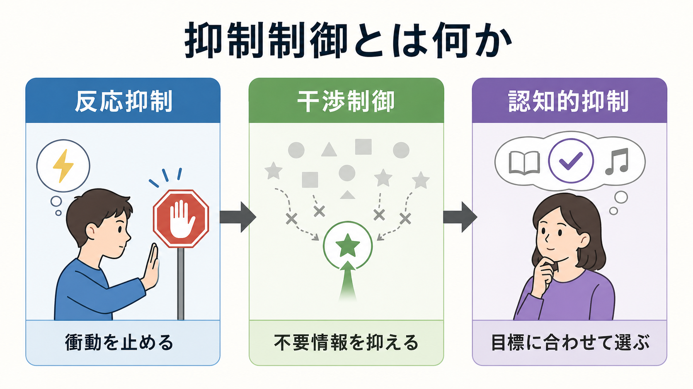
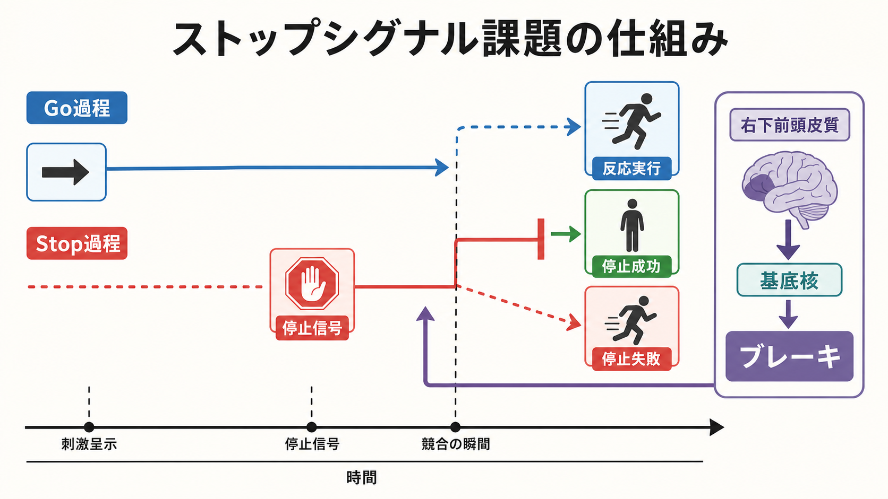
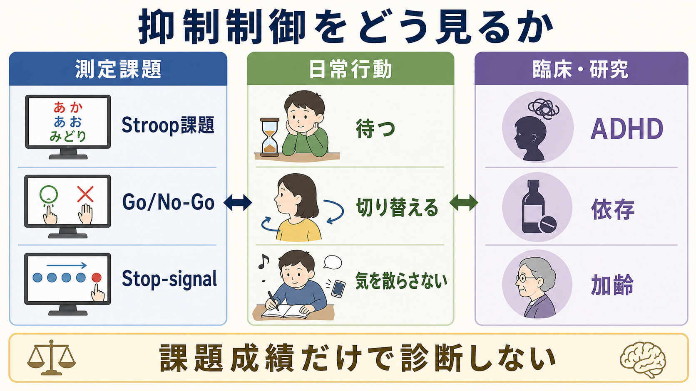

# 抑制制御とは何か

## 要点

- 抑制制御とは、目標に合わない反応、注意、思考、記憶検索を弱めたり止めたりする[[中央実行系とは何か|実行機能]]の一部である。
- 代表的には、衝動的な行動を止める「反応抑制」、競合する刺激を無視する「干渉制御」、不要な思考や記憶を抑える「認知的抑制」に分けて考える。
- 測定には Stroop 課題、Go/No-Go 課題、stop-signal 課題などが使われるが、単一課題の成績だけで「抑制制御そのもの」を純粋に測れるわけではない。
- 神経機構としては、前頭前野、前頭頭頂ネットワーク、右下前頭皮質、前補足運動野、[[大脳基底核ループとは何か|大脳基底核]]を含む前頭基底核回路が重要である。
- ADHD、依存、強迫症状、加齢、前頭葉損傷などと関係づけて研究されるが、課題成績は診断名ではなく、機能の一側面として読む必要がある。

## この記事で答える問い

- 抑制制御は「我慢」や「意志力」と同じなのか。
- 反応抑制、干渉制御、認知的抑制はどう違うのか。
- Stroop 課題や stop-signal 課題は何を測っているのか。
- 抑制制御の脳内メカニズムはどのように考えられているのか。
- 臨床や研究で抑制制御を扱うとき、どこに注意すべきか。

## まず結論

抑制制御は、単に「衝動を我慢する力」ではなく、現在の目標にとって邪魔になる反応や情報処理を調整する[[注意とは何か|注意]]・行動・思考の制御機能である。実行機能の中核要素として、[[ワーキングメモリとは何か|ワーキングメモリ]]、認知的柔軟性、[[計画能力とは何か|計画能力]]と相互に働く[1]。

ただし、抑制制御は一枚岩ではない。色名を答えるために単語の意味を無視する Stroop 課題、反応すべき刺激と止まるべき刺激を分ける Go/No-Go 課題、すでに始まりかけた反応を停止信号で止める stop-signal 課題では、似た「抑える」働きが関わる一方で、必要な処理は異なる[2]。

## 背景

日常生活では、目の前の刺激にすぐ反応するだけではうまくいかない。会議中に通知を見ない、怒りのまま発言しない、読みたい情報だけに[[選択的注意はどのように働くのか|選択的注意]]を向ける、途中で思いついた別作業に流されない。これらはすべて、何かを「する」能力だけでなく、別の何かを「しない」能力に支えられている。

心理学では、抑制制御は実行機能の一部として位置づけられる。Diamond は中核的実行機能として、抑制制御、ワーキングメモリ、認知的柔軟性を挙げ、抑制制御の中に反応抑制と干渉制御を含めて整理している[1]。Miyake らの潜在変数研究も、抑制、更新、シフティングが互いに関連しながら分離可能であることを示し、実行機能を単一能力としてではなく、共通性と多様性をもつ制御過程として扱う視点を強めた[2]。

## 基本概念

### 反応抑制

反応抑制は、すでに準備された、あるいは自動的に出やすい行動反応を止める働きである。たとえば、Go/No-Go 課題では多くの Go 刺激に反応する準備が高まるため、まれな No-Go 刺激で反応を止めることが難しくなる。stop-signal 課題では、反応開始後に停止信号が出され、その時点から反応を止められるかが問題になる[5]。

ここで重要なのは、反応抑制が「反応しない性格」ではないという点である。素早く反応する方略、注意の揺らぎ、運動速度、課題理解、動機づけも成績に影響する。

### 干渉制御

干渉制御は、目標と競合する刺激や反応傾向を抑え、必要な情報処理を保つ働きである。典型例は Stroop 課題で、色名を読む自動的傾向を抑え、インク色を答える必要がある[4]。これは[[トップダウン注意とボトムアップ注意は何が違うのか|トップダウン注意]]が、刺激に引き寄せられる処理を調整する場面といえる。

干渉制御は、注意の焦点化、競合モニタリング、反応選択を含むため、単なる「無視」ではなく、目標に合う情報と合わない情報の重みづけである。

### 認知的抑制

認知的抑制は、不要な思考、記憶、解釈、連想が作業中の表象を乱さないようにする働きである。たとえば、読むべき文に関係ない記憶が浮かんでも作業を続ける、以前のルールを引きずらず新しいルールに従う、といった場面に関わる。

Nigg は、発達精神病理の文脈で「抑制」を一括りに扱う危険を指摘し、実行的抑制、動機づけに関わる抑制、自動的注意抑制などを区別する必要を論じた[3]。この区別は、臨床研究で「脱抑制」と呼ばれる現象が、常に同じ認知メカニズムを意味するわけではないことを教えてくれる。

## 仕組み

抑制制御は、単一の「抑制中枢」が命令を出すというより、複数の脳領域が状況に応じて反応傾向の優先度を変える仕組みとして理解される。

反応抑制の代表モデルである stop-signal 課題では、Go 過程と Stop 過程が競争すると考える。Go 過程が先に閾値へ達すると反応が実行され、Stop 過程が先に十分強くなると反応が停止される[5]。この枠組みは、停止成功率だけでなく、stop-signal reaction time（SSRT）という推定指標を用いて、停止過程の速さを扱える点に特徴がある。

神経科学では、右下前頭皮質が反応傾向にブレーキをかけるネットワークの要所として議論されてきた。Aron らは、右下前頭皮質が前補足運動野や大脳基底核を含む前頭基底核ネットワークとともに、外的な停止信号や内的な目標に応じて行動を停止・一時停止・減速させると整理している[6]。この見方は、[[前頭頭頂ネットワークは認知制御をどう支えるのか|前頭頭頂ネットワーク]]やサリエンス処理との関係も含めて拡張されている。

一方で、抑制制御を「右下前頭皮質だけ」の機能に還元するのは過度に単純である。Bari と Robbins は、前頭前野、線条体、視床、運動関連領域、神経修飾系が協調し、行動の開始・停止・選択を調整すると論じている[7]。つまり抑制制御は、反応を消すだけでなく、競合する選択肢の中から目標に合う行動を通す制御でもある。

## 図解

| 側面 | 代表課題 | 主な読み取り | 注意点 |
|---|---|---|---|
| 反応抑制 | Go/No-Go、stop-signal | 衝動的反応を止める、始まりかけた反応を止める | 運動速度、待機方略、注意持続の影響を受ける |
| 干渉制御 | Stroop、Flanker | 競合する刺激・反応を抑える | 処理速度や読み能力の影響を受ける |
| 認知的抑制 | directed forgetting、task switching 関連課題 | 不要な記憶・ルール・思考の影響を弱める | ワーキングメモリや方略の影響が大きい |

## 臨床・研究との接続

抑制制御は、ADHD、依存、強迫症、前頭葉損傷、パーキンソン病、加齢など、多くの臨床・発達研究で扱われる。ADHD 研究では、stop-signal 課題のメタ分析により、ADHD 群で平均反応時間、反応時間変動、SSRT に差がみられることが報告されている[8]。これは[[ADHDは前頭線条体回路の障害として説明できるのか|前頭線条体回路]]や実行機能の観点から ADHD を理解する一つの根拠になる。

ただし、課題成績は個別診断や治療方針を単独で決めるものではない。臨床場面では、睡眠、薬物、抑うつ、不安、動機づけ、知的能力、環境負荷、学習歴などが抑制課題の成績に影響する。したがって、「抑制制御が弱い」という表現は、研究で示された機能差や評価上の仮説として扱い、本人の人格や意志力の欠如として断定しないことが重要である。

研究上も、単一課題の差を「抑制の差」と短絡しない必要がある。複数課題、反応時間分布、誤反応、方略、信頼性、潜在変数モデルを組み合わせることで、抑制制御のどの側面を見ているのかを明確にしやすくなる。

## よくある誤解

### 抑制制御は「我慢強さ」のことだ

我慢強さは抑制制御と関係するが、同じではない。抑制制御は、刺激、課題ルール、反応準備、報酬、疲労、注意状態に依存する情報処理機能である。人格評価ではなく、状況依存的な制御過程として見る方が正確である。

### 抑制制御が強いほど常によい

抑制が強すぎると、行動開始の遅れ、過度な慎重さ、柔軟性の低下につながる場合がある。適応的なのは、何でも止めることではなく、状況に応じて反応を出す・止める・切り替えるバランスである。

### Stroop 課題の成績だけで抑制制御がわかる

Stroop 課題は干渉制御の古典的課題だが、読みの自動性、処理速度、色覚、言語能力、課題慣れも影響する[4]。抑制制御を評価するには、課題の構造と交絡要因を読む必要がある。

### 脳のブレーキ部位が壊れると抑制制御がなくなる

右下前頭皮質や前頭基底核回路は重要だが、抑制制御は分散したネットワーク機能である[6][7]。損傷や機能差の影響も、課題、文脈、代償過程によって異なる。

## 関連ノート

- [[注意とは何か]]
- [[選択的注意はどのように働くのか]]
- [[トップダウン注意とボトムアップ注意は何が違うのか]]
- [[ワーキングメモリとは何か]]
- [[中央実行系とは何か]]
- [[計画能力とは何か]]
- [[前頭頭頂ネットワークは認知制御をどう支えるのか]]
- [[大脳基底核ループとは何か]]
- [[ADHDは前頭線条体回路の障害として説明できるのか]]

MOC 更新候補: `content/00_MOC/` 配下の認知科学・心理学、実行機能、注意、精神医学研究関連のMOCに追加する。

今後の作成候補: 反応抑制とは何か、干渉制御とは何か、Go/No-Go課題とは何か、Stop-signal課題とは何か、Stroop課題とは何か、SSRTとは何か。

## 理解チェック

1. 抑制制御を「反応抑制」「干渉制御」「認知的抑制」に分けると、日常例はそれぞれ何になるか。
2. stop-signal 課題で、Go 過程と Stop 過程が競争するとはどういう意味か。
3. Stroop 課題の成績を解釈するとき、抑制制御以外にどのような要因を考える必要があるか。
4. ADHD 研究で抑制制御課題が使われるとしても、なぜ課題成績だけで診断してはいけないのか。

## 参考文献

[1] Diamond, A. (2013). Executive functions. *Annual Review of Psychology*, 64, 135-168. https://doi.org/10.1146/annurev-psych-113011-143750

[2] Miyake, A., Friedman, N. P., Emerson, M. J., Witzki, A. H., Howerter, A., & Wager, T. D. (2000). The unity and diversity of executive functions and their contributions to complex "frontal lobe" tasks: A latent variable analysis. *Cognitive Psychology*, 41(1), 49-100. https://doi.org/10.1006/cogp.1999.0734

[3] Nigg, J. T. (2000). On inhibition/disinhibition in developmental psychopathology: Views from cognitive and personality psychology and a working inhibition taxonomy. *Psychological Bulletin*, 126(2), 220-246. https://doi.org/10.1037/0033-2909.126.2.220

[4] Stroop, J. R. (1935). Studies of interference in serial verbal reactions. *Journal of Experimental Psychology*, 18(6), 643-662. https://doi.org/10.1037/h0054651

[5] Logan, G. D., Cowan, W. B., & Davis, K. A. (1984). On the ability to inhibit simple and choice reaction time responses: A model and a method. *Journal of Experimental Psychology: Human Perception and Performance*, 10(2), 276-291. https://doi.org/10.1037/0096-1523.10.2.276

[6] Aron, A. R., Robbins, T. W., & Poldrack, R. A. (2014). Inhibition and the right inferior frontal cortex: One decade on. *Trends in Cognitive Sciences*, 18(4), 177-185. https://doi.org/10.1016/j.tics.2013.12.003

[7] Bari, A., & Robbins, T. W. (2013). Inhibition and impulsivity: Behavioral and neural basis of response control. *Progress in Neurobiology*, 108, 44-79. https://doi.org/10.1016/j.pneurobio.2013.06.005

[8] Alderson, R. M., Rapport, M. D., & Kofler, M. J. (2007). Attention-deficit/hyperactivity disorder and behavioral inhibition: A meta-analytic review of the stop-signal paradigm. *Journal of Abnormal Child Psychology*, 35(5), 745-758. https://doi.org/10.1007/s10802-007-9131-6
