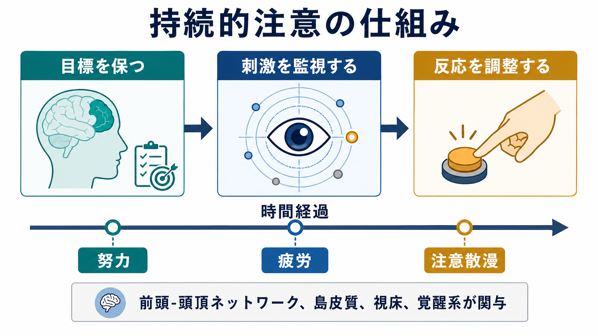
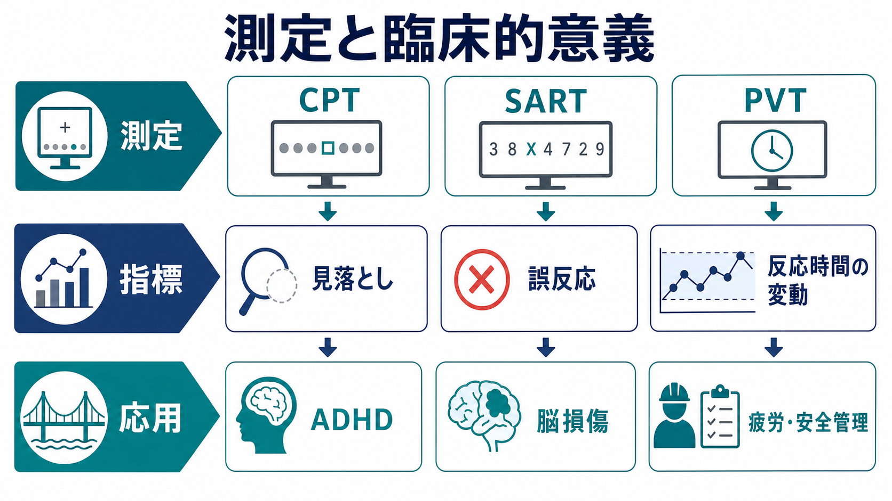

# 持続的注意とは何か

## 要点

- 持続的注意とは、短い瞬間の「気づき」ではなく、数十秒から数分以上にわたって課題目標を保ち、刺激を監視し、適切な反応を続ける能力である。
- 典型的には、CPT、SART、PVT などの連続課題で測定され、見落とし、誤反応、反応時間、反応時間の変動、時間経過に伴う成績低下が指標になる。
- 単なる「やる気」や「性格」ではなく、覚醒水準、前頭-頭頂ネットワーク、島皮質、視床、脳幹・神経調節系、課題の単調さや報酬価値が関わる。
- 臨床では ADHD、外傷性脳損傷、せん妄・認知症、睡眠不足、疲労、安全管理などと関係するが、単一の検査だけで診断を決めるものではない。

## この記事で答える問い

1. 持続的注意は、選択的注意や実行機能と何が違うのか。
2. なぜ「簡単で単調な課題」ほど、注意を保つのが難しくなるのか。
3. どのような検査で測り、どのような臨床的意味をもつのか。

## まず結論

持続的注意は、「今この刺激に気づく」能力というより、**時間のなかで課題セットを保ち続ける能力**である。たとえば、画面にまれに出る標的を見逃さず押す、単調な監視作業で異常を拾う、長い面接や検査中に反応の安定性を保つ、といった場面で必要になる。

注意は瞬間ごとに揺らぐ。Esterman と Rothlein は、持続的注意を一枚岩の能力ではなく、覚醒、マインドワンダリング、認知資源配分、努力、刺激処理から運動反応までの揺らぎが組み合わさる過程として整理している[1]。したがって、成績低下は「怠け」だけでは説明できず、覚醒系、目標維持、疲労、動機づけ、課題設計を一緒に見る必要がある。

## 背景

持続的注意は、英語では sustained attention、vigilance、vigilant attention などと呼ばれる。歴史的には、レーダー監視、航空・鉄道・医療モニタリングのように、まれに起こる重要な信号を長時間見逃さない能力として研究されてきた。Mackworth の時計課題以降、時間が経つにつれて検出率が下がる「vigilance decrement」が重要な現象として扱われている[2]。

ただし、現在の認知神経科学では、持続的注意は単純な覚醒低下だけではなく、課題目標を維持するトップダウン制御、標的と非標的の識別、反応抑制、努力配分、主観的疲労が絡む過程として理解される[2][3]。この点で、[[前頭頭頂ネットワークは認知制御をどう支えるのか]]、[[サリエンスネットワークとは何か]]、[[脳幹網様体は覚醒ネットワークで何をしているのか]]と接続して考えるとわかりやすい。

## 基本概念

### 選択的注意との違い

選択的注意は「何に注意を向けるか」を決める機能であり、妨害刺激のなかから関連刺激を選ぶ過程を含む。持続的注意は「それをどれだけ保てるか」に焦点がある。実際の課題では両者は重なるが、理論上は次のように分けられる。

| 概念 | 中心となる問い | 典型例 |
|---|---|---|
| 選択的注意 | どの刺激を優先するか | 雑音のなかで特定の声を聞く |
| 持続的注意 | どれだけ安定して注意を保つか | 10分間、まれな標的を見逃さない |
| 実行機能 | 目標に沿って行動を制御できるか | ルール変更、反応抑制、計画 |
| 覚醒 | 反応できる準備状態があるか | 眠気、過覚醒、警戒水準 |

Langner と Eickhoff らは、vigilant attention を「約10秒を超えて数分に至る、単純な刺激検出・弁別を効率よく保つ過程」として操作的に整理している[3]。この定義では、空間的注意の移動、複雑な葛藤解決、複数反応の選択などは、持続的注意そのものというより追加の実行的要求として扱われる。

### 何を測っているのか

代表的な課題は次の通りである。

| 課題 | 概要 | 主な指標 |
|---|---|---|
| CPT | 連続する刺激列のなかで標的に反応する、または非標的への反応を抑える | 見落とし、誤反応、反応時間 |
| SART | 高頻度の go 反応のなかで、まれな no-go 刺激への反応を止める | 誤反応、反応時間変動、日常的注意失敗との関連 |
| PVT | 予測しにくいタイミングの刺激に素早く反応する | 反応時間、遅延反応、睡眠不足や疲労の影響 |

CPT は Rosvold らが脳損傷の評価課題として報告して以来、臨床・研究で広く使われてきた[4]。SART は Robertson らが外傷性脳損傷者と健常者の日常的注意失敗を捉える課題として報告し、反応の自動化と抑制失敗を通して注意の揺らぎを可視化する[5]。

## 仕組み

持続的注意の維持には、少なくとも三つの層が関わる。

1. **覚醒・準備状態**  
   眠気が強い、覚醒が低すぎる、または過覚醒で落ち着かない場合、刺激を安定して処理しにくい。脳幹網様体、視床、ノルアドレナリン系、アセチルコリン系は、皮質が刺激に反応できる準備状態を調整する。関連して、[[ノルアドレナリンは覚醒とストレスにどう関わるのか]]、[[アセチルコリンは注意や記憶にどう関わるのか]]が重要になる。

2. **目標維持とトップダウン制御**  
   単調な課題では、標的が出ない時間が長く続く。そのあいだも「何を探すか」「いつ反応するか」という課題セットを保つ必要がある。前頭前野と頭頂葉を含むネットワークは、目標表象と反応準備を支える[3][6]。

3. **時間経過に伴う揺らぎ**  
   注意は一定ではなく、反応時間のばらつき、マインドワンダリング、疲労、努力配分の変化として現れる[1][2]。Warm らは、vigilance は退屈で低負荷な作業ではなく、主観的負荷とストレスを伴う努力的作業だと論じている[2]。

## 図解

持続的注意を一つの図にすると、「目標を保つ」「刺激を監視する」「反応を安定させる」という循環になる。重要なのは、課題が簡単であるほど脳が自動的に安定して働くわけではない点である。むしろ、刺激が単調で報酬が少ないと、外から注意を引き戻す手がかりが減り、内的思考や疲労の影響を受けやすくなる。

臨床・研究での解釈では、次のような分解が役立つ。

| 観察される成績 | ありうる解釈 | 注意点 |
|---|---|---|
| 見落としが多い | 覚醒低下、標的検出の弱さ、課題目標の脱落 | 視力・聴力、理解不足、疲労も確認する |
| 誤反応が多い | 反応抑制の弱さ、衝動性、ルール維持の弱さ | 持続的注意だけの問題とは限らない |
| 反応時間が遅い | 処理速度低下、眠気、慎重さ | 正確性とのトレードオフを見る |
| 反応時間変動が大きい | 注意の揺らぎ、状態調整の不安定さ | ADHD に限らず多くの状態で起こる |
| 時間とともに悪化 | vigilance decrement、疲労、努力配分の変化 | 課題時間・難度・報酬で変わる |

## 臨床・研究との接続

### ADHD

ADHD では、不注意症状、反応抑制、反応時間変動、報酬・状態調整の問題が持続的注意課題に反映されることがある。反応時間変動については、319研究を対象にしたメタ分析で、ADHD 群は非臨床群より反応時間のばらつきが大きい傾向が示されている[7]。ただし、この指標は ADHD に特異的ではなく、睡眠不足、不安、抑うつ、神経疾患、薬剤、課題理解などの影響も受ける。

また、CPT は ADHD 評価でよく使われるが、診断の単独根拠にはならない。小児・青年の ADHD 識別に関するシステマティックレビュー・メタ分析では、市販 CPT の診断性能はおおむね modest to moderate であり、包括的な診断過程の一部として使うべきだと結論づけられている[8]。この点は、[[ADHDは前頭線条体回路の障害として説明できるのか]]と合わせて読むと、行動指標と神経回路仮説の距離が見えやすい。

### 脳損傷・神経心理学

外傷性脳損傷や前頭葉・右半球病変では、日常的には「ぼんやりする」「ミスが続く」「長く作業できない」と表現される問題が、SART や CPT の誤反応・見落とし・反応時間変動として現れることがある[5]。このとき重要なのは、検査室の短い課題で正常範囲に見えても、長時間作業、複数課題、疲労、環境ノイズが加わると困難が顕在化する場合がある点である。

### 安全管理とヒューマンファクター

持続的注意は、運転、監視、医療モニター、産業安全にも直結する。Warm らが強調するように、vigilance は「何も起きない画面を見るだけ」の低負荷作業ではなく、精神的努力とストレスを要する作業である[2]。したがって、個人の注意力だけに責任を置くのではなく、休憩、アラート設計、標的頻度、信号の目立ちやすさ、作業交替、睡眠管理を含めたシステム設計が必要になる。

## よくある誤解

### 誤解1: 持続的注意は集中力の強さだけで決まる

実際には、覚醒、報酬、疲労、睡眠、薬剤、課題の単調さ、刺激の目立ちやすさ、反応ルールの複雑さが影響する。本人の努力不足だけで説明すると、評価も支援も粗くなる。

### 誤解2: CPT が悪ければ ADHD と診断できる

CPT は客観的な行動指標を与えるが、診断検査そのものではない。ADHD の診断は、発達歴、複数場面での症状、機能障害、併存症、睡眠、物質・薬剤、心理社会的文脈を含めて判断される。CPT はその一部の情報である[8]。

### 誤解3: 単調な課題は脳にとって楽である

単調な課題では、外的刺激が注意を自然に引き戻してくれない。むしろ、目標を自分で再活性化し続ける必要があるため、時間とともに努力感やストレスが増え、成績が低下しやすい[2][3]。

## 関連ノート

- [[前頭頭頂ネットワークは認知制御をどう支えるのか]]
- [[サリエンスネットワークとは何か]]
- [[脳幹網様体は覚醒ネットワークで何をしているのか]]
- [[ノルアドレナリンは覚醒とストレスにどう関わるのか]]
- [[アセチルコリンは注意や記憶にどう関わるのか]]
- [[ADHDは前頭線条体回路の障害として説明できるのか]]

### 関連ノート候補

- 注意とは何か
- 選択的注意はどのように働くのか
- 実行機能とは何か
- 反応時間変動とは何か
- CPTとは何か
- SARTとは何か

### MOC更新候補

- `content/00_MOC/` 配下の認知科学・心理学系 MOC
- 注意、実行機能、神経心理検査、ADHD 関連の索引

## 理解チェック

1. 持続的注意と選択的注意の違いを、一文で説明できるか。
2. CPT の見落とし、誤反応、反応時間変動が、それぞれ何を示しうるか説明できるか。
3. 「CPT が悪い = ADHD」と言えない理由を説明できるか。
4. 単調な監視作業を安全に設計するために、個人要因以外に何を変えられるか挙げられるか。

## 未解決問題

- 持続的注意の低下を、覚醒低下、マインドワンダリング、動機づけ低下、疲労、反応抑制の失敗にどこまで分解できるか。
- 反応時間変動が ADHD、睡眠不足、気分症状、神経疾患でどの程度共通し、どの程度異なる機構を反映するか。
- 検査室の短時間課題が、学校・職場・運転・医療安全など現実場面の注意維持をどれだけ予測するか。

## 参考文献

[1] Esterman, M., & Rothlein, D. (2019). Models of sustained attention. *Current Opinion in Psychology, 29*, 174-180. https://doi.org/10.1016/j.copsyc.2019.03.005

[2] Warm, J. S., Parasuraman, R., & Matthews, G. (2008). Vigilance requires hard mental work and is stressful. *Human Factors, 50*(3), 433-441. https://doi.org/10.1518/001872008X312152

[3] Langner, R., & Eickhoff, S. B. (2013). Sustaining attention to simple tasks: A meta-analytic review of the neural mechanisms of vigilant attention. *Psychological Bulletin, 139*(4), 870-900. https://doi.org/10.1037/a0030694

[4] Rosvold, H. E., Mirsky, A. F., Sarason, I., Bransome, E. D., Jr., & Beck, L. H. (1956). A continuous performance test of brain damage. *Journal of Consulting Psychology, 20*(5), 343-350. https://doi.org/10.1037/h0043220

[5] Robertson, I. H., Manly, T., Andrade, J., Baddeley, B. T., & Yiend, J. (1997). "Oops!": Performance correlates of everyday attentional failures in traumatic brain injured and normal subjects. *Neuropsychologia, 35*(6), 747-758. https://doi.org/10.1016/S0028-3932(97)00015-8

[6] Petersen, S. E., & Posner, M. I. (2012). The attention system of the human brain: 20 years after. *Annual Review of Neuroscience, 35*, 73-89. https://doi.org/10.1146/annurev-neuro-062111-150525

[7] Kofler, M. J., Rapport, M. D., Sarver, D. E., Raiker, J. S., Orban, S. A., Friedman, L. M., & Kolomeyer, E. G. (2013). Reaction time variability in ADHD: A meta-analytic review of 319 studies. *Clinical Psychology Review, 33*(6), 795-811. https://doi.org/10.1016/j.cpr.2013.06.001

[8] Arrondo, G., Mulraney, M., Iturmendi-Sabater, I., Musullulu, H., Gambra, L., Niculcea, T., Banaschewski, T., Simonoff, E., Döpfner, M., Hinshaw, S. P., Coghill, D., & Cortese, S. (2024). Systematic review and meta-analysis: Clinical utility of continuous performance tests for the identification of attention-deficit/hyperactivity disorder. *Journal of the American Academy of Child & Adolescent Psychiatry, 63*(2), 154-171. https://doi.org/10.1016/j.jaac.2023.03.011
