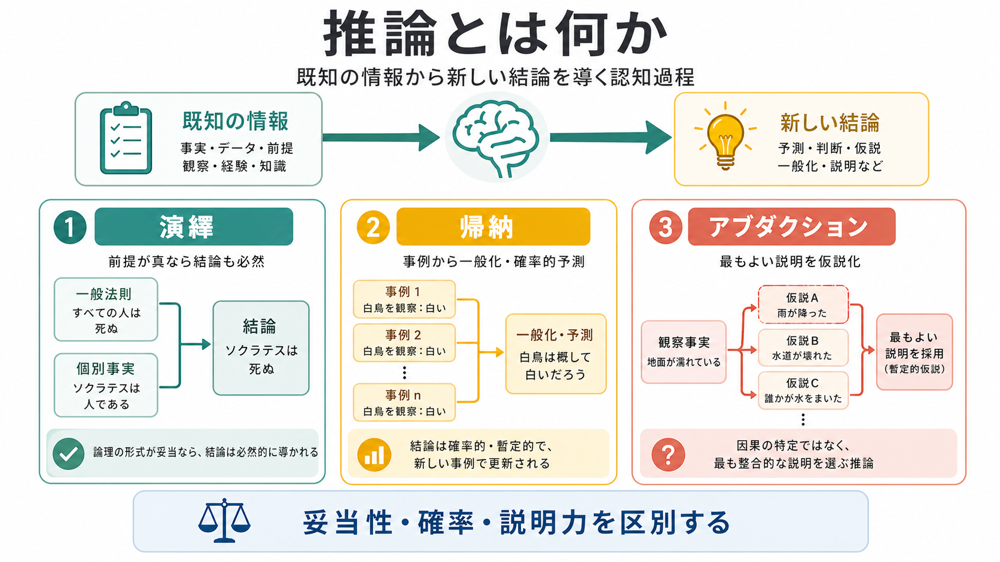
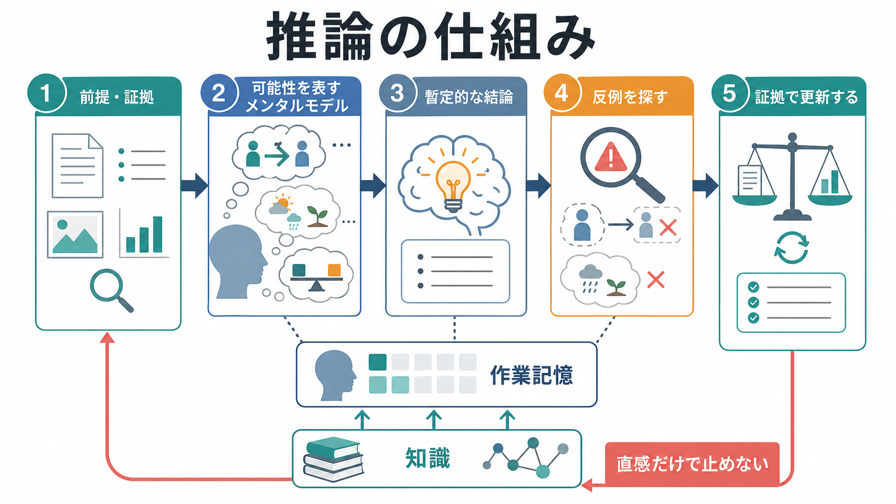
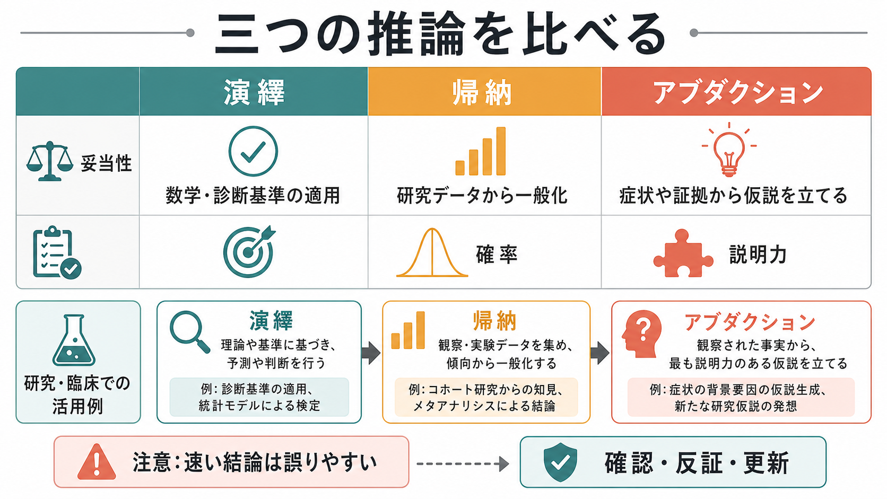

# 推論とは何か

## 要点

- 推論とは、すでに与えられた前提・証拠・経験・知識から、まだ直接は与えられていない結論を導く働きである。
- 演繹は「前提が真なら結論も必ず真になるか」を問う。帰納は「限られた事例から、どれほど一般化できるか」を問う。アブダクションは「観察された事実を最もよく説明する仮説は何か」を問う。
- 人間の推論は、形式論理だけでなく、[[ワーキングメモリとは何か]]、背景知識、信念、確率判断、説明のしやすさ、反例探索に左右される。
- 誤った推論は「知能が低い」ことだけで起きるのではない。速い直感、信念バイアス、確認しやすい証拠への偏り、作業記憶負荷、動機づけが結論を変える。
- 臨床・研究では、妄想形成、認知機能評価、心理教育、科学的仮説形成、意思決定支援を理解する基礎概念になる。

## この記事で答える問い

1. 推論とは、単なる「考えること」と何が違うのか。
2. 演繹・帰納・アブダクションは、どのように使い分けるのか。
3. 人間はなぜ論理的に誤ることがあるのか。
4. 推論研究は、認知科学・心理学・精神医学とどこでつながるのか。

## まず結論

推論とは、情報をそのまま受け取るだけでなく、そこから「だから何が言えるか」を作る認知過程である。たとえば、空が暗い、湿った風が吹く、天気予報で降水確率が高い、という情報から「傘を持っていく方がよい」と結論する。この結論は、目の前に直接書かれていたわけではない。複数の情報を結び、可能性を絞り、行動に使える形へ変換した結果である。

ただし、推論には複数の型がある。演繹は、前提と結論の形式的な関係を調べる。帰納は、限られた観察から一般的な規則や確率的予測を作る。アブダクションは、観察を説明する仮説を作る。三つは競合する分類というより、同じ問題解決の中で役割を分担する道具である。

## 背景

推論研究は、哲学、論理学、心理学、認知科学、人工知能、精神医学にまたがる。形式論理では「どの結論が妥当か」が中心になるが、認知科学では「人間が実際にどのように結論へ到達するか」が問題になる。Johnson-Laird のメンタルモデル理論では、人は前提を心的な可能世界のモデルとして構成し、そのモデルから結論を読み取り、必要に応じて反例を探すと考えられる[1]。

この見方は、推論を「脳内の記号操作」だけに閉じ込めない。人は[[知覚とは何か]]によって得た情報、[[注意とは何か]]によって選ばれた情報、記憶にある知識、現在の目的、社会的文脈を使って推論する。したがって、同じ論理構造でも、内容が現実的か、信じやすいか、損得に関係するかによって、答えやすさが変わる。

## 基本概念

### 推論

推論は、前提から結論へ進む過程である。ここでいう前提は、文章で明示された命題だけではない。観察、症状、実験データ、過去経験、社会的手がかり、専門知識も前提として働く。

推論を理解するうえで重要なのは、結論には強さの違いがあることである。ある結論は、前提が正しければ必ず成り立つ。別の結論は、もっともらしいが例外がある。さらに別の結論は、観察を説明するにはよいが、まだ検証が必要である。この違いが、演繹・帰納・アブダクションの区別につながる。

### 演繹

演繹は、前提が真であれば結論も必然的に真になる推論である。典型例は三段論法である。

| 前提 | 結論 |
|---|---|
| すべての哺乳類は恒温動物である。犬は哺乳類である。 | 犬は恒温動物である。 |

演繹で問題になるのは、結論が現実に正しいかどうかだけではない。前提と結論の形式的なつながり、つまり妥当性である。現実には偽の前提からでも、形式としては妥当な推論がありうる。

### 帰納

帰納は、いくつかの事例から一般的な規則、傾向、確率的予測を導く推論である。たとえば、何度も見たカラスが黒かったことから「カラスは黒いことが多い」と考える。帰納は科学研究、統計、日常学習の基盤であるが、結論は必然ではない。

帰納の強さは、事例数、サンプルの偏り、背景知識、説明モデルによって変わる。Tenenbaum らは、帰納的学習を、単なる頻度の集計ではなく、構造化された知識表象の上でのベイズ的推論として捉える枠組みを示した[6]。

### アブダクション

アブダクションは、観察された事実を最もよく説明する仮説を立てる推論である。たとえば、朝に道路が濡れているのを見て「夜に雨が降ったのだろう」と考える。この結論は必然ではない。散水車が通った可能性もある。しかし「雨が降った」は、観察を手早く説明する仮説である。

Stanford Encyclopedia of Philosophy は、現代的なアブダクションを「最良の説明への推論」として整理している[2]。臨床面接、科学的発見、日常の原因推定では、アブダクションがよく使われる。ただし、説明しやすい仮説が正しいとは限らないため、追加証拠で検証する必要がある。

## 仕組み

### 1. 前提を表す

推論は、まず情報を扱える形にするところから始まる。言語で与えられた前提は命題として解釈され、視覚情報は対象や関係としてまとめられ、経験は記憶から検索される。この段階ですでに、[[注意とは何か]]や文脈の影響を受ける。

### 2. 可能性を作る

メンタルモデル理論では、人は前提に合う可能性を頭の中に構成する[1]。たとえば「AならB」という条件文を聞いたとき、人は A と B がともに成り立つ場合をまず考えやすい。しかし、論理的には A でない場合、B でない場合、反例になる場合も検討する必要がある。

### 3. 結論を読み取る

構成されたモデルから、共通して成り立つことを結論として取り出す。演繹では、すべての可能なモデルで成り立つ結論が妥当である。帰納では、観察されたモデルから、まだ観察していない事例への予測を作る。アブダクションでは、観察モデルを最もよくまとめる説明仮説を選ぶ。

### 4. 反例を探す

人間の推論で重要なのは、最初の結論をそのまま採用しないことである。Wason の選択課題は、条件文の検証で人が反例を探すことに苦労しやすいことを示した古典的研究である[3]。また、三段論法では、結論が信じやすいと、論理的に妥当でない結論でも受け入れやすくなる信念バイアスが観察される[4]。

### 5. 速い推論と遅い推論を調整する

二過程理論では、速く自動的な処理と、作業記憶を使う熟慮的処理が区別される。Evans と Stanovich は、Type 1 処理が自律的で速い反応を生み、Type 2 処理が仮説的思考や作業記憶を必要とする高次推論を支えると整理した[5]。ただし、速い処理が常に悪く、遅い処理が常に正しいわけではない。熟達した判断では速い推論が有効に働くこともある。

## 図解

| 種類 | 中心の問い | 強み | 弱点 | 例 |
|---|---|---|---|---|
| 演繹 | 前提が真なら結論は必ず真か | 妥当性を厳密に評価できる | 前提が誤っていれば結論も信用できない | 診断基準の適用、数学的証明 |
| 帰納 | 観察からどれほど一般化できるか | 経験・データから予測できる | サンプルの偏りや例外に弱い | 実験結果から傾向を推定する |
| アブダクション | 何が最もよく説明するか | 仮説形成に向く | 説明しやすさと真実を混同しやすい | 症状から鑑別仮説を立てる |

## 臨床・研究との接続

臨床では、推論は評価・理解・支援のあらゆる場面に関わる。たとえば、ある症状が見られたとき、支援者は「どの疾患か」と直ちに断定するのではなく、生活史、身体疾患、薬剤、環境、発達特性、心理社会的要因を含めて仮説を立てる。これはアブダクションである。その後、追加情報によって仮説を絞り、必要に応じて診断基準や尺度を参照する。ここでは演繹と帰納も加わる。

妄想研究では、少ない情報から早く結論へ飛びつく jumping to conclusions バイアスが議論されてきた。2025年の系統的レビュー・メタ分析は、精神病症状の連続体において、JTC バイアスと妄想的観念との関連を検討している[7]。ただし、こうした知見は個人を診断するための単独指標ではない。研究上の集団差や課題成績は、臨床評価の一部として慎重に読む必要がある。

研究では、仮説形成にアブダクション、データからの一般化に帰納、理論から予測を導く過程に演繹が使われる。たとえば「ある介入が注意制御を改善する」という仮説を立て、実験データから効果の傾向を推定し、理論から新たな予測を導く。推論は、科学の方法そのものの中に埋め込まれている。

## よくある誤解

### 誤解1: 演繹は正しく、帰納やアブダクションは弱い

演繹は妥当性を厳密に扱えるが、現実の問題では前提そのものが不確実であることが多い。帰納とアブダクションは、限られた情報から学習し、仮説を作るために不可欠である。重要なのは、どの推論を使っているかを混同しないことである。

### 誤解2: 論理的に考えれば信念の影響は消える

信念や常識は推論を助ける一方で、妥当性判断を歪めることがある。信念バイアス研究は、結論がもっともらしいと、論理的には不十分な推論でも受け入れやすくなることを示している[4]。

### 誤解3: 直感は常に非合理である

直感は、速く粗いが、経験に支えられる場合には有効である。一方、反例探索、複数仮説の比較、統計的判断のように、[[ワーキングメモリとは何か]]や[[認知的柔軟性とは何か]]を必要とする場面では、熟慮的な推論が重要になる[5]。

### 誤解4: 説明できる仮説は正しい

説明力は重要だが、真理の保証ではない。アブダクションで作った仮説は、観察をよく説明する候補であって、確定結論ではない。反証可能な予測を作り、別の説明と比較し、追加証拠で更新する必要がある。

## 関連ノート

- [[知覚とは何か]]
- [[注意とは何か]]
- [[ワーキングメモリとは何か]]
- [[認知的柔軟性とは何か]]

今後の作成候補:

- 演繹推論とは何か
- 帰納推論とは何か
- アブダクションとは何か
- 信念バイアスとは何か
- Wason選択課題とは何か
- jumping to conclusions バイアスとは何か

MOC更新候補:

- content/00_MOC/ 配下の認知科学・心理学系 MOC に、本記事 `[[推論とは何か]]` を追加する。
- 並列ジョブとの競合を避けるため、本タスクでは MOC 本体は更新しない。

## 理解チェック

1. 「前提が真なら結論も必ず真か」を問う推論は何か。
2. 「限られた観察から一般的傾向を推定する」推論は何か。
3. 「観察を最もよく説明する仮説を立てる」推論は何か。
4. 信念バイアスは、推論のどの部分を歪めやすいか。
5. アブダクションで得た仮説を、そのまま確定結論にしてはいけない理由は何か。

## 参考文献

[1] Johnson-Laird, P. N. (2010). Mental models and human reasoning. *Proceedings of the National Academy of Sciences*, 107(43), 18243-18250. https://doi.org/10.1073/pnas.1012933107

[2] Douven, I. (2021). Abduction. In *The Stanford Encyclopedia of Philosophy*. https://plato.stanford.edu/archives/spr2022/entries/abduction/

[3] Wason, P. C. (1968). Reasoning about a rule. *Quarterly Journal of Experimental Psychology*, 20(3), 273-281. https://doi.org/10.1080/14640746808400161

[4] Evans, J. St. B. T., Barston, J. L., & Pollard, P. (1983). On the conflict between logic and belief in syllogistic reasoning. *Memory & Cognition*, 11, 295-306. https://doi.org/10.3758/BF03196976

[5] Evans, J. St. B. T., & Stanovich, K. E. (2013). Dual-process theories of higher cognition: Advancing the debate. *Perspectives on Psychological Science*, 8(3), 223-241. https://doi.org/10.1177/1745691612460685

[6] Tenenbaum, J. B., Griffiths, T. L., & Kemp, C. (2006). Theory-based Bayesian models of inductive learning and reasoning. *Trends in Cognitive Sciences*, 10(7), 309-318. https://doi.org/10.1016/j.tics.2006.05.009

[7] Doherty, R., Weber, N., Hillier, C., Ross, R., & Balzan, R. (2025). Jumping to conclusions and delusional ideation: A systematic review and meta-analysis across the psychosis continuum. *Clinical Psychology Review*, 120, 102618. https://doi.org/10.1016/j.cpr.2025.102618

## 未解決問題

- 演繹・帰納・アブダクションは、実際の課題遂行中にどの程度分離できるのか。
- 速い推論と遅い推論の区別は、神経機構としてどこまで明確に対応づけられるのか。
- 臨床場面で、推論バイアスを評価・介入に使う場合、個人差と文脈差をどう扱うべきか。
- AI の推論と人間の推論を比較するとき、妥当性、確率、説明力をどの指標で評価すべきか。
