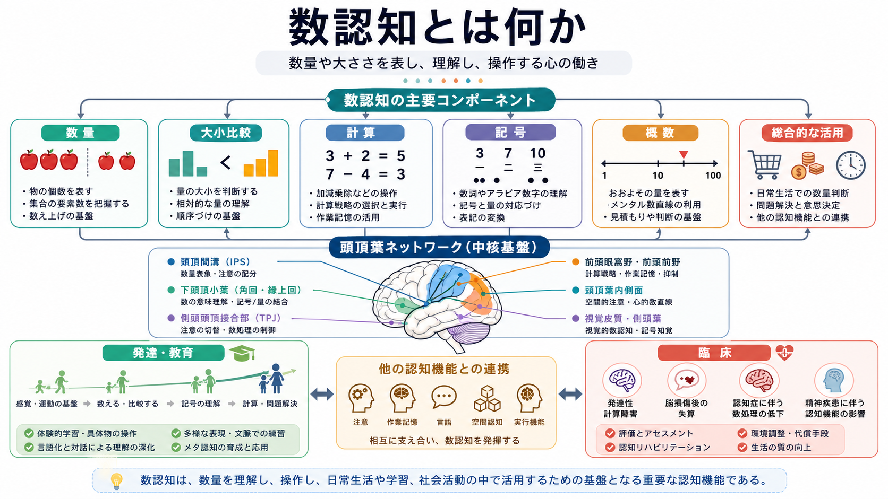
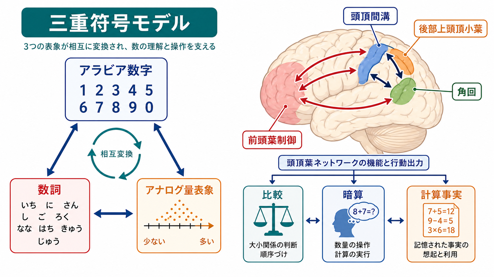
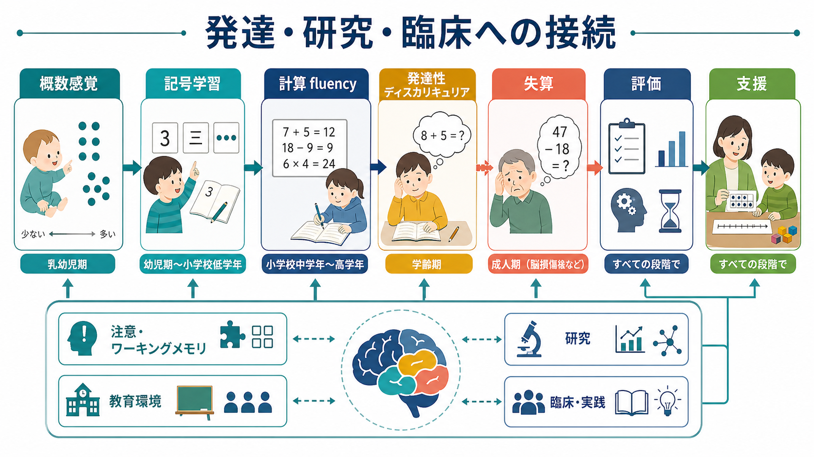

# 数認知とは何か

## 要点

- 数認知とは、個数や量を見積もり、大小を比べ、数詞やアラビア数字を理解し、計算や日常的な数量判断に使う認知機能の総称である[1][2]。
- ヒトの数処理は、概数的な量表象、小さな集合の正確な把握、数詞・記号、言語的な計算事実、空間的な数直線表象などが組み合わさって成立する[3][5]。
- 神経基盤としては、頭頂間溝を中心とする頭頂葉ネットワークが数量意味の表象に強く関与し、角回、後部上頭頂小葉、前頭前野などが課題に応じて加わる[1][2][4]。
- 計算は「数感覚」だけではなく、[[ワーキングメモリとは何か|ワーキングメモリ]]、[[注意とは何か|注意]]、言語、視空間処理、教育経験の影響を受ける複合的な技能である[2][8]。
- 発達性ディスカリキュリアや脳損傷後の失算では、数処理・計算の困難が研究される。ただし、個別の診断や支援は検査成績だけでなく、発達歴、教育環境、注意・記憶、生活機能を含めて総合的に考える必要がある[7][8]。

## この記事で答える問い

1. 数認知とは、単なる「計算力」と何が違うのか。
2. 数量、大小比較、数詞、アラビア数字、暗算はどのように結びつくのか。
3. 頭頂葉、とくに頭頂間溝は数処理にどう関わるのか。
4. 発達・教育・臨床では、数認知をどのように読むべきか。

## まず結論

数認知は、数を「読む」「覚える」「計算する」能力だけではない。目の前の点の数をおおよそ見積もる、2つの量のどちらが大きいか判断する、数詞と記号を対応づける、九九や加算事実を想起する、買い物や時間管理で数量を使う、といった一連の認知機能である。

この機能の中核には、数量を意味として扱う表象がある。脳画像研究と神経心理学研究では、両側の頭頂間溝が数量意味の処理に繰り返し関与することが示されてきた[2][4]。ただし、頭頂間溝だけで数認知が完結するわけではない。言語的な計算事実には左角回や言語ネットワーク、数直線や空間的注意には後部上頭頂小葉、計算手順や方略選択には前頭前野を含む制御系が関わる[2]。

したがって、数認知を理解するには、「数を感じる仕組み」と「文化的に学習された記号・計算」を分けたうえで、両者がどのように接続されるかを見る必要がある。発達や教育の観点では、概数感覚、記号理解、言語、ワーキングメモリ、注意、経験が重なりながら算数・数学の学習を支える。

## 背景

私たちは日常的に数量を扱う。人数を数える、距離を見積もる、値段を比較する、時間を読む、薬の量を確認する、統計グラフを理解する。これらは高度な数学だけでなく、生活の基礎にある認知機能である。

数認知研究が重要なのは、数が「言語」「空間」「記憶」「行動」と交差するためである。たとえば「8」はアラビア数字であり、「はち」は数詞であり、8個の物体の集まりは視覚的な集合であり、数直線上では7と9の間に位置する。計算では、8+7を手続き的に解くことも、15という計算事実を記憶から想起することもある。

Dehaene と Cohen の三重符号モデルは、この複数表象を整理する代表的な枠組みである[1]。このモデルでは、数はアラビア数字表象、言語的表象、アナログ量表象という複数の符号で扱われ、課題によって使われる符号が変わる。後のレビューでは、頭頂葉の複数回路が数量、空間的注意、言語的計算を分担しつつ統合するという見方が整理された[2]。

## 基本概念

### 数量表象

数量表象とは、「いくつあるか」「どれくらい多いか」を扱う心的表象である。正確な数え上げをしなくても、多い・少ないをすばやく判断できることがある。Feigenson、Dehaene、Spelke は、ヒト乳児や動物にもみられる数量処理を、概数的な大きな数の表象と、小さな個体数の比較的正確な表象に分けて整理した[3]。

概数表象は、距離効果や比率効果を示す。たとえば 8 と 9 よりも 2 と 9 の方が大小判断しやすく、20 と 40 よりも 20 と 21 の方が区別しにくい。この性質は、数量が物理的な長さのように無限精度で表されるのではなく、圧縮された内的尺度として表されることを示唆する[4]。

### 数記号

数記号には、アラビア数字、漢数字、数詞、点集合、指の数などが含まれる。数認知の発達では、これらの記号を単に読めるだけでなく、数量意味と結びつけることが重要である。「5」という記号を見て、5個の物、5番目、5円、5分、5より大きい数・小さい数を文脈に応じて理解できるようになる。

### 計算

計算には、手続きと記憶の両方が関わる。繰り上がりを含む筆算では手順を保持し、途中結果を更新する必要がある。九九のような計算事実では、言語的・記憶的な想起が大きい。暗算では、数量意味、作業記憶、注意、方略選択が同時に動くため、[[中央実行系とは何か|中央実行系]]との接続が強い。

## 仕組み

### 三重符号モデル

三重符号モデルでは、数処理は主に3つの符号で整理される[1]。

| 符号 | 例 | 主な役割 |
|---|---|---|
| アラビア数字符号 | `3`, `27`, `105` | 視覚的な数字認識、筆算、記号操作 |
| 言語符号 | 「さん」「二十七」 | 数詞、九九、計算事実、音韻的記憶 |
| アナログ量表象 | 点の多さ、数直線上の位置 | 大小比較、概数、数量意味 |

このモデルの利点は、同じ「数」でも課題によって必要な処理が違うことを説明できる点である。たとえば、数字を読むだけなら視覚・言語変換が中心になる。大小比較では数量意味へのアクセスが重要になる。九九では言語的な記憶から計算事実を引く比重が大きい。

### 頭頂間溝と数量意味

頭頂間溝は、数量意味の処理における中心的な候補領域である。Dehaene らは、数処理に関わる頭頂葉回路として、頭頂間溝、左角回、後部上頭頂小葉を区別した[2]。頭頂間溝は、記号の形式を越えた数量意味、大小比較、概数処理に関わると考えられている。

Piazza らは、ヒトの頭頂間溝が概数の変化に選択的に反応し、その反応が圧縮された数量尺度に合うことを示した[4]。これは、頭頂間溝が単なる視覚処理や言語処理ではなく、数量の意味表象に関与するという見方を支える。

### 空間と数直線

数は空間的に表されることがある。SNARC 効果では、小さい数が左側反応、大きい数が右側反応と結びつきやすいことが示された[5]。これは、数が心的数直線のような空間的構造と結びつく可能性を示す。ただし、この効果は課題、文化、読み書き方向、反応方法に左右されるため、「すべての人が固定的な左から右の数直線を持つ」と単純化してはいけない。

この点は、数認知が[[選択的注意はどのように働くのか|選択的注意]]や視空間処理と結びつくことを示している。後部上頭頂小葉は、空間的注意や視覚探索にも関わるため、数量判断と空間的注意が重なる場面では重要な役割を持つ。

### 記号学習と文化

乳幼児や動物にも概数的な数量処理はみられるが、学校数学はそれだけでは成立しない。子どもは、数詞、数字、数え上げ規則、十進法、演算記号、筆算手続き、文章題の意味を学習する。つまり、数認知は生物学的な量表象を土台にしながら、文化的な記号体系によって拡張される。

この学習では、言語と教育環境が大きく影響する。数詞の規則性、指を使った数え方、具体物操作、図や数直線の使い方、反復練習の質が、数量意味と記号の対応づけを支える。単に「たくさん問題を解く」だけではなく、数量の意味と手続きを結びつけることが重要である。

## 図解

図1は、数認知を数量、大小比較、計算、記号、概数、頭頂葉ネットワーク、発達・教育、臨床の観点から整理した概念地図である。数認知は一つの能力ではなく、複数の表象と処理が連携するシステムとして理解するとよい。

図2は、三重符号モデルと頭頂葉ネットワークの関係を示している。アラビア数字、数詞、アナログ量表象は相互に変換され、比較、暗算、計算事実の想起などに使われる。

図3は、概数感覚から記号学習、学校での計算、発達性ディスカリキュリア、脳損傷後の失算、評価と支援への接続を示す。臨床・教育場面では、検査得点だけでなく、課題の種類、方略、注意、ワーキングメモリ、学習機会を分けて見る必要がある。

## 臨床・研究との接続

### 発達性ディスカリキュリア

発達性ディスカリキュリアは、知的能力や教育機会だけでは説明しにくい数処理・計算の持続的困難として研究される。Kucian と von Aster は、数処理・計算の発達障害が学業や職業生活に影響しうること、また数処理の複数側面と脳構造・機能の差異が関係することを整理している[7]。

ただし、ディスカリキュリアを「頭頂葉の障害」とだけ説明するのは粗い。数詞理解、記号と量の対応づけ、手続き記憶、ワーキングメモリ、注意、不安、教育歴などが絡む。研究上は中核的な数量処理の困難が重視される一方、支援では個々の困難の内訳を見る必要がある[8]。

### 失算

脳損傷後には、数を読む、書く、大小比較する、計算する、計算事実を想起する、といった機能が選択的に損なわれることがある。神経心理学の症例研究は、数処理が単一の能力ではなく、複数の部分処理から成ることを示してきた[1][2]。

臨床的には、失算は言語障害、視空間障害、注意障害、遂行機能障害と重なりやすい。そのため、計算課題の成績だけで病巣や機能を断定するのではなく、どの表記、どの演算、どの手続き、どの生活場面で困難が出るかを評価する必要がある。

### 教育と支援

教育では、概数感覚、具体物操作、数詞、数字、数直線、演算手続き、文章題を段階的に結びつけることが重要である。Butterworth らは、ディスカリキュリア研究を教育へ接続するうえで、数量処理の神経基盤と、数量理解を支える介入の可能性を論じている[8]。

ただし、脳科学から直接「この教材が正しい」と結論するのは危険である。研究知見は、困難の仮説を立てる材料であり、実際の支援では学習履歴、本人の方略、情緒面、家庭・学校環境を含めて調整する必要がある。

## よくある誤解

### 誤解1: 数認知は計算力と同じである

計算力は数認知の一部である。数認知には、概数、大小比較、数詞理解、記号理解、数直線、量の見積もり、日常的な数量判断も含まれる。計算が苦手でも数量比較は保たれることがあり、逆に簡単な計算事実は覚えていても数量意味の理解が弱いこともある。

### 誤解2: 数感覚は生まれつきなので教育では変わらない

概数的な数量処理には早期からみられる側面があるが、学校数学は文化的な記号学習に大きく依存する。数詞、数字、十進法、演算記号、筆算、グラフは学習によって獲得される。教育は、概数表象と記号を結びつける橋渡しとして重要である。

### 誤解3: 頭頂間溝が数の専用領域である

頭頂間溝は数量意味に強く関わるが、注意、空間、運動計画などとも関係する。数処理は頭頂間溝だけではなく、角回、後部上頭頂小葉、前頭前野、言語ネットワーク、記憶系との相互作用で成立する[2][6]。

### 誤解4: 算数の困難は努力不足で説明できる

算数の困難には、数量処理、記号理解、作業記憶、注意、言語、教育経験、情緒面など複数の要因が関わる。努力は重要だが、困難の内訳を見ずに努力不足とみなすと、適切な支援につながりにくい。

## 関連ノート

- [[注意とは何か]]
- [[選択的注意はどのように働くのか]]
- [[持続的注意とは何か]]
- [[ワーキングメモリとは何か]]
- [[ワーキングメモリ容量はなぜ限られているのか]]
- [[中央実行系とは何か]]
- [[記憶の固定化とは何か]]
- [[意味記憶とは何か]]

### 関連ノート候補

- 数直線とは何か
- 概数システムとは何か
- 発達性ディスカリキュリアとは何か
- 失算とは何か
- 頭頂間溝とは何か
- 頭頂葉ネットワークとは何か
- 算数不安とは何か

### MOC更新候補

- 並列実行時の競合を避けるため、本ジョブでは MOC を直接更新しない。
- 統合ジョブで `content/00_MOC/` 配下の認知科学・心理学系 MOC に、本記事を「認知機能」または「学習・数認知」関連として追加するとよい。

## 理解チェック

1. 数認知を「計算力」より広い概念として説明できるか。
2. 三重符号モデルの3つの符号を、それぞれ例つきで説明できるか。
3. 頭頂間溝、角回、後部上頭頂小葉の役割の違いを大まかに説明できるか。
4. 発達性ディスカリキュリアを、単一の脳領域や努力不足だけで説明してはいけない理由を説明できるか。

## 未解決問題

- 概数表象の精度と学校数学の成績は、どの程度直接的に結びつくのか。
- 記号と数量意味の対応づけを、どの介入でどの年齢に最も効果的に支援できるのか。
- 発達性ディスカリキュリアの下位タイプを、行動指標・脳指標・教育反応性からどこまで分けられるのか。
- 数認知、数学不安、注意、ワーキングメモリの因果関係を、縦断研究でどこまで明確にできるのか。

## 参考文献

[1] Dehaene, S., & Cohen, L. (1995). Towards an anatomical and functional model of number processing. *Mathematical Cognition, 1*, 83-120. https://cir.nii.ac.jp/crid/1571698601321260032

[2] Dehaene, S., Piazza, M., Pinel, P., & Cohen, L. (2003). Three parietal circuits for number processing. *Cognitive Neuropsychology, 20*(3-6), 487-506. https://doi.org/10.1080/02643290244000239

[3] Feigenson, L., Dehaene, S., & Spelke, E. (2004). Core systems of number. *Trends in Cognitive Sciences, 8*(7), 307-314. https://doi.org/10.1016/j.tics.2004.05.002

[4] Piazza, M., Izard, V., Pinel, P., Le Bihan, D., & Dehaene, S. (2004). Tuning curves for approximate numerosity in the human intraparietal sulcus. *Neuron, 44*(3), 547-555. https://doi.org/10.1016/j.neuron.2004.10.014

[5] Dehaene, S., Bossini, S., & Giraux, P. (1993). The mental representation of parity and number magnitude. *Journal of Experimental Psychology: General, 122*(3), 371-396. https://doi.org/10.1037/0096-3445.122.3.371

[6] Nieder, A., & Dehaene, S. (2009). Representation of number in the brain. *Annual Review of Neuroscience, 32*, 185-208. https://doi.org/10.1146/annurev.neuro.051508.135550

[7] Kucian, K., & von Aster, M. (2015). Developmental dyscalculia. *European Journal of Pediatrics, 174*(1), 1-13. https://doi.org/10.1007/s00431-014-2455-7

[8] Butterworth, B., Varma, S., & Laurillard, D. (2011). Dyscalculia: From brain to education. *Science, 332*(6033), 1049-1053. https://doi.org/10.1126/science.1201536
