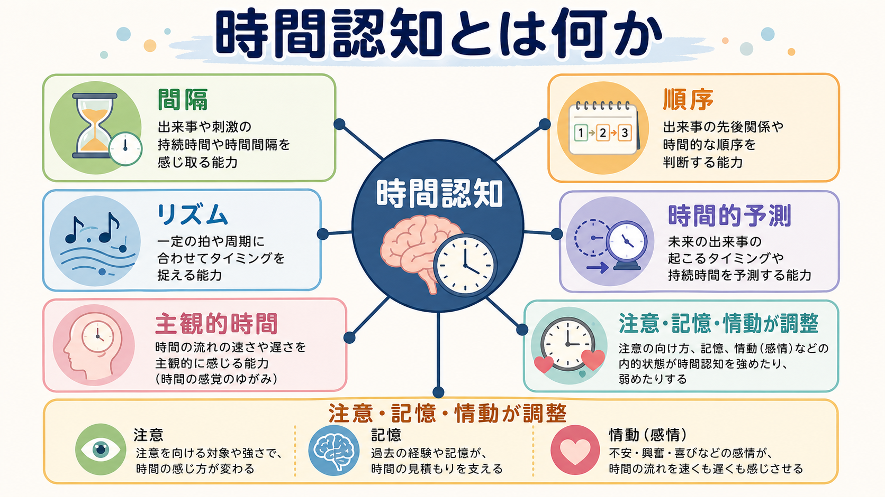
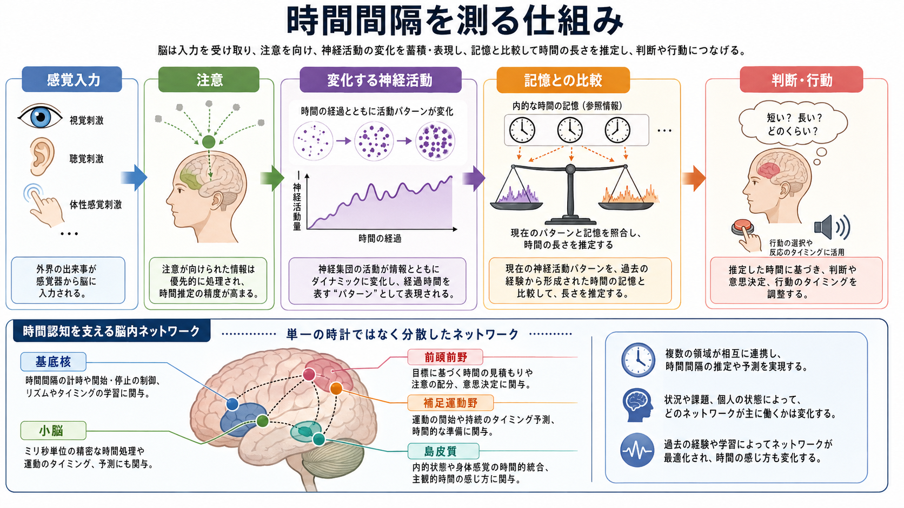
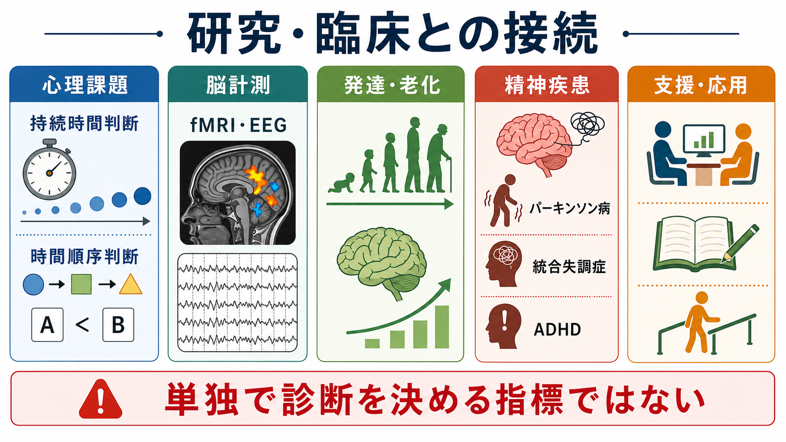

# 時間認知とは何か

## 要点

- 時間認知とは、出来事の長さ、順序、リズム、タイミング、未来の発生時点を推定し、それを知覚・注意・記憶・行動制御に使う認知機能である。
- 脳内に単一の「時計」があるというより、基底核、小脳、前頭前野、補足運動野、島皮質、感覚野などが、課題や時間スケールに応じて協調する分散的な仕組みとして理解される[1][2][3][4]。
- 主観的な時間の速さは、物理時間そのものではなく、注意、覚醒、感情、身体内受容、記憶量、予測誤差によって変化する[5][6]。
- 時間認知の障害は、パーキンソン病、統合失調症、ADHD、加齢、脳損傷などの研究で扱われるが、それだけで診断を決める指標ではない[2][7]。

## この記事で答える問い

この記事では、次の問いに答える。

- 時間認知は「時計を見ること」と何が違うのか。
- 時間間隔、順序、リズム、時間的予測はどのように区別できるのか。
- 脳はどのようにして、まだ起きていないタイミングを予測するのか。
- 時間認知は[[注意とは何か]]、[[ワーキングメモリとは何か]]、[[エピソード記憶とは何か]]とどう関係するのか。
- 臨床や研究では、時間認知をどのように測り、どう解釈するのか。

## まず結論

時間認知とは、外界や身体の変化を「いつ」「どれくらい」「どの順番で」「次にいつ起きそうか」という時間的な構造としてまとめる働きである。これはストップウォッチのように物理時間をそのまま読む機能ではない。むしろ、感覚入力、注意、記憶、運動準備、情動、身体状態を統合して、行動に役立つ時間の見積もりを作る機能である[1][3][6]。

たとえば、会話で相手の返答の間を読む、信号が変わるタイミングを予測する、音楽の拍に合わせる、数秒待つ、過去の出来事の順序を思い出す、嫌な時間が長く感じられる、といった経験はいずれも時間認知に関係する。したがって時間認知は、知覚だけでなく、[[選択的注意はどのように働くのか]]、[[持続的注意とは何か]]、[[中央実行系とは何か]]、[[長期記憶とは何か]]とも深く結びつく。

## 背景

時間は、視覚や聴覚のように一つの受容器で直接検出される対象ではない。網膜には光を受け取る細胞があり、蝸牛には音の振動を受け取る構造があるが、「時間そのもの」を受け取る感覚器はない。そのため脳は、感覚信号の変化、身体状態、行動結果、記憶された出来事を手がかりとして、時間的な構造を推定する[3][4]。

この点で時間認知は、[[知覚とは何か]]と[[記憶の固定化とは何か]]の間にまたがる。現在の刺激がどれくらい続いたかを判断するには、その刺激に注意を向け、変化を追跡し、過去に経験した時間幅と比較する必要がある。さらに、会話・運動・音楽・社会的やりとりでは、未来のタイミングを予測し、行動を前もって準備しなければならない[8]。

## 基本概念

### 時間間隔

時間間隔とは、ある出来事の開始から終了までの長さ、または二つの出来事の間の長さである。心理実験では、数百ミリ秒から数秒程度の間隔を再生する課題、長短を比較する課題、一定時間が経過したと思った時点で反応する課題などで測られる[1][2]。

時間間隔の見積もりは、注意の配分に敏感である。時間に注意を向けると長く感じやすく、別の課題に注意を奪われると短く感じやすい。このため、時間間隔判断は純粋な時計機能ではなく、[[注意とは何か]]や[[認知負荷とは何か]]と一体になった課題として扱う必要がある[6]。

### 時間順序

時間順序とは、出来事 A と出来事 B のどちらが先に起きたかを判断する働きである。視覚と聴覚のように異なる感覚モダリティが関わる場合、物理的には同時でも主観的には片方が先に感じられることがある。これは、感覚処理速度、注意、予測、文脈によって「同時性の窓」が変化するためである[5]。

時間順序は、[[視覚認知はどのように対象を認識するのか]]や[[言語理解はどのように行われるのか]]にも関係する。言語音や会話の理解では、音の順序とタイミングが意味の識別に直結する。

### リズムと周期

リズムは、一定または準一定の時間構造をもつ出来事の系列である。音楽の拍、歩行、発話、呼吸、心拍、日常行動の繰り返しは、時間認知に周期性を与える。リズムがあると、脳は次の出来事が起きるタイミングを予測しやすくなる[8]。

この予測は、単に受け身で待つことではない。次の刺激が来そうな時間に感覚処理や運動準備を高めることで、反応速度や知覚精度を上げる働きがある。時間的な予測は、[[トップダウン注意とボトムアップ注意は何が違うのか]]の具体例としても理解できる。

### 主観的時間

主観的時間とは、物理的な秒数ではなく、本人が感じる時間の長さや速さである。退屈な時間は長く、没頭している時間は短く感じられることがある。恐怖や強い覚醒の場面では、出来事がゆっくり進むように感じられることもある[5][6]。

ただし、主観的時間の変化は一つの原因だけで説明できない。注意が時間に向くか、出来事がどれだけ記憶に残るか、身体内部の変化がどれだけ意識されるか、予測と実際のずれがどれだけ大きいかによって、体験される時間は変化する[6]。

## 仕組み

### 内的時計モデル

時間認知の古典的な説明には、内的時計モデルがある。このモデルでは、脳内にパルスを発生させる機構があり、注意が開いたゲートを通ってパルスが蓄積され、蓄積量が記憶された基準と比較されることで時間間隔が判断される、と考える[1][2]。

このモデルは、時間に注意を向けると長く感じる、覚醒が高いと時間が速く進むように感じる、過去の基準時間との比較が判断を左右する、といった現象を説明しやすい。一方で、脳の中に単一のパルス発生器やカウンターが直接見つかっているわけではない。そのため現在では、内的時計モデルは有用な計算上の比喩であり、実際の神経基盤はより分散的で動的なものと考えられる[3][4]。

### 分散的な神経ダイナミクス

近年の神経科学では、時間は単一の時計が測るというより、神経集団の活動パターンが時間とともに変化し、その変化が時間情報として読まれる、という見方が重視される[4]。たとえば、ある刺激が提示された後、神経活動の状態が少しずつ変化していけば、現在の活動パターンは「刺激からどれくらい経ったか」を含むことになる。

この見方では、時間認知は特定部位だけの機能ではなく、課題に応じて異なるネットワークが時間情報を表現する。感覚刺激の持続を判断する場合は感覚野が重要になり、運動タイミングでは運動関連領域や小脳が重要になり、数秒程度の予測や意思決定では前頭前野、補足運動野、基底核が関わりやすい[2][3][4]。

### 基底核

基底核は、数百ミリ秒から数秒程度の時間間隔、行動選択、報酬予測、運動開始のタイミングに関わるとされる[1][2][3]。特にドパミン系は、時間間隔判断の速さやばらつきに影響する可能性がある。パーキンソン病で時間推定やリズム生成が変化しやすいことも、基底核とドパミンの関与を示す重要な手がかりである[2][7]。

ただし、基底核だけが時間を測るわけではない。基底核は、時間情報を行動選択や開始・停止制御と結びつけるノードとして考えるほうがよい。

### 小脳

小脳は、短い時間幅の精密なタイミング、感覚運動予測、誤差修正に関わる[2][3]。運動をなめらかにするには、筋肉を動かしてから感覚結果を待つだけでは遅すぎる。そのため脳は、次に起きる感覚結果を予測し、ずれを検出して修正する必要がある。小脳はこの予測と誤差修正に重要であり、リズム、発話、眼球運動、運動学習とも関係する。

### 前頭前野・補足運動野・島皮質

前頭前野は、目標、注意配分、作業記憶、判断基準の保持に関わる。時間課題では、どの時間幅に注意を向けるか、どの基準と比較するか、いつ反応するかを制御する[2][3]。これは[[実行機能とは何か]]や[[計画能力とは何か]]と重なる。

補足運動野は、運動の準備、系列化、時間構造をもつ行動に関わる。時間間隔を再生する課題や、一定のリズムで反応する課題では、補足運動野を含む運動関連ネットワークがしばしば関与する[2][3]。

島皮質は、身体内部の状態、内受容感覚、主観的な時間の感覚と関連づけて議論される[6]。時間が長く感じられるとき、そこには外界の変化だけでなく、心拍、緊張、呼吸、身体の違和感のような内的手がかりも関わる可能性がある。

### 時間的予測と注意

時間的予測とは、次の出来事が「何か」だけでなく「いつ」起きるかを予測する働きである。刺激が来る時点を予測できると、その時点に注意を合わせ、処理効率を高めることができる[8]。これは空間的注意が「どこ」に向くかを調整するのに対し、時間的注意が「いつ」に向くことを調整する、と整理できる。

時間的予測は、リズムがある場面で特に強い。たとえば一定のテンポで音が続くと、次の音が来る時点に注意が集まりやすい。日常生活では、会話の間、横断歩道の信号、スポーツの反応、音楽演奏、授業中の発話理解などで使われている。

## 図解

この記事では、時間認知を三つの視点から図解した。

1. 概念地図: 時間認知を、間隔、順序、リズム、時間的予測、主観的時間に分ける。
2. メカニズム図: 感覚入力、注意、変化する神経活動、記憶との比較、判断・行動という処理の流れを見る。
3. 研究・臨床接続図: 心理課題、脳計測、発達・老化、精神疾患、支援・応用を整理する。

## 臨床・研究との接続

### 心理課題

時間認知は、持続時間判断、時間再生、時間産出、時間順序判断、同時性判断、リズム同期、時間的予測課題などで測られる[2][7]。ただし、どの課題も時間認知だけを純粋に測るわけではない。注意、運動反応、記憶、課題理解、報酬、疲労が混ざるため、解釈には課題設計の理解が必要である。

この点は、[[認知機能検査は何を測っているのか]]と同じである。ある検査成績が低いとき、それをすぐに単一機能の障害と断定するのではなく、課題が要求する複数の下位過程を分けて考える必要がある。

### 脳計測

時間認知研究では、fMRI、EEG、MEG、脳刺激、病変研究、薬理学的研究、動物実験が用いられる[2][3][4]。fMRI は時間課題中に活動する脳領域やネットワークを推定するのに有用であり、EEG や MEG はミリ秒単位の時間変化を追いやすい。詳しくは[[fMRIは神経活動を直接測っているのか]]、[[脳波EEGは何を測っているのか]]も参照できる。

### 精神疾患・神経疾患

時間認知の変化は、パーキンソン病、統合失調症、ADHD、うつ、不安、認知症、外傷性脳損傷などで研究されている[2][7]。たとえば、基底核とドパミン系が関わる疾患では、時間間隔の推定やリズム生成が変化しやすい。統合失調症では、時間順序、同時性、自己と外界の出来事の結びつきに関する研究がある。ADHD では、待つこと、遅延、時間管理、時間間隔判断の困難が実行機能や報酬処理と結びつけて検討される。

ただし、時間認知課題の成績は診断名に一対一対応しない。臨床的には、個別診断や治療指示としてではなく、症状理解、認知機能評価、支援方針を考える補助的な視点として扱うのが妥当である。

### 発達・老化

時間認知は発達とともに変化する。幼児期には時間語彙、順序理解、待機、リズム同期、未来の予定理解が少しずつ発達する。成人期には比較的安定するが、加齢に伴って注意、処理速度、記憶、運動制御が変化するため、時間課題の成績も変化しうる[7]。これは[[ワーキングメモリ容量はなぜ限られているのか]]や[[認知的柔軟性とは何か]]とも関係する。

## よくある誤解

### 誤解1: 脳には一つの時計がある

内的時計モデルは有用だが、脳内に一つの機械式時計があるわけではない。現在の研究では、課題、時間スケール、感覚モダリティ、運動要求に応じて複数のネットワークが時間情報を表現すると考えるほうが自然である[3][4]。

### 誤解2: 時間認知は知覚だけの問題である

時間認知には、知覚だけでなく、注意、記憶、予測、意思決定、運動準備、情動、身体感覚が関わる[5][6][8]。そのため、時間が長く感じられる経験を「時計が遅くなった」と表現しても、実際には注意や身体状態が変化している場合が多い。

### 誤解3: 時間課題が苦手なら特定の疾患がある

時間課題の成績だけで、特定の精神疾患や神経疾患を診断することはできない。課題成績は、睡眠、疲労、薬剤、動機づけ、理解度、運動反応、感覚障害にも影響される。研究知見を臨床に接続する場合は、包括的な評価の一部として慎重に読む必要がある。

### 誤解4: 主観的時間は不正確だから研究できない

主観的時間は物理時間と一致しないが、だからこそ研究対象になる。どの条件で長く感じ、どの条件で短く感じるかを調べることで、注意、感情、記憶、身体感覚が時間体験をどう作るかを理解できる[5][6]。

## 関連ノート

既存ノートとして、次のノートと接続しやすい。

- [[注意とは何か]]
- [[持続的注意とは何か]]
- [[選択的注意はどのように働くのか]]
- [[トップダウン注意とボトムアップ注意は何が違うのか]]
- [[ワーキングメモリとは何か]]
- [[ワーキングメモリ容量はなぜ限られているのか]]
- [[エピソード記憶とは何か]]
- [[長期記憶とは何か]]
- [[知覚とは何か]]
- [[実行機能とは何か]]
- [[認知的柔軟性とは何か]]
- [[fMRIは神経活動を直接測っているのか]]
- [[脳波EEGは何を測っているのか]]

MOC更新候補:

- `content/00_MOC/` 配下の認知科学・心理学系 MOC
- 脳・神経科学の神経計測系 MOC
- 将来「時間認知」「予測」「リズム処理」の記事群が増えた場合の小 MOC

## 理解チェック

1. 時間認知は、物理時間をそのまま読む機能ではなく、何を統合する機能か。
2. 時間間隔判断と時間順序判断は、どのように違うか。
3. 内的時計モデルは何を説明しやすく、何を説明しにくいか。
4. 基底核と小脳は、時間認知の中でどのように役割が異なるか。
5. 時間認知課題の成績を、単独で診断指標として扱うべきでない理由は何か。

## 未解決問題

- 時間スケールごとに、どの脳ネットワークがどの程度共通し、どの程度分化しているのか。
- 主観的時間の変化を、注意、覚醒、情動、内受容、記憶のどの要因に分解できるのか。
- 時間認知の個人差が、日常生活の時間管理、衝動性、待機困難、会話の間、運動技能にどれほど影響するのか。
- 時間認知課題を、精神疾患や神経疾患の診断ではなく、支援計画やリハビリテーションにどう活かせるのか。

## 参考文献

[1] Buhusi, C. V., & Meck, W. H. (2005). What makes us tick? Functional and neural mechanisms of interval timing. *Nature Reviews Neuroscience, 6*(10), 755-765. https://doi.org/10.1038/nrn1764

[2] Coull, J. T., Cheng, R. K., & Meck, W. H. (2011). Neuroanatomical and neurochemical substrates of timing. *Neuropsychopharmacology, 36*(1), 3-25. https://doi.org/10.1038/npp.2010.113

[3] Merchant, H., Harrington, D. L., & Meck, W. H. (2013). Neural basis of the perception and estimation of time. *Annual Review of Neuroscience, 36*, 313-336. https://doi.org/10.1146/annurev-neuro-062012-170349

[4] Paton, J. J., & Buonomano, D. V. (2018). The neural basis of timing: Distributed mechanisms for diverse functions. *Neuron, 98*(4), 687-705. https://doi.org/10.1016/j.neuron.2018.03.045

[5] Eagleman, D. M. (2008). Human time perception and its illusions. *Current Opinion in Neurobiology, 18*(2), 131-136. https://doi.org/10.1016/j.conb.2008.06.002

[6] Wittmann, M. (2013). The inner sense of time: How the brain creates a representation of duration. *Nature Reviews Neuroscience, 14*(3), 217-223. https://doi.org/10.1038/nrn3452

[7] Allman, M. J., Teki, S., Griffiths, T. D., & Meck, W. H. (2014). Properties of the internal clock: First- and second-order principles of subjective time. *Annual Review of Psychology, 65*, 743-771. https://doi.org/10.1146/annurev-psych-010213-115117

[8] Nobre, A. C., & van Ede, F. (2018). Anticipated moments: Temporal structure in attention. *Nature Reviews Neuroscience, 19*(1), 34-48. https://doi.org/10.1038/nrn.2017.141
