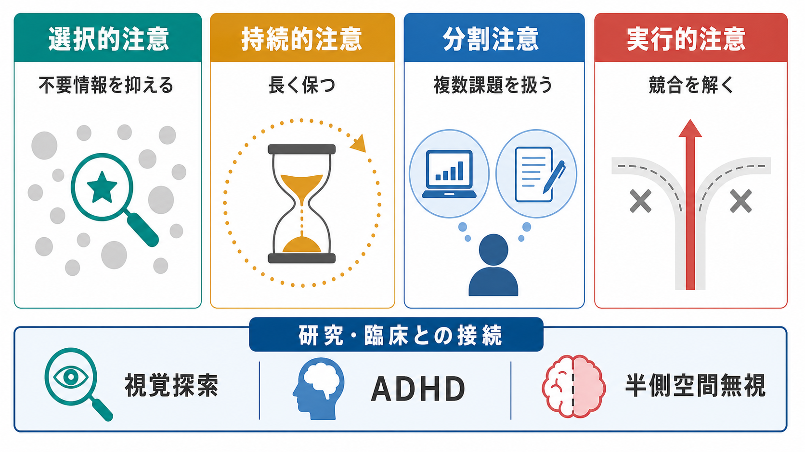

# 注意とは何か

## 要点

- 注意とは、膨大な感覚入力・記憶・目標の中から、いま処理すべき情報の優先度を上げ、不要な情報の影響を下げる仕組みである。
- 注意は「一点に光を当てる能力」だけではなく、選択、維持、切り替え、競合解決、覚醒水準の調整を含む複合的な制御過程である。
- 神経科学的には、前頭・頭頂ネットワーク、視床、サリエンス関連領域、感覚野の相互作用として理解される。
- 注意の障害は ADHD、半側空間無視、意識障害、統合失調症やうつ病における認知機能低下など、研究・臨床の接点が広い。ただし、注意課題の成績だけで個別診断を行うことはできない。

## この記事で答える問い

1. 注意は「集中力」と同じものなのか。
2. 注意はどのように情報を選び、処理資源を配分するのか。
3. トップダウン制御とボトムアップ制御はどう違うのか。
4. 注意研究は臨床や認知神経科学とどこでつながるのか。

## まず結論

注意とは、限られた処理資源をどこに割り当てるかを決める優先度づけの仕組みである。視覚、聴覚、身体感覚、記憶、内的思考は同時に大量の候補を生み出すが、脳はそれらをすべて同じ深さで処理できない。そのため、目標に合う情報、急に現れた刺激、報酬や危険に関わる情報、現在の課題に必要な情報を優先し、ほかの情報を相対的に弱める。

古典的な注意研究では、注意を「選択」として捉えてきた。たとえば視覚探索では、多数の刺激の中から目標だけを見つける必要がある。神経科学では、この選択は感覚野だけで完結せず、前頭・頭頂領域が感覚処理をバイアスする過程として説明されてきた [1][2]。

## 背景

日常生活では、注意はしばしば「集中力」と呼ばれる。しかし、注意は単に頑張って一点を見つめることではない。道路を歩くとき、人は会話、信号、車の音、足元、スマートフォン通知などを同時に受け取る。その中で、いま重要な情報を選び、必要に応じて切り替え、危険な刺激には素早く反応する。この一連の配分が注意である。

注意研究が重要なのは、知覚、記憶、意思決定、行動制御の入口に位置するからである。どの情報が注意によって増幅されるかによって、見えるもの、覚えるもの、判断に使われるものが変わる。したがって、注意は [[ワーキングメモリ容量はなぜ限られているのか]] や [[前頭頭頂ネットワークは認知制御をどう支えるのか]] と密接に関係する。

## 基本概念

### 選択的注意

選択的注意は、複数の刺激の中から特定の対象・場所・特徴を優先する働きである。たとえば、騒がしい部屋で自分の名前に気づく、画面上の赤いアイコンを探す、文章中の誤字を見つける、といった場面で働く。

選択的注意の重要な考え方に、競合バイアス理論がある。複数の刺激は感覚処理の段階で互いに競合し、注意は目標に合う刺激の処理を強めることで、その競合の勝者を変える [2]。これは、注意が「情報を新しく作る」というより、既に入っている情報の優先度を変える仕組みだという見方である。

### 持続的注意

持続的注意は、一定時間にわたって目標への感度を保つ働きである。単調な監視課題、長時間の読書、運転、研究データの確認などでは、短時間の選択よりも、注意を保つことが問題になる。詳しくは [[持続的注意とは何か]] と接続できる。

持続的注意では、トップダウンの目標維持だけでなく、覚醒水準、ノルアドレナリン系、刺激の予測可能性、疲労が関わる。Sarter らは、持続的注意をトップダウン制御とボトムアップ信号が出会う場として整理している [6]。

### 分割注意

分割注意は、複数の課題や情報源を同時に扱う働きである。ただし、分割注意は「処理資源が無限に分裂する」ことではない。二重課題で成績が落ちるのは、反応選択、作業記憶、知覚負荷などの段階で資源競合が起きるためである。

### 実行的注意

実行的注意は、競合する反応や解釈を制御し、目標に沿った行動を選ぶ働きである。ストループ課題のように、自動的な反応と課題目標が衝突する状況でよく測定される。Posner らの注意ネットワーク理論では、警戒、定位、実行制御が区別され、実行的注意は前部帯状皮質や前頭前野を含む制御系と関連づけられる [3][7]。

## 仕組み

### トップダウン注意とボトムアップ注意

注意には大きく、トップダウンとボトムアップの二つの方向がある。

トップダウン注意は、目標、期待、課題ルール、文脈によって決まる。たとえば「青い本を探す」と決めると、青色や本の形に関わる処理が優先される。これは [[中央実行ネットワークとは何か]] や [[前頭頭頂ネットワークは認知制御をどう支えるのか]] と関係する。

ボトムアップ注意は、刺激そのものの目立ちや新奇性によって引き起こされる。突然の大きな音、視野の端で動くもの、予期しない通知などは、意図していなくても注意を引く。Corbetta と Shulman は、目標志向の注意と刺激駆動の注意を区別し、両者が異なるが相互作用する神経システムに支えられると論じた [4]。

### 優先度マップ

注意の仕組みを理解するうえで有用なのが、優先度マップという考え方である。これは、空間・特徴・物体・行動候補に対して「どれがいま処理されるべきか」という重みを置く表現である。

優先度は一つの要因だけで決まらない。課題目標、刺激の目立ち、報酬、危険、身体状態、過去の学習が重ね合わさり、その時点で最も重要な候補が選ばれる。したがって、注意は静的なスポットライトではなく、状況に応じて更新される制御信号として見るほうが正確である。

### 感覚処理を強め、妨害を抑える

注意は、選ばれた情報の処理を強めるだけでなく、競合する情報の影響を抑える。視覚注意の研究では、注意を向けた場所や特徴の処理が増強され、知覚判断が変化することが示されている [7]。この増強は、[[視覚ネットワークはどのように階層的に情報処理するのか]] のような感覚処理階層に対して、上位の制御系が影響する過程として理解できる。

一方で、注意の容量には限界がある。Lavie の負荷理論では、知覚負荷が高いと課題に資源が使われるため妨害刺激の処理が減り、負荷が低いと余った資源が妨害刺激にも流れやすいと説明される [5]。この考え方は、注意散漫を「意志の弱さ」だけでなく、課題設計と処理負荷の問題として考える手がかりになる。

## 図解

注意は、入力刺激から行動までの全経路を調整する。全体像としては、複数の刺激が入力され、目標や新奇性に基づいて優先度がつけられ、選ばれた情報が知覚・記憶・行動に強く影響する。

| 観点 | 典型的な問い | 関連する課題・現象 |
|---|---|---|
| 選択的注意 | どの刺激を選ぶか | 視覚探索、カクテルパーティ効果 |
| 持続的注意 | どのくらい保てるか | 監視課題、長時間作業、疲労 |
| 分割注意 | 複数課題をどう配分するか | 二重課題、マルチタスク |
| 実行的注意 | 競合をどう解くか | ストループ課題、反応抑制 |

## 臨床・研究との接続

注意は多くの臨床領域で問題になるが、ここでは教育・研究目的の概念整理に留める。個別の診断や治療判断は、症状、発達歴、生活機能、併存症、環境要因を含む包括的評価が必要である。

ADHD では、不注意、多動性、衝動性が主要症状として扱われる。NIMH も、細部への注意困難、課題の持続困難、忘れやすさなどを説明している [8]。ただし、ADHD は「注意がまったくない状態」ではない。報酬、興味、刺激性、時間圧によって注意が大きく変動することがあり、[[ADHDは前頭線条体回路の障害として説明できるのか]] のような前頭線条体回路や実行機能の観点と接続して理解する必要がある。

半側空間無視では、視野や運動の単純な障害だけでは説明できない空間注意の偏りが生じる。これは、注意が感覚入力そのものではなく、空間や行動候補の優先度づけに関わることを示す代表例である。[[皮質視床ループは意識や注意にどう関わるのか]] や [[サリエンスネットワークとは何か]] とも関連する。

研究法としては、反応時間、正答率、視線計測、ERP、fMRI、計算モデルが使われる。たとえば注意ネットワーク研究では、警戒、定位、実行制御を分けて測る枠組みが提案されてきた [1][3]。ただし、課題成績は動機づけ、疲労、理解度、運動反応、視力、睡眠などにも左右されるため、単一課題だけで「注意能力」を断定するのは危険である。

## よくある誤解

### 誤解1: 注意は一つの能力である

注意は一枚岩ではない。選択、維持、分割、切り替え、競合解決、覚醒は部分的に重なるが、同じものではない。ある人が長時間集中するのは得意でも、妨害刺激を抑えるのは苦手、ということはありうる。

### 誤解2: 注意は意志だけで決まる

意志や目標は重要だが、注意は刺激の目立ち、報酬、疲労、睡眠、感情、環境設計にも左右される。通知が多い環境で注意が乱れるのは、本人の性格だけでなく、ボトムアップ信号が頻繁に優先度マップを書き換えるためでもある。

### 誤解3: 注意は感覚入力の後に働く

注意は知覚の後処理ではない。注意は感覚処理の早い段階から影響し、何が見えやすく、何が判断に使われるかを変える [7]。そのため、注意は知覚・記憶・行動選択の入口と出口の両方に関わる。

### 誤解4: マルチタスクは注意を鍛えれば無制限にできる

分割注意には限界がある。二つの課題が同じ処理段階や同じ反応資源を使う場合、練習しても干渉は残る。マルチタスクを上達させるより、環境から妨害を減らし、課題を時間的に分けるほうが有効なことも多い。

## 関連ノート

- [[持続的注意とは何か]]
- [[ワーキングメモリ容量はなぜ限られているのか]]
- [[前頭頭頂ネットワークは認知制御をどう支えるのか]]
- [[中央実行ネットワークとは何か]]
- [[サリエンスネットワークとは何か]]
- [[皮質視床ループは意識や注意にどう関わるのか]]
- [[視覚ネットワークはどのように階層的に情報処理するのか]]
- [[ADHDは前頭線条体回路の障害として説明できるのか]]

## 理解チェック

1. 注意を「処理資源の優先度づけ」として説明すると、単なる集中力という説明より何が見えやすくなるか。
2. トップダウン注意とボトムアップ注意の違いを、日常例で一つずつ説明できるか。
3. 選択的注意、持続的注意、分割注意、実行的注意は、それぞれどのような課題で問題になりやすいか。
4. 注意課題の成績だけで個別診断を断定できない理由は何か。

## 未解決問題

- 注意の「資源」は比喩なのか、それとも神経活動・代謝・ネットワーク制御として定量化できる実体なのか。
- 注意、意識、ワーキングメモリの境界はどこまで分けられるのか。
- 実験室の注意課題の成績は、日常生活の注意困難をどの程度予測できるのか。
- 注意制御の個人差を、教育・職場・臨床支援にどう安全に応用できるのか。

## 参考文献

[1] Posner, M. I., & Petersen, S. E. (1990). The attention system of the human brain. *Annual Review of Neuroscience, 13*, 25-42. https://doi.org/10.1146/annurev.ne.13.030190.000325

[2] Desimone, R., & Duncan, J. (1995). Neural mechanisms of selective visual attention. *Annual Review of Neuroscience, 18*, 193-222. https://doi.org/10.1146/annurev.ne.18.030195.001205

[3] Petersen, S. E., & Posner, M. I. (2012). The attention system of the human brain: 20 years after. *Annual Review of Neuroscience, 35*, 73-89. https://doi.org/10.1146/annurev-neuro-062111-150525

[4] Corbetta, M., & Shulman, G. L. (2002). Control of goal-directed and stimulus-driven attention in the brain. *Nature Reviews Neuroscience, 3*, 201-215. https://doi.org/10.1038/nrn755

[5] Lavie, N. (2005). Distracted and confused?: Selective attention under load. *Trends in Cognitive Sciences, 9*(2), 75-82. https://doi.org/10.1016/j.tics.2004.12.004

[6] Sarter, M., Givens, B., & Bruno, J. P. (2001). The cognitive neuroscience of sustained attention: Where top-down meets bottom-up. *Brain Research Reviews, 35*(2), 146-160. https://doi.org/10.1016/S0165-0173(01)00044-3

[7] Carrasco, M. (2011). Visual attention: The past 25 years. *Vision Research, 51*(13), 1484-1525. https://doi.org/10.1016/j.visres.2011.04.012

[8] National Institute of Mental Health. (n.d.). Attention-Deficit/Hyperactivity Disorder. https://www.nimh.nih.gov/health/topics/attention-deficit-hyperactivity-disorder-adhd
