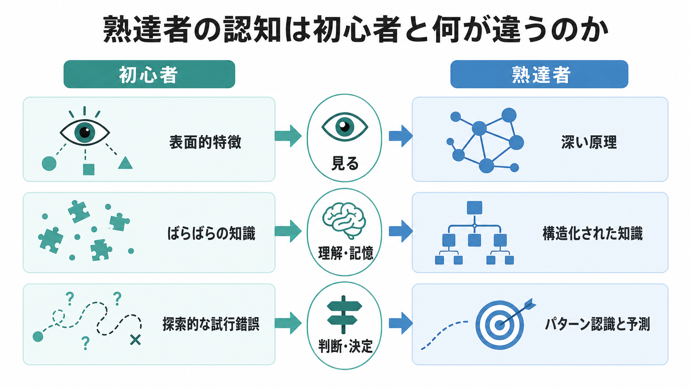
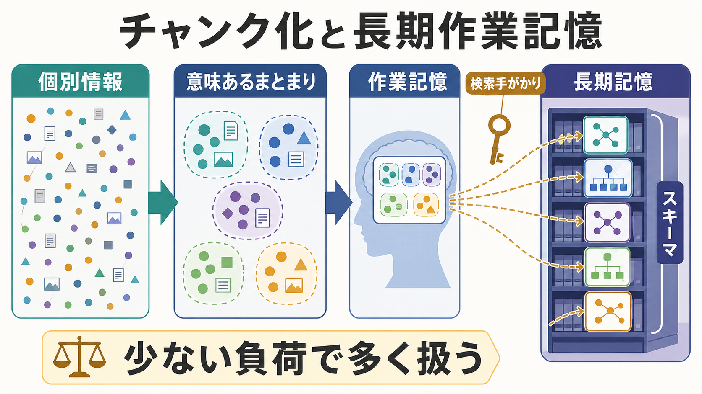
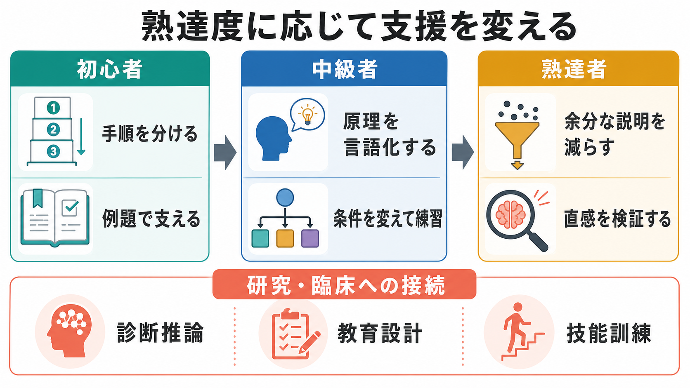

# 熟達者の認知は初心者と何が違うのか

## 要点

- 熟達者は「記憶力がよい人」ではなく、領域固有の知識をよく構造化している人である。
- 初心者は目立つ表面的特徴に引かれやすいが、熟達者は背後の原理・制約・典型パターンを見抜きやすい。
- チャンク化により、熟達者は多くの情報を少数の意味ある単位として扱える。
- 熟達者の直感は経験に支えられた高速なパターン認識だが、すべての状況で正しいわけではない。
- 教育や臨床では、初心者には足場かけを、熟達者には過剰説明を減らしつつ、直感を検証する仕組みを置く必要がある。

## この記事で答える問い

このノートでは、専門知識、[[知覚とは何か]]、[[注意とは何か]]、[[ワーキングメモリとは何か]]、[[長期記憶とは何か]]、[[問題解決とは何か]]の関係から、熟達者と初心者の認知の違いを整理する。中心の問いは、「熟達者は何を多く知っているのか」ではなく、「知識がどのように組織化され、何を見て、どう判断を進めるのか」である。

## まず結論

熟達者の認知は、同じ情報を見ていても「何を情報として拾うか」が初心者と違う。初心者は、目立つ形、言葉、数値、見た目の類似性などに反応しやすい。一方で熟達者は、領域内で意味をもつ制約、因果関係、例外、次に起こりそうな展開をまとめて捉える。これは一般的な頭の良さだけでは説明しにくく、領域固有の知識構造に強く依存する[1]。

## 背景

熟達研究の古典的な入口は、チェス研究である。Chase と Simon は、チェス熟達者が盤面を短時間でよく再現できることを示した。ただし、その優位はランダムに並べた駒では弱まる。つまり熟達者は単に視覚記憶が大きいのではなく、実戦的に意味をもつ配置を「まとまり」として知覚している[2]。

物理問題の分類研究でも同様の傾向がある。初心者は「斜面」「ばね」「円運動」のような表面的特徴で問題を分類しやすいが、熟達者は「エネルギー保存」「ニュートンの法則」のような深い原理で分類しやすい[3]。この差は、[[意味記憶とは何か]]に蓄えられた知識量だけでなく、知識どうしの関係づけ方の差でもある。

## 基本概念

### 専門知識

専門知識とは、事実をたくさん暗記している状態ではない。熟達者の知識は、典型例、反例、手続き、判断基準、失敗しやすい条件が結びついたネットワークとして働く。National Research Council の学習科学レビューは、熟達者の特徴を「何に注意を向けるか」「どう情報を組織化するか」「どの条件で知識を使えるか」の違いとしてまとめている[1]。

### パターン認識

パターン認識とは、目の前の状況を過去に学習した構造と照合し、「これはあの型に近い」と素早く見当をつける働きである。熟達者は、多くの場合、すべての選択肢を一つずつ比較する前に、有望な解釈や行動候補を生成できる。自然主義的意思決定研究では、経験がある人ほど、複雑で時間圧のある状況でも状況を速く分類しやすいことが強調されている[4]。

### チャンク化

チャンク化とは、ばらばらの要素を意味あるまとまりとして扱うことをいう。たとえば初心者には 20 個の別々の記号に見えるものが、熟達者には 4 つの構造として見える。これにより、[[ワーキングメモリとは何か]]の容量制約を直接広げるのではなく、扱う単位の粒度を変えている。

## 仕組み

熟達者の認知を支える仕組みは、少なくとも三層で考えるとわかりやすい。

第一に、知覚と注意の段階で差が出る。熟達者は、領域内で診断価値の高い手がかりに目を向けやすい。初心者は目立つ特徴に引かれやすく、重要だが地味な制約を見落としやすい。

第二に、作業記憶で扱う単位が違う。チャンク化によって、熟達者は個別情報を「意味あるまとまり」に圧縮する。Ericsson と Kintsch は、熟達的な読解や専門的遂行を説明するために、長期記憶内の知識を検索手がかりで素早く利用する「長期作業記憶」を提案した[5]。これは、[[長期記憶とは何か]]が作業中の思考を支えるという見方である。

第三に、問題表象が違う。熟達者は、問題を解く前に「これは何の問題か」を深く表象する。初心者はすぐに手続きへ飛びつきやすいが、熟達者は制約条件、目的、例外、失敗したときの代替案を含めて状況を組み立てる。ここで[[計画能力とは何か]]や[[認知的柔軟性とは何か]]も重要になる。

## 図解

熟達者の認知は、次のような流れとして捉えられる。

| 段階 | 初心者に起こりやすいこと | 熟達者に起こりやすいこと |
|---|---|---|
| 情報の見方 | 目立つ特徴を拾う | 診断価値の高い手がかりを拾う |
| 知識の使い方 | 事実や手順がばらばら | 原理・条件・例外が結びつく |
| 作業記憶 | 個別要素でいっぱいになる | チャンクとしてまとめて扱う |
| 判断 | 試行錯誤が多い | パターン認識で候補を絞る |
| エラー | 原理の取り違えに気づきにくい | 直感が外れる条件を見抜く必要がある |

## 臨床・研究との接続

臨床判断では、熟達者の高速な直感が役立つ場面がある。診断面接、身体診察、画像読影、心理アセスメントでは、経験に基づいて「典型からのずれ」に早く気づくことがある。一方で、直感だけに依存すると、初期印象に合う情報だけを集める危険もある。医学教育の熟達研究では、熟達者に必要なのは常に速く判断することではなく、必要なときに立ち止まって分析的処理へ切り替える判断だと論じられている[6]。

教育設計でも同じことが言える。初心者には、例題、手順の分割、明示的なフィードバックが有効になりやすい。しかし熟達度が上がると、同じ支援が冗長になり、かえって負荷になる場合がある。これは熟達化逆転効果として知られ、学習者の既有知識に応じて支援を変える必要がある[7]。

研究上は、熟達を「練習時間だけ」で説明しすぎないことも重要である。意図的練習は熟達化に重要だが、単なる反復ではなく、明確な目標、即時フィードバック、苦手部分への集中、改善可能な課題設計を含む努力的な練習である[8]。領域、動機づけ、教育環境、身体条件、社会的機会も熟達の形成に関わる。

## よくある誤解

### 誤解1: 熟達者は万能に頭がよい

熟達は多くの場合、領域固有である。チェスの熟達者が、無意味に並べた駒や別領域の問題で常に優位になるわけではない[2]。熟達者の強さは、特定領域の構造をよく知っていることに依存する。

### 誤解2: 熟達者は考えなくても正しい

熟達者の直感は強力だが、環境が変わったとき、手がかりが不完全なとき、まれなケースに遭遇したときには誤る。熟達とは、直感を使う能力だけでなく、直感を疑うタイミングを知る能力でもある[6]。

### 誤解3: 初心者には熟達者と同じ課題を与えればよい

初心者はまだチャンクやスキーマを持たないため、熟達者向けの自由度の高い課題では負荷が高すぎることがある。逆に、熟達者に初心者向けの細かな説明を続けると、既存スキーマの利用を妨げる場合がある[7]。

## 関連ノート

- [[知覚とは何か]]
- [[注意とは何か]]
- [[ワーキングメモリとは何か]]
- [[長期記憶とは何か]]
- [[意味記憶とは何か]]
- [[問題解決とは何か]]
- [[直感と熟慮はどう違うのか]]
- [[メタ認知とは何か]]
- [[計画能力とは何か]]
- [[認知的柔軟性とは何か]]

MOC 更新候補: `content/00_MOC/` 配下の認知科学・心理学系 MOC に、本記事を「熟達・専門知識・問題解決」の項目として追加する。

今後の作成候補: 「チャンク化とは何か」「認知負荷とは何か」「熟達化逆転効果とは何か」「練習はどのように熟達を生むのか」。

## 理解チェック

1. 熟達者が初心者より多くの情報を扱えるように見えるのは、作業記憶の容量が単純に大きいからだろうか。
2. 物理問題の分類で、初心者と熟達者はどのような特徴に注目しやすいか。
3. 熟達者の直感が有効に働きやすい条件と、危険になりやすい条件は何か。
4. 初心者向けの支援が、熟達者には逆効果になりうるのはなぜか。

## 未解決問題

- 熟達者の直感が外れる条件を、現場でどう早期検出するか。
- AI 支援が専門家のパターン認識を補強するのか、それとも過信を増やすのか。
- 領域をまたいで転移する熟達と、領域固有に閉じる熟達をどう区別するか。
- 教育現場で、学習者の熟達度を低負担で推定する方法をどう設計するか。

## 参考文献

[1] National Research Council. (2000). *How People Learn: Brain, Mind, Experience, and School: Expanded Edition*. National Academies Press. https://doi.org/10.17226/9853

[2] Chase, W. G., & Simon, H. A. (1973). Perception in chess. *Cognitive Psychology, 4*(1), 55-81. https://doi.org/10.1016/0010-0285(73)90004-2

[3] Chi, M. T. H., Feltovich, P. J., & Glaser, R. (1981). Categorization and representation of physics problems by experts and novices. *Cognitive Science, 5*(2), 121-152. https://doi.org/10.1207/s15516709cog0502_2

[4] Klein, G. (2008). Naturalistic decision making. *Human Factors, 50*(3), 456-460. https://doi.org/10.1518/001872008X288385

[5] Ericsson, K. A., & Kintsch, W. (1995). Long-term working memory. *Psychological Review, 102*(2), 211-245. https://doi.org/10.1037/0033-295X.102.2.211

[6] Moulton, C.-A. E., Regehr, G., Mylopoulos, M., & MacRae, H. M. (2007). Slowing down when you should: A new model of expert judgment. *Academic Medicine, 82*(10 Suppl), S109-S116. https://doi.org/10.1097/ACM.0b013e3181405a76

[7] Kalyuga, S., Ayres, P., Chandler, P., & Sweller, J. (2003). The expertise reversal effect. *Educational Psychologist, 38*(1), 23-31. https://doi.org/10.1207/S15326985EP3801_4

[8] Ericsson, K. A., Krampe, R. T., & Tesch-Römer, C. (1993). The role of deliberate practice in the acquisition of expert performance. *Psychological Review, 100*(3), 363-406. https://doi.org/10.1037/0033-295X.100.3.363
