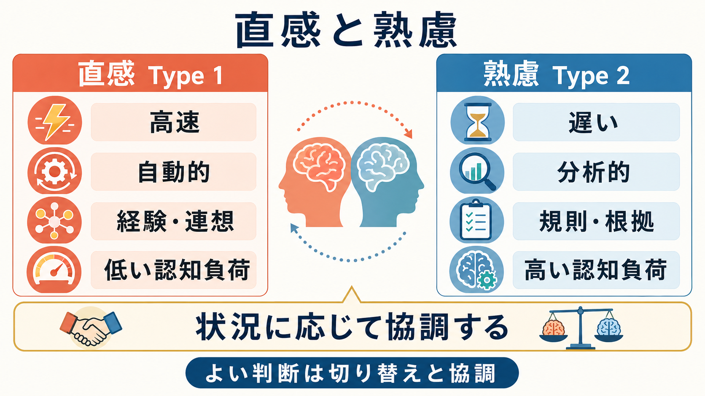
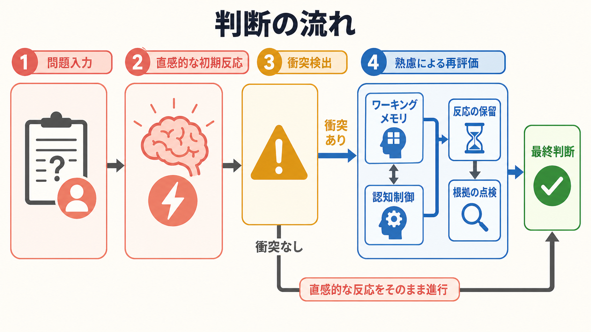

# 直感と熟慮はどう違うのか

## 要点

- 直感は、高速・自動的・低負荷に働く判断であり、経験、連想、感情的手がかり、ヒューリスティックを使いやすい。
- 熟慮は、遅く・意識的・分析的に働く判断であり、根拠の点検、規則の適用、反応の保留に関わる。
- 二重過程理論では、直感を Type 1、熟慮を Type 2 と呼ぶことが多い。ただし、両者は完全に別々の「脳内装置」ではなく、課題や文脈のなかで相互作用する過程として理解する方がよい。
- よい判断とは、常に熟慮することではなく、直感が有効な場面と、いったん止まって検討すべき場面を見分けることである。

## この記事で答える問い

この記事では、二重過程理論を手がかりに、次の問いを整理する。

- 直感的判断と熟慮的判断は何が違うのか。
- なぜ直感は速いのに、時に系統的な誤りを生むのか。
- 熟慮はいつ役立ち、いつ負担になるのか。
- 研究や臨床的な心理教育では、この区別をどう使えるのか。

## まず結論

直感と熟慮の違いは、「感情か理性か」という単純な対立ではない。より正確には、直感は過去経験、環境内の手がかり、連想、身体感覚、感情価をもとに、素早く候補反応を出す処理である。一方、熟慮は、その候補を一時的に保留し、根拠、規則、確率、反例、長期的帰結を点検する処理である。

二重過程理論の古典的整理では、速く自動的な処理を Type 1、遅く分析的な処理を Type 2 と呼ぶ。Evans は、推論、判断、社会的認知の多くの理論が、速く自動的な処理と遅く熟慮的な処理の区別を共有していると整理した[1]。その後、Evans と Stanovich は「System 1 / System 2」という固定的な装置名よりも、「Type 1 / Type 2」という処理特性として考える方が混乱が少ないと論じた[2]。

## 背景

人間の判断は、すべてをゼロから計算しているわけではない。日常生活では、相手の表情を読む、道を渡るタイミングを決める、慣れた作業を進める、といった判断が連続している。これらを毎回、明示的な論理計算として処理していたら、行動は遅すぎる。

そこで私たちは、多くの場面でヒューリスティックを使う。ヒューリスティックとは、限られた情報と時間のもとで、十分に使える答えをすばやく出すための近道である。Tversky と Kahneman は、不確実な判断で代表性、利用可能性、アンカリングといったヒューリスティックが働き、それらはしばしば有効だが、予測可能なバイアスも生むと示した[3]。

この点が重要である。直感は「非合理」ではない。むしろ、限られた時間、注意、[[ワーキングメモリとは何か|ワーキングメモリ]]のなかで、行動可能な候補を出すための適応的な処理である。ただし、問題が直感に合わない形式で提示されたとき、直感はもっともらしいが誤った答えを出すことがある。

## 基本概念

### 直感 Type 1

直感的処理は、速く、自動的で、認知負荷が低い。経験に基づくパターン認識、連想、感情的な重みづけ、身体感覚、環境内の目立つ手がかりに強く影響される。慣れた領域では、直感は非常に有効である。熟練者が状況を一目で把握する、危険を即座に避ける、会話の流れを読む、といった働きは、明示的な計算だけでは説明しにくい。

一方で、直感は「答えやすい問い」に置き換えて答えることがある。Kahneman と Frederick は、難しい判断対象を、より答えやすい属性で代替する「属性置換」として直感的判断を整理した[4]。たとえば「この政策は長期的に有効か」という難しい問いが、「この説明はもっともらしく聞こえるか」という問いにすり替わることがある。

### 熟慮 Type 2

熟慮的処理は、遅く、意識的で、努力を要する。根拠を比較し、規則を適用し、直感的な初期反応を一時停止し、反例や別解を探す。[[中央実行系とは何か|中央実行系]]、[[注意とは何か|注意]]、反応抑制、作業記憶容量と関係が深い。

Frederick の Cognitive Reflection Test は、直感的にはすぐ出るが誤りやすい答えを抑え、分析的に再検討できるかを測る課題として知られる[5]。ここで測られているのは、単なる計算力だけではなく、「最初の答えを疑う」傾向でもある。

## 仕組み

二重過程理論でよく想定される流れは、次のように整理できる。

1. 問題や状況が入力される。
2. 直感的な初期反応がすばやく生じる。
3. その反応が課題要求、規則、確率、既有知識と食い違う場合、衝突が検出される。
4. 衝突が十分に強い、または失敗コストが高い場合、熟慮が反応を保留し、根拠を点検する。
5. 最終判断は、直感的候補と熟慮的検討の相互作用として決まる。

この流れは、直感が常に誤りで、熟慮が常に正しいという意味ではない。De Neys は、推論課題で人が誤答する場合でも、しばしば規範的な答えとの衝突を暗黙に検出していると論じた[6]。つまり、直感のなかにも「論理的・確率的な手がかり」への感受性が含まれる可能性がある。

また、近年の議論では、直感と熟慮を完全に排他的な処理として扱うことへの批判も強い。De Neys は、速い処理と遅い処理の区別は有用だが、「直感では規範的反応が出せない」「熟慮に切り替えれば正しくなる」といった単純なモデルでは不十分だと整理している[7]。

## 図解

上の 2 枚の図は、この記事の要点を次のように整理している。

| 図 | 役割 | 読み方 |
|---|---|---|
| 直感と熟慮の比較 | Type 1 と Type 2 の基本特徴を比較する | 直感は高速・自動的・低負荷、熟慮は遅い・分析的・高負荷。ただし両者は協調する |
| 判断の流れ | 直感的反応から熟慮的再評価へ移る条件を示す | 衝突があると、ワーキングメモリや認知制御が反応保留と根拠点検を支える |

図で示した「衝突検出」は、日常的には「何か変だ」「すぐ答えたが自信がない」「条件を読み落としているかもしれない」といった感覚として現れることがある。この感覚を無視せず、[[選択的注意はどのように働くのか|選択的注意]]を問題の条件へ戻すことが、熟慮を起動する実践的な入口になる。

## 臨床・研究との接続

研究では、直感と熟慮の区別は、推論課題、意思決定、道徳判断、リスク判断、フェイクニュースへの感受性などで使われる。Pennycook と Rand は、偽ニュース見出しの正確性判断において、分析的思考傾向が真偽識別と関連することを報告した[8]。これは、すべての誤信念が単なる党派的動機づけから生じるわけではなく、いったん立ち止まって検討するかどうかも重要であることを示す。

臨床や心理教育では、この区別は「思考を観察する」ための道具として使える。たとえば、不安が強いときには、直感的な脅威検出が過敏になり、「危険そうだ」という初期反応が強くなることがある。ただし、ここから個別の診断や治療方針を直接導くべきではない。教育・研究目的では、次のような整理が有用である。

- 直感的反応: すぐ浮かぶ評価、身体反応、危険感、嫌悪感、安心感。
- 熟慮的点検: 証拠は何か、別解はあるか、確率はどの程度か、今すぐ決める必要があるか。
- 注意の調整: [[トップダウン注意とボトムアップ注意は何が違うのか|トップダウン注意]]で、目立つ手がかりだけでなく、見落とした条件へ注意を戻す。

## よくある誤解

### 誤解1: 直感は悪く、熟慮は良い

直感は、慣れた環境や時間制約のある状況で有効である。問題は、直感が使っている手がかりと、実際に判断すべき対象がずれる場合である。熟慮も万能ではなく、時間がかかり、負荷が高く、過剰になると決断を遅らせる。

### 誤解2: System 1 と System 2 は脳の別々の場所にある

「System」という言い方は便利だが、実体として 2 つの箱が脳内にあるわけではない。現在は、Type 1 / Type 2 のように、処理の性質として理解する方が慎重である[2]。

### 誤解3: 熟慮すれば必ずバイアスを避けられる

熟慮は反応を点検する力を与えるが、動機づけ、知識不足、過信、疲労、時間圧の影響を受ける。熟慮そのものが、都合のよい結論を正当化する方向に使われることもある。

### 誤解4: 直感と熟慮は完全に順番に働く

実際には、直感的な感受性のなかに論理的・確率的な手がかりが含まれることがあり、熟慮も既有知識や直感的評価に支えられる。近年の議論では、両者の境界は固定的ではなく、相互作用的に考える必要がある[7]。

## 関連ノート

既存ノートとしては、次の項目と接続しやすい。

- [[ワーキングメモリとは何か]]
- [[ワーキングメモリ容量はなぜ限られているのか]]
- [[中央実行系とは何か]]
- [[注意とは何か]]
- [[選択的注意はどのように働くのか]]
- [[トップダウン注意とボトムアップ注意は何が違うのか]]

今後の作成候補:

- ヒューリスティックとは何か
- 認知バイアスとは何か
- Cognitive Reflection Test とは何か
- 意思決定とは何か
- メタ認知とは何か

MOC 更新候補:

- `content/00_MOC/` 配下の認知科学・心理学 MOC
- 認知機能、意思決定、推論、注意、ワーキングメモリに関する索引

## 理解チェック

1. 直感的判断が有効になりやすいのは、どのような環境か。
2. 直感的な初期反応を熟慮で点検した方がよいのは、どのような条件か。
3. 「直感は悪く、熟慮は良い」という説明は、なぜ不十分か。
4. Type 1 / Type 2 と System 1 / System 2 を区別して考える利点は何か。

## 未解決問題

- 直感と熟慮の境界を、行動データ、反応時間、生理指標、神経指標からどこまで分離できるか。
- 衝突検出が起きても熟慮に移らない場合、何が切り替えを妨げるのか。
- 専門家の直感と、初心者の思い込みをどう区別するか。
- 教育や臨床的心理教育で、熟慮を促す介入がどの範囲で有効か。

## 参考文献

[1] Evans, J. St. B. T. (2008). Dual-processing accounts of reasoning, judgment, and social cognition. *Annual Review of Psychology, 59*, 255-278. https://doi.org/10.1146/annurev.psych.59.103006.093629

[2] Evans, J. St. B. T., & Stanovich, K. E. (2013). Dual-process theories of higher cognition: Advancing the debate. *Perspectives on Psychological Science, 8*(3), 223-241. https://doi.org/10.1177/1745691612460685

[3] Tversky, A., & Kahneman, D. (1974). Judgment under uncertainty: Heuristics and biases. *Science, 185*(4157), 1124-1131. https://doi.org/10.1126/science.185.4157.1124

[4] Kahneman, D., & Frederick, S. (2002). Representativeness revisited: Attribute substitution in intuitive judgment. In T. Gilovich, D. Griffin, & D. Kahneman (Eds.), *Heuristics and Biases: The Psychology of Intuitive Judgment* (pp. 49-81). Cambridge University Press. https://doi.org/10.1017/CBO9780511808098.004

[5] Frederick, S. (2005). Cognitive reflection and decision making. *Journal of Economic Perspectives, 19*(4), 25-42. https://doi.org/10.1257/089533005775196732

[6] De Neys, W. (2012). Bias and conflict: A case for logical intuitions. *Perspectives on Psychological Science, 7*(1), 28-38. https://doi.org/10.1177/1745691611429354

[7] De Neys, W. (2023). Advancing theorizing about fast-and-slow thinking. *Behavioral and Brain Sciences, 46*, e111. https://doi.org/10.1017/S0140525X2200142X

[8] Pennycook, G., & Rand, D. G. (2019). Lazy, not biased: Susceptibility to partisan fake news is better explained by lack of reasoning than by motivated reasoning. *Cognition, 188*, 39-50. https://doi.org/10.1016/j.cognition.2018.06.011
