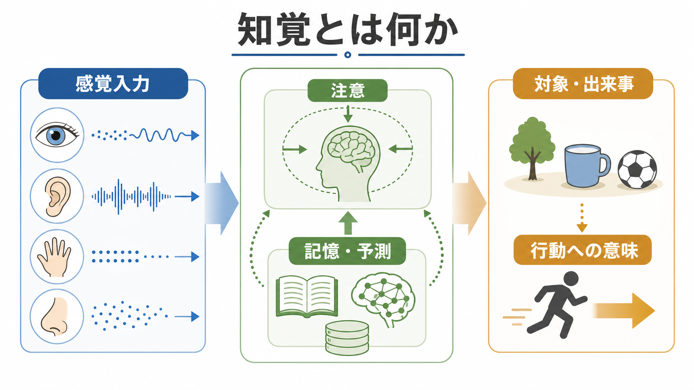
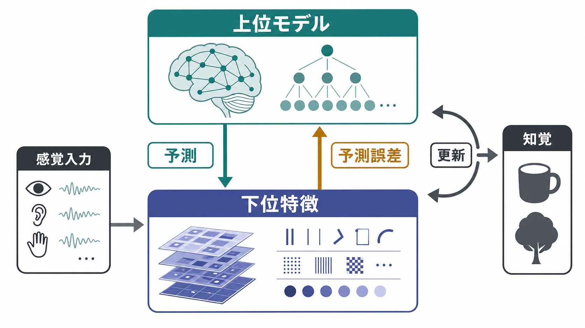
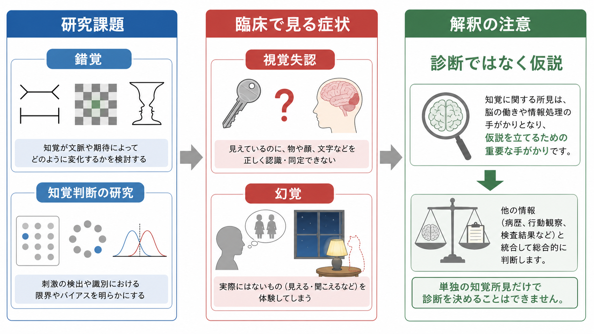

# 知覚とは何か

## 要点

- 知覚とは、感覚器から入る信号を、そのまま写し取ることではなく、注意、記憶、予測、文脈、行動目的を使って「意味ある対象や出来事」として構成する過程である。
- 知覚は、特徴検出、統合、対象認識、空間定位、行動への変換という複数の処理からなる。視覚だけでなく、聴覚、触覚、嗅覚、味覚、身体感覚にも同じ考え方を広げられる。
- 近年は、脳が感覚入力を受け身に処理するだけでなく、世界についての予測を作り、予測誤差で更新するという見方が重要になっている[4][5]。
- 臨床では、錯覚、視覚失認、幻覚などを通じて、知覚が単なる入力ではなく、推論と統合の過程であることが見えやすくなる。ただし、単独の知覚所見だけで診断を決めることはできない[6][7]。

## この記事で答える問い

1. 知覚は「感覚」とどう違うのか。
2. 脳はどのように特徴を統合し、対象や出来事を作っているのか。
3. 予測、注意、記憶は知覚にどう関わるのか。
4. 錯覚、失認、幻覚は知覚理解に何を教えてくれるのか。

## まず結論

知覚は、外界のコピーではなく、感覚入力と内的モデルのすり合わせである。たとえば、網膜には光の強さと位置のパターンが届くが、私たちはそれを「線」「面」「顔」「コップ」「近づいてくる車」として経験する。この変換には、低次の特徴抽出だけでなく、注意による選択、過去経験による予測、状況文脈、身体を使って何ができるかという行動上の意味が関わる。

## 背景

知覚研究の古典的な問いは、「感覚入力から、どのように安定した世界が立ち上がるのか」である。Marr は視覚を、入力画像から三次元的な対象記述へ進む情報処理として捉え、計算論、アルゴリズム、実装という複数のレベルで分析する必要を示した[1]。この見方は、知覚を「目に入ったものを見る」という単純な過程ではなく、表現を段階的に構成する過程として考える基盤になった。

一方、日常的な知覚は実験室の静止画像よりはるかに複雑である。視線は動き、身体も動き、対象は隠れたり変化したりする。それでも私たちは、同じコップを角度や距離が変わっても同じ対象として扱い、音声を雑音の中から聞き取り、相手の表情や視線から出来事の意味を推定する。ここでは、[[持続的注意とは何か]]、[[ワーキングメモリ容量はなぜ限られているのか]]、運動制御、記憶、情動が知覚と連続的に働く。

## 基本概念

### 感覚と知覚

感覚は、光、音、圧、化学物質、身体内部の変化などが受容器で神経信号へ変換される入口の過程である。知覚は、その信号を「何が、どこで、どのように起きているのか」という意味ある構造へまとめる過程である。感覚が材料なら、知覚は材料を使って場面を構成する処理である。

ただし、この区別は絶対的ではない。初期視覚野でも文脈や注意の影響を受けるし、高次領域だけが意味を作るわけでもない。感覚処理と知覚処理は、階層的かつ循環的に結びついている。

### 特徴と統合

視覚では、方位、色、明るさ、運動、奥行き、輪郭などの特徴が並列的に処理される。Treisman と Gelade の特徴統合理論は、単一特徴の検出は比較的自動的に行われる一方、複数特徴を一つの対象として結びつけるには注意が重要になると提案した[2]。この考えは、注意が「見えているものを強める」だけでなく、「どの特徴が同じ対象に属するか」を決める働きにも関わることを示した。

### 知覚と行動

知覚は認識だけで終わらない。Goodale と Milner は、物体を同定するための視覚処理と、つかむ、避ける、向かうといった行動を制御する視覚処理が、部分的に異なる神経経路に支えられると論じた[3]。粗く言えば、腹側視覚経路は「それは何か」に、背側視覚経路は「それにどう働きかけるか」に強く関わる。

この区別は、知覚を「頭の中に画像を作ること」とだけ見ないために重要である。対象の意味は、名前やカテゴリーだけでなく、近づける、避ける、つかめる、話しかけるといった行動可能性にも支えられる。

## 仕組み

### 1. 入力から特徴を取り出す

最初の段階では、感覚入力から局所的な特徴が抽出される。視覚ならエッジ、方位、コントラスト、運動方向、色などである。聴覚なら周波数、時間変化、音源位置などが対応する。これらはまだ「机」「声」「危険」といった意味ではなく、後続処理の材料である。

### 2. 特徴を対象として束ねる

次に、複数の特徴がまとまりとして扱われる。輪郭が閉じている、同じ方向に動く、同じ表面に属する、時間的に同期する、といった手がかりによって、脳は入力を対象や出来事に分節化する。注意は、この統合の優先順位を決める。どの特徴を同じ対象として扱うかが変われば、同じ入力でも知覚経験は変わる。

### 3. 予測で入力を解釈する

知覚はボトムアップ入力だけでは決まらない。期待、文脈、過去経験は、刺激が来る前から感覚処理を変える。de Lange らは、期待が感覚表現を弱める場合も、より鋭くする場合もあり、予測は脳の複数領域から感覚処理へ影響すると整理している[4]。つまり、予測は単なる思い込みではなく、曖昧な入力を効率よく解釈するための仕組みである。

Rao と Ballard の予測符号化モデルでは、上位階層から下位階層へ予測が送られ、下位階層からは予測と実際の入力のずれ、すなわち予測誤差が送られる[5]。この循環により、脳は世界についての仮説を更新し続ける。

### 4. 安定した世界として経験する

目や頭を動かすたびに網膜像は変わるが、世界そのものが揺れて見え続けるわけではない。これは、脳が身体運動、視線、空間文脈、対象の恒常性を組み合わせているためである。大きさ、色、形、位置の知覚は、入力の物理量だけでなく、照明、距離、背景、行動目的によって補正される。

## 図解

| 観点 | 主な問い | 関わる処理 |
|---|---|---|
| 感覚入力 | どのような信号が入ったか | 受容器、初期感覚野、特徴抽出 |
| 注意 | どの情報を優先するか | 選択、統合、抑制、探索 |
| 記憶・予測 | 何が起きそうか | 文脈、期待、事前知識、予測誤差 |
| 対象・出来事 | 何がどこで起きているか | 物体認識、空間定位、時間的統合 |
| 行動への意味 | それにどう対応するか | 接近、回避、把持、発話、意思決定 |

## 臨床・研究との接続

### 錯覚

錯覚は、知覚が「失敗している」だけではなく、通常の知覚がどのような仮定に依存しているかを明らかにする。文脈、明るさ、奥行き、運動、期待が変わると、同じ物理刺激が違って見える。錯覚は、知覚が入力と文脈の統合であることを示す研究道具である。

### 視覚失認

視覚失認では、視力や単純な視野だけでは説明できない対象認識の障害が起こる。Biran と Coslett は、視覚失認を、高次視覚理論を考えるうえで重要な臨床現象として整理し、視覚喪失、言語障害、全般的認知低下だけでは説明できない物体認識障害として説明している[6]。これは、見えていることと認識できることが同じではないことを示す。

### 幻覚

幻覚は、外部刺激がない、または弱い状況で知覚経験が生じる現象である。Powers らは、条件づけ課題と計算モデルを用いて、聴声傾向のある人では感覚証拠よりも知覚的事前分布が過重に働く可能性を示した[7]。ただし、幻覚を「予測が強すぎる」だけで説明するのは単純化である。精神病理では、予測、精度、信念、行動、社会的文脈が複雑に関わる[8]。

臨床的には、知覚異常は本人の訴え、生活上の困りごと、神経心理検査、脳画像、薬物、睡眠、ストレス、神経疾患、精神疾患の文脈と合わせて評価される。この記事の内容は教育・研究目的の整理であり、個別の診断や治療指示ではない。

## よくある誤解

### 誤解1: 知覚は外界をそのまま写す

知覚は外界のコピーではない。感覚入力は限定的で曖昧であり、脳は文脈と予測を使って最もありそうな解釈を作る。このため、通常は効率よく世界を把握できるが、錯覚や誤認も起こりうる。

### 誤解2: 予測が入るなら、知覚は主観的で信頼できない

予測は誤りの原因にもなるが、知覚を安定させる条件でもある。雑音の中で言葉を聞き取る、暗い場所で物体を見分ける、部分的に隠れた対象を同じものとして扱うには、予測が必要である。問題は、予測そのものではなく、感覚証拠との重みづけである。

### 誤解3: 視覚だけを理解すれば知覚がわかる

視覚は研究が進んでいるが、知覚は多感覚的で身体化された過程である。音、触覚、内受容感覚、姿勢、運動、情動が、同じ場面の意味を変える。視覚中心の説明は有用だが、知覚全体の一部である。

### 誤解4: 知覚異常があれば特定の疾患だとわかる

錯覚、幻覚、失認、離人感、現実感の変化は、複数の神経・精神医学的条件、睡眠不足、薬物、ストレス、感覚障害などで起こりうる。単独の知覚所見を診断名に直結させるのではなく、複数の情報を統合して考える必要がある。

## 関連ノート

- [[持続的注意とは何か]]
- [[ワーキングメモリ容量はなぜ限られているのか]]
- [[ガンマ振動は認知機能にどう関わるのか]]
- [[BOLD信号とは何か]]
- [[E/Iバランスとは何か]]
- [[認知機能障害は統合失調症でなぜ重要なのか]]

### 関連ノート候補

- 感覚とは何か
- 錯覚とは何か
- 視覚失認とは何か
- 幻覚とは何か
- 予測処理とは何か
- アフォーダンスとは何か

### MOC更新候補

- `content/00_MOC/MOC｜認知科学・心理学.md` の「今後追加する代表テーマ」または認知機能セクションに `[[知覚とは何か]]` を追加する。
- `content/00_MOC/MOC｜脳・神経科学.md` から、感覚処理、視覚経路、予測処理に関する関連項目として接続する。

## 理解チェック

1. 感覚と知覚の違いを、自分の言葉で一文にまとめられるか。
2. 特徴統合に注意が関わる理由を説明できるか。
3. 予測符号化における「予測」と「予測誤差」の流れを説明できるか。
4. 錯覚や幻覚を、単なる失敗ではなく知覚の仕組みを示す現象として説明できるか。

## 未解決問題

- 予測が感覚表現を弱める場合と強める場合は、どの条件で分かれるのか。
- 意識に上る知覚と、行動を制御する無意識的な知覚処理は、どの時点で分岐し、どこで再統合されるのか。
- 幻覚や錯覚に関わる予測の重みづけを、個人差、発達、疾患、薬物、睡眠、社会的文脈とどう結びつけて測定できるのか。

## 参考文献

[1] Marr, D. (2010). *Vision: A Computational Investigation into the Human Representation and Processing of Visual Information*. The MIT Press. Original work published 1982. https://mitpress.mit.edu/9780262514620/vision/

[2] Treisman, A. M., & Gelade, G. (1980). A feature-integration theory of attention. *Cognitive Psychology, 12*(1), 97-136. https://doi.org/10.1016/0010-0285(80)90005-5

[3] Goodale, M. A., & Milner, A. D. (1992). Separate visual pathways for perception and action. *Trends in Neurosciences, 15*(1), 20-25. https://doi.org/10.1016/0166-2236(92)90344-8

[4] de Lange, F. P., Heilbron, M., & Kok, P. (2018). How do expectations shape perception? *Trends in Cognitive Sciences, 22*(9), 764-779. https://doi.org/10.1016/j.tics.2018.06.002

[5] Rao, R. P. N., & Ballard, D. H. (1999). Predictive coding in the visual cortex: A functional interpretation of some extra-classical receptive-field effects. *Nature Neuroscience, 2*, 79-87. https://doi.org/10.1038/4580

[6] Biran, I., & Coslett, H. B. (2003). Visual agnosia. *Current Neurology and Neuroscience Reports, 3*(6), 508-512. https://doi.org/10.1007/s11910-003-0055-4

[7] Powers, A. R., Mathys, C., & Corlett, P. R. (2017). Pavlovian conditioning-induced hallucinations result from overweighting of perceptual priors. *Science, 357*(6351), 596-600. https://doi.org/10.1126/science.aan3458

[8] Adams, R. A., Stephan, K. E., Brown, H. R., Frith, C. D., & Friston, K. J. (2013). The computational anatomy of psychosis. *Frontiers in Psychiatry, 4*, 47. https://doi.org/10.3389/fpsyt.2013.00047
