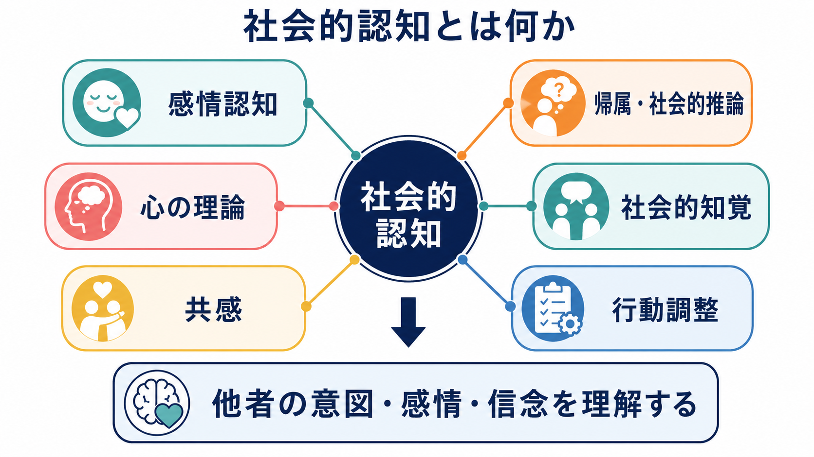
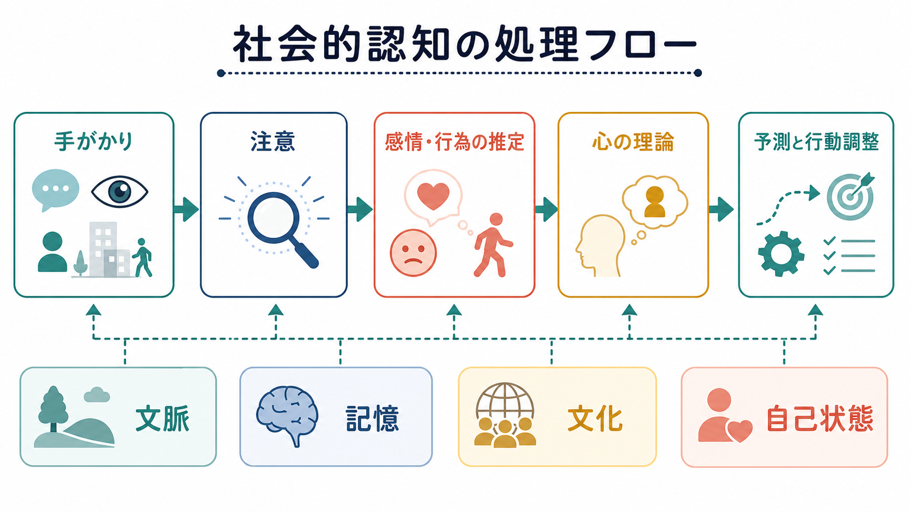
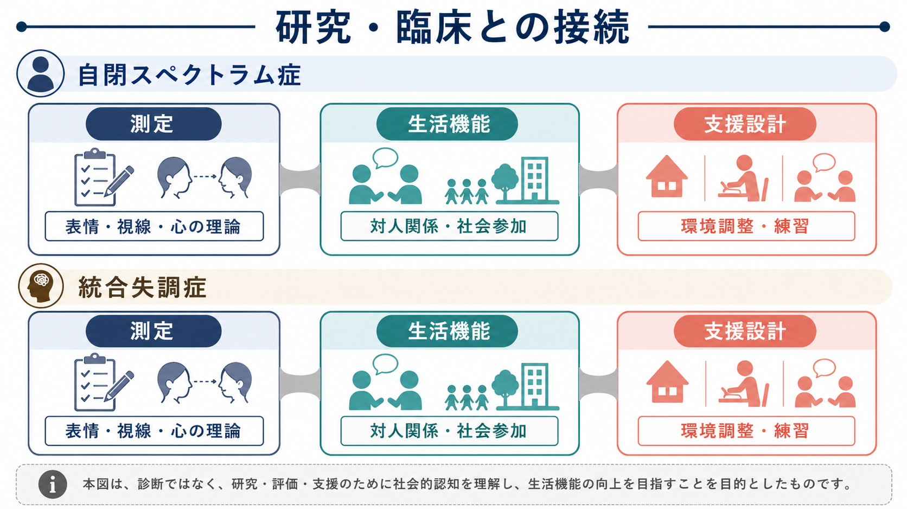

# 社会的認知とは何か

## 要点

- 社会的認知とは、表情、視線、声、行為、文脈などの手がかりから、他者の感情、意図、信念、性格傾向、社会的ルールを推定し、自分の行動を調整する認知機能の総称である [1][2]。
- 単一の能力ではなく、[[顔認知はなぜ特別なのか]]、[[注意とは何か]]、[[情動と認知は分けられるのか]]、[[心の理論とは何か]]、[[共感は認知機能としてどう理解できるのか]]、[[実行機能とは何か]] などが組み合わさった機能群として理解する方がよい [1][3]。
- 神経基盤は「社会脳」という単一部位ではなく、扁桃体、上側頭溝、側頭頭頂接合部、内側前頭前野などを含む分散ネットワークとして捉えられる [1][3]。
- 自閉スペクトラム症や統合失調症では、社会的コミュニケーション、感情認知、心の理論、帰属スタイルなどが研究・支援上の重要な論点になる。ただし、社会的認知の特徴だけで個別診断や治療方針を断定してはいけない [5][6][7]。

## この記事で答える問い

1. 社会的認知は、いわゆる「空気を読む力」と同じなのか。
2. 他者の感情、意図、信念はどのような手がかりから推定されるのか。
3. 社会的認知を支える脳内ネットワークには何が含まれるのか。
4. 研究・臨床では、社会的認知をどのように扱うべきか。

## まず結論

社会的認知は、他者を「物体」ではなく「心をもつ相手」として理解し、相互作用の中で行動を調整するための情報処理である。会話では、言葉の意味だけでなく、相手の表情、声の調子、視線、沈黙、場面のルール、過去の関係性を使って、「相手は何を感じているのか」「何を知っているのか」「何を意図しているのか」を推定する。この推定があるから、説明を補う、冗談を控える、謝る、待つ、距離をとる、といった行動調整が可能になる。

ただし、社会的認知は「人柄のよさ」や「社交性」と同じではない。社交的に見える人でも他者の信念を読み違えることはあるし、口数が少ない人でも文脈や相手の気持ちを精密に推定していることがある。したがって、社会的認知は性格評価ではなく、手がかりの検出、注意、感情認知、心の理論、帰属、記憶、行動制御が連動する認知機能として扱う必要がある [1][3]。

## 背景

認知科学では、知覚、注意、記憶、言語、意思決定などの一般的な認知機能が研究されてきた。社会的認知は、これらの機能が「他者」という特別な対象に向けられたときに現れる。たとえば、相手の顔を見るには [[知覚とは何か]] や [[顔認知はなぜ特別なのか]] が関わり、発話を理解するには [[言語理解はどのように行われるのか]] が関わり、会話の途中で相手の反応に合わせて話し方を変えるには [[実行機能とは何か]] や [[ワーキングメモリとは何か]] が関わる。

一方で、社会的認知には独自の難しさもある。他者の感情や信念は直接観察できない。観察できるのは、表情、視線、声、動作、発話、状況だけである。そのため社会的認知は、見える手がかりから見えない心的状態を推定する過程になる。Frith と Frith は、人間の社会的相互作用では、相手の行動を予測するだけでなく、互いに「伝えようとしていること」を理解する仕組みが重要だと論じた [2]。

## 基本概念

### 社会的手がかり

社会的手がかりとは、他者の状態を推定するために使われる情報である。代表例は、表情、視線、声の抑揚、姿勢、身体動作、対人距離、沈黙、発話のタイミング、場面のルールである。たとえば同じ「大丈夫です」という発話でも、声が震えている、視線をそらす、返答が遅い、といった手がかりによって意味は変わる。

この段階では、[[注意とは何か]] が重要になる。どの手がかりに注意を向けるかによって、推定される感情や意図が変わるからである。社会的認知は、単に多くの情報を処理する能力ではなく、場面に応じて重要な社会的手がかりを選ぶ能力でもある。

### 感情認知

感情認知は、表情、声、姿勢、行為から、相手の情動状態を推定する働きである。ここでいう感情は、喜び、怒り、恐れ、悲しみのような基本的情動だけではない。不安、困惑、退屈、安心、恥、ためらいのような複合的な状態も含まれる。

感情認知は [[情動と認知は分けられるのか]] と深く関係する。相手の感情を読むことは、情動的な共鳴だけではなく、文脈、記憶、言語的説明を使った推論でもある。そのため、感情認知は「感じ取る」過程と「考えて解釈する」過程が重なった機能として理解する方が正確である。

### 心の理論

[[心の理論とは何か]] は、他者が自分とは異なる信念、知識、欲求、意図をもつと理解し、それに基づいて行動を予測する能力である。古典的には、誤信念課題を用いて、相手が現実とは異なる信念をもつ場合でも、その信念に基づいて行動を予測できるかが調べられてきた [4]。

心の理論は、社会的認知の中心的要素だが、社会的認知そのものと同義ではない。社会的認知には、感情認知、共感、帰属、社会的知覚、規範理解、行動調整も含まれる。

### 共感

[[共感は認知機能としてどう理解できるのか]] は、他者の感情を共有したり、相手の立場から状況を理解したりする働きである。少なくとも、他者の苦痛や喜びに自分も反応する情動的共感と、相手が何を感じているかを推定する認知的共感を分けると理解しやすい。

共感が強ければ社会的認知が高い、とは限らない。相手の感情に強く巻き込まれても、相手の信念や文脈を読み違えることはある。逆に、情動的には距離を保ちながら、相手の状況を認知的に理解する場合もある。

### 帰属と社会的推論

帰属とは、他者の行動の原因をどのように説明するかである。相手が返信しないとき、「忙しいのだろう」と考えるか、「自分を避けている」と考えるかで、その後の感情と行動は大きく変わる。社会的認知には、観察された行動から、意図、性格傾向、状況要因を推論する過程が含まれる [3]。

## 仕組み

社会的認知は、おおまかには次の流れで働く。

| 段階 | 何をしているか | 例 |
|---|---|---|
| 手がかりの取得 | 顔、声、視線、姿勢、発話、文脈を拾う | 相手が視線をそらしたことに気づく |
| 注意と重みづけ | 重要そうな手がかりを選ぶ | 声の小ささより、発話内容を重視する |
| 感情・行為の推定 | 相手の感情や行為の意味を推定する | 不安そうだと考える |
| 心の理論 | 相手の知識、信念、意図を推定する | まだ事情を知らないのだと考える |
| 予測と行動調整 | 次の反応を選ぶ | 説明を補う、質問する、待つ |

この流れは一方向ではない。相手の反応を見て、自分の推定をすぐに修正する。会話は、推定、反応、再推定の連続である。だから社会的認知は、単発のテストで完全に測れる能力ではなく、相互作用の中で更新される予測過程として考える必要がある。

神経科学的には、社会的認知は分散ネットワークとして理解される。Adolphs は、社会的知識を支える神経基盤として、情動的・身体的な手がかり処理と、文脈に敏感な制御的処理の両方を整理している [1]。Van Overwalle のメタ分析では、側頭頭頂接合部が一時的な目標や意図の推定に、内側前頭前野がより持続的な性格傾向、規範、社会的スクリプトの統合に関わるという整理が示されている [3]。

## 図解

図1は、社会的認知を「他者の意図・感情・信念を理解する」機能群として整理した概念地図である。図2は、手がかりから注意、感情・行為の推定、心の理論、行動調整へ進む処理フローを示している。図3は、研究・臨床で社会的認知を扱うとき、測定、生活機能、支援設計を分けて考える必要があることを示している。

## 臨床・研究との接続

### 自閉スペクトラム症

自閉スペクトラム症では、社会的コミュニケーションや相互作用の困難が中心的特徴の一部として扱われる [7]。ただし、これは「他者に関心がない」と単純化できるものではない。視線、表情、暗黙のルール、比喩、会話の順番、感覚過敏、予測のしにくさなど、複数の要因が関わる。

心の理論研究では、誤信念課題を用いた古典的研究が大きな影響をもった [4]。しかし現在では、単一課題の成績をもって個人の社会的理解を断定することは避けるべきである。日常生活の社会的困難は、感覚、注意、言語、実行機能、不安、環境側の明示性によっても変わる。

### 統合失調症

統合失調症研究では、社会的認知は生活機能や社会参加と関連する重要な領域として扱われてきた。Green らは、統合失調症における認知機能障害を、非社会的認知と社会的認知の両方から整理し、社会的認知が機能的転帰と関係することを論じている [6]。

社会的認知の支援研究では、表情認知、社会的知覚、心の理論、帰属スタイルなどを標的にした心理社会的介入が検討されている [8]。ただし、教育・研究上は、介入の効果、一般化、生活場面での持続性、本人の目標との整合性を慎重に扱う必要がある。

### 測定と支援の注意点

社会的認知課題は、研究には有用だが、日常生活そのものではない。表情写真、動画、短い物語、誤信念課題、帰属課題は、特定の条件下で特定の機能を測るための道具である。実際の生活では、相手との関係、疲労、文化、言語、場面の明示性、支援環境が結果を大きく変える。

したがって、社会的認知を臨床や教育に接続するときは、「本人の能力だけ」を変えようとするより、環境をわかりやすくする、曖昧なルールを明示する、確認の機会を増やす、誤解が起こりやすい場面を一緒に整理する、といった設計が重要になる。

## よくある誤解

### 誤解1: 社会的認知は「空気を読む力」である

日常語としては近いが、科学的には広すぎる。社会的認知には、表情認知、視線理解、心の理論、共感、帰属、社会的規範理解、自己と他者の区別などが含まれる。どの過程の困難なのかを分けて考える必要がある。

### 誤解2: 共感が強いほど社会的認知が高い

共感は重要だが、社会的認知の一部である。相手の感情に強く反応しても、相手の信念や文脈を正確に推定できるとは限らない。情動的共感と認知的共感を区別することが重要である。

### 誤解3: 社会的認知は脳の一つの部位で決まる

社会的認知は、扁桃体、上側頭溝、側頭頭頂接合部、内側前頭前野などを含む分散ネットワークで支えられる [1][3]。さらに、注意、記憶、言語、実行機能も関与するため、単一部位や単一物質だけで説明するのは単純化しすぎである。

### 誤解4: 社会的認知課題の成績は、その人の人間性を示す

課題成績は、検査状況で観察された情報処理の一側面である。人間性や価値を示すものではない。疲労、不安、言語理解、文化差、検査者との関係、課題への慣れによって成績は変わる。

## 関連ノート

- [[心の理論とは何か]]
- [[共感は認知機能としてどう理解できるのか]]
- [[情動と認知は分けられるのか]]
- [[顔認知はなぜ特別なのか]]
- [[注意とは何か]]
- [[実行機能とは何か]]
- [[ワーキングメモリとは何か]]
- [[言語理解はどのように行われるのか]]

## MOC更新候補

- `content/00_MOC/` 配下の認知科学・心理学系 MOC
- 脳・神経科学系 MOC
- 精神医学系 MOC

並列生成ジョブとの競合を避けるため、このノートでは MOC 本体の直接更新は行わない。

## 理解チェック

1. 社会的認知を「社交性」や「性格」と同一視しない方がよい理由は何か。
2. 感情認知、心の理論、共感はそれぞれどのように違うか。
3. 社会的認知が [[注意とは何か]] や [[ワーキングメモリとは何か]] と切り離せない理由は何か。
4. 社会的認知課題の成績だけで個別診断や治療方針を断定できない理由は何か。

## 未解決問題

- 実験室の社会的認知課題は、自然な会話や集団場面の困難をどの程度予測できるのか。
- 社会的認知の個人差は、文化、言語、発達歴、感覚特性、対人経験によってどのように変わるのか。
- 心の理論、共感、帰属、社会的知覚を神経回路レベルでどこまで分けて説明できるのか。
- 支援では、本人のスキルトレーニングと環境調整をどのように組み合わせるのがよいのか。

## 参考文献

[1] Adolphs, R. (2009). The social brain: Neural basis of social knowledge. *Annual Review of Psychology, 60*, 693-716. https://doi.org/10.1146/annurev.psych.60.110707.163514

[2] Frith, U., & Frith, C. (2010). The social brain: Allowing humans to boldly go where no other species has been. *Philosophical Transactions of the Royal Society B: Biological Sciences, 365*(1537), 165-176. https://doi.org/10.1098/rstb.2009.0160

[3] Van Overwalle, F. (2009). Social cognition and the brain: A meta-analysis. *Human Brain Mapping, 30*(3), 829-858. https://doi.org/10.1002/hbm.20547

[4] Baron-Cohen, S., Leslie, A. M., & Frith, U. (1985). Does the autistic child have a “theory of mind”? *Cognition, 21*(1), 37-46. https://doi.org/10.1016/0010-0277(85)90022-8

[5] National Institute of Mental Health. (2011). *Social Processes: Workshop Proceedings*. https://www.nimh.nih.gov/research/research-funded-by-nimh/rdoc/social-processes-workshop-proceedings

[6] Green, M. F., Horan, W. P., & Lee, J. (2019). Nonsocial and social cognition in schizophrenia: Current evidence and future directions. *World Psychiatry, 18*(2), 146-161. https://doi.org/10.1002/wps.20624

[7] National Institute of Mental Health. (n.d.). *Autism Spectrum Disorder*. https://www.nimh.nih.gov/health/publications/autism-spectrum-disorder

[8] Horan, W. P., & Green, M. F. (2019). Treatment of social cognition in schizophrenia: Current status and future directions. *Schizophrenia Research, 203*, 3-11. https://doi.org/10.1016/j.schres.2017.07.013
