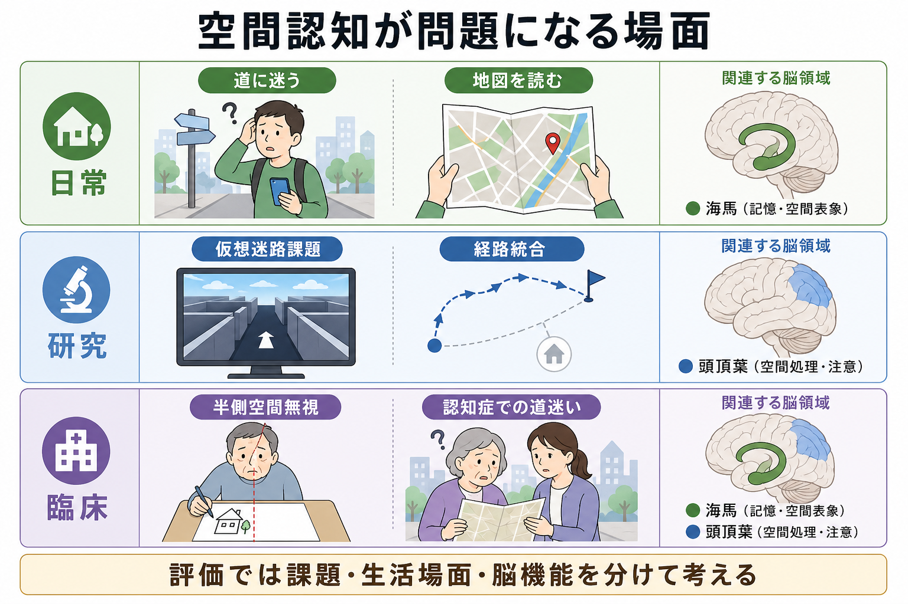
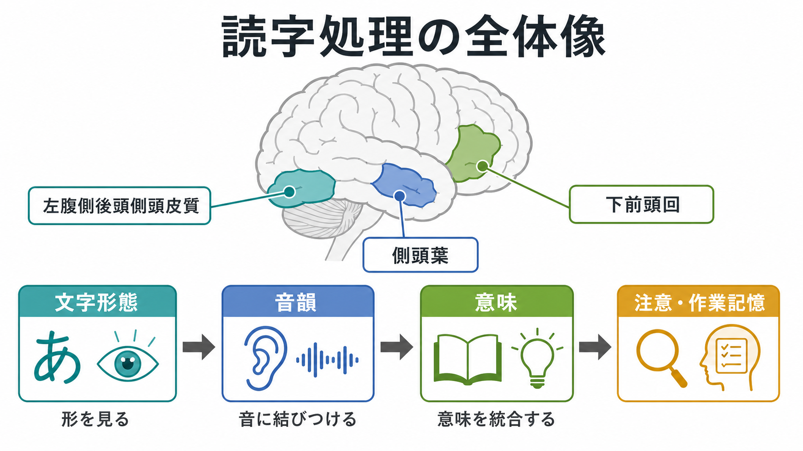
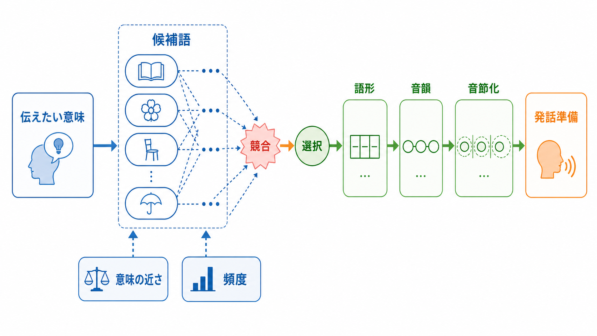

# 空間認知とは何か

## 要点

- 空間認知とは、対象や自分の**位置・方向・距離・配置関係**を知覚し、記憶し、行動に使う認知機能である。
- 空間表象には、自分の身体を基準にする**自己中心座標**と、環境や物体間関係を基準にする**環境中心座標**がある[1][5]。
- 海馬・内嗅皮質系は、場所細胞・格子細胞・頭方向細胞などを通じて、移動可能な環境の「認知地図」に関わる[2][3][4]。
- 頭頂葉を含む前頭頭頂ネットワークは、視線・身体・手の届く範囲に対する位置、注意の向け方、行為のための空間変換に関わる[1][5]。
- 臨床的には、半側空間無視、道迷い、認知症や軽度認知障害におけるナビゲーション障害などと接続する。ただし、個別の診断や治療判断は専門的評価に基づく必要がある[6][7][8]。

## この記事で答える問い

1. 空間認知は、単に「方向感覚がよい・悪い」という話と何が違うのか。
2. 位置、方向、距離、地図表象はどのように結びつくのか。
3. 海馬、内嗅皮質、頭頂葉は、それぞれどの部分を支えているのか。
4. 空間認知の障害は、研究課題や臨床場面でどのように見えるのか。

## まず結論

空間認知は、「どこに何があるか」を知るだけでなく、「自分はどこにいて、どちらを向き、どの経路を通れば目的地に着けるか」を更新し続ける働きである。見える景色、前庭感覚、自己運動感覚、過去の記憶、地図や標識の知識を統合し、現在位置の推定と未来の経路計画に使う。

脳内では、頭頂葉が身体・視線・行為に近い空間を扱い、海馬・内嗅皮質系がより環境全体の関係を保持する地図的表象を支える、という分担で理解すると見通しがよい[1][3][5]。ただし、この分担は固定的ではなく、実際のナビゲーションでは海馬、内嗅皮質、後部帯状皮質・脳梁膨大後皮質、頭頂葉、前頭前野などが課題に応じて協調する。

## 背景

空間認知は、心理学では迷路学習、メンタルローテーション、左右判断、地図読解、視空間ワーキングメモリなどとして研究されてきた。神経科学では、海馬の場所細胞、内嗅皮質の格子細胞、頭方向細胞、境界細胞などの発見によって、空間が単なる感覚入力ではなく、神経活動のパターンとして能動的に構成されることが明らかになった[2][3][4]。

このテーマは[[海馬回路は記憶をどう形成するのか]]や[[シータリズムは記憶とナビゲーションをどう支えるのか]]とも深くつながる。海馬はエピソード記憶だけでなく、出来事が「どこで」起きたか、あるいは環境内でどの位置関係をもつかを扱うため、記憶と空間は切り離しにくい。

## 基本概念

### 位置・方向・距離

空間認知の最小単位は、位置、方向、距離である。位置は「対象がどこにあるか」、方向は「自分や対象がどちらを向いているか」、距離は「どのくらい離れているか」を表す。これらは、視覚だけでなく、前庭感覚、固有感覚、運動指令のコピー、聴覚、触覚からも支えられる。

距離の推定は、単なるメートル換算ではない。日常の移動では、歩数、曲がった回数、坂道、目印、混雑、疲労などが「近い・遠い」の主観に影響する。したがって、空間認知は幾何学的処理であると同時に、行為可能性と記憶に結びついた処理でもある。

### 自己中心座標と環境中心座標

自己中心座標とは、「右前にカップがある」「左側から車が来る」のように、自分の身体や視線を基準に位置を表す方式である。頭頂葉を含む前頭頭頂ネットワークは、この種の身体・視線・行為に結びついた空間処理に関わる[5]。

環境中心座標とは、「駅は公園の北にある」「病院は川の向こうにある」のように、自分の現在位置に依存しにくい関係で位置を表す方式である。海馬・内嗅皮質系、脳梁膨大後皮質、海馬傍皮質などは、環境内の関係を保ち、別の向きから見ても同じ場所として再同定する処理に関わる[1][3][5]。

### 認知地図

認知地図とは、環境内の場所や経路の関係を、行動に使える形で表した内部表象である。O'Keefe と Nadel の古典的提案以来、海馬は空間の認知地図に関わる構造として議論されてきた[2]。現在では、認知地図は「頭の中に紙の地図がある」という意味ではなく、場所、方向、境界、経路、文脈、目的地の関係を必要に応じて再構成する神経計算として理解される。

## 仕組み

### 1. 感覚入力から身体基準の空間へ

最初に必要なのは、自分の身体を基準にした空間の把握である。視線の向き、頭部の向き、身体の向き、手足の位置が変わるたびに、同じ対象でも網膜上の位置や身体からの方向は変わる。頭頂葉は、このような感覚入力を行為に使える座標へ変換し、注意の配分や到達運動、視線移動に結びつける[5]。

この点で空間認知は[[注意とは何か]]や[[前頭頭頂ネットワークは認知制御をどう支えるのか]]と重なる。どこに注意を向けるか、どの刺激を無視するか、どの対象へ手を伸ばすかは、空間表象と認知制御の共同作業である。

### 2. 移動に伴う現在位置の更新

歩いたり曲がったりすると、現在位置は連続的に変わる。外界の目印だけに頼らず、自分の移動量から位置を更新する処理を経路統合という。経路統合では、方向、速度、移動距離、回転量が統合される。内嗅皮質の格子細胞、頭方向細胞、境界細胞、海馬の場所細胞は、このような位置・方向・環境境界の符号化に関わる[3][4]。

### 3. 海馬・内嗅皮質による地図的表象

場所細胞は、動物が特定の場所にいるときに活動しやすい海馬ニューロンである。格子細胞は、環境内の複数地点で格子状の発火パターンを示し、空間の距離や座標を支える候補として研究されている。頭方向細胞は、動物が特定方向を向いたときに活動しやすい[3][4]。

重要なのは、これらの細胞が「GPSの部品」として単純に一対一対応するわけではないことである。場所細胞や格子細胞は、環境の形、手がかり、課題、記憶、目的によって再構成される。したがって、海馬・内嗅皮質系は固定地図を保存するというより、移動と記憶の文脈に応じて空間表象を更新する仕組みとして捉える方が正確である[3][4]。

### 4. 地図表象を行動へ戻す

目的地へ向かうには、地図的表象を行動系列に戻す必要がある。たとえば「駅の南側から出て、交差点を右折し、次の角で左へ行く」という行動計画では、環境中心座標と自己中心座標を何度も変換する。この変換には、海馬・内嗅皮質系だけでなく、脳梁膨大後皮質、頭頂葉、前頭前野、視覚領域が関わる[1][5]。

このため、空間認知の失敗は一種類ではない。地図は読めるが身体方向への変換が苦手な場合、目印は覚えているが経路の順序を保てない場合、左側の空間に注意が向きにくい場合、慣れない場所で現在位置を更新しにくい場合など、異なる水準の障害がありうる。

## 図解

この記事の図は、次の3つの観点で読むとよい。

| 図 | 見るポイント | 対応する概念 |
|---|---|---|
| 概念地図 | 位置・方向・距離・地図表象が、日常の移動と脳領域にどう結びつくか | 空間認知の全体像 |
| 神経メカニズム | 感覚入力、頭頂葉、海馬・内嗅皮質、経路計画の流れ | 座標変換と認知地図 |
| 応用場面 | 日常、研究課題、臨床評価で何が問題になるか | 道迷い、仮想迷路、半側空間無視 |

## 臨床・研究との接続

### 半側空間無視

半側空間無視は、脳損傷後に反対側の空間への注意や探索が低下する症候群である。典型的には右半球損傷後に左側空間への反応が乏しくなることが多いが、症状は一様ではなく、視覚探索、身体空間、物体中心空間、注意の持続、病識など複数の要素が絡む[6]。これは、空間認知が単一の「空間センサー」ではなく、注意、行為、身体表象、視覚探索の複合システムであることを示す。

### 認知症・軽度認知障害と道迷い

アルツハイマー病や軽度認知障害では、記憶障害だけでなく、空間ナビゲーションの低下が早期から問題になることがある。海馬・内嗅皮質系はアルツハイマー病理の影響を受けやすく、空間ナビゲーション課題は将来の臨床的進行の予測指標として研究されている[7][8]。ただし、道迷いは視力、運動機能、不安、生活環境、注意、実行機能などにも左右されるため、単独の症状だけで疾患を判断することはできない。

### 実験課題

研究では、仮想迷路、仮想都市、経路学習、地図描画、方向判断、目印再認、経路統合課題などが使われる。仮想環境は、現実の移動に近い要素を保ちながら、手がかり、経路、視点、目的地を統制できるため、海馬・頭頂葉・前頭前野の関与を調べる方法として有用である[1][7]。

## よくある誤解

### 誤解1: 空間認知は「方向感覚」と同じである

方向感覚は空間認知の一部である。しかし空間認知には、位置の記憶、距離推定、目印の利用、経路統合、地図読解、視点変換、注意配分、行為計画が含まれる。方向だけが正しくても、距離や目印の順序を誤れば目的地には着けない。

### 誤解2: 海馬だけが空間認知を担う

海馬は重要だが、単独で空間認知を担うわけではない。頭頂葉、内嗅皮質、脳梁膨大後皮質、海馬傍皮質、前頭前野、視覚野、前庭系が課題に応じて協調する[1][3][5]。とくに行為に近い空間処理では頭頂葉の役割が大きい。

### 誤解3: 地図が読めない人は空間認知が全体的に低い

地図読解には、記号理解、視点変換、縮尺理解、ワーキングメモリ、経験、文化的な慣れが関わる。地図が苦手でも、目印を使った経路学習が得意な人もいる。逆に、紙の地図は読めても、実際の街で現在位置を更新するのが苦手な場合もある。

## 関連ノート

- [[海馬回路は記憶をどう形成するのか]]
- [[シータリズムは記憶とナビゲーションをどう支えるのか]]
- [[前頭頭頂ネットワークは認知制御をどう支えるのか]]
- [[注意とは何か]]
- [[ワーキングメモリ容量はなぜ限られているのか]]
- [[標準脳空間とは何か]]

### MOC更新候補

- `content/00_MOC/MOC｜認知科学・心理学.md`
- 必要に応じて、脳・神経科学側の MOC にも「海馬・内嗅皮質系の空間表象」として追加候補。

## 理解チェック

1. 自己中心座標と環境中心座標の違いを、日常例で説明できるか。
2. 海馬・内嗅皮質系が「固定地図の保存庫」ではなく「文脈依存的な地図表象の更新系」と言える理由は何か。
3. 半側空間無視が、空間認知と注意の関係を示す例になるのはなぜか。
4. 道迷いを評価するとき、海馬機能以外にどのような要因を分けて考えるべきか。

## 未解決問題

- 人間の自然な街歩きで、自己中心座標と環境中心座標がどの時点でどのように切り替わるのか。
- 仮想環境課題で測ったナビゲーション能力が、現実世界の道迷いをどの程度予測するのか。
- 海馬・内嗅皮質系の空間表象が、社会的関係や概念空間の「認知地図」とどこまで共通するのか。
- 認知症の早期評価として、空間ナビゲーション課題をどのように安全かつ実用的に使えるか。

## 参考文献

[1] Whitlock, J. R., Sutherland, R. J., Witter, M. P., Moser, M.-B., & Moser, E. I. (2008). Navigating from hippocampus to parietal cortex. *Proceedings of the National Academy of Sciences*, 105(39), 14755-14762. https://doi.org/10.1073/pnas.0804216105

[2] O'Keefe, J., & Nadel, L. (1979). The cognitive map as a hippocampus. *Behavioral and Brain Sciences*, 2(4), 520-533. https://doi.org/10.1017/S0140525X00064256

[3] Stensola, T., & Moser, E. I. (2016). Grid Cells and Spatial Maps in Entorhinal Cortex and Hippocampus. In G. Buzsaki & Y. Christen (Eds.), *Micro-, Meso- and Macro-Dynamics of the Brain*. Springer. https://www.ncbi.nlm.nih.gov/books/NBK435751/

[4] Hartley, T., Lever, C., Burgess, N., & O'Keefe, J. (2014). Space in the brain: how the hippocampal formation supports spatial cognition. *Philosophical Transactions of the Royal Society B*, 369(1635), 20120510. https://doi.org/10.1098/rstb.2012.0510

[5] Moraresku, S., & Vlcek, K. (2020). The Use of Egocentric and Allocentric Reference Frames in Static and Dynamic Conditions in Humans. *Physiological Research*, 69(Suppl 2), S143-S178. https://pmc.ncbi.nlm.nih.gov/articles/PMC8549915/

[6] Adair, J. C., & Barrett, A. M. (2008). Spatial neglect clinical and neuroscience review: a wealth of information on the poverty of attention. *Annals of the New York Academy of Sciences*, 1142, 21-43. https://doi.org/10.1196/annals.1444.008

[7] Levine, T. F., Allison, S. L., Stojanovic, M., Fagan, A. M., Morris, J. C., & Head, D. (2020). Spatial Navigation Ability Predicts Progression of Dementia Symptomatology. *Alzheimer's & Dementia*, 16(3), 491-500. https://doi.org/10.1002/alz.12031

[8] Coughlan, G., Laczo, J., Hort, J., Minihane, A.-M., & Hornberger, M. (2018). Spatial navigation deficits - overlooked cognitive marker for preclinical Alzheimer disease? *Nature Reviews Neurology*, 14, 496-506. https://doi.org/10.1038/s41582-018-0031-x
