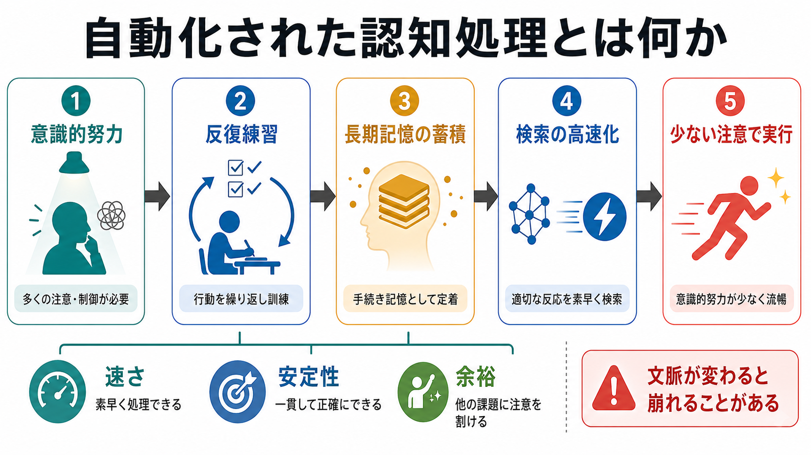
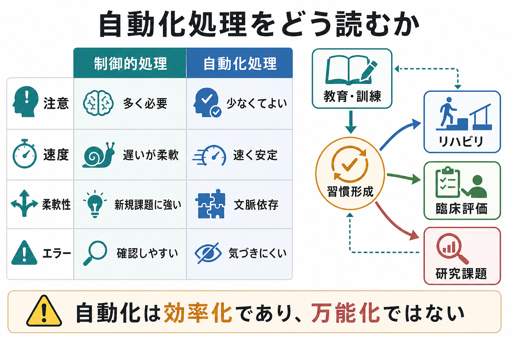

# 自動化された認知処理とは何か

## 要点

- 自動化された認知処理とは、反復練習と一貫した刺激-反応関係によって、少ない[[注意とは何か|注意]]や意識的制御で実行できるようになった処理である。
- 古典的研究では、制御的処理は遅く柔軟で注意を要し、自動的処理は速く安定し、しばしば並列的に進み、[[ワーキングメモリとは何か|ワーキングメモリ]]への負荷を下げると整理されてきた[1][2]。
- ただし「自動的」は「完全に無意識」「常に制御不能」「どんな状況でも同じ」という意味ではない。意図、意識、効率性、制御可能性は分けて評価する必要がある[4]。
- 自動化の中心には、練習によって課題固有の記憶表象や手続きが蓄積し、実行時にそれらを素早く検索・利用できるようになる過程がある[3]。
- 教育、技能訓練、リハビリテーション、習慣形成を理解するうえで重要だが、臨床的には個別診断や治療指示ではなく、研究・教育上の概念として扱う。

## この記事で答える問い

1. 自動化された認知処理とは、何が自動化されている状態なのか。
2. 練習によって、なぜ意識的努力や注意負荷が下がるのか。
3. 自動化は[[中央実行系とは何か|中央実行系]]、[[長期記憶とは何か|長期記憶]]、[[記憶の固定化とは何か|記憶の固定化]]とどう関係するのか。
4. 自動化を教育・研究・臨床文脈で読むとき、どこに注意すべきか。

## まず結論

自動化された認知処理とは、「考えなくてもできる魔法」ではなく、練習によって処理の支えが意識的な逐次制御から、長期記憶内の手続き・事例・刺激-反応対応の検索へ移っていくことである。最初は、目標を保ち、手順を確認し、反応を選び、エラーを監視するために多くの注意資源が必要になる。練習が進むと、同じ状況で同じ処理を繰り返した履歴が蓄積し、似た入力に対して適切な処理系列が素早く呼び出されるようになる[1][3]。

その結果、処理は速く、安定し、主観的には「努力が少ない」ものとして経験される。タイピング、読字、楽器演奏、運転中の基本操作、実験課題での熟練反応などが典型例である。ただし、自動化は課題や文脈に依存する。練習した条件から大きく外れると、処理は崩れたり、再び意識的制御を必要としたりする[2][4]。

## 背景

認知心理学では、人間の情報処理を「制御的処理」と「自動的処理」に分けて考える伝統がある。Shiffrin と Schneider の研究は、探索、検出、注意課題を通じて、練習と一貫した対応関係が自動的検出や自動的注意反応を形成することを示した[1]。この枠組みでは、制御的処理は容量に制約され、注意を要し、柔軟だが遅い。一方、自動的処理は、十分に学習された条件下では、少ない注意で素早く進む。

この区別は便利だが、単純な二分法では不十分である。現代的には、自動性を「速い」「効率的」「意図せず開始する」「意識されない」「制御しにくい」「目標から独立する」といった複数の特徴の束として扱う[4]。ある処理は高速で効率的でも、完全に無意識ではないかもしれない。逆に、意図せず生じても、訓練や状況設定によって抑制できる場合もある。

## 基本概念

### 制御的処理

制御的処理は、新しい課題、曖昧な状況、失敗時の修正、複数手順の切り替えで重要になる。たとえば初めて使うソフトウェアでは、操作対象を探し、説明を読み、次の手順を[[ワーキングメモリとは何か|ワーキングメモリ]]に保持しながら実行する必要がある。このとき[[選択的注意はどのように働くのか|選択的注意]]や[[中央実行系とは何か|中央実行系]]の関与が大きい。

### 自動的処理

自動的処理は、よく練習された入力、文脈、反応の組み合わせで生じやすい。処理の各段階を逐一言語化しなくても実行でき、反応時間が短くなり、同じ課題内でのばらつきも小さくなる。読字で文字ごとに発音規則を考えないこと、熟練タイピングでキー位置を毎回探索しないこと、よく練習した計算手順をすぐ使えることは、自動化の身近な例である。

### 自動化と習慣の違い

自動化は認知処理の効率化を指す広い概念であり、習慣はその一部として、文脈手がかりと行動が結びついた反復的行動パターンとして理解できる。自動化された読字、専門技能、運動スキルは必ずしも習慣ではない。一方で、習慣的行動には、自動化された注意配分、価値判断、運動系列が含まれることがある。

## 仕組み

### 1. 反復が処理単位をまとめる

練習の初期には、課題は細かい手順に分かれている。たとえばタイピングでは、文字を読む、対応するキーを探す、指を動かす、入力結果を確認する、という処理が比較的はっきり分かれる。反復によって、これらの手順はより大きなまとまりとして扱われるようになる。処理単位がまとまるほど、各段階で[[注意とは何か|注意]]を向ける必要が減る。

### 2. 一貫性が検索可能な記憶を作る

Logan のインスタンス理論では、自動化は課題固有の事例記憶が蓄積し、実行時にアルゴリズム的に計算するよりも、過去の事例を検索することで反応できるようになる過程として説明される[3]。ここで重要なのは練習量だけではない。入力と反応の対応が一貫しているほど、検索された記憶は現在の課題に役立つ。対応が頻繁に変わる課題では、検索された過去事例がむしろ干渉源になる。

### 3. 注意負荷が下がり、他の処理へ余裕が生まれる

自動化が進むと、課題遂行に必要な[[ワーキングメモリとは何か|ワーキングメモリ]]容量や意識的監視が減る。そのため、上級者は基本操作に注意を奪われにくく、より上位の判断、例外処理、環境変化の検出に資源を回せる。ただし、これは常に良いことではない。自動化された処理は、想定外の文脈ではエラーに気づきにくくなることがある[2][4]。

### 4. 脳内では単一部位ではなく学習ネットワークが変わる

自動化は「脳の一か所に保存される」わけではない。運動技能の研究では、反復練習に伴って皮質-線条体系、皮質-小脳系、運動関連皮質などの関与が学習段階に応じて変化することが示されている[5][6]。また、複数の記憶システム研究は、宣言的・海馬依存的な記憶と、線条体を含む手続き的・習慣的学習が競合または協調しうることを示している[7]。

このため、認知処理の自動化は、[[長期記憶とは何か|長期記憶]]、手続き記憶、注意制御、感覚運動予測が再編成される過程として読むのがよい。単純な暗記だけでも、単純な筋肉記憶だけでもない。

## 図解

### 概念地図

1枚目の図は、意識的努力を要する処理が、反復練習と長期記憶の蓄積を通じて、少ない注意で実行できる処理へ変わる流れを示している。重要なのは「練習すれば何でも自動化する」のではなく、練習した文脈と対応関係が処理の安定性を支える点である。

### メカニズム

2枚目の図は、認知負荷が下がる仕組みを示している。自動化は、入力を減らすことではなく、必要な処理をより効率よく組織化することで、限られたワーキングメモリと注意制御を節約する過程である。

### 比較と応用

3枚目の図は、制御的処理と自動化処理の比較を、教育・訓練、リハビリ、臨床評価、研究課題へ接続している。自動化は効率化であって、万能化ではない。速く安定する一方で、文脈依存性やエラーへの気づきにくさを伴うことがある。

## 臨床・研究との接続

### 教育と技能訓練

教育では、基礎技能を自動化することで、学習者がより高次の理解に注意を向けられるようになる。読字が自動化されていないと、文章理解に使う資源が文字認識に奪われる。計算手続きが自動化されていないと、問題構造の理解や方略選択に使える余裕が減る。したがって、自動化は「考えない学習」ではなく、考えるための下位処理を安定させる学習といえる。

### リハビリテーション

運動技能学習の研究では、練習、保持、再学習、文脈変化に伴う神経可塑性が検討されている[5][6]。リハビリテーションでは、ある動作が少ない努力で実行できるようになることが重要だが、実験室や訓練場面で自動化された動作が日常環境で同じように機能するとは限らない。文脈の幅、疲労、注意分散、情動状態を含めて評価する必要がある。

### 精神医学・臨床心理学

自動化の観点は、不安、強迫、依存、習慣的回避、注意バイアスなどを理解する補助線にもなる。ただし、特定の症状を「自動化された処理」と呼ぶだけでは説明にならない。どの刺激で、どの反応が、どの程度意図せず、どの程度制御しにくく、どの文脈で維持されるのかを分けて検討する必要がある。ここでの記述は教育・研究目的であり、個別の診断や治療方針を示すものではない。

### 実験研究

研究では、反応時間、エラー率、二重課題干渉、意識報告、転移課題、文脈変更、神経画像、学習曲線などを組み合わせて自動化を評価する。単に速くなっただけでは、速度-正確性トレードオフや方略変更を排除できない。自動化を主張するには、効率性、意図性、制御可能性、意識性、文脈依存性を分けて測る設計が必要である[2][4]。

## よくある誤解

### 誤解1: 自動化は無意識と同じである

自動化された処理は、意識的努力が少ないことが多い。しかし、処理の結果や一部の手順に気づいている場合もある。自動性は「意識されない」という単一特徴ではなく、複数の特徴の組み合わせとして評価する必要がある[4]。

### 誤解2: 練習量だけで自動化する

練習量は重要だが、対応関係の一貫性、フィードバック、文脈の安定性、課題の構造も重要である。ランダムに変わる規則を大量に練習しても、安定した検索手がかりが形成されにくい[3]。

### 誤解3: 自動化すると柔軟性が必ず上がる

自動化は、練習された文脈では処理を速く安定させる。一方で、新しい文脈では、既存の自動反応が邪魔になることがある。熟練者ほど、基本操作は自動化しているが、例外や新奇状況では制御的処理へ戻る必要がある。

### 誤解4: 自動化は注意が不要になることを意味する

注意が完全に不要になるわけではない。多くの場合、自動化によって必要な注意量が減り、注意の役割が「手順の逐次制御」から「目標維持、異常検出、文脈監視」へ移ると考えた方がよい。

## 関連ノート

- [[注意とは何か]]
- [[選択的注意はどのように働くのか]]
- [[持続的注意とは何か]]
- [[ワーキングメモリとは何か]]
- [[中央実行系とは何か]]
- [[長期記憶とは何か]]
- [[記憶の固定化とは何か]]
- [[計画能力とは何か]]

## 関連ノート候補

- 自動性と習慣形成
- 手続き記憶とは何か
- 技能学習とは何か
- 二重課題干渉とは何か
- ストループ効果とは何か
- 注意バイアスとは何か

## MOC更新候補

- `content/00_MOC/` 配下の認知科学・心理学系MOCがある場合、バッチ統合時に本記事へのリンク追加を検討する。
- 並列生成ジョブとの競合を避けるため、この作業ではMOC本体は更新しない。

## 理解チェック

1. 自動化された認知処理は、単に「速い処理」と同じではない。なぜか。
2. 練習量が多くても自動化が進みにくい条件には何があるか。
3. 自動化によってワーキングメモリ負荷が下がると、どのような利点とリスクが生じるか。
4. 臨床・教育場面で「自動化している」と判断するとき、どのような測定や観察が必要か。

## 未解決問題

- 自動化の各特徴、すなわち速度、効率性、意図性、意識性、制御可能性をどこまで独立に測定できるか。
- 実験室で自動化された処理が、日常環境でどの程度転移するか。
- 熟練者が自動処理と制御的処理をどのタイミングで切り替えるのか。
- 臨床的介入で、望ましくない自動反応を弱め、望ましい代替反応を形成する最適条件は何か。

## 参考文献

[1] Shiffrin, R. M., & Schneider, W. (1977). Controlled and automatic human information processing: II. Perceptual learning, automatic attending and a general theory. *Psychological Review, 84*(2), 127-190. https://doi.org/10.1037/0033-295X.84.2.127

[2] Schneider, W., & Chein, J. M. (2003). Controlled & automatic processing: behavior, theory, and biological mechanisms. *Cognitive Science, 27*(3), 525-559. https://doi.org/10.1016/S0364-0213(03)00011-9

[3] Logan, G. D. (1988). Toward an instance theory of automatization. *Psychological Review, 95*(4), 492-527. https://doi.org/10.1037/0033-295X.95.4.492

[4] Moors, A., & De Houwer, J. (2006). Automaticity: A theoretical and conceptual analysis. *Psychological Bulletin, 132*(2), 297-326. https://doi.org/10.1037/0033-2909.132.2.297

[5] Doyon, J., & Benali, H. (2005). Reorganization and plasticity in the adult brain during learning of motor skills. *Current Opinion in Neurobiology, 15*(2), 161-167. https://doi.org/10.1016/j.conb.2005.03.004

[6] Ungerleider, L. G., Doyon, J., & Karni, A. (2002). Imaging brain plasticity during motor skill learning. *Neurobiology of Learning and Memory, 78*(3), 553-564. https://doi.org/10.1006/nlme.2002.4091

[7] Poldrack, R. A., & Packard, M. G. (2003). Competition among multiple memory systems: converging evidence from animal and human brain studies. *Neuropsychologia, 41*(3), 245-251. https://doi.org/10.1016/S0028-3932(02)00157-4
