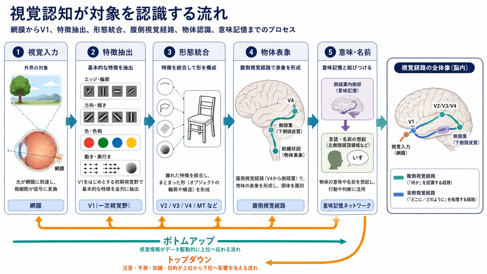
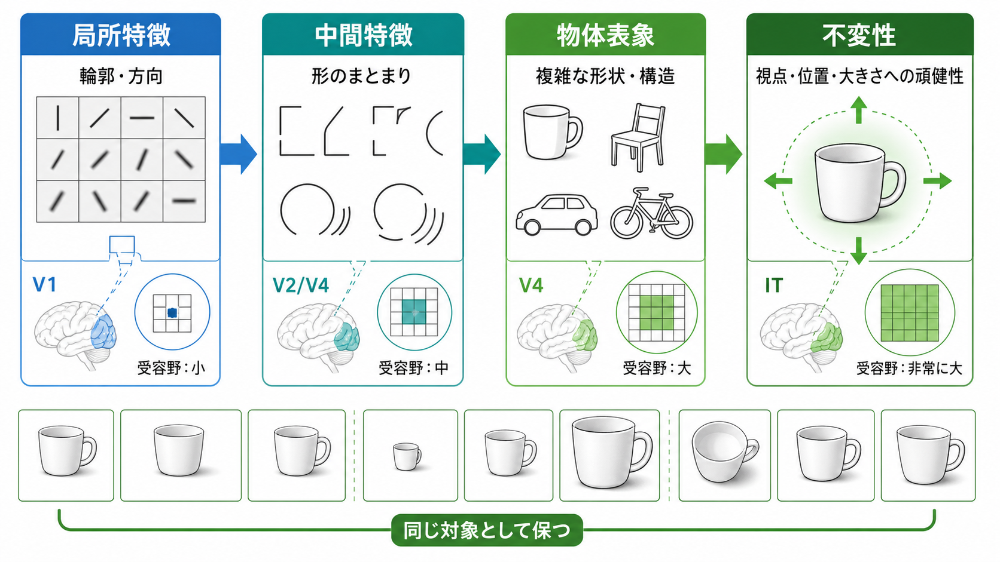
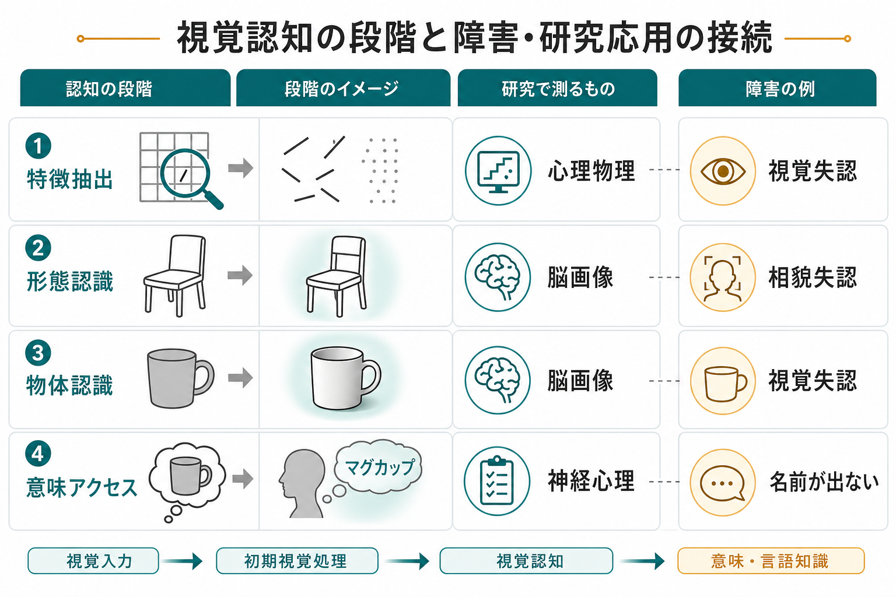

# 視覚認知はどのように対象を認識するのか

## 要点

- 視覚認知は、網膜像をそのまま「写真のように読む」過程ではない。光の分布から、輪郭、向き、色、運動、奥行きなどの特徴を抽出し、それらをまとまった形として統合し、物体表象と意味記憶へ接続する過程である。
- 初期視覚野では、向きや位置に選択的な受容野をもつニューロンが、局所的な特徴を並列に処理する。Hubel と Wiesel の研究は、この段階的な特徴抽出の神経基盤を示した古典的研究である [1]。
- 物体認識の中心には、後頭葉から側頭葉へ向かう腹側視覚経路がある。この経路では、単純な局所特徴から複雑な形態、さらに視点・位置・大きさが変わっても同じ対象として扱える表象へと処理が進む [2][3]。
- ただし認識は純粋なボトムアップ処理だけではない。[[注意とは何か]]、課題目標、経験、文脈、予測が、どの特徴を重く扱うかを変える。
- 視覚失認や相貌失認の研究は、目が見えていても「何であるか」がわからなくなることを示し、特徴抽出、形態統合、物体認識、意味アクセスを区別する手がかりを与える [4][5]。

## この記事で答える問い

この記事で扱う問いは、「私たちは、なぜ網膜に届いた二次元の光の変化から、椅子、顔、文字、道具のような対象を認識できるのか」である。日常的には、目の前の対象は一瞬で「見える」。しかし脳に届く入力は、明るさ、色、位置、動きの変化であり、対象名や意味が直接書き込まれているわけではない。

そのため視覚認知を理解するには、少なくとも次の段階を分けて考える必要がある。

1. 光の分布から局所的な特徴を取り出す。
2. 離れた特徴を、輪郭や面、奥行き、まとまりとして統合する。
3. 統合された形を、物体や顔や文字の表象として安定化する。
4. その表象を、名前、用途、カテゴリー、過去経験と結びつける。

この流れは [[視覚ネットワークはどのように階層的に情報処理するのか]]、[[選択的注意はどのように働くのか]]、[[意味記憶とは何か]] とも深く関係する。

## まず結論

視覚認知は、「特徴を足し算して最後に名前をつける」だけの単純な直列処理ではない。初期段階ではフィードフォワード処理が重要であり、網膜から一次視覚野、外線条皮質、下側頭皮質へ向かう処理によって、短時間で対象カテゴリーを推定できる [2]。一方で、あいまいな図形、部分的に隠れた対象、文脈に依存する場面では、注意、記憶、予測、課題要求が視覚処理を調整する。

したがって、視覚認知は次のようにまとめられる。

> 視覚認知とは、感覚入力を、行動や理解に使える対象表象へ変換する、階層的で相互作用的な情報処理である。

この表現で重要なのは、「対象表象」という中間段階である。私たちは、網膜像そのものを認識しているのではなく、網膜像から推定された「対象らしさ」を使っている。カップが少し横を向いても、遠くに置かれて小さく見えても、光の当たり方が変わっても、同じカップとして扱えるのは、入力画像ではなく比較的安定した表象が形成されるからである [2][3]。

## 背景

視覚は人間にとって非常に強力な認知機能である。私たちは、短い時間でも、場面の大まかな意味や対象カテゴリーをつかむことができる [2]。しかし、これは外界がそのまま脳内に写し取られているという意味ではない。

網膜に投影される像は、三次元世界の二次元投影である。同じ対象でも、距離、照明、視点、遮蔽、背景、運動によって網膜像は大きく変わる。逆に、まったく異なる対象が一部の角度や輪郭だけを見ると似ている場合もある。これが視覚認知の根本問題である。

Marr と Nishihara は、視覚認識を「網膜像から、認識に使える三次元的な形の表現を構成する問題」として整理した [7]。この考え方は、現在の神経科学や計算モデルにも引き継がれている。つまり視覚認知は、単に目から入った情報を運ぶだけではなく、どの表現なら対象の同一性を安定して扱えるかという計算問題でもある。

## 基本概念

### 特徴抽出

特徴抽出とは、入力画像の中から、局所的な向き、エッジ、明暗差、色、運動方向、空間周波数などを取り出す過程である。一次視覚野 V1 では、特定の位置と向きに反応しやすい細胞が知られており、これは「線分」や「輪郭」を処理する初期段階の基盤として理解される [1]。

ここでの特徴は、まだ「椅子」や「顔」ではない。たとえば椅子の背もたれを見たとき、初期視覚処理は、縦線、横線、角、明暗差、面の境界を局所的に扱う。物体認識は、こうした断片的な信号をさらに統合する必要がある。

### 形態認識

形態認識とは、離れた特徴を、ひとまとまりの輪郭、面、構造として組織化する過程である。私たちは、線が途切れていても輪郭を補完し、重なった図形から手前と奥を分け、影やテクスチャから面の向きを推定する。これは、単一の特徴だけでは説明できない。

Biederman の recognition-by-components 理論では、物体はジオンと呼ばれる基本的な三次元部品と、その配置関係から認識されると提案された [8]。この理論は現在のすべてを説明する完成モデルではないが、「形態認識では部品と関係が重要である」という考え方を明確にした。

### 物体認識

物体認識とは、形態表象を、特定の対象、カテゴリー、用途、名前と結びつける過程である。側頭葉の下側頭皮質やヒトの外側後頭複合体は、物体の形やカテゴリーに関わる領域として研究されてきた [3][4]。

ここで重要なのは不変性である。同じ対象は、視点、位置、大きさ、照明、背景が変わっても同じ対象として扱われる必要がある。DiCarlo らは、このような「core object recognition」は、主に腹側視覚経路を通る高速な処理によって実現されると整理している [2]。

### 意味アクセス

対象が「何か」を見分けることと、その対象について「何を知っているか」は完全には同じではない。カップをカップとして見分けること、カップという名前を言えること、飲み物を入れる道具だとわかること、誰のカップかを知っていることは、関連しながらも異なる処理である。

この段階は [[意味記憶とは何か]] と接続する。視覚認知は、形の処理だけで終わらず、意味記憶、言語、行動選択へつながる。

## 仕組み

### 1. 網膜から初期視覚野へ

光は網膜の視細胞で神経信号に変換され、網膜神経節細胞、外側膝状体、一次視覚野へ送られる。初期視覚野では、視野上の位置関係がある程度保たれたまま表現される。これをレチノトピーという。

一次視覚野のニューロンは、視野上の特定範囲に反応しやすい受容野をもつ。単純細胞や複雑細胞は、特定の向きや動きに選択的に反応し、局所的な特徴抽出を担う [1]。この段階では、情報はまだ対象全体ではなく、視野内の局所パターンとして表現される。

### 2. 階層処理によって複雑な形へ

視覚情報は V1 から V2、V4、MT、側頭葉や頭頂葉へ広がる。腹側視覚経路では、処理段階が進むにつれて、受容野が大きくなり、表現される特徴も複雑になる。単純な線分から、曲線、角、面、部品、物体全体へと、より大きな単位が扱われるようになる。

Riesenhuber と Poggio の階層モデルは、単純な特徴検出と、位置や大きさの変化に頑健な統合操作を組み合わせることで、物体認識に必要な不変性を説明しようとした [3]。現在の深層ニューラルネットワークとの単純な同一視は避けるべきだが、階層的な特徴表現という発想は、神経科学と機械学習をつなぐ重要な視点である。

### 3. 腹側経路と背側経路

古典的には、腹側経路は「何か」、背側経路は「どこか」を処理すると説明されてきた。その後 Goodale と Milner は、背側経路を「行為のための視覚」、腹側経路を「知覚のための視覚」として再整理した [5]。つまり、対象を同定する経路と、対象へ手を伸ばす、避ける、つかむといった行動制御の経路は、重なりながらも異なる目的をもつ。

日常の視覚認知では、この二つは分離して働くわけではない。コップを「コップ」と認識するには腹側経路が重要だが、そのコップに手を伸ばすには背側経路が必要である。対象認識は、最終的には行動へ接続して初めて実用的な意味をもつ。

### 4. 注意と予測が処理を調整する

視覚認知は、入力から一方向に進むだけではない。[[選択的注意はどのように働くのか]] で扱うように、課題目標や注意は、特定の位置、特徴、対象の処理を強める。たとえば「赤い物を探す」と決めているとき、赤に関する処理が相対的に重くなる。

また、文脈や予測も重要である。台所で丸い取っ手のついた白い物体を見れば、私たちはそれをカップとして解釈しやすい。夜道で一部だけ見えた形を人影として誤認することもある。これは視覚認知が柔軟で効率的である一方、錯覚や誤認にも開かれていることを示す。

### 5. 意味記憶と言語へ接続する

物体表象は、カテゴリーや名前と結びつく。カップを見たとき、視覚系は輪郭や形を処理するだけでなく、「飲む」「取っ手がある」「割れる」「自分のものではないかもしれない」といった意味や行動可能性へ接続する。

この段階で障害が生じると、形は見えていても名前が出ない、用途がわからない、顔だとわかるが誰かわからない、といった解離が起こりうる。視覚認知は、感覚処理と [[意味記憶とは何か]]、言語、行動選択の間にある橋渡しの機能である。

## 図解

図1は、網膜入力から意味アクセスまでの全体像を示している。重要なのは、特徴抽出、形態統合、物体表象、意味・名前という段階が区別できる一方で、注意や予測が各段階へ戻って影響することである。

図2は、階層処理と不変性の関係を示している。V1 では局所特徴が中心だが、V2/V4、IT へ進むにつれて、表象はより複雑になり、視点や位置の変化に対して頑健になる。

図3は、研究・臨床との接続を示している。心理物理学、脳画像、神経心理学は、それぞれ異なる粒度で視覚認知を調べる。障害名は診断ラベルとして単独で使うものではなく、「どの段階の処理が弱くなっている可能性があるか」を考えるための研究上の手がかりである。

## 臨床・研究との接続

### 視覚失認

視覚失認とは、基本的な視力だけでは説明しにくい対象認識の障害を指す。典型的には、見えているのに対象を正しく同定できない。Farah は、視覚失認を、正常な視覚認知の仕組みを理解するための重要な神経心理学的証拠として整理した [6]。

大まかには、形の統合が難しい場合と、形はとらえられるが意味や名前に接続しにくい場合を分けて考えることがある。ただし実際の症状は単純に分類できるとは限らず、病変部位、課題、言語機能、注意、記憶などを合わせて評価する必要がある。ここでの説明は教育・研究目的であり、個別診断を意図しない。

### 相貌失認と顔認知

顔は、物体の一種でありながら、人間にとって特に重要な視覚カテゴリーである。顔の同一性、視線、表情、口の動きなどは、単なる形の違いだけでなく社会的意味をもつため、一般的な物体認識と重なりながらも独自の研究領域を形成している。

このことは、対象認識が単一の「物体認識センター」で完結しないことを示す。対象の種類、社会的意味、行動上の重要性によって、視覚表象は異なるネットワークと接続する。

### 心理物理・脳画像・計算モデル

研究では、視覚認知は複数の方法で調べられる。心理物理学では、刺激の提示時間、コントラスト、遮蔽、ノイズ、視点変化を操作して、どの条件で認識が難しくなるかを測る。脳画像では、外側後頭複合体や下側頭皮質など、物体に選択的に反応する領域を調べる [4]。計算モデルでは、どの表現と変換規則を仮定すれば、人間や動物の認識行動を説明できるかを検討する [2][3]。

特に近年は、深層学習モデルとの比較が重要になっている。ただし、深層ネットワークが高い分類性能を示すことと、人間の視覚認知をそのまま説明することは同じではない。神経活動、行動データ、錯覚、失認、発達、注意の効果と照合する必要がある。

## よくある誤解

### 誤解1: 目はカメラのように外界を写している

目は光学的にはカメラに似た部分をもつが、視覚認知は写真の保存ではない。網膜像は、神経回路によって特徴へ分解され、統合され、推定される。私たちが経験する「見えている世界」は、外界そのものの写しではなく、行動に使えるよう構成された知覚である。

### 誤解2: 物体認識は特徴を足せば完成する

特徴は重要だが、特徴の単純な足し算だけでは対象認識は説明できない。輪郭の補完、図地分離、奥行き、部品間の関係、視点変化への頑健性が必要である。形態認識は、特徴をどのように組織化するかの問題である [7][8]。

### 誤解3: 腹側経路は「何」、背側経路は「どこ」と覚えれば十分

この説明は導入として便利だが、現在では単純化しすぎである。腹側経路は対象同定に、背側経路は空間や行為制御に強く関わるが、両者は相互作用する。Goodale と Milner の「知覚のための視覚」と「行為のための視覚」という整理は、この点を理解する助けになる [5]。

### 誤解4: 視覚失認は「見えていない」だけである

視覚失認では、視力や視野だけでは説明できない対象認識の障害が問題になる。見えていることと、何であるかを認識することは同じではない。この区別は、視覚認知を段階的に理解するうえで重要である [4]。

## 関連ノート

- [[視覚ネットワークはどのように階層的に情報処理するのか]]: 視覚経路の階層性を神経回路の観点から整理する。
- [[注意とは何か]]: 視覚処理をどの情報へ優先的に割り当てるかを考える基礎。
- [[選択的注意はどのように働くのか]]: 特徴・位置・対象の選択が視覚認知へ与える影響を理解する。
- [[意味記憶とは何か]]: 見えた対象を名前、用途、カテゴリーへ結びつける段階と関係する。
- [[フィードフォワード回路はどのように情報を処理するのか]]: 高速な視覚認識の基礎になる一方向処理を整理する。
- [[フィードバック回路は脳内情報処理をどう調節するのか]]: 予測、注意、文脈が視覚処理を調整する仕組みと接続する。
- [[皮質視床ループは意識や注意にどう関わるのか]]: 視覚入力が意識内容や注意制御と関わる上位の回路を考える。

### 関連ノート候補

- 腹側視覚経路とは何か
- 背側視覚経路とは何か
- 視覚失認とは何か
- 相貌失認とは何か
- 図地分離とは何か
- 物体認識と深層学習モデルはどこまで対応するのか

### MOC更新候補

- `content/00_MOC/` 配下の認知科学・心理学系 MOC に、本記事へのリンクを追加する候補。
- 視覚・知覚・注意・記憶を横断する MOC がある場合、[[視覚ネットワークはどのように階層的に情報処理するのか]]、[[注意とは何か]]、[[意味記憶とは何か]] と並べて配置する候補。

## 理解チェック

1. 網膜像と「対象表象」はどのように違うか。
2. 特徴抽出、形態認識、物体認識、意味アクセスを、それぞれ一文で説明できるか。
3. なぜ同じカップを、視点や大きさが変わっても同じ対象として認識できるのか。
4. 腹側視覚経路と背側視覚経路は、どのような役割の違いとして理解できるか。
5. 視覚失認が、正常な視覚認知の仕組みを理解する手がかりになるのはなぜか。

## 参考文献

[1] Hubel, D. H., & Wiesel, T. N. (1968). Receptive fields and functional architecture of monkey striate cortex. *The Journal of Physiology, 195*(1), 215-243. https://doi.org/10.1113/jphysiol.1968.sp008455

[2] DiCarlo, J. J., Zoccolan, D., & Rust, N. C. (2012). How does the brain solve visual object recognition? *Neuron, 73*(3), 415-434. https://doi.org/10.1016/j.neuron.2012.01.010

[3] Riesenhuber, M., & Poggio, T. (1999). Hierarchical models of object recognition in cortex. *Nature Neuroscience, 2*, 1019-1025. https://doi.org/10.1038/14819

[4] Grill-Spector, K., Kourtzi, Z., & Kanwisher, N. (2001). The lateral occipital complex and its role in object recognition. *Vision Research, 41*(10-11), 1409-1422. https://doi.org/10.1016/S0042-6989(01)00073-6

[5] Goodale, M. A., & Milner, A. D. (1992). Separate visual pathways for perception and action. *Trends in Neurosciences, 15*(1), 20-25. https://doi.org/10.1016/0166-2236(92)90344-8

[6] Farah, M. J. (2004). *Visual Agnosia* (2nd ed.). MIT Press. https://mitpress.mit.edu/9780262562034/visual-agnosia/

[7] Marr, D., & Nishihara, H. K. (1978). Representation and recognition of the spatial organization of three-dimensional shapes. *Proceedings of the Royal Society of London. Series B, Biological Sciences, 200*(1140), 269-294. https://doi.org/10.1098/rspb.1978.0020

[8] Biederman, I. (1987). Recognition-by-components: A theory of human image understanding. *Psychological Review, 94*(2), 115-147. https://doi.org/10.1037/0033-295X.94.2.115

## 未解決問題

- 腹側視覚経路の階層表現は、深層学習モデルの内部表現とどこまで対応するのか。
- 物体認識におけるフィードフォワード処理とフィードバック処理の寄与は、刺激の曖昧さや課題要求によってどのように変わるのか。
- 視覚失認、相貌失認、読字障害などの症状を、単一の局所損傷ではなくネットワーク障害としてどのように記述できるのか。
- 発達や学習によって、物体カテゴリーの表象はどの程度変化するのか。
