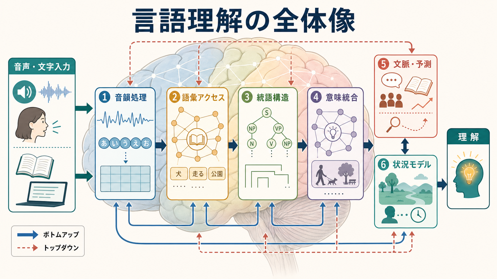
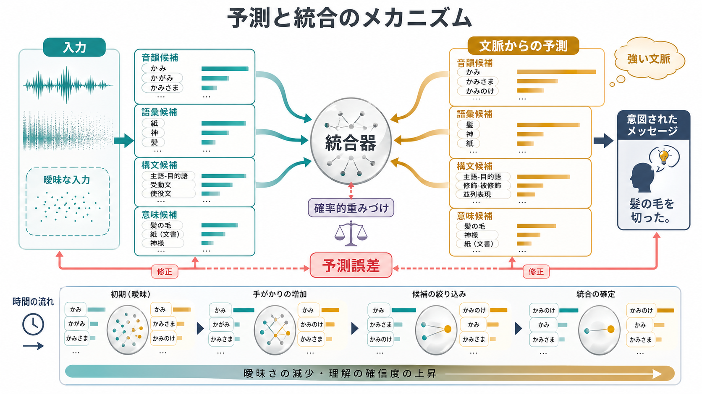
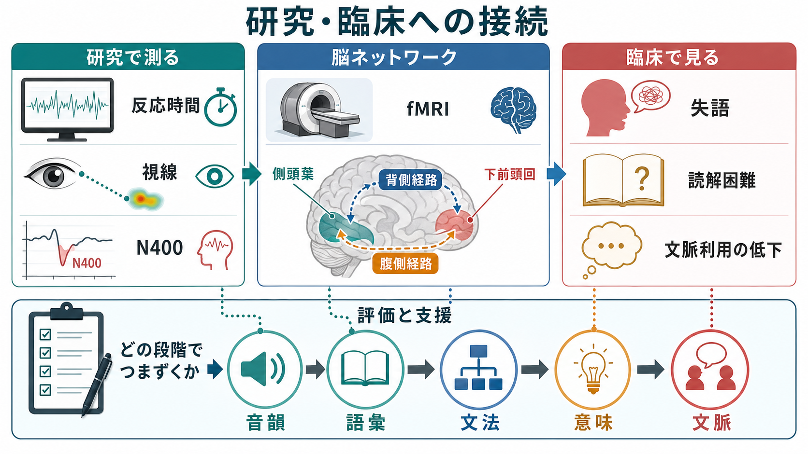

# 言語理解はどのように行われるのか

## 要点

- 言語理解は、音声や文字を受け取ってから、音韻、語彙、文法、意味、文脈、状況モデルを統合し、話し手・書き手が伝えようとしたメッセージを推定する過程である。
- 音声理解では、側頭葉を中心とする腹側経路が音声を意味へ結び、背側経路が音声と発話運動・音韻作業記憶を結ぶと考えられている[1]。
- 語の理解は「候補を一つずつ検索する」よりも、入力に合う複数候補が並列に活性化し、競合し、文脈によって絞り込まれる過程として捉えられる[2]。
- 文の理解では、記憶された語彙知識、構文・意味の統合、課題や会話状況に応じた制御が協調する[3]。
- 現代的には、言語理解はボトムアップ処理だけでなく、文脈からの予測と予測誤差の修正を含む確率的推論として理解される[6]。

## この記事で答える問い

1. 音や文字は、どのように語や意味へ変換されるのか。
2. 語彙、文法、意味、文脈はどの順序で、どのように相互作用するのか。
3. 脳内では、どのようなネットワークが言語理解を支えているのか。
4. 失語、読解困難、文脈利用の低下を考えるとき、言語理解モデルは何を教えてくれるのか。

## まず結論

言語理解は、入力を下から積み上げる単純なパイプラインではない。たしかに、話し声なら音響特徴から音韻候補へ、文字なら視覚特徴から文字・語形候補へ進む。しかし、理解が成立するには、同時に「この文脈なら次に何が来そうか」「この語はどの意味で使われているか」「この文は誰が何をしたと言っているか」を予測し、候補を更新し続ける必要がある[6]。

たとえば「銀行でお金を下ろした」という文では、「銀行」は金融機関として解釈される。一方、「川の銀行」という不自然な直訳では、英語 bank の別義を知らなければ理解が崩れる。ここで働いているのは、音や文字の認識だけではない。[[意味記憶とは何か|意味記憶]]、文法知識、文脈、世界知識、注意、[[ワーキングメモリ容量はなぜ限られているのか|ワーキングメモリ]]が、短い時間幅の中で協調している。

## 背景

古典的な言語理解観では、入力は「音韻処理 → 語彙アクセス → 構文解析 → 意味解釈」という段階を順に通ると説明されやすかった。この説明は学習上わかりやすいが、実際の理解はもっと相互作用的である。音声を聞いている最中にも、聞き手は語の候補を逐次更新し、視覚的な場面や会話の目的を利用して解釈を絞り込む[2][7]。

神経科学でも、単一の「言語中枢」だけで理解が行われるという見方は不十分である。Hickok と Poeppel の二重経路モデルでは、音声から意味へ向かう腹側経路と、音声から発話運動・音韻保持へ向かう背側経路が区別される[1]。また Friederici のレビューは、統語処理には左半球の側頭-下前頭ネットワークが強く関与し、意味処理はより広い両側性ネットワークを含むことを整理している[4]。

## 基本概念

### 音韻処理

音韻処理とは、連続した音声信号から、言語に関係する音の単位やリズム、強勢、音節構造を取り出す過程である。実際の音声は、単語ごとに明確な切れ目があるわけではない。発話速度、話者の声質、雑音、方言、前後の音の影響により、同じ音素でも物理的特徴は変わる。

この段階は[[聴覚ネットワークは音情報をどう処理するのか|聴覚ネットワーク]]と密接に関係する。側頭葉の聴覚野や上側頭領域は、音声の時間的変化や音韻的特徴を処理し、語彙候補を活性化する土台を作る[1]。

### 語彙アクセス

語彙アクセスとは、聞こえた音や見えた文字から、心内辞書にある語の候補を呼び出す過程である。Marslen-Wilson のコホートモデルでは、語の始まりに合う複数の候補が同時に活性化し、入力が進むにつれて候補が絞られる[2]。たとえば「かみ...」と聞いた時点では、「紙」「神」「髪」など複数の語が候補になる。後続の音、文法的位置、文脈が加わることで、最も妥当な候補が選ばれていく。

重要なのは、語彙アクセスが単なる辞書引きではないことである。語の頻度、親近性、音韻的近さ、意味的関連、会話状況が候補の競合に影響する。したがって、聞き取りにくい環境では、[[注意とは何か|注意]]や文脈の利用が理解を大きく左右する。

### 統語構造

統語構造とは、語がどのような関係で結びついて文を作るかを示す構造である。「犬が男を追いかけた」と「男が犬を追いかけた」は、同じ語を含んでいても、助詞と語順によって意味が変わる。文法処理は、誰が行為者で、何が対象で、どの語がどの語を修飾するかを決めるために必要である。

脳内では、左下前頭回、上側頭回、前部側頭葉、白質連絡路を含むネットワークが統語処理に関わると整理されている[4]。ただし、統語処理は意味や文脈から完全に独立しているわけではない。実際の理解では、構文候補と意味候補は相互に制約し合う。

### 意味統合

意味統合とは、単語の意味を文脈の中で組み合わせ、文や談話の意味を作る過程である。N400 と呼ばれる事象関連電位は、意味的適合性や予測しやすさに敏感であり、語の意味が文脈にどれだけ合うかを調べる代表的な指標として使われてきた[5]。

たとえば「彼女はコーヒーに砂糖と靴下を入れた」という文では、「靴下」は文法的には入るが、意味的には文脈に合わない。このような不一致では N400 が大きくなりやすい。これは、意味理解が単語の定義を取り出すだけでなく、文脈と照合しながら進むことを示している[5]。

### 状況モデル

状況モデルとは、文そのものを越えて、誰が、どこで、何を、なぜしているのかという出来事の表象である。言語理解の最終目標は、構文木を作ることでも、単語の意味を全部列挙することでもなく、伝達されたメッセージを状況の中で理解することである[6]。

## 仕組み

### 1. 入力は候補を作る

音声や文字の入力は、最初から一つの解釈に決まるのではなく、複数の候補を作る。音声では、入力が時間とともに展開するため、候補は逐次更新される。文字言語でも、語の頻度、形態、前後の語、文脈が候補の活性化に影響する。

### 2. 候補は競合し、文脈で重みづけされる

語彙候補、構文候補、意味候補は互いに競合する。たとえば「太郎が花子を見た犬...」のような文では、どの語がどこに係るのかが一時的に曖昧になる。理解システムは、入力の信頼度、文法的自然さ、語の意味的整合性、文脈の予測を使って候補を重みづけする[3][6]。

### 3. 統合は記憶・制御・予測を使う

Hagoort の MUC モデルは、言語処理を Memory、Unification、Control の三つの構成要素で整理する[3]。Memory は語彙や構文パターンなどの長期知識、Unification は語や句を文脈に合う構造へ統合する過程、Control は課題、会話相手、意図、注意を踏まえて処理を調整する過程である。

この枠組みは、言語理解が「語を知っているかどうか」だけでは決まらないことを説明する。同じ文でも、雑音下で聞く場合、専門用語が多い場合、冗談や皮肉を含む場合、読者は異なる制御資源を使う。ここには[[選択的注意はどのように働くのか|選択的注意]]や[[リカレント回路はどのように記憶や持続活動を支えるのか|持続的な神経活動]]も関わる。

### 4. 予測誤差で理解を修正する

予測処理の観点では、理解者は文脈から次に来る音、語、構文、意味を確率的に予測し、実際の入力とのずれを使って解釈を更新する[6]。予測は常に正しい必要はない。むしろ、入力が予測と違ったときに、どのレベルの仮説を修正すべきかを判断することが重要である。

たとえば「彼は朝食にトーストを塗った」と聞けば、文法的には可能でも、意味的には「トーストに何かを塗った」のほうが自然である。理解者は、聞き間違い、比喩、冗談、文法的誤り、未知の表現など、複数の可能性を考えながら解釈を修正する。この意味で、言語理解は[[妄想は予測誤差処理の異常として説明できるのか|予測誤差処理]]とも概念的に接続できる。ただし、精神症状の説明へ直結させるには慎重な検討が必要である。

## 図解

図1は、音声・文字入力から理解に至るまでの全体像を示す。音韻、語彙、統語、意味、文脈、状況モデルは便宜的に分けられるが、実際には矢印が示すように相互作用する。

図2は、ボトムアップ入力とトップダウン予測の統合を示す。曖昧な入力では複数候補が残り、文脈が強いほど候補の重みづけが変わる。予測誤差は、入力の聞き直し、語彙候補の変更、構文解析のやり直し、意味解釈の修正を促す。

図3は、研究・臨床との接続を示す。反応時間、視線、ERP、fMRI、神経心理学的評価は、言語理解のどの段階で処理が変化しているかを推定するために使われる。

## 臨床・研究との接続

### 失語と一次進行性失語

失語では、音韻、語彙、統語、意味、発話、復唱、読解、書字のどこに障害が強いかによって症状が異なる。一次進行性失語は、言語ネットワークが比較的選択的に障害される神経変性症候群として整理され、語想起、文法、語義理解などの障害パターンが診断と研究の手がかりになる[8]。

ただし、臨床的な言語障害を「ブローカ野が壊れたから文法が壊れる」「ウェルニッケ野が壊れたから意味が壊れる」と単純化するのは危険である。現在の神経言語学では、皮質領域、白質連絡、左右半球、認知制御、記憶、聴覚・視覚処理を含むネットワークとして評価する必要がある[1][4][8]。

### 読解困難と聞き取り困難

読解や聞き取りの困難は、単一の段階だけで起こるとは限らない。文字や音韻の識別、語彙知識、文法処理、作業記憶、注意、背景知識、文脈推論がいずれも影響しうる。したがって評価では、「音は聞こえるか」「語として認識できるか」「文法関係を追えるか」「意味を文脈に統合できるか」を分けて考えることが重要である。

### 研究方法

言語理解研究では、反応時間、正答率、視線計測、ERP、MEG、fMRI、病巣研究、計算モデルが組み合わされる。視線計測は、話し言葉が展開するその瞬間に、聞き手がどの対象を候補として考えているかを調べるのに有用である[7]。ERP の N400 は、意味処理や予測可能性の時間経過をミリ秒単位で調べるために使われる[5]。

## よくある誤解

### 誤解1: 言語理解は左脳の一部だけで行われる

左半球優位の言語ネットワークは重要だが、理解は一つの場所で完結しない。音声処理、意味処理、文脈処理、注意、記憶、社会的推論を含む広いネットワークが関わる[1][4]。

### 誤解2: 文法を解析してから意味を理解する

統語処理と意味処理は区別できるが、実際には相互作用する。視覚的文脈が早い段階から語認識や構文処理に影響することも示されている[7]。

### 誤解3: 予測は単なる当て推量である

言語理解における予測は、根拠のない思い込みではなく、過去の言語経験、現在の文脈、話し手の意図、入力の信頼度に基づく確率的な準備である[6]。予測が外れたときに柔軟に修正できることが、理解の精度を支える。

### 誤解4: 単語の意味を知っていれば文は理解できる

単語の意味を知っていても、文法関係、談話文脈、比喩、皮肉、語用論的意図を処理できなければ、文全体の理解は不十分になる。言語理解は、語彙知識と状況推論を結びつける過程である。

## 関連ノート

- [[聴覚ネットワークは音情報をどう処理するのか]]
- [[意味記憶とは何か]]
- [[ワーキングメモリ容量はなぜ限られているのか]]
- [[注意とは何か]]
- [[選択的注意はどのように働くのか]]
- [[リカレント回路はどのように記憶や持続活動を支えるのか]]
- [[妄想は予測誤差処理の異常として説明できるのか]]

MOC更新候補: `content/00_MOC/` 配下の認知科学、言語、神経科学、心理学関連 MOC。並列ジョブとの競合を避けるため、本記事からは MOC 本体を更新していない。

今後の作成候補: 言語理解、語彙アクセス、統語処理、N400、失語、語用論、読解モデル、予測処理と言語。

## 理解チェック

1. 言語理解を、単純な「音韻 → 語彙 → 文法 → 意味」の一方向処理としてだけ説明できない理由は何か。
2. 語彙アクセスで、複数の候補が同時に活性化するとはどういうことか。
3. N400 は、言語理解のどの側面を調べるときに役立つか。
4. 文脈からの予測は、理解を助ける一方で、どのような場合に誤解を生むか。
5. 失語や読解困難を評価するとき、音韻・語彙・文法・意味・文脈を分けて考える利点は何か。

## 未解決問題

- 言語理解における予測は、音韻、語彙、構文、意味のどのレベルで、どの程度まで事前活性化を起こすのか。
- 大規模言語モデルの予測能力は、人間の言語理解における意味統合や状況モデル形成とどこまで対応するのか。
- 個人差、発達、加齢、二言語使用、神経疾患により、文脈利用と予測誤差処理はどのように変わるのか。
- 臨床評価で、言語ネットワークのどの段階のつまずきを、短時間で信頼性高く測定できるのか。

## 参考文献

[1] Hickok, G., & Poeppel, D. (2007). The cortical organization of speech processing. *Nature Reviews Neuroscience, 8*, 393–402. https://doi.org/10.1038/nrn2113

[2] Marslen-Wilson, W. D. (1987). Functional parallelism in spoken word-recognition. *Cognition, 25*(1–2), 71–102. https://doi.org/10.1016/0010-0277(87)90005-9

[3] Hagoort, P. (2013). MUC (Memory, Unification, Control) and beyond. *Frontiers in Psychology, 4*, 416. https://doi.org/10.3389/fpsyg.2013.00416

[4] Friederici, A. D. (2011). The brain basis of language processing: From structure to function. *Physiological Reviews, 91*(4), 1357–1392. https://doi.org/10.1152/physrev.00006.2011

[5] Kutas, M., & Federmeier, K. D. (2011). Thirty years and counting: Finding meaning in the N400 component of the event-related brain potential (ERP). *Annual Review of Psychology, 62*, 621–647. https://doi.org/10.1146/annurev.psych.093008.131123

[6] Kuperberg, G. R., & Jaeger, T. F. (2016). What do we mean by prediction in language comprehension? *Language, Cognition and Neuroscience, 31*(1), 32–59. https://doi.org/10.1080/23273798.2015.1102299

[7] Tanenhaus, M. K., Spivey-Knowlton, M. J., Eberhard, K. M., & Sedivy, J. C. (1995). Integration of visual and linguistic information in spoken language comprehension. *Science, 268*(5217), 1632–1634. https://doi.org/10.1126/science.7777863

[8] Mesulam, M.-M., Rogalski, E. J., Wieneke, C., Hurley, R. S., Geula, C., Bigio, E. H., Thompson, C. K., & Weintraub, S. (2014). Primary progressive aphasia and the evolving neurology of the language network. *Nature Reviews Neurology, 10*, 554–569. https://doi.org/10.1038/nrneurol.2014.159
