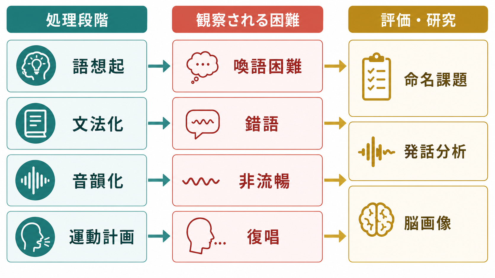

# 言語産出はどのように行われるのか

## 要点

- 言語産出は、考えをそのまま音に変える単純な変換ではなく、意図の形成、語彙選択、文法化、音韻符号化、構音運動、自己モニタリングが重なり合う過程である。
- 古典的な段階モデルでは、概念化、形式化、構音、自己モニタリングが区別されるが、実際の処理は完全な直列ではなく、意味・語彙・音韻の間で相互作用する[1][2]。
- 神経科学的には、側頭葉、下前頭回、運動・聴覚系、前頭頭頂系が、語の検索、文法処理、発話運動、フィードバック制御を分担する[3][4][5]。
- 失語、喚語困難、錯語、非流暢性は、単に「言葉を知らない」問題ではなく、処理段階のどこで詰まるかによって異なる形をとる[7]。

## この記事で答える問い

- 考えはどのように語や文に変換されるのか。
- 言いたい語を選ぶとき、何が競合し、何が選択されるのか。
- 発話はなぜ言い間違いや言い直しを含むのか。
- 言語産出のモデルは、研究や臨床評価にどう役立つのか。

## まず結論

言語産出とは、内的な意図を、相手に伝わる音声または書記表現へ変換する一連の認知過程である。典型的には、まず「何を伝えるか」が作られ、そこから意味に合う語が選ばれ、文法的な並びが構成され、語の音形が取り出され、音節や音素の系列が発話運動へ渡される[1][3]。ただし、語彙選択と音韻符号化は完全に一方向ではない。語の候補同士が競合し、意味的に近い語や音が似た語が干渉し、自己モニタリングによって言い直しが起こる[2][6]。

この過程には、[[意味記憶とは何か]]、[[ワーキングメモリとは何か]]、[[注意とは何か]]、[[選択的注意はどのように働くのか]]が関わる。たとえば会話中に適切な語を選び続けるには、意味知識だけでなく、発話目標を保持し、不要な候補を抑え、相手の反応を見ながら調整する制御が必要になる。

## 背景

言語理解では、外から入ってくる音声や文字を意味へ向けて解析する。これに対して言語産出では、内側にある意図を、相手が聞き取れる語・文・音声へ外化する。両者は鏡写しではない。理解では曖昧な入力から意味を推定するが、産出では多数の候補から一つの表現を選び、時間的に順序づけ、発話器官を制御しなければならない。

Levelt らのモデルは、発話を概念化、形式化、構音、モニタリングに分ける枠組みを示した[1]。この枠組みは現在でも、命名課題、発話エラー、失語症状、脳画像研究を整理する土台として使われる。ただし、語彙アクセスをめぐっては、段階が比較的独立しているとみる立場と、意味・語彙・音韻の活性化が相互に広がるとみる立場がある[1][2]。

## 基本概念

**概念化**  
話し手が「何を伝えたいか」を組み立てる段階である。出来事、対象、意図、相手との関係、会話の文脈がここに入る。これは単なる言語処理ではなく、[[エピソード記憶とは何か]]、[[意味記憶とは何か]]、社会的推論、目標管理を含む。

**語彙選択**  
伝えたい意味に合う語を選ぶ段階である。「犬」と言いたいとき、「動物」「ペット」「柴犬」「猫」など意味的に近い候補も同時に活性化しうる。産出エラーでは、意味的に近い語への置換が生じることがある[2]。

**文法化**  
選ばれた語を、文として並べる段階である。語順、助詞、時制、数、主語と述語の対応などがここに含まれる。日本語では、助詞や語順の柔軟性がある一方で、話題構造や省略の管理が重要になる。

**音韻符号化**  
選ばれた語の音形を取り出し、音素や音節の系列へ変換する段階である。ここでの失敗は、音が入れ替わる、似た音に置き換わる、語頭だけ出てこない、といった形で現れる。

**構音とフィードバック制御**  
音韻系列は、舌、唇、顎、喉頭、呼吸の運動計画へ変換される。発話中は、聴覚フィードバックと体性感覚フィードバックを使い、自分の声が意図した音になっているかを調整する[5]。

**自己モニタリング**  
話し手は、自分が言おうとしている内容と、実際に出た発話を監視する。言い間違いへの気づき、言い直し、言い淀みは、産出系の失敗だけでなく、監視と修正の働きも反映する[6]。

## 仕組み

### 1. 伝達意図を作る

発話は、まず言語以前の意図から始まる。「相手に何を知らせるか」「どの程度詳しく言うか」「丁寧に言うか」「曖昧に残すか」といった選択は、語を取り出す前に始まっている。ここでは、[[中央実行系とは何か]]や[[前頭頭頂ネットワークは認知制御をどう支えるのか]]に関わる目標維持と選択が重要になる。

### 2. 意味から語彙候補を活性化する

伝えたい意味が決まると、その意味に近い語彙候補が活性化する。たとえば「赤くて甘い果物」を表したいとき、「りんご」だけでなく、「果物」「いちご」「食べ物」なども部分的に活性化しうる。Dell の相互活性化モデルでは、意味、語、音韻の表象がネットワーク状に結びつき、活性化が広がることで、正しい語だけでなくエラー候補も生じると考える[2]。

### 3. 候補を選び、文の形にする

語彙選択は、最も活性化した語を単に読み出すだけではない。会話文脈、相手の知識、語の頻度、直前に使った語、構文上の制約が影響する。さらに、単語を並べるだけでは文にならない。発話するには、語を文法的な枠に入れ、どの要素を明示し、どの要素を省略するかを決める必要がある。

### 4. 音の系列へ変換する

語が選ばれると、その語の音形が取り出される。音韻符号化では、音素、モーラ、音節、アクセントなどが時間的な系列として準備される。Indefrey と Levelt のメタ分析は、語産出の各成分が異なる時間窓と脳領域に対応する可能性を示した[3]。ただし、脳領域と処理段階を一対一で対応させるのは単純化しすぎであり、課題や言語によって変わる。

### 5. 発話運動として実行し、結果を監視する

音韻系列は、構音器官の運動へ変換される。発話は高速な運動なので、毎回の音を意識的に制御しているわけではない。むしろ、予測された感覚結果と実際の聴覚・体性感覚フィードバックを比較し、ずれがあれば調整する[5]。自分の発話を聞きながら修正する仕組みは、流暢な会話にも、発話訓練や音声障害の研究にも関係する。

## 図解

言語産出を理解するには、「一つの中枢が文を作る」と考えるより、複数の処理段階が短時間で連携すると考えるほうがよい。特に重要なのは、候補語の競合と選択、そして発話後のフィードバックである。

画像生成では、概念地図と臨床・研究接続図を作成した。図中の語は本文理解の補助であり、厳密な神経解剖学的対応を示すものではない。

## 臨床・研究との接続

臨床的には、言語産出のどの段階が障害されるかによって、観察される困難が変わる。意味処理や語彙検索が弱いと喚語困難が目立ち、音韻符号化が弱いと音韻性錯語が増え、発話運動計画が障害されると非流暢性や発語失行に近い問題が現れる。一次進行性失語の分類でも、非流暢/失文法型、意味型、ロゴペニック型のように、言語症状の組み合わせから背景過程を推定する[7]。

研究では、絵命名課題、単語読み上げ、文産出課題、発話エラー分析、反応時間、眼球運動、EEG/MEG、fMRI などが使われる。たとえば絵を見て名前を言う課題では、視覚認識、意味アクセス、語彙選択、音韻符号化、構音が連続して必要になる。そのため、反応時間が遅いだけでは、どの段階が遅いのかは分からない。エラーの種類、刺激特性、脳活動、症例比較を組み合わせる必要がある[3][4]。

医療・臨床に関する記述は教育・研究目的の整理であり、個別の診断や治療方針を示すものではない。発話や言語理解の困難がある場合は、医師、言語聴覚士、臨床心理職などの専門家による評価が必要である。

## よくある誤解

**誤解1: 言葉が出ないのは、語彙を知らないからである。**  
語を知っていても、会話中に取り出せないことがある。これは語彙知識の欠如ではなく、検索、競合解決、音韻符号化、注意資源の問題として生じうる。

**誤解2: 発話は完全に直列処理である。**  
段階モデルは理解しやすいが、実際には意味、語彙、音韻、運動、モニタリングが重なり合う。語彙候補の活性化や発話エラーは、相互作用的な処理を示唆する[2][6]。

**誤解3: ブローカ野だけが発話を作る。**  
下前頭回は重要だが、言語産出は側頭葉、運動皮質、補足運動野、聴覚皮質、頭頂葉、基底核、小脳などを含む広いネットワークに依存する[4][5]。

**誤解4: 自己モニタリングは発話後にだけ働く。**  
話し手は、実際に声に出た発話だけでなく、発話前の内的な語や音の候補も監視している可能性がある。エラー検出には理解系だけでなく、産出系内部の情報も関わると議論されている[6]。

## 関連ノート

- [[意味記憶とは何か]]
- [[ワーキングメモリとは何か]]
- [[中央実行系とは何か]]
- [[注意とは何か]]
- [[選択的注意はどのように働くのか]]
- [[エピソード記憶とは何か]]
- [[前頭頭頂ネットワークは認知制御をどう支えるのか]]

## 関連ノート候補

- 言語理解はどのように行われるのか
- 失語症とは何か
- 音韻処理とは何か
- 発話運動制御とは何か
- 喚語困難とは何か

## MOC更新候補

- `content/00_MOC/MOC｜認知科学・心理学.md` に本記事 `[[言語産出はどのように行われるのか]]` を追加する。
- 並列ジョブとの衝突を避けるため、本タスクでは MOC ファイル自体は更新しない。

## 理解チェック

1. 言語産出における概念化、語彙選択、音韻符号化、構音はそれぞれ何をしているか。
2. 語を知っているのに言葉が出ない現象は、どの処理段階の問題として説明できるか。
3. 発話の自己モニタリングは、なぜ言い間違いの修正に重要なのか。
4. 絵命名課題の反応時間だけでは、なぜ障害段階を特定しにくいのか。

## 未解決問題

- 語彙選択と音韻符号化は、どの程度まで直列的で、どの程度まで相互作用的なのか。
- 発話前の内的モニタリングと、発話後の聴覚フィードバックは、どのように分担しているのか。
- 多言語話者では、使用しない言語の語彙候補をどのように抑制しているのか。
- 大規模言語モデルの文生成と人間の言語産出は、どの水準で比較でき、どの水準では比較できないのか。

## 参考文献

[1] Levelt, W. J. M., Roelofs, A., & Meyer, A. S. (1999). A theory of lexical access in speech production. *Behavioral and Brain Sciences*, 22(1), 1-38. https://doi.org/10.1017/S0140525X99001776

[2] Dell, G. S. (1986). A spreading-activation theory of retrieval in sentence production. *Psychological Review*, 93(3), 283-321. https://doi.org/10.1037/0033-295X.93.3.283

[3] Indefrey, P., & Levelt, W. J. M. (2004). The spatial and temporal signatures of word production components. *Cognition*, 92(1-2), 101-144. https://doi.org/10.1016/j.cognition.2002.06.001

[4] Hickok, G., & Poeppel, D. (2007). The cortical organization of speech processing. *Nature Reviews Neuroscience*, 8, 393-402. https://doi.org/10.1038/nrn2113

[5] Houde, J. F., & Nagarajan, S. S. (2011). Speech production as state feedback control. *Frontiers in Human Neuroscience*, 5, 82. https://doi.org/10.3389/fnhum.2011.00082

[6] Nozari, N., Dell, G. S., & Schwartz, M. F. (2011). Is comprehension necessary for error detection? A conflict-based account of monitoring in speech production. *Cognitive Psychology*, 63(1), 1-33. https://doi.org/10.1016/j.cogpsych.2011.05.001

[7] Gorno-Tempini, M. L., Hillis, A. E., Weintraub, S., et al. (2011). Classification of primary progressive aphasia and its variants. *Neurology*, 76(11), 1006-1014. https://doi.org/10.1212/WNL.0b013e31821103e6
