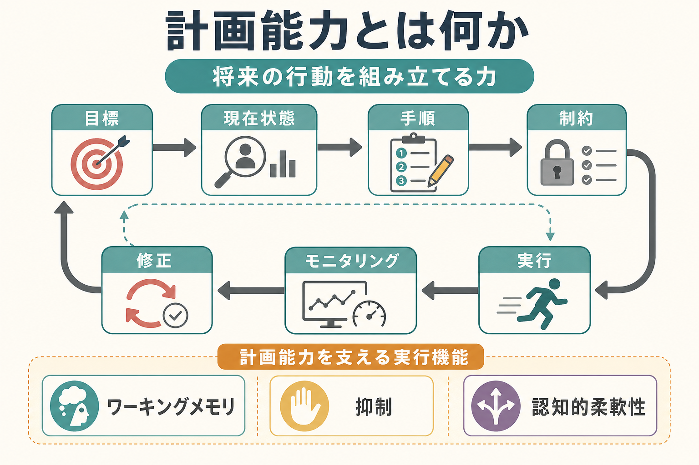
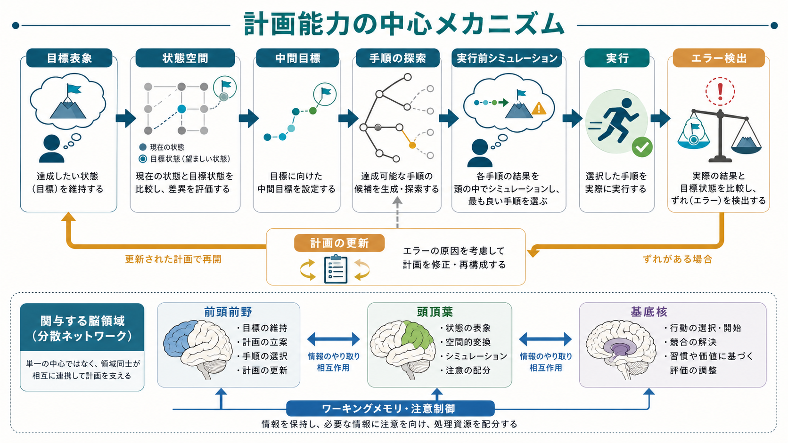
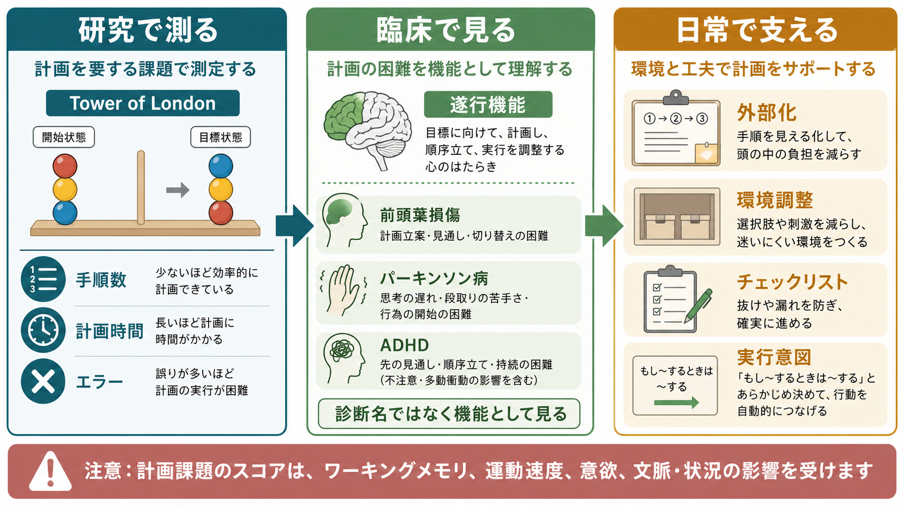

# 計画能力とは何か

## 要点

- 計画能力とは、現在状態と目標状態の差を見積もり、制約の中で中間目標と手順を組み立て、実行しながら修正する認知機能である[1][2]。
- 計画は、単なる「やることリスト」ではなく、[[ワーキングメモリとは何か]]、抑制、[[注意とは何か]]、認知的柔軟性、モニタリングが組み合わさった実行機能の一部として働く[3][4]。
- Tower of London のような課題は計画能力の研究に広く使われるが、成績には作業記憶、処理速度、運動速度、動機づけ、課題理解も影響するため、「計画だけ」を純粋に測るとは考えにくい[2][7]。
- 臨床や支援では、計画能力を診断名そのものとして扱うより、日常生活のどの段階でつまずくかを分けて見るほうが有用である[6][7]。

## この記事で答える問い

1. 計画能力とは、どのような認知機能なのか。
2. 計画能力は、実行機能、ワーキングメモリ、注意制御とどう関係するのか。
3. Tower of London などの課題は、計画能力の何を測っているのか。
4. 臨床・教育・日常支援では、計画能力をどう読み替えればよいのか。

## まず結論

計画能力は、「未来を思い浮かべる力」だけではない。より正確には、目標に向けて行動系列を構成し、制約を考慮し、途中で結果を見ながら手順を更新する能力である。たとえば「明日の発表準備をする」場合、必要なのは資料を作る意欲だけではない。締切、所要時間、資料の不足、他の予定、失敗時の代替案を見積もり、どの順番で動くかを決める必要がある。

この意味で、計画能力は[[中央実行系とは何か]]に近い。目標を保持する、関係のない刺激を抑える、必要な情報を[[ワーキングメモリとは何か]]に置く、状況が変わったら切り替える、といった複数の制御過程の束として理解するとよい[3][4]。

## 背景

計画能力が認知科学で注目される理由は、日常的にはよく見えるのに、単純な記憶検査や知能検査だけでは捉えにくいからである。Shallice は、日常的なルーティン課題とは別に、非定型で新しい課題では前頭葉損傷患者が特異的に困難を示すことを示し、計画能力を検討する代表課題として Tower of London を用いた[1]。

Tower of London では、複数の玉や棒を使い、決められたルールのもとで初期状態から目標状態へ最少手数で移す。ここで必要になるのは、目の前の一手を選ぶだけではない。数手先を見越し、今すぐ動かしたくなる手を抑え、途中の状態を作業記憶に保ち、失敗したら探索をやり直す必要がある[1][2]。

ただし、計画能力を「前頭葉の能力」とだけ言い切るのは単純化しすぎである。計画課題には前頭前野が関与するが、頭頂葉、基底核、感覚・運動系、記憶系との相互作用も重要であり、課題の種類や難度によって関与する過程は変わる[2][5]。

## 基本概念

### 目標状態と現在状態

計画は、まず「どこへ向かうか」と「いまどこにいるか」の差を作る。目標状態が曖昧だと、手順の良し悪しを評価できない。現在状態の把握が粗いと、必要な資源、制約、障害を見落とす。

ここで重要なのは、目標が大きすぎると直接行動に移しにくいことである。「研究を進める」よりも、「先行研究を3本読み、仮説を1文で書く」のほうが計画に落とし込みやすい。大きな目標を中間目標へ分けることは、計画能力の中心的な働きである。

### 手順の系列化

計画能力は、行動を順序づける。ある手順は、別の手順が終わっていないと実行できない。発表資料を作るには、テーマを決める、文献を集める、構成を作る、スライドに落とす、練習する、という依存関係がある。

この系列化では、[[選択的注意はどのように働くのか]]や[[持続的注意とは何か]]も関わる。関係のある情報を選び、途中で目標からそれないように注意を保つ必要がある。

### 制約とトレードオフ

計画は、理想的な手順を作る作業ではなく、制約の中で実行可能な手順を選ぶ作業である。時間、体力、道具、情報、他者の予定、環境の騒音、失敗時のコストが制約になる。

良い計画は、細かいほどよいわけではない。細かすぎる計画は、状況変化に弱くなる。逆に粗すぎる計画は、実行時に毎回判断を求めるため、認知負荷が高くなる。計画能力には、「どの程度まで事前に決め、どこから先を現場で調整するか」を決める働きも含まれる。

## 仕組み

計画能力の最小単位は、次の循環として整理できる。

| 段階 | 認知的な働き | つまずきの例 |
|---|---|---|
| 目標表象 | 達成したい状態を保つ | 何を終えれば完了か曖昧 |
| 状態評価 | 現在の条件と不足を見積もる | 必要な資料や時間を見落とす |
| 手順探索 | 可能な行動系列を試す | 目の前の一手だけで動く |
| 予測 | 手順の結果や失敗を想像する | 後で詰まる順番を選ぶ |
| 実行 | 行動を開始し維持する | 計画はあるが始められない |
| モニタリング | 進捗と誤差を見る | 遅れや間違いに気づかない |
| 更新 | 状況に合わせて修正する | 一度決めた手順に固執する |

実行機能研究では、抑制、ワーキングメモリ、認知的柔軟性が中核的な構成要素として整理されることが多い[3]。計画能力は、これらを使ってより長い時間幅の行動を構成する。ワーキングメモリは中間状態や未完了の手順を保持する。抑制は、目標に合わない衝動的な一手を止める。認知的柔軟性は、失敗した手順から別の手順へ移る。

Miyake と Friedman らの実行機能研究は、実行機能が一枚岩ではなく、共通性を持ちながらも更新、抑制、シフティングなどに分けられることを示してきた[4]。したがって、ある人が「計画が苦手」に見える場合でも、原因は一つとは限らない。目標保持が弱いのか、妨害刺激に引き込まれるのか、選択肢を切り替えられないのか、所要時間の見積もりが弱いのかを分けて考える必要がある。

神経科学的には、計画は前頭前野だけで完結しない。Miller と Cohen は、前頭前野を、目標や文脈に応じて他の脳領域の処理をバイアスする制御システムとして整理した[5]。この見方では、前頭前野は「計画を書き込む場所」というより、現在の目標に応じて知覚、記憶、行動選択を調整するハブに近い。

## 図解

図1は、計画能力を「目標」「現在状態」「手順」「制約」「実行」「モニタリング」「修正」の循環として示している。計画は一度作って終わるものではなく、実行中の情報によって更新される。

図2は、計画の中心メカニズムを示している。重要なのは、実行前シミュレーションとエラー検出である。うまく計画できる人は、実際に動く前に「この順番だとどこで詰まるか」をある程度試し、実行後にずれを検出して修正する。

図3は、研究・臨床・日常支援への接続を示している。研究では Tower of London などの課題が使われる。臨床では、前頭葉損傷、パーキンソン病、ADHD、統合失調症、認知症などで実行機能の困難として観察されることがある。ただし、診断名から一対一に計画能力を推定するのではなく、具体的な生活場面でどの処理が難しいかを見る必要がある。

## 臨床・研究との接続

### 研究課題としての Tower of London

Tower of London は、計画能力を調べる代表的課題である。課題難度は、最少手数だけでなく、途中で作るべき中間状態、探索の幅、見越しの深さ、ルール違反の抑制によって変わる[2][7]。

Kostering らは、成人臨床サンプルで Tower of London Freiburg 版の信頼性と妥当性を検討し、脳卒中、パーキンソン症候群、軽度認知障害を含む集団で計画成績の低下が観察されることを示した[7]。ただし、このような課題成績は多くの認知過程の合成物である。結果を読むときは、「計画能力が低い」と一語でまとめず、どの条件で誤りや遅れが増えたのかを見る必要がある。

### 日常生活で見える計画困難

Burgess は、伝統的な神経心理検査では大きな問題が見えなくても、日常の多重課題では混乱、忘れっぽさ、計画と意思決定の困難が目立つ症例を「strategy application disorder」として論じた[6]。これは、検査室での短い課題と、日常の開かれた課題が違うことを示している。

日常の計画では、目標が複数あり、締切が動き、他者との調整が入り、途中で割り込みが起こる。したがって、検査で良好でも生活で困ることがあり、逆に生活上の工夫で検査成績以上にうまく機能することもある。

### 支援の考え方

計画能力の支援では、「本人の中で計画を完結させる」ことだけを目指さない。外部化、環境調整、手順の分割、チェックリスト、リマインダー、実行意図が有効な場合がある。

実行意図とは、「もし X が起きたら Y をする」という形で、状況手がかりと行動を結びつける計画である。Gollwitzer は、単なる目標意図よりも、具体的な状況と反応を結びつける実行意図が目標達成を助けることを論じた[8]。たとえば「勉強する」ではなく、「夕食後に机に座ったら、10分だけ文献メモを開く」とする。

教育・臨床・職場支援では、次のような読み替えが役立つ。

| 困りごと | 機能としての見立て | 支援例 |
|---|---|---|
| 何から始めればよいかわからない | 目標分解・中間目標化の困難 | 最初の一手だけを明示する |
| 途中で別のことを始める | 注意制御・抑制の困難 | 作業環境を減刺激化する |
| 締切直前まで動けない | 時間見積もり・開始の困難 | 逆算予定と外部リマインダー |
| 一度決めた手順に固執する | 認知的柔軟性の困難 | 代替案を事前に2つ用意する |
| 計画は立つが実行できない | 実行開始・動機づけ・環境手がかりの問題 | 「もし X なら Y」の実行意図 |

## よくある誤解

### 誤解1: 計画能力は性格や努力だけの問題である

計画がうまくいかないと、「だらしない」「やる気がない」と解釈されやすい。しかし、計画には目標保持、注意制御、作業記憶、抑制、柔軟性、時間見積もり、環境調整が関わる。努力の問題としてだけ扱うと、支援可能な認知的・環境的要因を見落とす。

### 誤解2: 細かい計画ほどよい

計画は細かければよいわけではない。変化が多い状況では、細かすぎる計画は更新コストを増やす。むしろ、「固定する部分」と「現場で調整する部分」を分けることが重要である。

### 誤解3: Tower of London は純粋な計画能力検査である

Tower of London は重要な研究課題だが、成績にはワーキングメモリ、運動速度、課題理解、探索戦略、注意、疲労が影響する[2][7]。結果は、単一の能力値ではなく、課題条件と反応パターンから読む必要がある。

### 誤解4: 前頭葉だけを見れば計画能力がわかる

前頭前野は重要だが、計画は分散したネットワークで成立する。頭頂葉、基底核、記憶系、感覚運動系、報酬系との相互作用を含めて考えるほうが、研究にも臨床にも適している[2][5]。

## 関連ノート

- [[ワーキングメモリとは何か]]
- [[中央実行系とは何か]]
- [[注意とは何か]]
- [[選択的注意はどのように働くのか]]
- [[持続的注意とは何か]]
- [[分割注意はどこまで可能なのか]]
- [[空間認知とは何か]]

## MOC更新候補

並列ジョブとの競合を避けるため、このノートでは MOC 本体は更新しない。後続の統合ジョブで、以下への追加を検討する。

- `content/00_MOC/` 配下の認知科学・心理学系 MOC
- 実行機能、注意、ワーキングメモリ、問題解決に関する MOC

## 理解チェック

1. 計画能力を「やることリスト作成」とだけ捉えると、何を見落とすか。
2. Tower of London の成績に、計画能力以外のどの認知機能が影響しうるか。
3. 「計画は立てられるが実行できない」場合、どの段階の支援を考えるべきか。
4. 実行意図を使って、自分の日常課題を「もし X なら Y」の形に言い換えるとどうなるか。

## 未解決問題

- 検査室課題で測られる計画能力と、学校・職場・家庭での実際の計画困難はどの程度一致するのか。
- 計画能力を、作業記憶、抑制、認知的柔軟性、時間見積もり、動機づけからどの程度分離して測定できるのか。
- 外部化、チェックリスト、デジタルリマインダー、実行意図は、どのタイプの計画困難に最も効果的なのか。
- 臨床群ごとの平均差ではなく、個人内の「どの段階で詰まるか」をどう評価するのが妥当か。

## 参考文献

[1] Shallice, T. (1982). Specific impairments of planning. *Philosophical Transactions of the Royal Society of London. Series B, Biological Sciences*, 298(1089), 199-209. https://doi.org/10.1098/rstb.1982.0082

[2] Unterrainer, J. M., & Owen, A. M. (2006). Planning and problem solving: From neuropsychology to functional neuroimaging. *Journal of Physiology-Paris*, 99(4-6), 308-317. https://doi.org/10.1016/j.jphysparis.2006.03.014

[3] Diamond, A. (2013). Executive functions. *Annual Review of Psychology*, 64, 135-168. https://doi.org/10.1146/annurev-psych-113011-143750

[4] Friedman, N. P., & Miyake, A. (2017). Unity and diversity of executive functions: Individual differences as a window on cognitive structure. *Cortex*, 86, 186-204. https://doi.org/10.1016/j.cortex.2016.04.023

[5] Miller, E. K., & Cohen, J. D. (2001). An integrative theory of prefrontal cortex function. *Annual Review of Neuroscience*, 24, 167-202. https://doi.org/10.1146/annurev.neuro.24.1.167

[6] Burgess, P. W. (2000). Strategy application disorder: The role of the frontal lobes in human multitasking. *Psychological Research*, 63(3-4), 279-288. https://doi.org/10.1007/s004269900006

[7] Kostering, L., Schmidt, C. S. M., Egger, K., Amtage, F., Peter, J., Kloppel, S., Beume, L.-A., Hoeren, M., Weiller, C., & Kaller, C. P. (2015). Assessment of planning performance in clinical samples: Reliability and validity of the Tower of London task (TOL-F). *Neuropsychologia*, 75, 646-655. https://doi.org/10.1016/j.neuropsychologia.2015.07.017

[8] Gollwitzer, P. M. (1999). Implementation intentions: Strong effects of simple plans. *American Psychologist*, 54(7), 493-503. https://doi.org/10.1037/0003-066X.54.7.493
