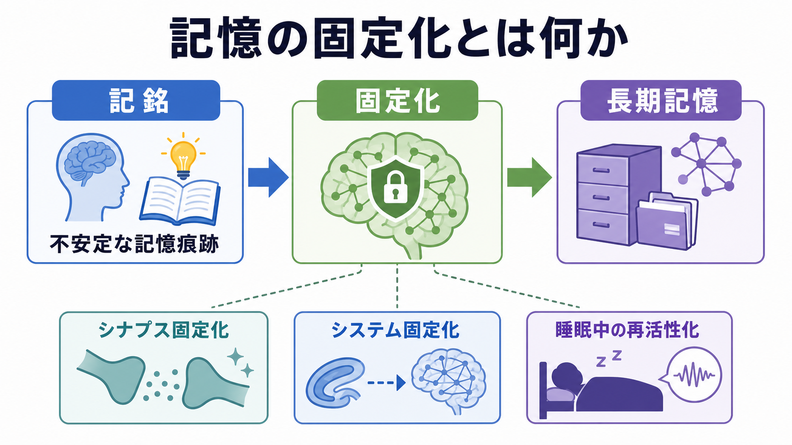
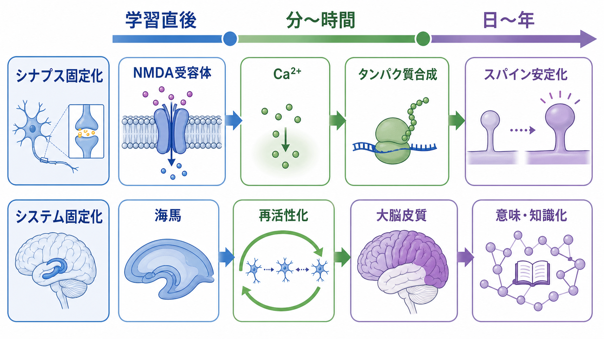
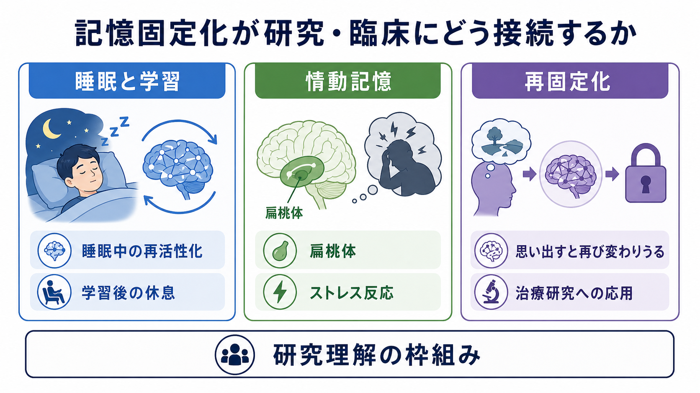

# 記憶の固定化とは何か

## 要点

- 記憶の固定化とは、学習直後には壊れやすい記憶痕跡が、時間経過と神経活動を通じてより安定した長期記憶へ変わる過程である[1][2]。
- 固定化には、分から時間のスケールで起こる「シナプス固定化」と、日から年のスケールで海馬・大脳皮質ネットワークの関係が変わる「システム固定化」がある[2][3]。
- 睡眠や休息中の再活性化は、経験後の記憶痕跡を再処理し、海馬と大脳皮質の結合を変える重要な候補機構である[3][5]。
- 固定化は「保存して終わり」ではない。記憶は想起によって再び不安定化し、再固定化を経て更新されることがある[7]。

## この記事で答える問い

1. 記憶の固定化とは、単に「忘れにくくなる」ことなのか。
2. シナプス固定化とシステム固定化は何が違うのか。
3. 睡眠、海馬、大脳皮質は固定化にどう関わるのか。
4. 固定化の知識は、学習・研究・臨床理解にどう接続するのか。

## まず結論

記憶の固定化は、学習直後の記憶をそのまま冷凍保存する過程ではない。むしろ、経験によって生じた神経活動パターンが、[[シナプス可塑性とは何か|シナプス可塑性]]、タンパク質合成、神経集団の再活性化、海馬と大脳皮質の相互作用を通じて、より長く利用できる表象へ作り替えられる過程である[1][2][6]。

このため、固定化後の記憶は必ずしも「元の経験の完全コピー」ではない。時間が経つにつれて、具体的なエピソードの細部は薄れ、意味、スキーマ、感情的な重み、既存知識とのつながりが強まることがある[2][3]。固定化は安定化であると同時に、変換でもある。

## 背景

記憶固定化という考えは、学習直後の記憶が時間とともに妨害に強くなるという観察から発展した。McGaugh は、固定化仮説が20世紀初頭以来、ホルモン、情動、脳領域、分子機構を結びつける記憶研究の中心概念であり続けてきたと整理している[1]。

典型的には、新しい出来事を経験した直後の記憶は、注意の逸脱、干渉、薬理学的操作、脳損傷などの影響を受けやすい。時間が経つと、その記憶は相対的に壊れにくくなる。この「壊れやすい状態から安定状態への移行」を説明するために固定化という概念が使われる。

ただし、固定化は単一のスイッチではない。脳内では、局所シナプスでの変化、神経細胞内の遺伝子発現、[[海馬回路は記憶をどう形成するのか|海馬回路]]と皮質ネットワークの再編成、睡眠中の活動パターンの再生などが、複数の時間スケールで重なっている[2][3][5]。

## 基本概念

### 記銘・保持・想起との関係

記憶過程は大まかに、記銘、保持、想起に分けられる。記銘は経験を神経表象として作り始める段階、保持はその表象が時間を越えて残る段階、想起は必要なときに再利用する段階である。固定化は主に、記銘直後から保持が成立していくあいだに起こる過程として位置づけられる。

ただし、想起は単なる読み出しではない。想起された記憶は再び不安定化し、その後に再固定化されることがある[7]。したがって、記憶は「記銘して保存し、必要時に取り出す」だけの静的な倉庫モデルでは捉えにくい。

### シナプス固定化

シナプス固定化は、学習に関与した局所回路で、シナプス効率やスパイン構造が長く保たれるようになる過程を指す。[[長期増強LTPとは何か|長期増強LTP]]の後期相、NMDA受容体を介したCa2+流入、転写・翻訳、可塑性関連タンパク質、スパイン構造の安定化などが代表的な候補機構である[4][6]。

重要なのは、強く活動したすべてのシナプスが自動的に長期保存されるわけではない点である。シナプスタグ仮説では、活動したシナプスに一時的な「タグ」が作られ、その後に細胞内で作られた可塑性関連産物を捕捉できたシナプスだけが長期的に変化を保つと考えられる[4][6]。

### システム固定化

システム固定化は、記憶を支える脳領域間の依存関係が変わる過程である。特に宣言的記憶やエピソード記憶では、学習直後には海馬を含む内側側頭葉系が重要だが、時間経過とともに大脳皮質ネットワーク内の結合が強まり、遠隔記憶はより分散した皮質表象として支えられると考えられてきた[3]。

この見方は「標準固定化理論」と呼ばれることがある。一方で、文脈豊かなエピソード記憶や空間記憶には海馬が長く関与し続けるという多重痕跡理論・変換理論もあり、すべての記憶が同じように海馬非依存へ移るわけではない[2][3]。

## 仕組み

### 1. 学習直後の記憶痕跡は不安定である

新しい経験は、感覚情報、注意、情動、文脈、報酬予測などを含む神経活動パターンを作る。この時点の記憶痕跡は、まだ局所回路と広域ネットワークの両方で不安定である。記憶痕跡を担う細胞集団はエングラムと呼ばれ、近年は学習時に活動した神経細胞群を標識・操作する研究によって、記憶の物理的基盤として検討されている[6]。

### 2. 局所シナプスで長期変化が固定される

学習に伴う活動は、[[シナプスとは何か|シナプス]]の伝達効率を変える。海馬や扁桃体などでは、グルタミン酸作動性シナプス、NMDA受容体、Ca2+依存性シグナル、タンパク質合成が、短期的な変化を長期的な変化へ移すうえで重要とされる[4][6]。この段階では、記憶は分子・細胞レベルで「消えにくい形」へ変わる。

### 3. 再活性化によってネットワークが再編成される

学習後の休息や睡眠中には、学習時に活動した海馬ニューロンの活動パターンが再び現れることがある。この再活性化は、大脳皮質側の関連表象を繰り返し駆動し、皮質間結合を強める機構として考えられている[3][5]。[[睡眠障害は脳機能にどのような影響を与えるのか|睡眠]]は単なる休止ではなく、学習後の情報処理を支える能動的な状態とみなされる。

### 4. 記憶はスキーマや意味へ統合される

固定化が進むと、個別経験は既存知識と結びつき、意味記憶やスキーマの一部として使いやすくなることがある[2][3]。たとえば、授業で聞いた一つの具体例は細部まで残らなくても、「この概念はこう使う」という知識へ変換される。これは忘却ではなく、詳細を捨てながら一般化する適応的な変換でもある。

## 図解

上の2枚の図は、固定化を「経験直後から長期記憶への変換」と「時間スケールの異なるメカニズム」として整理したものである。3枚目は、学習研究、情動記憶、再固定化研究への接続をまとめる。

図を読むときは、矢印を一方向の固定的な経路としてではなく、複数の過程が重なったモデルとして見るとよい。シナプス固定化は局所的で速く、システム固定化は広域的で遅いが、両者は独立した別物ではなく、相互に支え合う。

## 臨床・研究との接続

学習研究では、固定化は「復習をいつ入れるか」「睡眠をどのように確保するか」「学習後の干渉をどう減らすか」を考える基盤になる。睡眠研究では、徐波睡眠、睡眠紡錘波、海馬シャープウェーブ・リップルなどが、記憶再活性化と固定化に関わる候補として検討されている[5]。

情動記憶では、扁桃体、ストレスホルモン、覚醒水準が固定化を調節する。強い情動を伴う経験が忘れにくいことは、日常的にも臨床的にも重要である。ただし、強く残る記憶が常に正確な記憶であるとは限らない。[[PTSDでは恐怖記憶ネットワークに何が起きているのか|PTSDの恐怖記憶ネットワーク]]を理解する際にも、固定化、再固定化、消去学習を区別する必要がある。

再固定化研究は、想起された記憶が一時的に変わりやすくなる可能性を示した[7]。これは心理療法や薬理学的介入の研究に接続するが、個別の症状に対して「記憶を書き換えられる」と単純化してよい段階ではない。臨床応用については、教育・研究上の理解として慎重に扱う必要がある。

## よくある誤解

### 固定化されると記憶は完全に変わらない

固定化は安定性を高めるが、記憶を永久に不変にするわけではない。想起、再解釈、干渉、新しい学習によって、記憶表象は更新されうる[2][7]。

### 睡眠中にすべての記憶が同じように強化される

睡眠は多くの記憶過程に関わるが、すべての情報を均等に保存するわけではない。情動的価値、課題関連性、既存知識との一致、学習時の強度などによって、固定化されやすさは変わる[5]。

### 海馬は最初だけ働き、あとは不要になる

標準固定化理論では海馬の時間限定的役割が強調されるが、文脈や空間の細部を伴う記憶では、海馬が長く関与し続ける可能性がある[3]。記憶の種類によって、海馬と皮質の役割分担は異なる。

### LTPが起きれば記憶ができたと言える

LTPは記憶研究の重要な細胞モデルだが、記憶そのものではない。行動としての記憶には、シナプス変化、神経集団、脳領域間ネットワーク、想起手がかり、文脈が関わる[4][6]。

## 関連ノート

- [[シナプス可塑性とは何か]]
- [[長期増強LTPとは何か]]
- [[シナプスとは何か]]
- [[海馬回路は記憶をどう形成するのか]]
- [[シータリズムは記憶とナビゲーションをどう支えるのか]]
- [[アセチルコリンは注意や記憶にどう関わるのか]]
- [[睡眠障害は脳機能にどのような影響を与えるのか]]
- [[PTSDでは恐怖記憶ネットワークに何が起きているのか]]

### MOC更新候補

- `content/00_MOC/` 配下の認知科学・心理学系 MOC
- `content/00_MOC/` 配下の脳・神経科学系 MOC
- 学習・記憶・睡眠・海馬を扱う統合 MOC がある場合は本記事へのリンクを追加

## 理解チェック

1. シナプス固定化とシステム固定化は、時間スケールと主な神経基盤がどのように異なるか。
2. 睡眠中の再活性化は、なぜ海馬と大脳皮質の関係を変える候補機構と考えられるか。
3. 再固定化という概念は、「固定化された記憶は不変である」という見方をどのように修正するか。
4. LTPを記憶そのものと同一視すると、どのような説明の不足が生じるか。

## 未解決問題

- どの記憶が睡眠によって選択的に固定化されるのかを決める条件は、まだ完全には整理されていない。
- 海馬依存性が時間とともにどの程度低下するかは、記憶の種類、細部の豊かさ、想起状況によって異なる。
- 再固定化を臨床介入へ応用する方法は研究されているが、効果の再現性、適用条件、安全性の検討が必要である。

## 参考文献

[1] McGaugh, J. L. (2000). Memory--a century of consolidation. *Science*, 287(5451), 248-251. https://doi.org/10.1126/science.287.5451.248

[2] Dudai, Y., Karni, A., & Born, J. (2015). The Consolidation and Transformation of Memory. *Neuron*, 88(1), 20-32. https://doi.org/10.1016/j.neuron.2015.09.004

[3] Frankland, P. W., & Bontempi, B. (2005). The organization of recent and remote memories. *Nature Reviews Neuroscience*, 6, 119-130. https://doi.org/10.1038/nrn1607

[4] Frey, U., & Morris, R. G. M. (1997). Synaptic tagging and long-term potentiation. *Nature*, 385, 533-536. https://doi.org/10.1038/385533a0

[5] Rasch, B., & Born, J. (2013). About sleep's role in memory. *Physiological Reviews*, 93(2), 681-766. https://doi.org/10.1152/physrev.00032.2012

[6] Josselyn, S. A., Kohler, S., & Frankland, P. W. (2015). Finding the engram. *Nature Reviews Neuroscience*, 16, 521-534. https://doi.org/10.1038/nrn4000

[7] Nader, K., Schafe, G. E., & LeDoux, J. E. (2000). Fear memories require protein synthesis in the amygdala for reconsolidation after retrieval. *Nature*, 406, 722-726. https://doi.org/10.1038/35021052
