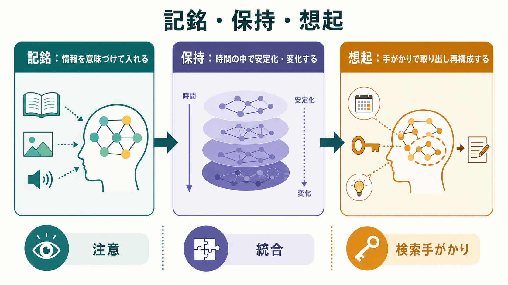
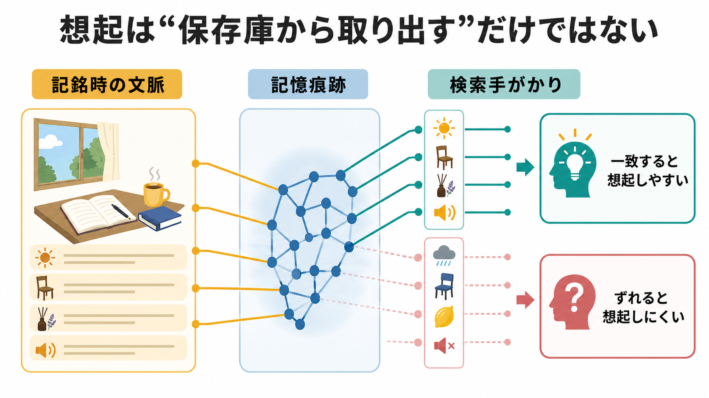

# 記銘・保持・想起は何が違うのか

## 要点

- **記銘**は、経験や情報を記憶として利用できる形に変換する過程である。注意、意味づけ、既有知識との関連づけが強い記銘を支える。
- **保持**は、記銘された情報が時間の中で維持・変化・統合される過程である。単なる保存ではなく、固定化、再固定化、干渉、忘却を含む。
- **想起**は、手がかりを使って情報を取り出し、現在の文脈の中で再構成する過程である。記憶は保存庫からそのまま出てくるのではない。
- 三段階は直線的に分かれるが、実際には相互作用する。想起そのものが保持を変え、次の記銘を変えることがある。

## この記事で答える問い

この記事では、記憶を「入れる」「保つ」「取り出す」という日常語で終わらせず、認知心理学と認知神経科学で区別される過程として整理する。具体的には、記銘・保持・想起の違い、三者をつなぐ仕組み、学習や臨床評価でなぜ区別が重要になるのかを扱う。

関連する前提として、注意や作業中の一時保持は[[持続的注意とは何か]]、[[選択的注意はどのように働くのか]]、[[ワーキングメモリ容量はなぜ限られているのか]]と接続して理解できる。

## まず結論

記銘・保持・想起は、記憶の「場所」ではなく、記憶が働く**過程**の違いである。記銘は入力された情報を意味・文脈・感覚特徴・行為と結びつける過程、保持はその痕跡が時間の中で安定化しながら変化する過程、想起は手がかりと現在の目標に応じて痕跡を再活性化し、再構成する過程である[1][2]。

この区別が重要なのは、「覚えられない」という訴えが一つの原因だけを意味しないからである。注意が向かなければ記銘が弱くなる。睡眠不足、干渉、時間経過があれば保持が不安定になる。手がかりが合わなければ、保持されていても想起できない。したがって、学習支援や神経心理学的評価では、どの段階でつまずいているのかを分けて考える必要がある。

## 背景

記憶研究では古くから、入力、貯蔵、検索という三分法が使われてきた。Atkinson と Shiffrin の多重貯蔵モデルは、感覚登録、短期貯蔵、長期貯蔵を区別し、情報がどのように処理されるかを考える枠組みを与えた[1]。ただし、現在の理解では、記憶は単に箱から箱へ移されるものではない。記銘の質、保持中の変化、想起時の文脈が互いに影響する。

特にエピソード記憶では、記銘時の文脈と想起時の手がかりの対応が重要である。Tulving と Thomson の符号化特異性原理は、想起の成功が「記憶痕跡の強さ」だけでなく、記銘時に形成された符号化情報と検索手がかりの適合に依存することを示した[3]。

## 基本概念

### 記銘

記銘とは、経験や情報を後で利用できる形式へ変換する過程である。英語では encoding と呼ばれる。記銘には、知覚された特徴を処理すること、意味を理解すること、既有知識と結びつけること、文脈や感情と関連づけることが含まれる。

Craik と Lockhart の処理水準説は、記憶の成績が単なる反復回数ではなく、どの深さで処理されたかに左右されることを強調した。文字の形や音だけを見る浅い処理よりも、意味や関連を考える深い処理の方が、後の保持と想起を助けやすい[2]。この点で、記銘は「入力する」だけではなく、「意味のネットワークへ接続する」作業である。

### 保持

保持とは、記銘された情報が時間をまたいで利用可能な状態にあることである。英語では storage や retention と表現される。ただし、保持は静的な保存ではない。記憶痕跡は、神経活動、シナプス可塑性、システムレベルの固定化、睡眠、再想起、干渉によって変わりうる[4][5]。

神経科学的には、経験に伴う回路変化は[[シナプス可塑性とは何か]]、[[長期増強LTPとは何か]]、[[神経可塑性は発達と学習をどう支えるのか]]と関連する。特に宣言的記憶では、海馬と関連皮質領域の相互作用が重要であり、[[海馬回路は記憶をどう形成するのか]]と接続して理解できる[5][6]。

### 想起

想起とは、記憶を手がかりに基づいて取り出し、現在の課題に使える形へ組み立てる過程である。英語では retrieval や recall と呼ばれる。想起には、自由再生、手がかり再生、再認などがある。

想起は、保存された情報をそのまま再生する録音再生ではない。人は断片的な情報、現在の文脈、期待、意味知識を使って過去を構成する。Schacter らの構成的記憶研究は、過去を思い出す能力が未来を想像する能力とも重なることを示し、記憶を「過去の正確な複製」ではなく「経験要素を再結合する仕組み」として捉える重要性を示している[7]。

## 仕組み

### 1. 注意が記銘の入口を決める

記銘は、まず注意に依存する。刺激が目や耳に届いていても、課題目標と関係づけられなければ、後から利用できる記憶として残りにくい。したがって、学習で重要なのは「同じ時間だけ眺めたか」ではなく、「どの特徴に注意を向け、どの意味関係を作ったか」である。

この点は[[アセチルコリンは注意や記憶にどう関わるのか]]とも関係する。注意調整系は、どの入力を優先的に処理するかを変え、記銘の効率に影響しうる。

### 2. 保持は安定化と変化の両方を含む

保持を「記憶がそのまま保存されること」と考えると誤解が生じる。短時間の保持では作業記憶やリハーサルが重要になり、長期保持では固定化と干渉が問題になる。固定化とは、記憶痕跡が時間をかけてより安定した形へ変化していく過程であり、シナプスレベルとシステムレベルの両方で議論される[4][5]。

ただし、安定化は不変化ではない。思い出すこと、言語化すること、新しい情報と結びつけることは、既存の記憶表象を更新する。したがって、保持は「凍結」ではなく「利用可能性を保ちながら変わる」過程として理解する方がよい。

### 3. 想起は手がかり依存である

同じ記憶でも、手がかりが合うと想起しやすく、合わないと想起しにくい。たとえば、ある場所で学んだことが、同じ場所や似た文脈で思い出しやすい場合がある。これは単に雰囲気の問題ではなく、記銘時にどの情報が一緒に符号化されたかに関わる[3]。

### 4. 想起は保持を強めることがある

想起は、記憶を測るだけではない。Roediger と Karpicke の研究は、文章を再読するだけの場合よりも、テストとして取り出す練習をした場合の方が、遅延後の保持が良くなることを示した[8]。これは検索練習効果、またはテスト効果と呼ばれる。

つまり、記銘、保持、想起は一方向に並ぶだけではない。想起の経験が次の保持を変え、次の記銘で使える知識構造を変える。学習法として「読む」だけでなく「思い出して書く」「自分で説明する」「小テストを使う」が有効なのは、この循環を使っているからである。

## 図解

図1は、記銘・保持・想起を三つの段階として分けた概念地図である。記銘では注意と意味づけ、保持では時間経過と統合、想起では検索手がかりと再構成が中心になる。

図2は、符号化特異性の考え方を示している。記銘時の文脈と想起時の手がかりが一致すると、記憶痕跡へ到達しやすくなる。一方、手がかりがずれると、情報が保持されていても想起できないことがある。

## 臨床・研究との接続

神経心理学では、記憶障害を「記銘障害」「保持障害」「想起障害」に分けて考えることがある。たとえば、注意障害や意識水準の低下があると、そもそも情報が十分に記銘されない。海馬や内側側頭葉の障害では、新しい宣言的記憶の形成が難しくなることがある[6]。一方、前頭葉機能や実行機能の問題では、手がかりを使って効率よく検索することが難しくなる場合がある。

ただし、臨床的な記憶低下をこの三分類だけで診断することはできない。疲労、睡眠、抑うつ、不安、薬剤、感覚障害、注意、動機づけ、教育歴、検査文脈などが成績に影響する。この記事の区別は、個別診断や治療指示ではなく、研究・教育目的の整理である。

研究では、記銘を操作する課題、遅延時間を操作する保持課題、手がかりを操作する想起課題を分けることで、どの段階のメカニズムが行動成績に効いているかを検討する。fMRI、脳損傷研究、電気生理、計算モデルを組み合わせると、行動上の「忘れた」が、記銘不足なのか、痕跡の変化なのか、検索失敗なのかをより細かく扱える。

## よくある誤解

### 誤解1: 記憶は脳内の保存庫にそのまま入っている

記憶は、完全なファイルとして保存され、必要時にそのまま開かれるものではない。記憶表象は分散的で、想起時に手がかりや文脈に応じて再構成される[7]。

### 誤解2: 何度も読むほど保持が強くなる

反復は有用だが、受動的な再読だけでは記銘が浅くなることがある。意味づけ、間隔を空けた復習、検索練習、自分の言葉で説明することは、保持と想起をより強く支えやすい[2][8]。

### 誤解3: 思い出せないなら記憶は消えている

想起失敗は、保持の消失を必ずしも意味しない。手がかりが不十分、文脈が合わない、注意や実行機能が働きにくい場合、保持されている情報へアクセスできないことがある[3]。

### 誤解4: 記銘・保持・想起は完全に独立している

三者は分析上は分けられるが、実際には循環している。良い記銘は保持を助け、保持のされ方は想起を制約し、想起の経験は保持を更新する。

## 関連ノート

- [[MOC｜認知科学・心理学]]
- [[持続的注意とは何か]]
- [[選択的注意はどのように働くのか]]
- [[ワーキングメモリ容量はなぜ限られているのか]]
- [[海馬回路は記憶をどう形成するのか]]
- [[シナプス可塑性とは何か]]
- [[長期増強LTPとは何か]]
- [[神経可塑性は発達と学習をどう支えるのか]]
- [[アセチルコリンは注意や記憶にどう関わるのか]]

MOC更新候補: バッチ統合時に [[MOC｜認知科学・心理学]] の「認知機能」または「学習・行動」周辺へ追加する。

今後の作成候補: 「エピソード記憶とは何か」「意味記憶とは何か」「検索練習効果とは何か」「符号化特異性とは何か」「記憶固定化とは何か」。

## 理解チェック

1. 記銘と保持の違いは何か。
2. 「思い出せない」が、必ずしも「保存されていない」を意味しないのはなぜか。
3. 符号化特異性原理は、学習環境や復習方法にどのような示唆を与えるか。
4. 検索練習が保持を強めるという知見は、記銘・保持・想起のどの関係を示しているか。

## 参考文献

[1] Atkinson, R. C., & Shiffrin, R. M. (1968). Human memory: A proposed system and its control processes. *Psychology of Learning and Motivation*, 2, 89-195. https://doi.org/10.1016/S0079-7421(08)60422-3

[2] Craik, F. I. M., & Lockhart, R. S. (1972). Levels of processing: A framework for memory research. *Journal of Verbal Learning and Verbal Behavior*, 11(6), 671-684. https://doi.org/10.1016/S0022-5371(72)80001-X

[3] Tulving, E., & Thomson, D. M. (1973). Encoding specificity and retrieval processes in episodic memory. *Psychological Review*, 80(5), 352-373. https://doi.org/10.1037/h0020071

[4] McGaugh, J. L. (2000). Memory: A century of consolidation. *Science*, 287(5451), 248-251. https://doi.org/10.1126/science.287.5451.248

[5] Eichenbaum, H. (2000). A cortical-hippocampal system for declarative memory. *Nature Reviews Neuroscience*, 1, 41-50. https://doi.org/10.1038/35036213

[6] Squire, L. R., & Wixted, J. T. (2011). The cognitive neuroscience of human memory since H.M. *Annual Review of Neuroscience*, 34, 259-288. https://doi.org/10.1146/annurev-neuro-061010-113720

[7] Schacter, D. L., Addis, D. R., & Buckner, R. L. (2007). Remembering the past to imagine the future: The prospective brain. *Nature Reviews Neuroscience*, 8, 657-661. https://doi.org/10.1038/nrn2213

[8] Roediger, H. L., III, & Karpicke, J. D. (2006). Test-enhanced learning: Taking memory tests improves long-term retention. *Psychological Science*, 17(3), 249-255. https://doi.org/10.1111/j.1467-9280.2006.01693.x
