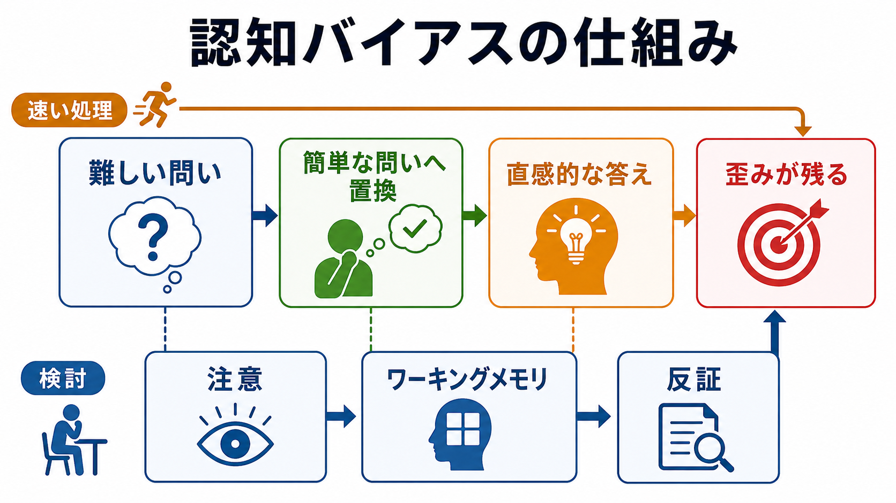

# 認知バイアスとは何か

## 要点

- 認知バイアスとは、情報の取り込み、解釈、記憶、判断のどこかで生じる、偶然ではない系統的な偏りである。
- バイアスは「愚かな誤り」ではなく、限られた時間・情報・[[ワーキングメモリとは何か|ワーキングメモリ]]で判断するための近道が、特定の条件で予測可能な歪みを生む現象である[1][5]。
- 代表例には、確証バイアス、利用可能性ヒューリスティック、代表性ヒューリスティック、アンカリング、動機づけられた推論がある[1][2][6]。
- 臨床や研究では、注意・解釈・記憶の偏りが抑うつや不安の維持に関わる可能性が検討される。ただし、個別診断や治療指示へ単純化して使うべきではない[8]。

## この記事で答える問い

1. 認知バイアスは、単なる思い込みや感情的判断と何が違うのか。
2. なぜヒューリスティックは役に立つのに、同時に誤りを生むのか。
3. 代表的なバイアスは、どの認知過程に関係するのか。
4. 研究・臨床・日常の意思決定では、どのように扱えばよいのか。

## まず結論

認知バイアスは、判断がランダムに外れることではなく、特定の情報や手がかりが過大評価されることで、同じ方向へ繰り返しずれやすくなる現象である。Tversky と Kahneman は、不確実な状況で人が代表性、利用可能性、アンカリングと調整などのヒューリスティックを用いることを示し、それらが効率的である一方、予測可能な誤りを生むと整理した[1]。

重要なのは、認知バイアスを「悪い認知」とだけ見ないことである。ヒューリスティックは、情報が多すぎる、時間がない、完全な計算ができない場面で有用な近道にもなる[5]。問題になるのは、その近道が現在の課題に合っていないのに、十分に検討されないまま判断を支配する場合である。

## 背景

古典的な意思決定論では、人間は利用可能な情報を一貫した規則で統合し、合理的に選択すると仮定されることが多かった。しかし実際の判断は、確率、基準率、サンプルサイズ、最初に示された数値、思い出しやすい事例、既存信念によって大きく変わる。ヒューリスティックとバイアス研究は、このずれを単なる失敗としてではなく、測定可能な心理過程として扱った[1]。

この視点は、[[注意とは何か|注意]]や[[選択的注意はどのように働くのか|選択的注意]]、[[想起は記憶を変えるのか|想起]]の研究とも接続する。どの情報に注意が向くか、何が思い出しやすいか、どの説明を信じやすいかが、最終的な判断の材料を変えるからである。

## 基本概念

### ヒューリスティック

ヒューリスティックとは、複雑な問題を限られた情報で素早く扱うための経験則である。たとえば「よく思い出せる出来事は起こりやすい」と見なす利用可能性ヒューリスティックは、災害報道や身近な経験がリスク判断を過大に動かす場面で問題になる[1]。

ただし、ヒューリスティックは常に誤りを増やすわけではない。Gigerenzer と Gaissmaier は、環境の構造によっては、情報を一部無視する単純な規則が複雑な計算よりよく働く場合があると論じている[5]。したがって、バイアス研究では「どの近道が、どの環境で、どの程度ずれるのか」を見る必要がある。

### 代表的な認知バイアス

| バイアス | 典型的な働き | 注意点 |
|---|---|---|
| 確証バイアス | 既存の信念や仮説を支持する証拠を探し、反証を軽視する | 情報探索と解釈の両方で起こる[2] |
| 利用可能性 | 思い出しやすい事例を頻度や確率の手がかりにする | メディア接触や最近の経験に左右される[1] |
| 代表性 | ある事例が典型像に似ているほど、そのカテゴリーに属すると判断する | 基準率やサンプルサイズを軽視しやすい[1] |
| アンカリング | 最初に示された数値や基準に判断が引き寄せられる | 無関係な数値でも影響する場合がある[1] |
| 動機づけられた推論 | 望ましい結論に合う証拠を集め、都合の悪い証拠を厳しく評価する | 知識が多いほど巧妙に正当化することもある[6] |

## 仕組み

### 難しい問いを簡単な問いに置き換える

認知バイアスの中心的な仕組みの一つは、属性置換である。これは「この治療法の有効性をどの程度信じるべきか」のような難しい問いを、「印象に残る体験談があるか」「説明がもっともらしいか」のような簡単な問いに置き換えて答える過程である[3]。置き換えに気づかないと、答えの速さが確信の強さとして感じられやすい。

### 速い処理と検討する処理

二過程理論では、速く自動的な処理が初期反応を生み、より遅く、仮説的に考え、[[ワーキングメモリとは何か|ワーキングメモリ]]負荷を伴う処理がそれを検討すると考える[4]。認知バイアスは、速い処理そのものだけでなく、検討が働きにくい条件で強まりやすい。疲労、時間制限、情報過多、強い感情、社会的圧力は、反証や基準率を見る余裕を狭める。

### 注意・記憶・信念の循環

認知バイアスは一回の判断だけで終わらない。確証バイアスでは、信念に合う情報へ[[注意とは何か|注意]]が向き、その情報が記憶に残りやすくなり、後の[[想起は記憶を変えるのか|想起]]でさらに信念を強めることがある[2]。この循環は、日常の意見形成だけでなく、研究仮説、臨床的評価、組織の意思決定でも問題になる。

## 図解

上の 2 枚の図は、認知バイアスを次の二層で整理している。

1. 全体像: 認知バイアスは、情報・注意・記憶・判断の偏りが組み合わさって生じる。
2. メカニズム: 難しい問いが簡単な問いに置換され、直感的な答えが検討なしに採用されると、歪みが残る。

実践的には、「反証を探す」「基準率を見る」「フィードバックを受ける」という三つの操作が、直感を否定するのではなく、直感を点検可能な判断へ変える補助線になる。

## 臨床・研究との接続

臨床心理学では、抑うつや不安に関連する認知バイアスとして、脅威や否定的情報への注意バイアス、曖昧な出来事を否定的に読む解釈バイアス、否定的経験を思い出しやすい記憶バイアスが検討されてきた。Everaert らは、抑うつに関わる認知バイアスを単独で見るのではなく、注意・解釈・記憶・認知制御の相互作用として扱う必要を論じている[8]。

ただし、この記事は教育・研究目的の整理であり、個別の症状を認知バイアスだけで説明したり、診断・治療方針を決めたりするものではない。臨床では、症状の経過、生活機能、身体状態、環境要因、併存症、本人の価値観を含む包括的評価が必要である。

研究方法としては、反応時間課題、選択課題、記憶課題、眼球運動、自己報告、実験的介入などが使われる。脱バイアス介入では、個別化されたフィードバックや練習を含む訓練が判断バイアスを低減する可能性が示されているが、効果の一般化や持続性は課題として残る[7]。

## よくある誤解

### 誤解1: 認知バイアスは知識不足だけで起こる

知識不足は誤判断の一因だが、認知バイアスは知識がある人にも起こる。むしろ動機づけられた推論では、知識や推論能力が、望ましい結論を正当化する材料として使われることがある[6]。

### 誤解2: バイアスはなくせばよい

すべての近道を捨てることは現実的ではない。多くの場面では、完全な計算よりも、十分によい判断を早く下すことが必要である。重要なのは、どの場面で近道が破綻しやすいかを知り、必要な場面でだけ検討を追加することである[5]。

### 誤解3: 自分は客観的なので影響されない

バイアスは、本人の主観的な誠実さとは別に生じる。自分だけは例外だと考えるほど、反証探索やフィードバックを避けやすくなる。したがって、個人の努力だけでなく、判断手順、チェックリスト、第三者レビュー、事前登録、盲検化などの環境設計が重要になる。

### 誤解4: 感情が入るとバイアスで、理性的ならバイアスではない

感情は判断を歪めることもあるが、価値や優先順位を知らせる手がかりにもなる。逆に、形式的に理性的に見える推論でも、出発点の情報探索が偏っていれば結論は偏る。感情対理性ではなく、情報探索、仮説生成、反証、基準率、フィードバックのどこが偏っているかを見る方が有用である。

## 関連ノート

- [[注意とは何か]]
- [[選択的注意はどのように働くのか]]
- [[ワーキングメモリとは何か]]
- [[想起は記憶を変えるのか]]
- [[意味記憶とは何か]]
- [[知覚とは何か]]

## 関連ノート候補

- 認知バイアスの一覧と分類
- ヒューリスティックとは何か
- 確証バイアスとは何か
- 意思決定とは何か
- 二過程理論とは何か
- 臨床心理学における認知バイアス

## MOC更新候補

- `content/00_MOC/` 内の認知科学・心理学系 MOC に、判断・意思決定・認知バイアスの入門ノートとして追加する。
- 今後、確証バイアス、ヒューリスティック、意思決定、二過程理論のノートが増えた時点で、認知機能カテゴリ内の小さな索引を作る。

## 理解チェック

1. 認知バイアスを「ランダムな誤り」ではなく「系統的な偏り」と呼ぶ理由は何か。
2. 利用可能性ヒューリスティックが役に立つ場面と、危険になる場面を一つずつ挙げられるか。
3. 確証バイアスは、情報探索、解釈、記憶のどこに現れるか。
4. バイアスを減らすために、個人の注意努力以外にどのような環境設計が考えられるか。

## 未解決問題

- どのヒューリスティックが、どの環境構造では適応的で、どの環境構造では誤りを増やすのか。
- 実験室で測定されたバイアスが、日常・組織・臨床場面の実際の行動をどの程度予測するのか。
- 脱バイアス介入の効果は、時間、課題、文化、専門性を超えてどの程度一般化するのか。
- 注意・解釈・記憶の複数のバイアスは、精神症状の原因、結果、維持因子としてどのように区別できるのか。

## 参考文献

[1] Tversky, A., & Kahneman, D. (1974). Judgment under uncertainty: Heuristics and biases. *Science, 185*(4157), 1124-1131. https://doi.org/10.1126/science.185.4157.1124

[2] Nickerson, R. S. (1998). Confirmation bias: A ubiquitous phenomenon in many guises. *Review of General Psychology, 2*(2), 175-220. https://doi.org/10.1037/1089-2680.2.2.175

[3] Kahneman, D., & Frederick, S. (2002). Representativeness revisited: Attribute substitution in intuitive judgment. In T. Gilovich, D. Griffin, & D. Kahneman (Eds.), *Heuristics and Biases: The Psychology of Intuitive Judgment* (pp. 49-81). Cambridge University Press. https://doi.org/10.1017/CBO9780511808098.004

[4] Evans, J. St. B. T., & Stanovich, K. E. (2013). Dual-process theories of higher cognition: Advancing the debate. *Perspectives on Psychological Science, 8*(3), 223-241. https://doi.org/10.1177/1745691612460685

[5] Gigerenzer, G., & Gaissmaier, W. (2011). Heuristic decision making. *Annual Review of Psychology, 62*, 451-482. https://doi.org/10.1146/annurev-psych-120709-145346

[6] Kunda, Z. (1990). The case for motivated reasoning. *Psychological Bulletin, 108*(3), 480-498. https://doi.org/10.1037/0033-2909.108.3.480

[7] Morewedge, C. K., Yoon, H., Scopelliti, I., Symborski, C. W., Korris, J. H., & Kassam, K. S. (2015). Debiasing decisions: Improved decision making with a single training intervention. *Policy Insights from the Behavioral and Brain Sciences, 2*(1), 129-140. https://doi.org/10.1177/2372732215600886

[8] Everaert, J., Koster, E. H. W., & Derakshan, N. (2012). The combined cognitive bias hypothesis in depression. *Clinical Psychology Review, 32*(5), 413-424. https://doi.org/10.1016/j.cpr.2012.04.003
