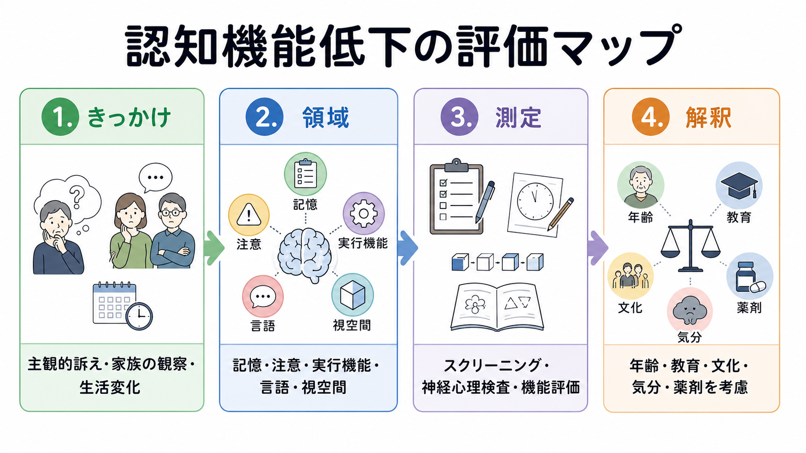
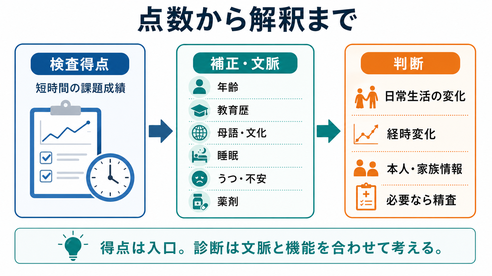
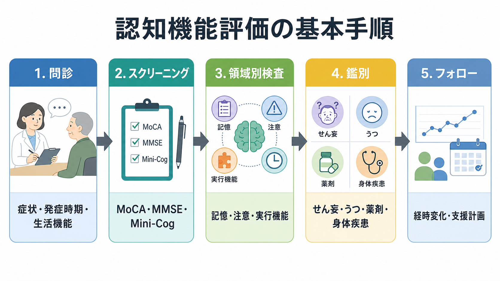

# 認知機能低下はどのように評価するのか

## 要点

- 認知機能低下の評価は、1回の点数で「認知症かどうか」を決める作業ではない。訴え、家族や周囲の観察、生活機能、領域別の検査、医学的・心理社会的背景を合わせて解釈する。
- 評価対象になる領域は、記憶、注意、実行機能、言語、視空間・知覚運動、社会的認知などである。DSM-5に基づくUSPSTF勧告でも、主要な認知領域として複雑性注意、実行機能、学習と記憶、言語、知覚運動、社会的認知が挙げられている[1]。
- MoCA、MMSE、Mini-Cogなどは入口として有用だが、陽性結果は診断そのものではない。陽性なら、病歴、身体疾患、薬剤、画像・血液検査、神経心理検査、日常生活機能の評価へ進む[1]。
- 加齢、教育歴、母語、文化、感覚障害、睡眠、うつ・不安、せん妄、薬剤、身体疾患は検査成績に影響する。したがって、同じ得点でも意味は人によって異なる。
- 研究では標準化された尺度と統計的な基準が重要になり、臨床では本人の困りごと、生活上の危険、支援計画につながる情報が重要になる。

## この記事で答える問い

1. 認知機能低下を評価するとき、何から確認するのか。
2. スクリーニング検査と神経心理検査は何が違うのか。
3. 加齢、認知症、精神疾患では、評価の焦点がどう変わるのか。
4. 検査得点を解釈するとき、どのような背景要因を考慮するべきか。
5. 研究や臨床支援に結びつけるには、何を記録しておくべきか。

## まず結論

認知機能低下の評価は、次の順序で考えると整理しやすい。

1. 何が変わったのかを聞く：本人の自覚、家族・同僚・支援者の観察、発症時期、進行の速さを確認する。
2. どの領域が弱いのかを測る：[[エピソード記憶とは何か|エピソード記憶]]、[[注意とは何か|注意]]、[[実行機能とは何か|実行機能]]、言語、視空間、処理速度などを分けて見る。
3. 生活に影響しているかを見る：金銭管理、服薬、料理、交通、仕事、対人関係、予定管理などを確認する。
4. 他の原因を除外・同定する：せん妄、睡眠不足、うつ・不安、薬剤、アルコール、甲状腺機能、ビタミン欠乏、脳血管障害などを検討する。
5. 経時変化を見る：同じ条件で再評価し、練習効果、測定誤差、病状変化を区別する。

MCIと認知症の境目では、認知課題の点数だけでなく、日常生活の自立がどの程度保たれているかが重要になる。NIA-AAの診断枠組みでも、認知機能低下が日常生活の独立性を妨げる段階が認知症として扱われ、MCIでは機能低下があっても独立性はおおむね保たれる[2][3]。

## 背景

認知機能は、年齢とともに一様に落ちるわけではない。処理速度や新しい情報の保持は変化しやすい一方で、語彙や経験に支えられた知識は比較的保たれやすい。したがって、加齢による変化を評価するときは、「若い頃と違うか」だけでなく、「同年代・同程度の教育歴の人と比べてどの程度か」「生活上の失敗が増えているか」を見る必要がある。

認知症の評価では、記憶低下だけに注目すると見落としが起こる。アルツハイマー病では学習と記憶が目立つことが多いが、前頭側頭型認知症では行動・言語、レビー小体型認知症では注意の変動や視空間、血管性認知障害では処理速度や[[実行機能とは何か|実行機能]]が目立つことがある。NIA-AAの認知症診断でも、記憶に限らず、推論・判断、視空間、言語、人格・行動など複数の領域が評価対象になる[2]。

精神疾患でも認知機能は重要である。統合失調症では処理速度、注意、[[ワーキングメモリとは何か|ワーキングメモリ]]、言語学習、社会的認知などの評価が研究・臨床試験で重視され、MATRICS Consensus Cognitive Batteryはその標準化に大きく関与した[7]。うつ病や双極性障害でも、主観的な「頭が働かない」という訴えと客観的検査の差、気分症状、睡眠、薬剤の影響を分けて考える必要がある[8]。

## 基本概念

### スクリーニング

スクリーニングは、短時間で「さらに詳しく調べる必要があるか」を判断するための入口である。MMSEは古典的で広く使われてきた短時間の認知状態検査であり[5]、MoCAはMCIの検出を意図して開発された尺度で、[[実行機能とは何か|実行機能]]や注意を含む比較的広い課題を含む[4]。

ただし、スクリーニングは診断ではない。USPSTFは、無症状の地域在住高齢者への一律スクリーニングについて、利益と害のバランスを判断する証拠が不十分だとしている。一方で、記憶や言語の問題など早期の兆候がある場合には、臨床家が適切に評価すべきだとも述べている[1]。つまり、「全員に機械的に検査する」ことと、「気になる変化がある人を評価する」ことは分けて考える必要がある。

### 神経心理検査

神経心理検査は、認知領域ごとの強みと弱みをより詳しく測る。たとえば、記憶検査では即時再生、遅延再生、再認を分けることで、「覚えられない」のか「思い出せない」のかを推定する。注意課題では持続的注意、選択的注意、分割注意を区別する。[[抑制制御とは何か|抑制制御]]、[[認知的柔軟性とは何か|認知的柔軟性]]、[[計画能力とは何か|計画能力]]は、[[実行機能とは何か|実行機能]]の下位側面として読むと理解しやすい。

検査結果は、標準得点、パーセンタイル、年齢・教育補正、信頼区間、カットオフ、前回からの変化量として表現される。研究では群平均や効果量が重要になるが、臨床では「本人の生活上の困りごとをどの程度説明するか」がより重要になる。

### 機能評価

認知機能低下が問題になるのは、課題成績そのものよりも、生活の独立性や安全性に影響するときである。確認する項目には、服薬管理、金銭管理、予定管理、買い物、調理、交通機関の利用、仕事のミス、家族内の役割、対人トラブルが含まれる。

本人は困難を過小評価することがあり、逆に不安が強い人は過大に感じることもある。したがって、本人の訴え、情報提供者の観察、客観的検査、生活記録を組み合わせる。

## 仕組み

認知機能評価の中心にあるのは、「得点」と「意味」の分離である。検査得点は、課題を行った時点の観察値であり、脳の病理を直接読むものではない。そこには、対象となる認知領域だけでなく、睡眠、疲労、緊張、視力・聴力、運動能力、教育歴、母語、文化的経験、検査への慣れが入り込む。

たとえば、MoCAの得点が低い場合でも、教育歴や年齢によって偽陽性が増える可能性がある。MoCAのカットオフを再検討したメタ分析では、元の26点カットオフが特に高齢者や低教育歴の人で偽陽性を増やしうることが指摘されている[6]。これは、短い検査が不要だという意味ではない。むしろ、短い検査は入口として使い、結果を背景要因と合わせて読む必要があるという意味である。

経時評価では、さらに練習効果と測定誤差が問題になる。同じ検査を短期間に繰り返すと、病状が改善していなくても手続きに慣れて得点が上がることがある。一方で、睡眠不足や体調不良の日には一時的に得点が下がる。したがって、前回との差を見るときは、検査間隔、代替版の有無、生活状況、薬剤変更、気分症状、検査条件を記録する。

## 図解

認知機能評価は、次のような流れで実施される。

| 段階 | 目的 | 代表的に確認すること | 注意点 |
|---|---|---|---|
| 問診 | 変化の性質をつかむ | いつから、何が、どの速さで変わったか | 急性ならせん妄・身体疾患を優先して考える |
| 情報提供者からの聴取 | 本人の自覚だけに依存しない | 家族・同僚・支援者の観察 | 本人の訴えと一致しない場合も重要 |
| スクリーニング | 詳細評価の必要性を判断する | MoCA、MMSE、Mini-Cogなど | 陽性でも診断ではない |
| 領域別検査 | 強みと弱みを分ける | 記憶、注意、実行機能、言語、視空間 | 年齢・教育・文化・感覚障害を考慮する |
| 生活機能評価 | 診断・支援につなげる | 服薬、金銭、料理、移動、仕事 | 認知症とMCIの区別にも関係する |
| 鑑別 | 可逆的・併存的要因を見る | うつ、睡眠、薬剤、代謝、脳血管 | 認知症だけを早く決めつけない |
| フォロー | 変化の方向を確認する | 同条件での再評価、支援効果 | 練習効果と測定誤差を考慮する |

## 臨床・研究との接続

### 加齢

加齢に伴う認知変化では、同年代平均との差と本人内の変化を分けて考える。若い頃より忘れやすいという訴えがあっても、生活機能が保たれ、客観的検査で年齢相応なら、すぐに疾患とみなす必要はない。一方で、金銭管理、服薬、運転、仕事の段取りなどで以前とは違う失敗が増える場合は、より詳しい評価が必要になる。

### 認知症とMCI

認知症では、1つ以上の認知領域の低下が日常生活の独立性を妨げる。MCIでは、本人または周囲が認知変化に気づき、客観的な低下が示されることがあるが、日常生活の自立はおおむね保たれる[2][3]。この違いは、単なる重症度の違いではなく、支援計画の違いに直結する。

たとえば、同じ記憶検査の低得点でも、予定管理を補助すれば仕事や生活が保てる人と、服薬・金銭・安全管理に直接支援が必要な人では、評価の意味が異なる。

### 精神疾患

精神疾患における認知機能評価では、症状評価と認知評価を混同しないことが重要である。統合失調症では、認知機能が社会機能や職業機能と関連し、MCCBのような標準化バッテリーが臨床試験や研究で使われてきた[7]。うつ病や双極性障害では、抑うつ気分、意欲低下、睡眠障害、薬剤の鎮静作用が検査成績にも主観的困難にも影響する[8]。

したがって、「精神症状があるから認知機能低下は気のせい」とも、「検査が低いから神経変性疾患」とも短絡しない。気分、睡眠、薬剤、生活ストレスを評価しながら、必要に応じて再検査する。

### 研究

研究では、評価手順を標準化しないと、群間差や介入効果が解釈できない。重要なのは、検査バッテリー、実施順序、検査者訓練、採点規則、対象者の年齢・教育・母語、除外基準、再検査間隔、主要評価項目を事前に定めることである。

臨床研究では、検査得点だけでなく、機能転帰、生活の質、介護負担、服薬アドヒアランス、社会参加なども合わせて見ると、認知変化の意味が明確になる。

## よくある誤解

### 「検査点が低い＝認知症である」

誤りである。検査点は入口であり、診断には生活機能、経過、鑑別、医学的評価が必要である。USPSTFも、スクリーニング検査はMCIや認知症を診断するためのものではなく、陽性なら追加評価につなげるものとして説明している[1]。

### 「本人が困っていないなら問題ない」

必ずしもそうではない。病識が低い場合や、周囲が補っている場合、本人の自覚は乏しいことがある。家族や支援者からの情報、実際の生活場面、失敗の具体例を確認する。

### 「年齢のせいなら評価しても意味がない」

これも誤りである。加齢による変化と疾患による変化を区別するために評価が必要になる。さらに、睡眠、薬剤、身体疾患、うつ、不安など、介入可能な要因が見つかることもある。

### 「1つの尺度で全領域がわかる」

短時間検査は便利だが、すべての領域を均等に測るわけではない。MMSEは広く用いられてきたが、[[実行機能とは何か|実行機能]]や複雑な注意の検出には限界がある。MoCAも万能ではなく、カットオフは対象集団によって調整が必要になる[4][6]。

## 関連ノート

- [[注意とは何か]]
- [[持続的注意とは何か]]
- [[分割注意はどこまで可能なのか]]
- [[ワーキングメモリとは何か]]
- [[エピソード記憶とは何か]]
- [[意味記憶とは何か]]
- [[実行機能とは何か]]
- [[抑制制御とは何か]]
- [[認知的柔軟性とは何か]]
- [[計画能力とは何か]]
- [[推論とは何か]]
- [[意思決定とは何か]]

## MOC更新候補

- `content/00_MOC/` 配下の認知科学・心理学系MOCに、バッチ統合時に本記事へのリンクを追加する候補。
- 並列実行時の衝突を避けるため、このジョブではMOCファイルを直接更新しない。

## 理解チェック

1. スクリーニング検査の陽性結果が、なぜそのまま認知症診断にならないのか説明できるか。
2. MCIと認知症を区別するとき、生活機能がなぜ重要なのか説明できるか。
3. MoCAやMMSEの得点を読むとき、年齢・教育歴・文化・気分症状をなぜ考慮する必要があるか説明できるか。
4. 精神疾患における認知機能低下を評価するとき、症状評価と認知評価をどう分けるべきか説明できるか。
5. 同じ人を再評価するとき、練習効果と測定誤差をどう扱うべきか説明できるか。

## 未解決問題

- 日本語環境で、年齢、教育歴、地域差、デジタルリテラシーを十分に反映した標準化データはまだ限られる。
- オンライン・遠隔評価は利便性が高い一方で、環境差、端末差、本人確認、援助の有無が結果に影響する。
- 主観的認知低下、うつ・不安、睡眠障害、神経変性疾患の初期変化を、個人レベルでどこまで区別できるかは今後の課題である。
- 検査得点を支援計画や生活上の意思決定にどう翻訳するかは、研究知見だけでなく倫理的・社会的判断も必要とする。

## 参考文献

[1] U.S. Preventive Services Task Force. (2020). *Cognitive Impairment in Older Adults: Screening*. https://www.uspreventiveservicestaskforce.org/uspstf/recommendation/cognitive-impairment-in-older-adults-screening

[2] McKhann, G. M., Knopman, D. S., Chertkow, H., et al. (2011). The diagnosis of dementia due to Alzheimer's disease: Recommendations from the National Institute on Aging-Alzheimer's Association workgroups on diagnostic guidelines for Alzheimer's disease. *Alzheimer's & Dementia, 7*(3), 263-269. https://doi.org/10.1016/j.jalz.2011.03.005

[3] Albert, M. S., DeKosky, S. T., Dickson, D., et al. (2011). The diagnosis of mild cognitive impairment due to Alzheimer's disease: Recommendations from the National Institute on Aging-Alzheimer's Association workgroups on diagnostic guidelines for Alzheimer's disease. *Alzheimer's & Dementia, 7*(3), 270-279. https://doi.org/10.1016/j.jalz.2011.03.008

[4] Nasreddine, Z. S., Phillips, N. A., Bedirian, V., et al. (2005). The Montreal Cognitive Assessment, MoCA: A brief screening tool for mild cognitive impairment. *Journal of the American Geriatrics Society, 53*(4), 695-699. https://doi.org/10.1111/j.1532-5415.2005.53221.x

[5] Folstein, M. F., Folstein, S. E., & McHugh, P. R. (1975). “Mini-mental state”: A practical method for grading the cognitive state of patients for the clinician. *Journal of Psychiatric Research, 12*(3), 189-198. https://doi.org/10.1016/0022-3956(75)90026-6

[6] Carson, N., Leach, L., & Murphy, K. J. (2018). A re-examination of Montreal Cognitive Assessment (MoCA) cutoff scores. *International Journal of Geriatric Psychiatry, 33*(2), 379-388. https://doi.org/10.1002/gps.4756

[7] August, S. M., Kiwanuka, J. N., McMahon, R. P., & Gold, J. M. (2012). The MATRICS Consensus Cognitive Battery (MCCB): Clinical and cognitive correlates. *Schizophrenia Research, 134*(1), 76-82. https://doi.org/10.1016/j.schres.2011.10.015

[8] Zhu, N., Zhang, W., Huang, J., et al. (2023). Validation of the THINC-It Tool for Assessment of Cognitive Impairment in Patients with Bipolar Depression. *Neuropsychiatric Disease and Treatment, 19*, 443-452. https://doi.org/10.2147/NDT.S401095

## 更新ログ

- 2026-04-27: 初版作成。認知機能低下評価の基本手順、画像3点、関連ノート候補、参考文献を追加。
