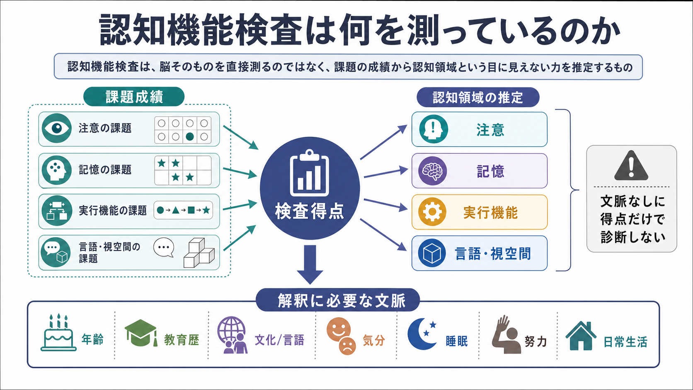
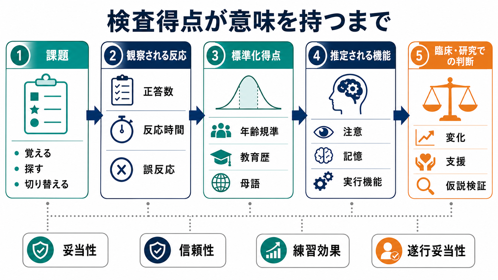

# 認知機能検査は何を測っているのか

## 要点

- 認知機能検査は、脳や「注意そのもの」「記憶そのもの」を直接測る装置ではない。標準化された課題への反応から、[[注意とは何か|注意]]、[[エピソード記憶とは何か|記憶]]、[[実行機能とは何か|実行機能]]、言語、視空間機能、処理速度などの状態を推定する方法である[1][2]。
- 得点は、正答数、反応時間、誤反応、再生量、課題完了時間などの観察可能な行動を、年齢・教育歴・文化/言語背景などの規準と照合して意味づけたものである[2][3]。
- 1つの検査が1つの認知機能だけを純粋に測ることは少ない。たとえば記憶課題には注意、理解、方略、動機づけ、疲労が入り、実行機能課題には処理速度や言語能力も混ざる[1][2]。
- 臨床では、認知症や脳損傷などの診断名を得点だけで決めるのではなく、病歴、日常生活、神経学的所見、気分、睡眠、薬剤、検査時の努力や遂行妥当性を合わせて解釈する[1][4]。
- 研究では、群間差や介入効果を見るために有用だが、反復測定では練習効果、信頼性、回帰効果を考慮しなければならない[7]。

## この記事で答える問い

1. 認知機能検査は、何を直接観察し、何を間接的に推定しているのか。
2. 注意、記憶、実行機能などの「領域別得点」はどこまで信用できるのか。
3. 得点を解釈するときに、年齢、教育歴、文化/言語、気分、睡眠、努力、練習効果をなぜ考える必要があるのか。
4. 臨床と研究では、同じ検査得点をどのように違う目的で使うのか。

## まず結論

認知機能検査が直接測っているのは、課題場面で観察された行動である。たとえば「単語をいくつ覚えたか」「どれくらい速く線を結べたか」「ルール変更にどれだけ柔軟に対応できたか」「誤反応をどれだけ抑えられたか」といった成績である。これを標準化された手続きで測り、適切な規準と照合することで、背後にある認知機能を推定する[1][2]。

したがって、検査得点は「能力そのもの」ではなく、「特定の条件で表れた遂行の指標」である。低得点は重要な手がかりだが、それだけで特定の疾患、脳部位、生活上の困難を一対一に示すわけではない。逆に、平均範囲の得点でも、本人の以前の水準、仕事や学業の要求、日常生活の変化から見ると意味のある低下である場合がある。

## 背景

認知機能検査は、神経心理学、老年医学、精神医学、リハビリテーション、教育、産業保健、研究で使われる。目的は大きく分けて、スクリーニング、詳細評価、経時変化の追跡、支援計画、研究上のアウトカム測定である[1][2]。

短時間のスクリーニング検査は、認知機能低下の可能性を拾い上げるために使われる。MMSE や MoCA のような検査は便利だが、詳細な神経心理評価の代替ではない。2025年の脳卒中後認知障害に関する診断精度レビューでも、MoCA と MMSE はスクリーニングとして有用だが、詳細な臨床評価を置き換えるものではないとされている[5]。

包括的な神経心理評価では、複数の検査を組み合わせて、[[ワーキングメモリとは何か|ワーキングメモリ]]、[[持続的注意とは何か|持続的注意]]、[[選択的注意はどのように働くのか|選択的注意]]、学習、再生、言語、視空間、処理速度、[[認知的柔軟性とは何か|認知的柔軟性]]などを多面的に見る。検査バッテリーは、紹介理由、疑われる病態、本人の背景、年齢、疲労しやすさに応じて選ばれる[1]。

## 基本概念

### 直接測定と間接推定

検査用紙やタブレットに記録されるのは、正答数、反応時間、誤りの種類、学習曲線、遅延再生、手順の逸脱、途中での方略変更などである。そこから「注意が保てているか」「記銘が弱いのか、想起が弱いのか」「抑制制御がうまく働いているか」といった仮説を立てる。

この点で、認知機能検査は血糖値や身長のような単一量の測定とは違う。多くの得点は、複数の認知過程が合成された結果である。たとえば Trail Making Test のような課題では、視覚探索、運動速度、処理速度、注意の切り替え、ルール保持が同時に関わる。したがって「どの機能が弱いか」は、単独の得点よりも、複数検査のパターン、誤反応の質、課題中の行動観察から推定する[1][2]。

### 標準化と規準

検査が意味を持つためには、誰に、どの手順で、どのように採点するかが決まっていなければならない。標準化された実施法、採点法、信頼性、妥当性、規準集団がそろって初めて、個人の得点を比較可能な情報として扱える。心理・教育検査の標準では、妥当性、信頼性、公平性、検査目的に合った解釈が重視され、臨床神経心理評価でも心理測定上の十分性と適切な規準の利用が求められる[3][8]。

規準は特に重要である。年齢、教育歴、性別、文化/言語背景は、多くの認知検査得点に影響する。高齢者を対象にした研究や臨床規準研究では、年齢や教育歴を補正しないと、偽陽性や偽陰性のリスクが高まることが示されている[6]。

### 妥当性と信頼性

妥当性とは、その検査が目的とする構成概念をどれだけ適切に捉えているかである。信頼性とは、測定がどれだけ一貫しているかである。信頼性が低ければ、前回より点が下がっても本当に低下したのか、測定誤差なのか判断しにくい。妥当性が低ければ、安定した得点であっても、本来知りたい認知機能を反映していない可能性がある[3][7]。

### 遂行妥当性

検査得点は、本人が課題を理解し、一定の努力と関与をもって取り組んだという前提で解釈される。痛み、不安、抑うつ、睡眠不足、薬剤、疲労、動機づけ、二次的利得、検査への不信感などは、得点に影響しうる。神経心理評価では、必要に応じて遂行妥当性検査や症状妥当性の情報を組み合わせ、得点が認知能力をどの程度反映しているかを検討する[4]。

## 仕組み

認知機能検査の解釈は、次のような流れで行われる。

1. 課題を標準化された手順で提示する。
2. 正答数、反応時間、誤反応、再生量、完成時間などを記録する。
3. 年齢、教育歴、言語、文化背景などに合った規準で標準化得点やパーセンタイルに変換する。
4. 複数得点のパターン、病歴、日常生活、検査中の行動を合わせて、どの認知機能が相対的な強み・弱みかを推定する。
5. 臨床では支援、追加評価、経過観察、鑑別の仮説に接続し、研究では群間比較や介入効果の指標として扱う。

この流れで注意すべきなのは、「標準化得点」は最終結論ではなく、解釈の材料であるという点である。たとえば、ある人の言語性記憶得点が低いとき、それは記銘の問題、注意の問題、聴覚理解の問題、抑うつや不安による集中困難、検査言語への不慣れ、睡眠不足のいずれか、または複数の組み合わせかもしれない。

## 図解

図1は、認知機能検査が「課題成績」から「認知領域の推定」へ進む概念地図である。中心にある検査得点は、注意、記憶、実行機能、言語・視空間の各領域と対応づけられるが、解釈には年齢、教育歴、文化/言語、気分、睡眠、努力、日常生活が必要になる。

図2は、課題から臨床・研究判断までの流れである。正答数や反応時間はそのまま診断名にならず、標準化、妥当性、信頼性、練習効果、遂行妥当性を経て、はじめて「変化」「支援」「仮説検証」の材料になる。

画像内の「文脈なしに得点だけで診断しない」という注意は、臨床評価だけでなく研究解釈にも当てはまる。群平均に差があっても、その差が日常生活上どれほど意味を持つか、個人差がどの程度大きいか、測定誤差や練習効果で説明できないかを検討する必要がある。

## 臨床・研究との接続

### 臨床での使い方

臨床では、検査は教育・研究目的の情報、または専門職による評価の一部として扱われる。個別の診断や治療方針は、検査得点だけで決めるものではない。神経心理評価は、認知プロフィールの把握、鑑別の補助、リハビリや学習支援の計画、復職・復学の判断材料、経時変化の追跡に使われる[1]。

たとえば、[[記銘・保持・想起は何が違うのか|記銘・保持・想起]]のどこでつまずくかが分かれば、単に「記憶が悪い」とまとめるよりも支援方針を立てやすい。記銘が弱いなら情報量を減らして反復する、想起が弱いなら手がかりや外部記憶補助を使う、注意が揺らぐなら環境調整を行う、といった見立てにつながる。

### 研究での使い方

研究では、認知検査は介入前後の変化、疾患群と対照群の差、脳画像指標との関連、発達や加齢による変化を調べるために使われる。ただし、反復測定では練習効果が大きな問題になる。特に記憶課題では、同じ形式の課題に慣れるだけで得点が上がることがある。変化を評価するには、検査再検査信頼性、練習効果、信頼できる変化指標を考慮する必要がある[7]。

### スクリーニングと詳細評価

スクリーニングは「詳しく調べる必要があるか」を判断するための入口である。短時間で実施できる一方、領域ごとの詳細な解釈には限界がある。MMSE や MoCA のような検査は、対象集団や目的によって感度・特異度が変わるため、カットオフを機械的に使うだけでは不十分である[5]。

## よくある誤解

### 誤解1：得点が低い領域が、そのまま脳の壊れた部位を示す

一部の神経心理検査は脳損傷部位の推定に役立つが、得点と脳部位は単純な一対一対応ではない。多くの課題は複数の脳ネットワークと認知過程を必要とする。脳画像、神経学的診察、病歴、生活上の変化と合わせて解釈する必要がある。

### 誤解2：IQ や認知検査は固定された能力を測る

検査得点は、その日の睡眠、疲労、不安、痛み、薬剤、検査者との関係、検査言語、文化的経験の影響を受ける。安定した能力の一部を反映するが、「その人の全能力」ではない。

### 誤解3：平均範囲なら問題はない

平均範囲でも、本人の以前の水準から大きく下がっている可能性がある。高い教育歴や高い職業的要求を持つ人では、平均範囲の得点が本人にとっては低下を示すことがある。逆に、低い得点が生活上の困難に直結しないこともある。

### 誤解4：同じ検査を繰り返して点が上がれば改善である

反復測定では、課題形式への慣れ、方略の学習、検査不安の低下によって点が上がることがある。改善と判断するには、練習効果を含む信頼できる変化指標や、日常生活の変化と照合する必要がある[7]。

### 誤解5：検査結果だけで支援方針が決まる

検査は支援方針を考える材料であり、本人の目標、環境、家族や職場・学校の理解、生活課題と結びつけて使う。得点の弱さを補う環境調整や代償方略は、検査名ではなく、日常の困りごとから設計する。

## 関連ノート

- [[注意とは何か]]
- [[持続的注意とは何か]]
- [[選択的注意はどのように働くのか]]
- [[ワーキングメモリとは何か]]
- [[エピソード記憶とは何か]]
- [[記銘・保持・想起は何が違うのか]]
- [[実行機能とは何か]]
- [[認知的柔軟性とは何か]]
- [[抑制制御とは何か]]
- [[計画能力とは何か]]

### 関連ノート候補

- 神経心理検査とは何か
- 認知スクリーニングと神経心理評価は何が違うのか
- 遂行妥当性とは何か
- 練習効果とは何か
- 認知検査の規準と標準化とは何か

### MOC 更新候補

- `content/00_MOC/` 配下の認知科学・心理学系 MOC に、本記事 `[[認知機能検査は何を測っているのか]]` を追加する候補。今回は並列ジョブとの競合を避けるため、MOC 本体は更新しない。

## 理解チェック

1. 認知機能検査が直接観察しているものと、間接的に推定しているものは何か。
2. 「記憶得点が低い」という結果を、すぐに記憶障害と断定できない理由は何か。
3. 年齢・教育歴・文化/言語背景を考慮しないと、どのような誤解が起こりうるか。
4. 反復測定で得点が上がったとき、改善以外にどのような説明がありうるか。
5. 臨床で、検査得点を日常生活の支援に接続するには何を見る必要があるか。

## 参考文献

[1] Schaefer, L. A., Thakur, T., & Meager, M. R. (2023). *Neuropsychological Assessment*. StatPearls, NCBI Bookshelf. https://www.ncbi.nlm.nih.gov/books/NBK513310/

[2] StatPearls. (2025). *Cognitive Assessment*. NCBI Bookshelf. https://www.ncbi.nlm.nih.gov/books/NBK556049/

[3] American Educational Research Association, American Psychological Association, & National Council on Measurement in Education. (2014). *Standards for Educational and Psychological Testing*. https://www.ncme.org/resources-publications/books/testing-standards

[4] Greher, M. R., & Wodushek, T. R. (2017). Performance Validity Testing in Neuropsychology: Scientific Basis and Clinical Application-A Brief Review. *Journal of Psychiatric Practice*, 23(2), 134-140. https://doi.org/10.1097/PRA.0000000000000218

[5] Wei, X., Liu, Y., Li, J., Zhu, Y., Li, W., Zhu, Y., Hua, L., Cao, J., & Ma, Y. (2025). MoCA and MMSE for the detection of post-stroke cognitive impairment: a comparative diagnostic test accuracy systematic review and meta-analysis. *Journal of Neurology*, 272(6), 407. https://doi.org/10.1007/s00415-025-13146-5

[6] Beyer, L., et al. (2023). The Influence of Age, Gender and Education on Neuropsychological Test Scores: Updated Clinical Norms for Five Widely Used Cognitive Assessments. *Journal of Clinical Medicine*, 12(17), 5659. https://pmc.ncbi.nlm.nih.gov/articles/PMC10455991/

[7] Duff, K. (2012). Evidence-Based Indicators of Neuropsychological Change in the Individual Patient: Relevant Concepts and Methods. *Archives of Clinical Neuropsychology*, 27(3), 248-261. https://pmc.ncbi.nlm.nih.gov/articles/PMC3499091/

[8] American Academy of Clinical Neuropsychology. (2007). American Academy of Clinical Neuropsychology (AACN) Practice Guidelines for Neuropsychological Assessment and Consultation. *The Clinical Neuropsychologist*, 21(2), 209-231. https://doi.org/10.1080/13825580601025932
