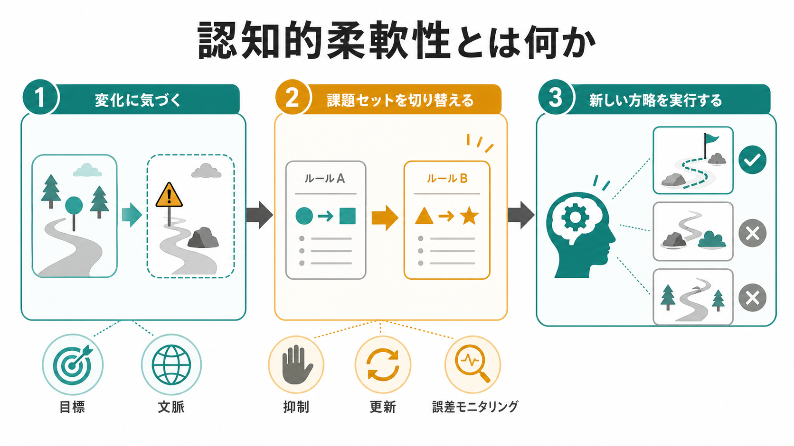
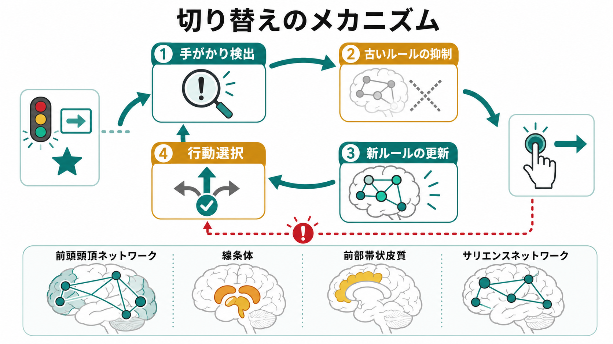
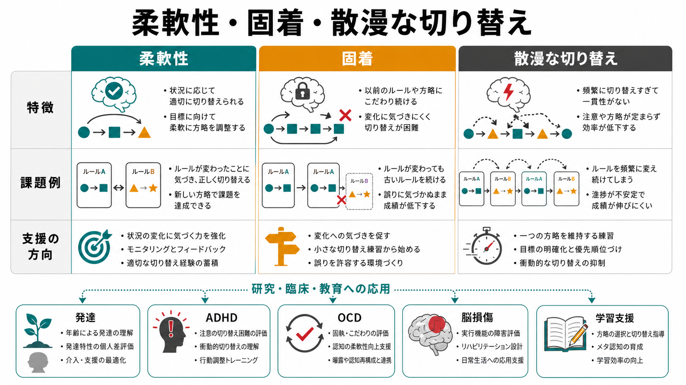

# 認知的柔軟性とは何か

## 要点

- 認知的柔軟性とは、状況やルールが変わったときに、考え方・注意の向け方・行動方略を適切に切り替える能力である[1][2]。
- 単なる「気分の切り替え」ではなく、変化の検出、古い反応の抑制、[[ワーキングメモリとは何か|ワーキングメモリ]]内のルール更新、行動選択を含む実行機能である[2][3]。
- 代表的な測定法には、タスク切り替え、セットシフト、Wisconsin Card Sorting Test、Trail Making Test Part B などがある。ただし、どの課題も処理速度、注意、作業記憶、運動反応を同時に含むため、成績をそのまま「柔軟性そのもの」と読むのは危険である[4][7]。
- 神経基盤としては、[[前頭頭頂ネットワークは認知制御をどう支えるのか|前頭頭頂ネットワーク]]、前頭前野、前部帯状皮質、島皮質、線条体、視床などの分散ネットワークが関わる[1][5]。
- 臨床・発達研究では、ADHD、ASD、強迫症、脳損傷、認知症などで「固着」や切り替え困難が問題になることがある。ただし、これは個別診断や治療指示ではなく、研究・教育上の理解枠組みとして読む必要がある[1][8]。

## この記事で答える問い

1. 認知的柔軟性とは、何を切り替える能力なのか。
2. 実行機能、注意、ワーキングメモリ、抑制とはどう関係するのか。
3. タスク切り替えやセットシフト課題では何を測っているのか。
4. 脳ネットワークや臨床・発達研究では、どのように位置づけられるのか。

## まず結論

認知的柔軟性は、「変化に合わせて、いま使うべきルールを選び直す能力」である。たとえば、相手の表情が変わったので説明の仕方を変える、実験課題で色ルールから形ルールへ切り替える、予定外の障害に対して別の手順を試す、といった場面で働く。

ただし、柔軟性は「何でもすぐ変えること」ではない。むしろ、目標を保つ力と、不要になった方略を捨てる力のバランスである。切り替えが弱すぎると固着になり、切り替えが多すぎると注意や方略が安定しない。適応的な柔軟性とは、変えるべきときに変え、保つべきときに保つ制御である[1][2]。

## 背景

日常生活では、同じ行動がいつも正解になるわけではない。会議では相手の反応に応じて説明を変える必要があり、臨床面接では患者の語りや感情の変化に合わせて質問の深さを調整する必要がある。学習でも、ある解法で詰まったときに別の表現や手順へ移れるかどうかが重要になる。

認知心理学では、この能力は実行機能の一部として扱われてきた。Diamond は実行機能の中核を、抑制、ワーキングメモリ、認知的柔軟性として整理している[2]。Miyake らの潜在変数研究では、更新、抑制、シフティングは互いに相関しつつも分離可能な成分として示された[3][6]。つまり、柔軟性は単独の能力ではなく、複数の制御過程が組み合わさって現れる。

## 基本概念

### 何を切り替えるのか

認知的柔軟性で切り替えられるものは一種類ではない。

| 切り替える対象 | 例 | 関連する認知過程 |
|---|---|---|
| 注意の焦点 | 文字の色から意味へ注目を変える | [[選択的注意はどのように働くのか]]、[[トップダウン注意とボトムアップ注意は何が違うのか]] |
| 課題ルール | 「色で分類」から「形で分類」へ変える | タスクセット、セットシフト |
| 反応方略 | 早く答える方略から正確に確認する方略へ変える | 抑制、誤差モニタリング |
| 解釈枠組み | 相手の沈黙を「拒否」ではなく「考えている」と見る | メタ認知、社会的認知 |
| 行動計画 | 予定の道が塞がったので別ルートを選ぶ | 計画、意思決定 |

このうち実験室でよく測られるのは、課題ルールや反応方略の切り替えである。タスク切り替え課題では、同じ刺激に対して「色を答える」「形を答える」などの課題を切り替える。切り替え直後は反応時間が遅くなり、誤答も増えやすい。この差は switch cost と呼ばれ、古い課題セットの残りや新しい課題セットの再構成にかかる負荷を反映すると考えられている[4]。

### セットシフトとタスク切り替え

セットシフトは、同じ課題内で使うルールや分類基準を変えることを指す。Wisconsin Card Sorting Test では、色、形、数などの分類基準をフィードバックから推測し、途中で基準が変わったら新しい基準へ移る必要がある。古い基準にこだわって誤り続ける反応は、保続または固着として扱われる[8]。

タスク切り替えは、より明示的に複数の課題を交互に実行する手続きである。Monsell のレビューは、切り替え後の遅延が準備によって減るが完全には消えないこと、また課題セットの再構成と前課題の残存効果の両方が関わることを整理している[4]。

## 仕組み

認知的柔軟性は、次のような循環として理解できる。

1. 状況変化や誤差に気づく。
2. 現在のルールがまだ有効かを評価する。
3. 古いルールや自動反応を抑える。
4. 新しいルールを[[ワーキングメモリとは何か|ワーキングメモリ]]上で更新する。
5. 新しい方略に沿って行動を選ぶ。
6. 結果をモニタリングし、必要なら再調整する。

この循環では、[[中央実行系とは何か|中央実行系]]、[[注意とは何か|注意]]、[[持続的注意とは何か|持続的注意]]、抑制制御が重なって働く。変化に気づくには、現在の目標と外界の手がかりを照合する必要がある。古い反応を止めるには、前に成功した反応の魅力を抑える必要がある。新しい行動を実行するには、現在のルールを保ちながら次の反応を選ぶ必要がある。

神経科学的には、柔軟性は一つの「柔軟性中枢」で生じるわけではない。前頭頭頂ネットワークは課題ルールや目標に沿って処理を調整し、前部帯状皮質や前部島皮質を含む[[サリエンスネットワークとは何か|サリエンスネットワーク]]は誤差や行動上重要な変化の検出に関わる。線条体や[[大脳基底核ループとは何か|大脳基底核ループ]]は、どの行動を選び、どのルールをゲートするかに関わる[1][5]。

Badre と Wagner は、タスク切り替えにおける干渉を計算モデルと fMRI で検討し、前の課題から取り出される概念表象や反応表象が切り替えの制約になること、前頭前野がその干渉解決に関わることを示した[5]。これは、柔軟性を「単に新しいことを始める力」ではなく、「前に有効だったものの残りを扱いながら新しい処理へ移る力」として理解する根拠になる。

## 図解

図1は、認知的柔軟性を「変化に気づく」「課題セットを切り替える」「新しい方略を実行する」という三段階で整理している。重要なのは、切り替えの前に「変化に気づく」過程があり、切り替えの後に「新方略を実際の行動に落とす」過程があることだ。

図2は、手がかり検出、古いルールの抑制、新ルールの更新、行動選択という制御ループを示している。ルール変更は一瞬のスイッチではなく、誤差や手がかりを使って脳内の課題セットを更新する過程である。

図3は、柔軟性、固着、散漫な切り替えを比較している。柔軟性は「安定した目標」と「必要な変更」の両立であり、固着とも、衝動的で不安定な切り替えとも異なる。

## 臨床・研究との接続

臨床・発達研究では、認知的柔軟性はさまざまな症状や生活機能と接続して議論される。ASD では反復行動やこだわり、ADHD では課題維持と切り替えの不安定さ、強迫症では反復的な確認や儀式行為、脳損傷では保続反応などと関連づけて検討されることがある[1][8]。この点は、[[ASDは脳ネットワークの違いとして理解できるのか]]、[[ADHDは前頭線条体回路の障害として説明できるのか]]、[[強迫症では皮質線条体視床回路に何が起きているのか]]とも接続する。

ただし、柔軟性の課題成績が低いことは、そのまま特定疾患の診断を意味しない。課題成績には、視覚探索、処理速度、理解度、疲労、睡眠、動機づけ、不安、薬剤、運動反応などが影響する。医学・精神医学の文脈では、検査結果だけでなく、生活歴、発達歴、症状、環境、本人の困りごとを含めて総合的に理解する必要がある。

教育・支援の文脈では、「柔軟になりなさい」と言うだけでは不十分である。切り替え困難がある場合、次の方略が役立つことがある。

- 変化の手がかりを明示する。
- 古いルールと新しいルールを並べて見える化する。
- 切り替え前に短い予告を入れる。
- 一度に変える要素を減らす。
- 誤りを罰ではなくフィードバックとして扱う。
- 目標を保つ時間と切り替える時間を分ける。

これらは一般的な研究・教育上の工夫であり、個別の診断や治療方針を置き換えるものではない。

## よくある誤解

### 誤解1: 柔軟性が高い人は、いつも方針を変える

認知的柔軟性は、頻繁に変えることではない。変えるべきときに変え、保つべきときに保つ能力である。方針変更が多すぎると、目標が安定せず、注意や行動が散漫になる。

### 誤解2: 固着は単に性格の問題である

固着は、性格だけで説明できない。課題理解、ワーキングメモリ、抑制制御、不安、報酬、過去の学習、環境の予測可能性が関わる。神経心理学的には、前頭前野、頭頂葉、線条体などを含む制御系の問題として現れることもある[1][8]。

### 誤解3: タスク切り替え課題は、純粋な柔軟性を測る

多くの課題は混合指標である。タスク切り替え課題には、知覚、刺激弁別、反応選択、記憶、処理速度、運動反応が含まれる。Trail Making Test Part B も、カテゴリー間の交替だけでなく、視覚探索、処理速度、系列維持、ワーキングメモリを含む[7]。

### 誤解4: 柔軟性は訓練すれば一般的に伸びる

特定課題の練習で、その課題の成績は改善しうる。しかし、それが学業、仕事、対人場面など広い生活機能へどの程度転移するかは別問題である。柔軟性を育てるには、単一課題の反復だけでなく、環境調整、メタ認知、フィードバック、情動調整を含めて考える必要がある。

## 関連ノート

- [[注意とは何か]]
- [[選択的注意はどのように働くのか]]
- [[トップダウン注意とボトムアップ注意は何が違うのか]]
- [[ワーキングメモリとは何か]]
- [[ワーキングメモリ容量はなぜ限られているのか]]
- [[中央実行系とは何か]]
- [[前頭頭頂ネットワークは認知制御をどう支えるのか]]
- [[サリエンスネットワークとは何か]]
- [[大脳基底核ループとは何か]]
- [[ADHDは前頭線条体回路の障害として説明できるのか]]

### 関連ノート候補

- 実行機能とは何か
- セットシフトとは何か
- タスク切り替えとは何か
- 抑制制御とは何か
- 保続とは何か
- Trail Making Testとは何か
- Wisconsin Card Sorting Testとは何か

### MOC更新候補

- `content/00_MOC/MOC｜認知科学・心理学.md` の「注意とワーキングメモリ」または「認知機能」周辺に追加候補。
- 並列ジョブとの競合を避けるため、この作業では MOC 本体は更新しない。

## 理解チェック

1. 認知的柔軟性を「何でもすぐ変える力」と説明すると、どこが不正確か。
2. タスク切り替えで switch cost が生じる理由を、古いルールの残存と新ルールの再構成から説明できるか。
3. ワーキングメモリと抑制制御は、認知的柔軟性のどの段階で必要になるか。
4. 固着と散漫な切り替えは、どちらも柔軟性の問題だが、どのように違うか。
5. 神経心理検査の成績だけで個別診断を断定してはいけない理由は何か。

## 未解決問題

- 認知的柔軟性は、単一の能力というより複数過程の合成だが、どこまでを同じ構成概念として扱うべきか。
- タスク切り替え、セットシフト、創造的発想、対人場面での視点転換は、どの程度同じ神経・認知機構を共有しているのか。
- 「適度な安定性」と「適度な切り替え」の最適点は、発達段階、課題、文化、臨床状態によってどう変わるのか。
- 脳ネットワークの動的再構成指標は、日常生活の柔軟性をどの程度予測できるのか。

## 参考文献

[1] Dajani, D. R., & Uddin, L. Q. (2015). Demystifying cognitive flexibility: Implications for clinical and developmental neuroscience. *Trends in Neurosciences, 38*(9), 571-578. https://doi.org/10.1016/j.tins.2015.07.003

[2] Diamond, A. (2013). Executive functions. *Annual Review of Psychology, 64*, 135-168. https://doi.org/10.1146/annurev-psych-113011-143750

[3] Miyake, A., Friedman, N. P., Emerson, M. J., Witzki, A. H., Howerter, A., & Wager, T. D. (2000). The unity and diversity of executive functions and their contributions to complex "frontal lobe" tasks: A latent variable analysis. *Cognitive Psychology, 41*(1), 49-100. https://doi.org/10.1006/cogp.1999.0734

[4] Monsell, S. (2003). Task switching. *Trends in Cognitive Sciences, 7*(3), 134-140. https://doi.org/10.1016/S1364-6613(03)00028-7

[5] Badre, D., & Wagner, A. D. (2006). Computational and neurobiological mechanisms underlying cognitive flexibility. *Proceedings of the National Academy of Sciences, 103*(18), 7186-7191. https://doi.org/10.1073/pnas.0509550103

[6] Miyake, A., & Friedman, N. P. (2012). The nature and organization of individual differences in executive functions: Four general conclusions. *Current Directions in Psychological Science, 21*(1), 8-14. https://doi.org/10.1177/0963721411429458

[7] Kortte, K. B., Horner, M. D., & Windham, W. K. (2002). The Trail Making Test, Part B: Cognitive flexibility or ability to maintain set? *Applied Neuropsychology, 9*(2), 106-109. https://doi.org/10.1207/S15324826AN0902_5

[8] Nagahama, Y., Okina, T., Suzuki, N., Nabatame, H., & Matsuda, M. (2005). The cerebral correlates of different types of perseveration in the Wisconsin Card Sorting Test. *Journal of Neurology, Neurosurgery & Psychiatry, 76*(2), 169-175. https://doi.org/10.1136/jnnp.2004.039818
