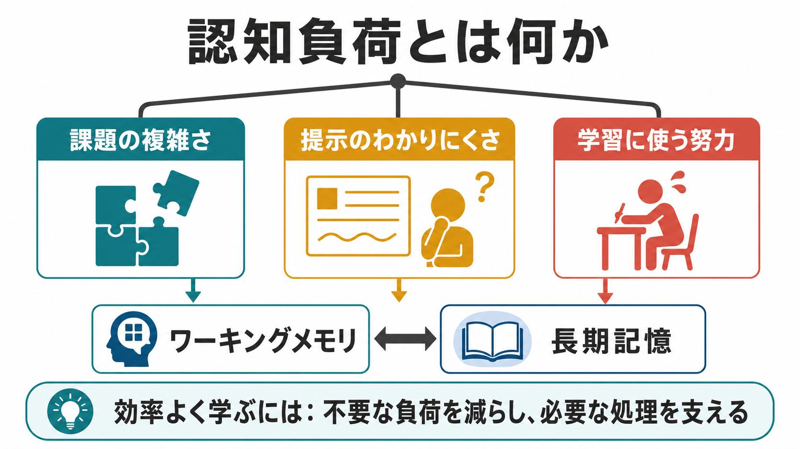
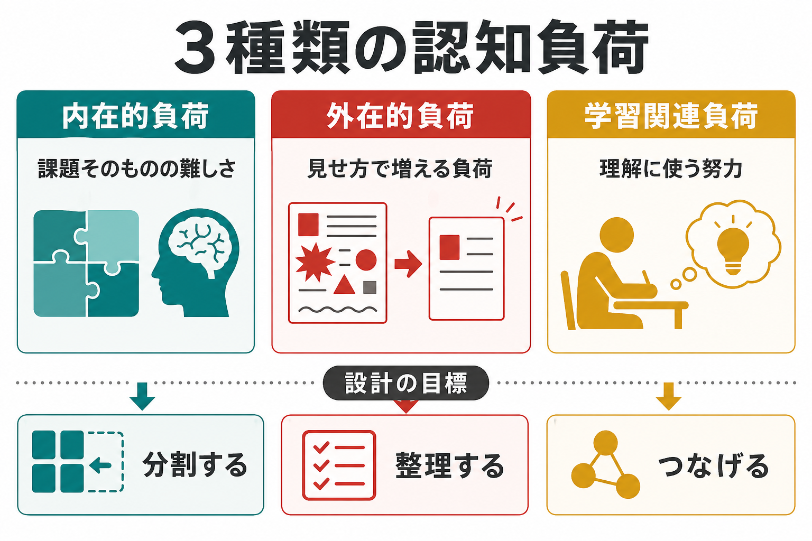
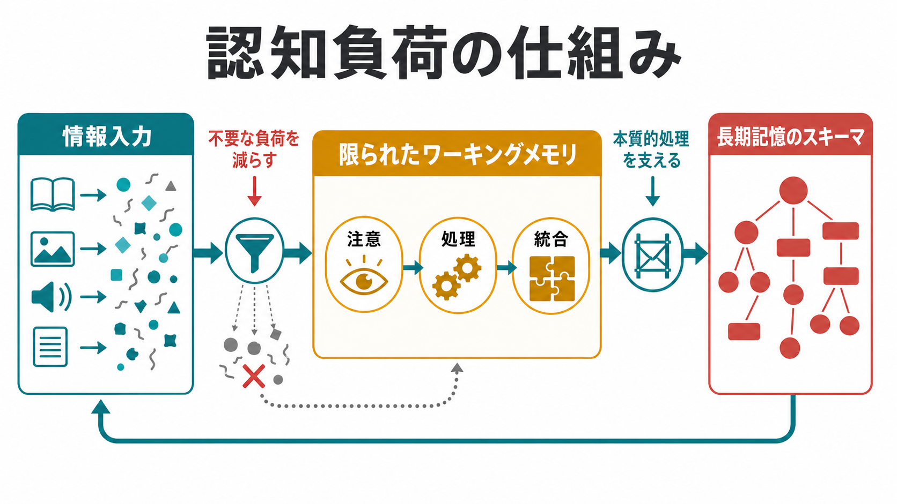

# 認知負荷とは何か

## 要点

- 認知負荷とは、課題を理解し、判断し、操作し、学習するために [[ワーキングメモリとは何か|ワーキングメモリ]] にかかる処理要求の大きさである。
- 認知負荷理論は、ワーキングメモリの容量が限られ、長期記憶のスキーマが課題処理を支えるという認知アーキテクチャを前提に、教材・作業環境・訓練設計を考える枠組みである[1][2]。
- 認知負荷はしばしば、課題そのものの難しさである「内在的負荷」、提示や環境の悪さで増える「外在的負荷」、理解やスキーマ形成に向かう「学習関連負荷」に分けて考えられる[2][7]。
- よい設計とは、負荷をゼロにすることではなく、不要な負荷を減らし、必要な処理を支え、学習者や作業者の現在の知識水準に合う負荷へ調整することである[2][4]。
- 教育、医療教育、臨床面接、研究手続き、UI設計、日常のタスク管理では、認知負荷を「本人の努力不足」ではなく「課題と環境が心的資源に何を要求しているか」として読むことが重要になる[3][8]。

## この記事で答える問い

1. 認知負荷とは何を指す概念なのか。
2. なぜ認知負荷は学習や作業効率に影響するのか。
3. 内在的負荷、外在的負荷、学習関連負荷はどう違うのか。
4. 認知負荷を下げることと、学習を浅くすることは同じなのか。
5. 研究・臨床・教育場面では、認知負荷をどう扱えばよいのか。

## まず結論

認知負荷は、「頭を使っている感じ」の総称ではなく、限られたワーキングメモリに対して、課題がどの程度の処理を要求しているかを表す概念である。人は情報を無制限に同時処理できない。複数の要素を保持し、それらの関係を考え、手順を選び、誤りを監視し、結果を長期記憶に統合するには、限られた注意と処理資源が必要になる[5][6]。

そのため、同じ内容でも、提示の仕方や作業環境によって負荷は変わる。たとえば、解説文と図が離れている、画面上に不要な装飾が多い、指示が曖昧で何をすべきか探さなければならない、途中結果を頭の中だけで保持しなければならない、といった状況では、課題の本質ではない処理が増える。これは外在的負荷であり、学習や作業の効率を下げやすい[2][4]。

一方で、負荷を下げれば常によいわけではない。理解するには、要素間の関係を比べ、説明し、既有知識と結びつけ、スキーマを形成する処理が必要である。重要なのは、不要な負荷を減らし、必要な処理に心的資源を回せるようにすることである[1][2]。

## 背景

認知負荷理論は、1980年代に John Sweller らの問題解決研究から発展した。Sweller は、初心者が手段-目的分析に多くの処理資源を使うと、問題の背後にある構造やスキーマの獲得に資源を回しにくくなると論じた[1]。これは、「問題を解かせれば自然に学ぶ」とは限らないことを示す重要な視点である。

その後、認知負荷理論は、教材設計、マルチメディア学習、専門職教育、医療教育、ヒューマンファクター研究に広がった。中心にあるのは、人間の認知システムには、容量の限られたワーキングメモリと、比較的大きな知識構造を保持する長期記憶があり、学習とは長期記憶内のスキーマを構築・自動化する過程だという考え方である[2][3]。

この点で、認知負荷は [[注意とは何か|注意]]、[[分割注意はどこまで可能なのか|分割注意]]、[[中央実行系とは何か|中央実行系]]、[[長期記憶とは何か|長期記憶]] と密接につながる。注意は処理対象を選び、ワーキングメモリは保持と操作を行い、長期記憶は知識のまとまりを提供する。認知負荷は、この一連のシステムに課題がどの程度の要求をかけるかを見るための実践的な言葉である。

## 基本概念

### 認知負荷の定義

認知負荷は、ある時点で課題を処理するために必要な心的資源の大きさである。ここでいう「資源」は、単なる気合いや意欲ではない。情報を一時的に保持する、要素を比較する、手順を選ぶ、誤りを検出する、言語情報と視覚情報を統合する、といった処理に使われる認知的な容量を指す。

認知負荷は、主観的な「大変さ」と関係するが、それだけではない。成績、反応時間、誤り、視線、二重課題の成績、生理指標、主観評定などを組み合わせて評価されることが多い[3]。特に教育研究では、成績だけを見ると「できた/できなかった」はわかっても、どれほど非効率な努力が必要だったかは見えにくい。そのため、認知負荷の測定は、教材や訓練法の効率を評価する補助線になる[3][7]。

### 3種類の認知負荷

認知負荷理論では、説明のために次の3種類がよく使われる[2][7]。

| 種類 | 何に由来するか | 例 | 設計上の扱い |
|---|---|---|---|
| 内在的負荷 | 課題そのものの要素数、要素間相互作用、学習者の既有知識 | 連立方程式、統計モデル、臨床推論のように複数要素を同時に扱う | 内容を分割し、前提知識を補い、段階的に複雑さを上げる |
| 外在的負荷 | 課題の本質に関係しない提示・環境・手続き上の負担 | 図と説明文が離れている、不要な情報が多い、指示が曖昧 | できる限り減らす |
| 学習関連負荷 | 理解、スキーマ形成、自己説明、既有知識との統合に使われる努力 | なぜそうなるかを説明する、例題から構造を抽出する | 支援し、適切に促す |

ただし、この3分類は便利な整理である一方、測定上は完全に独立した箱として扱うのが難しい。たとえば、ある学習者にとって内在的に難しい課題も、十分な既有知識をもつ学習者には低い負荷で処理できる。したがって、認知負荷は課題だけで決まるのではなく、課題、提示、環境、学習者の知識の相互作用として理解する必要がある[2][7]。

## 仕組み

### ワーキングメモリの制約

認知負荷が問題になる最大の理由は、ワーキングメモリが限られているからである。Baddeley のワーキングメモリ研究は、人間が音韻情報、視空間情報、中央実行系などを使って情報を一時的に保持・操作していることを示してきた[5]。また Cowan は、短期記憶や注意の焦点に保持できるチャンク数には厳しい制約があると整理した[6]。

この制約は、学習者の能力が低いという意味ではない。むしろ、人間の認知システムの通常の性質である。初心者が複雑な課題に取り組むと、多くの要素をまだひとまとまりの意味単位として扱えないため、個別要素をばらばらに保持しなければならない。その結果、ワーキングメモリの容量を使い切りやすい。

### 長期記憶のスキーマ

熟達者は、同じ課題をより低い負荷で処理できることがある。これは、長期記憶に蓄えられたスキーマが、複数の要素をひとまとまりとして扱うことを可能にするからである[1][2]。たとえば、初心者には別々に見える数式の項、実験手続き、臨床症状の組み合わせも、熟達者には「よくある構造」としてまとまって見える。

したがって、教育設計の目標は、単に問題を簡単にすることではない。学習者が処理すべき要素を適切にまとめ、段階的に関係を理解し、長期記憶内に再利用可能なスキーマを作れるようにすることである。

### 不要な負荷を減らし、必要な処理を支える

マルチメディア学習研究では、図・音声・文章を組み合わせるとき、情報の提示方法によって認知的過負荷が起こることが示されてきた。Mayer と Moreno は、人間には視覚・言語などの処理チャンネルがあり、それぞれの容量が限られ、意味ある学習には能動的な選択・組織化・統合が必要だと整理した[4]。

この考え方から、いくつかの実践原則が導かれる。対応する図と説明を近くに置く、不要な装飾や冗長説明を減らす、手順を小さく分ける、先行オーガナイザーを置く、例題から始める、途中結果を外部化する、といった工夫である。これらは「楽をさせる」ためではなく、課題の本質に関係しない探索や保持の負担を減らし、理解に必要な処理へ資源を配分するための工夫である[2][4]。

## 図解

図1は、認知負荷を「課題の複雑さ」「提示のわかりにくさ」「学習に使う努力」の3方向から整理している。これらはすべてワーキングメモリに影響し、最終的には長期記憶のスキーマ形成に関わる。

図2は、情報入力からワーキングメモリ、長期記憶へ向かう処理の流れを示している。重要なのは、入力された情報がそのまま学習になるわけではない点である。注意を向け、処理し、統合し、既有知識と結びつける段階で負荷が生じる。

図3は、3種類の認知負荷と設計上の対応を示している。内在的負荷は課題を分割して調整し、外在的負荷は提示や環境を整理して減らし、学習関連負荷は説明・比較・自己説明などで支える。

## 臨床・研究との接続

### 教育と訓練

教育場面では、認知負荷の視点は「学習者が理解できない理由」を個人内要因だけに還元しないために役立つ。説明が長すぎる、用語が未整理、例が抽象的すぎる、図と説明が離れている、手順が一度に提示されすぎる、といった設計上の問題が、学習者のワーキングメモリを圧迫していることがある。

特に初心者には、完全な探索課題よりも、よく構造化された例題、途中まで解かれた問題、段階的なヒントが有効になる場合がある[1][2]。一方で、熟達してくると、過剰な手取り足取りの説明がかえって不要な負荷になることもある。したがって、負荷調整は学習段階に合わせて変える必要がある。

### 医療教育と臨床場面

医療教育では、認知負荷理論は臨床推論、手技訓練、シミュレーション教育、現場での判断支援と関係する。Young らの AMEE Guide は、医療教育における認知負荷理論の応用として、学習者のワーキングメモリ容量、課題の複雑さ、指導設計、臨床環境のノイズを整理している[8]。

臨床場面でも、患者や家族に説明するときには、情報量、順序、用語、視覚的支援、確認の仕方が重要になる。ただし、認知負荷の概念を個別診断や治療指示として使うべきではない。ここでは教育・研究目的の枠組みとして、情報理解や意思決定支援の設計を考えるために用いる。

### 研究方法

認知負荷を測るときには、単一指標に頼りすぎないことが重要である。主観評定は簡便で有用だが、課題成績、反応時間、二重課題、眼球運動、生理指標などと組み合わせることで、より慎重な解釈が可能になる[3]。Leppink らは、内在的負荷、外在的負荷、学習関連負荷を区別して測定する尺度開発を行い、負荷の種類を分けて評価する試みを示した[7]。

ただし、認知負荷は観察可能な単一の物理量ではない。測定値は、課題、学習者、文脈、測定方法に依存する。研究では、「どの負荷を、どの課題で、どの指標から推定しているのか」を明確にする必要がある。

## よくある誤解

### 誤解1: 認知負荷は低ければ低いほどよい

低ければよいのは、主に外在的負荷である。理解や練習に必要な処理まで取り除くと、学習は浅くなる。重要なのは、不要な探索、保持、混乱を減らし、スキーマ形成に必要な処理を残すことである。

### 誤解2: 認知負荷は課題だけで決まる

同じ課題でも、初心者と熟達者では負荷が異なる。既有知識、用語への慣れ、手順の自動化、注意の向け方、環境ノイズによって負荷は変わる。認知負荷は、課題と人と環境の関係として読む必要がある[2]。

### 誤解3: 「集中力がない」ことと同じである

認知負荷は集中力の問題だけではない。人が十分に集中していても、同時に保持すべき要素が多すぎたり、提示が悪かったりすれば処理は破綻する。これは [[ワーキングメモリ容量はなぜ限られているのか|ワーキングメモリ容量]] や [[分割注意はどこまで可能なのか|分割注意]] の制約と関係する。

### 誤解4: 主観的に難しいと感じたら必ず学習効果が高い

困難さには、学習に役立つ困難さと、単に処理を妨げる困難さがある。読みにくい資料、探しにくい画面、曖昧な指示による困難は、学習の本質ではない負荷を増やすだけかもしれない。主観的な努力感だけでなく、成績、転移、保持、説明可能性を合わせて見る必要がある。

## 関連ノート

### 既存ノート

- [[ワーキングメモリとは何か]]
- [[ワーキングメモリ容量はなぜ限られているのか]]
- [[中央実行系とは何か]]
- [[注意とは何か]]
- [[分割注意はどこまで可能なのか]]
- [[長期記憶とは何か]]
- [[知覚とは何か]]
- [[計画能力とは何か]]

### 今後の作成候補

- 認知負荷理論とは何か
- 外在的負荷とは何か
- スキーマ獲得とは何か
- マルチメディア学習とは何か
- 例題効果とは何か
- 医療教育における認知負荷

### MOC更新候補

- `content/00_MOC/` 配下の認知科学・心理学系MOC
- 認知機能、学習、注意、ワーキングメモリを扱うMOC

## 理解チェック

1. 認知負荷は、単なる「疲れ」ではなく何に対する処理要求を指すか。
2. 内在的負荷と外在的負荷は、どの点で違うか。
3. 学習関連負荷を完全に減らしてしまうと、なぜ問題が起こるか。
4. 図と説明文が離れている教材は、どの種類の負荷を増やしやすいか。
5. 熟達者と初心者で、同じ課題の認知負荷が異なるのはなぜか。

## 参考文献

[1] Sweller, J. (1988). Cognitive load during problem solving: Effects on learning. *Cognitive Science, 12*(2), 257-285. https://doi.org/10.1016/0364-0213(88)90023-7

[2] Sweller, J., van Merriënboer, J. J. G., & Paas, F. (2019). Cognitive Architecture and Instructional Design: 20 Years Later. *Educational Psychology Review, 31*, 261-292. https://doi.org/10.1007/s10648-019-09465-5

[3] Paas, F., Tuovinen, J. E., Tabbers, H., & Van Gerven, P. W. M. (2003). Cognitive Load Measurement as a Means to Advance Cognitive Load Theory. *Educational Psychologist, 38*(1), 63-71. https://doi.org/10.1207/S15326985EP3801_8

[4] Mayer, R. E., & Moreno, R. (2003). Nine Ways to Reduce Cognitive Load in Multimedia Learning. *Educational Psychologist, 38*(1), 43-52. https://doi.org/10.1207/S15326985EP3801_6

[5] Baddeley, A. (1992). Is Working Memory Working? The Fifteenth Bartlett Lecture. *Quarterly Journal of Experimental Psychology, 44A*(1), 1-31. https://doi.org/10.1080/14640749208401281

[6] Cowan, N. (2001). The magical number 4 in short-term memory: A reconsideration of mental storage capacity. *Behavioral and Brain Sciences, 24*(1), 87-114. https://doi.org/10.1017/S0140525X01003922

[7] Leppink, J., Paas, F., Van der Vleuten, C. P. M., Van Gog, T., & Van Merriënboer, J. J. G. (2013). Development of an instrument for measuring different types of cognitive load. *Behavior Research Methods, 45*(4), 1058-1072. https://doi.org/10.3758/s13428-013-0334-1

[8] Young, J. Q., Van Merrienboer, J., Durning, S., & Ten Cate, O. (2014). Cognitive Load Theory: Implications for medical education: AMEE Guide No. 86. *Medical Teacher, 36*(5), 371-384. https://doi.org/10.3109/0142159X.2014.889290

## 未解決問題

- 認知負荷の3分類は実践上有用だが、測定上どこまで明確に分離できるかには議論が残る。
- 主観評定、行動指標、生理指標をどのように統合すれば、学習場面の負荷を妥当に推定できるかは継続的な課題である。
- 生成AI、マルチモーダル教材、複雑な臨床情報システムでは、外在的負荷を下げながら過度な自動化依存を避ける設計が必要になる。
