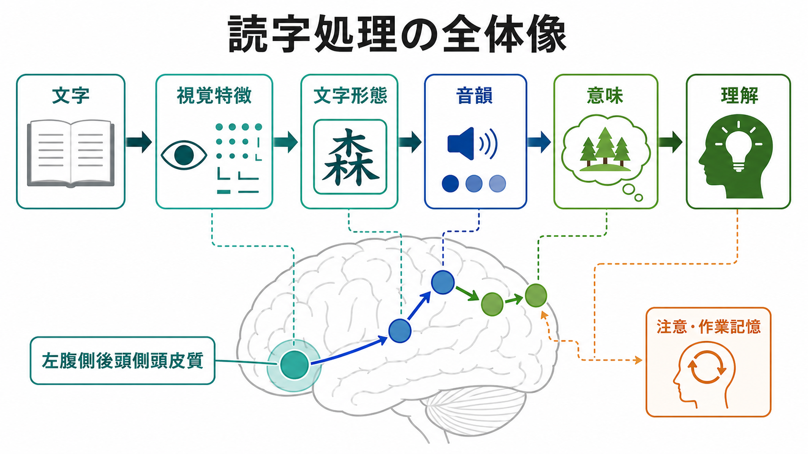
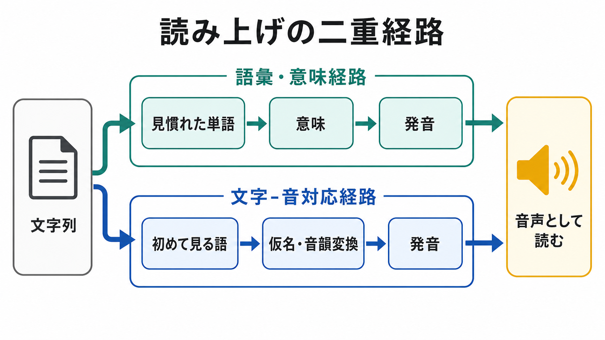

# 読字は脳内でどのように処理されるのか

## 要点

- 読字は、文字を「見る」処理だけではなく、文字形態、音韻、語彙、意味、注意、[[ワーキングメモリとは何か|ワーキングメモリ]]を結びつける分散ネットワークの働きである。
- 左腹側後頭側頭皮質、特に visual word form area と呼ばれる領域は、文字列を高速に識別する読字ネットワークの重要な入口として働く [1]。
- 読み上げには、見慣れた単語を語彙・意味から読む経路と、文字と音の対応を逐次的に使う経路があり、二重経路モデルと三角モデルはこの分業を異なる形で説明する [2][3][4]。
- 仮名、漢字、アルファベットなど文字体系が違っても、左半球の読字ネットワークには共通部分がある。一方で、音との対応の透明性や意味との結びつきに応じて使われ方は変わる [6]。
- 発達性ディスレクシアは単なる努力不足ではなく、音韻処理、文字-音対応、視覚的文字処理、注意制御などの複数要因が関わる発達上の読字困難として理解される [7]。

## この記事で答える問い

読字では、網膜に入った線や点の集まりが、なぜ「文字」「音」「意味」として扱われるのか。この記事では、読字を「文字形態を認識し、音韻と意味へ接続し、文脈の中で理解する過程」として整理する。焦点は、脳部位の暗記ではなく、どの処理がどの処理と結びつくのかに置く。

## まず結論

読字は、左半球を中心とする視覚-言語ネットワークが、文化的に学習された文字体系へ再編成されることで成立する。初期視覚野で抽出された線分や位置の情報は、左腹側後頭側頭皮質で文字列らしい形へまとめられ、その後、側頭葉や頭頂葉、下前頭回を含むネットワークを通じて音韻、語彙、意味、発話計画へ接続される [1][5]。

この処理は一直線ではない。単語を黙読して意味を取るとき、仮名を声に出して読むとき、見慣れない語を読むとき、漢字熟語を読むときでは、文字形態、音韻、意味への重みづけが変わる。さらに、[[注意とは何か|注意]]や[[選択的注意はどのように働くのか|選択的注意]]、作業記憶は、どの文字列に焦点を当て、どの候補を保ち、どの解釈を選ぶかを支える。

## 背景

読字は進化的に古い能力ではない。ヒトの脳はもともと文字を読むために作られたわけではなく、物体、顔、形、音声言語を処理する既存の回路を、教育と経験によって文字に合わせて使い直す。この考え方は「神経リサイクリング」と呼ばれ、文字認識が左腹側後頭側頭皮質に比較的一貫して局在する理由を説明する仮説として提案されている [1]。

読字研究は、少なくとも三つのレベルを区別すると理解しやすい。

1. 視覚レベル: 線分、曲線、位置、文字列のまとまりを抽出する。
2. 言語レベル: 文字形態を音韻、語彙、[[意味記憶とは何か|意味記憶]]へ接続する。
3. 課題レベル: 黙読、音読、語彙判断、文理解など、目的に応じて処理を調整する。

脳画像研究のメタ分析では、文字・単語・疑似語の読みに関わる活動は、左後頭側頭領域、側頭葉、下頭頂領域、下前頭回などに分布することが示されている [5]。この分布は、単一の「読字中枢」ではなく、複数の処理単位が協調するネットワークとして読字を捉える必要があることを示している。

## 基本概念

### 文字形態

文字形態とは、視覚入力を「文字らしい形」「単語らしい並び」として扱う表象である。たとえば、異なるフォントの「読」「読」「讀」を完全に同じ画像として見るわけではないが、読字ではそれらを同じ、または近い文字カテゴリーとして扱う必要がある。左腹側後頭側頭皮質は、このような視覚的変化を越えた文字列処理に関わると考えられている [1]。

### 音韻

音韻とは、言語音の単位や構造の表象である。仮名のように文字と音の対応が比較的透明な体系では、文字列から音韻への変換が読みを強く支える。一方、英語の不規則語や漢字のように、文字形態から音への対応が単純ではない場合、語彙知識や意味情報の関与が増える。

### 語彙と意味

語彙は「その単語を知っているか」に関わる表象であり、意味はその単語が指す概念、カテゴリー、連想、文脈との関係である。読字では、文字列が語彙に照合され、意味記憶と結びつく。漢字は形態と意味の結びつきが強いため、仮名とは異なる処理負荷を生みやすい。

### 読み上げと黙読

読み上げでは、文字列から発音を生成する必要がある。黙読では、発音を明示的に出さなくても音韻表象が関与することがある。ただし、すべての読字が「心の中で音読する」だけで説明できるわけではない。熟達した読者は、文字形態から意味へかなり直接的にアクセスすることもできる。

## 仕組み

### 1. 視覚特徴から文字形態へ

読字の入口では、網膜から入った視覚情報が、線、曲線、位置、方向、隣接関係として処理される。これらは左腹側後頭側頭皮質で、文字列に特化した表象へ統合される。ここで重要なのは、単なる視覚特徴ではなく、「その形がどの文字で、どの順序で並んでいるか」である [1]。

この段階が障害されると、視力が保たれていても文字列を読むことが難しくなることがある。古典的には純粋失読がその例で、単語を一目で読めず、一文字ずつたどるような読みになることがある [1]。

### 2. 文字形態から音韻へ

文字形態が得られると、読者はそれを音韻へ接続する。仮名では「あ」「か」「し」のように文字と音の対応が比較的一貫しているため、文字-音対応を使いやすい。英語の疑似語、たとえば実在しないが発音可能な文字列を読む課題でも、この変換経路が強く使われる [3][5]。

この処理には、左上側頭領域、縁上回を含む下頭頂領域、下前頭回などが関わるとされる。とくに、見慣れない語を読むときには、音韻候補を保持しながら変換する必要があるため、作業記憶や音韻出力の負荷が高くなる [5]。

### 3. 文字形態から語彙・意味へ

見慣れた単語では、文字列は語彙表象や意味表象へ素早く接続される。たとえば「森」を見たとき、読者は文字の形だけでなく、樹木の集まりという意味、文中での役割、場合によっては「もり」という音を同時に活性化する。

意味処理には、側頭葉の中部・下部、下前頭回などが関わる。これは[[意味記憶とは何か|意味記憶]]が、単独の辞書のように保存されているのではなく、語彙、概念、文脈、行為経験と結びつく分散表象として働くことと対応する。

### 4. 二重経路と三角モデル

読み上げを説明する代表的な認知モデルに、二重経路モデルと三角モデルがある。

二重経路モデルでは、読字には大きく二つの経路がある。ひとつは、見慣れた単語を語彙や意味に照合して読む語彙経路である。もうひとつは、文字と音の対応規則を使って読む非語彙経路である。DRC モデルは、この考え方を計算モデルとして具体化した代表例である [2]。

三角モデルでは、正書法、音韻、意味の三つの表象が相互に制約し合う。こちらは、経路を固定的に二分するよりも、文字形態、音韻、意味の重みづけが連続的に変わると考える。Plaut らのコネクショニストモデルは、規則語、不規則語、非語の読みを、分散表象と学習によって説明しようとした [4]。

### 5. トップダウン処理と文脈

熟達した読者は、文字を一つずつ機械的に変換しているだけではない。文脈、語彙頻度、予測、注意の向け方が、どの候補が採用されるかに影響する。たとえば、同じ文字列でも、文脈が異なれば読みや意味の候補が変わる。

この点で読字は、フィードフォワード処理だけでなく、[[フィードバック回路は脳内情報処理をどう調節するのか|フィードバック]]を含む反復的な処理である。初期視覚処理から語彙・意味へ進む流れと、文脈や課題から文字処理を調整する流れが重なって、最終的な理解が成立する。

## 図解

上の1枚目は、読字処理を「文字 - 視覚特徴 - 文字形態 - 音韻 - 意味 - 理解」という流れとして示している。ただし、これは一方向の単純なパイプラインではなく、注意・作業記憶や文脈からの調整を受ける。

2枚目は、読み上げの二重経路を示している。見慣れた単語では語彙・意味経路が有効に働き、初めて見る語や仮名列では文字-音対応経路が重要になる。ただし実際の読字では、二つの経路は独立して競争するだけでなく、相互に補い合う。

## 臨床・研究との接続

発達性ディスレクシアは、知的能力や教育機会だけでは説明できない読字の困難であり、音韻処理、文字-音対応、読字流暢性、視覚的文字処理、注意制御などの複数要因が関わる [7]。ここで重要なのは、個別の人の困難を単一原因に還元しないことである。

研究上は、読字課題の違いに注意が必要である。黙読、音読、語彙判断、意味判断、疑似語読みでは、同じ「読む」でも要求される処理が異なる。メタ分析は、左後頭側頭領域が文字形態処理に、下頭頂領域が文字-音変換に、側頭・下前頭領域が語彙・意味や音韻出力に関わるという大まかな対応を示している [5]。

臨床・教育への応用では、脳画像の知見を個別診断や支援方法へ直接短絡させないことが大切である。脳内処理の理解は、評価の観点を増やす助けにはなるが、支援は読みの正確さ、流暢性、音韻意識、語彙、理解、学習環境などを総合して考える必要がある。

## よくある誤解

### 誤解1: 読字は視覚だけの能力である

読字には視覚処理が不可欠だが、それだけではない。文字列が読めるためには、音韻、語彙、意味、注意、作業記憶が連携する必要がある。

### 誤解2: 読みは必ず音に変換してから意味に到達する

音韻は重要だが、熟達した読者では文字形態から語彙・意味へ直接的に近いアクセスも生じる。とくに見慣れた単語や漢字語では、意味処理の寄与が大きい。

### 誤解3: 読字困難は努力不足である

発達性ディスレクシアを含む読字困難は、神経認知的な処理差と学習経験が複雑に関わる。努力や意欲だけで説明することはできない [7]。

### 誤解4: 脳の一箇所に「読字中枢」がある

左腹側後頭側頭皮質は重要だが、読字は単一部位の機能ではない。側頭葉、頭頂葉、前頭葉、注意・制御系を含むネットワークの働きとして捉える必要がある [5]。

## 関連ノート

- [[注意とは何か]]
- [[選択的注意はどのように働くのか]]
- [[ワーキングメモリとは何か]]
- [[意味記憶とは何か]]
- [[神経可塑性は発達と学習をどう支えるのか]]
- [[フィードフォワード回路はどのように情報を処理するのか]]
- [[フィードバック回路は脳内情報処理をどう調節するのか]]

## 理解チェック

1. 読字処理で、左腹側後頭側頭皮質が重要とされる理由は何か。
2. 仮名を読むときと漢字を読むときで、音韻処理と意味処理の重みづけはどのように変わりうるか。
3. 二重経路モデルと三角モデルは、読字をどの点で異なる仕方で説明しているか。
4. 発達性ディスレクシアを「努力不足」と説明することの問題は何か。

## 関連ノート候補

- 読字発達とは何か
- 発達性ディスレクシアとは何か
- 音韻意識とは何か
- visual word form area とは何か
- 漢字と仮名は脳内でどう処理されるのか

## MOC更新候補

- `content/00_MOC/` 配下の認知科学・心理学系 MOC に、本記事を「言語・読字・認知機能」の項目として追加する候補。
- 並列ジョブとの競合を避けるため、この作業では MOC ファイル自体は更新しない。

## 未解決問題

- VWFA は「文字に特化した領域」なのか、それとも経験により文字処理へ強く調整された一般的な形態処理領域なのか。
- 日本語の仮名・漢字混じり文で、文字体系ごとの処理差が文理解中にどの時間スケールで統合されるのか。
- 発達性ディスレクシアのサブタイプを、音韻、視覚、注意、流暢性、語彙発達の観点からどこまで個別化できるのか。

## 参考文献

[1] Dehaene, S., & Cohen, L. (2011). The unique role of the visual word form area in reading. *Trends in Cognitive Sciences, 15*(6), 254-262. https://doi.org/10.1016/j.tics.2011.04.003

[2] Coltheart, M., Rastle, K., Perry, C., Langdon, R., & Ziegler, J. (2001). DRC: A dual route cascaded model of visual word recognition and reading aloud. *Psychological Review, 108*(1), 204-256. https://doi.org/10.1037/0033-295X.108.1.204

[3] Jobard, G., Crivello, F., & Tzourio-Mazoyer, N. (2003). Evaluation of the dual route theory of reading: A metanalysis of 35 neuroimaging studies. *NeuroImage, 20*(2), 693-712. https://doi.org/10.1016/S1053-8119(03)00343-4

[4] Plaut, D. C., McClelland, J. L., Seidenberg, M. S., & Patterson, K. (1996). Understanding normal and impaired word reading: Computational principles in quasi-regular domains. *Psychological Review, 103*(1), 56-115. https://doi.org/10.1037/0033-295X.103.1.56

[5] Taylor, J. S. H., Rastle, K., & Davis, M. H. (2013). Can cognitive models explain brain activation during word and pseudoword reading? A meta-analysis of 36 neuroimaging studies. *Psychological Bulletin, 139*(4), 766-791. https://doi.org/10.1037/a0030266

[6] Bolger, D. J., Perfetti, C. A., & Schneider, W. (2005). Cross-cultural effect on the brain revisited: Universal structures plus writing system variation. *Human Brain Mapping, 25*(1), 92-104. https://doi.org/10.1002/hbm.20124

[7] Peterson, R. L., & Pennington, B. F. (2012). Developmental dyslexia. *The Lancet, 379*(9830), 1997-2007. https://doi.org/10.1016/S0140-6736(12)60198-6
