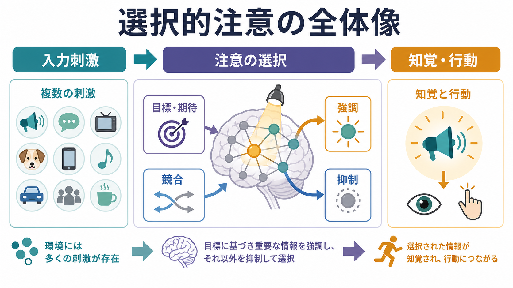
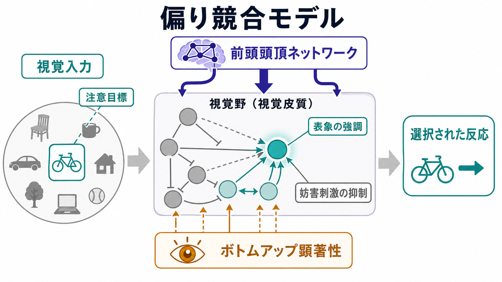
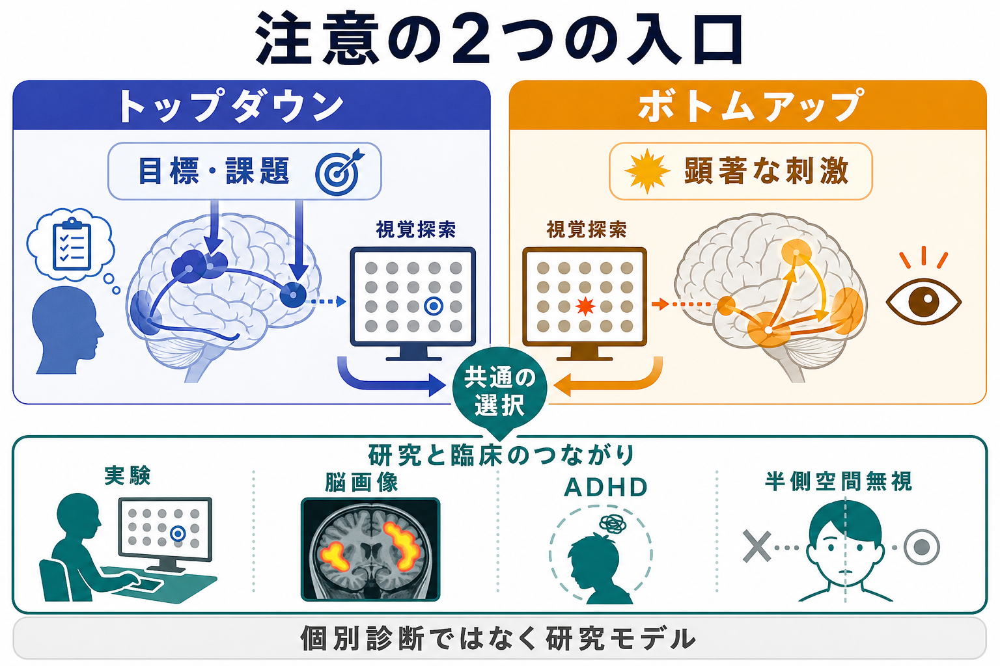

# 選択的注意はどのように働くのか

## 要点

- 選択的注意とは、環境内のすべてを均等に処理するのではなく、目標、場所、特徴、顕著性に応じて一部の情報を優先する仕組みである。
- 古典的な視覚探索研究では、単一特徴の探索は比較的自動的に進みやすいが、色と形の組み合わせのような結合探索では焦点化された注意が重要になるとされた[1]。
- 注意は「見ている場所」だけでなく、眼球を動かさずに処理効率を変える covert orienting としても働く[2]。
- 神経機構としては、複数の刺激表象が競合し、目標や顕著性によって標的表象が強調され、妨害刺激の影響が弱められるという偏り競合モデルが中心的である[3]。
- 背側前頭頭頂ネットワークは目標に基づくトップダウン選択、腹側前頭頭頂ネットワークは予期しない重要刺激への再定位に関わると整理される[4][5]。
- 臨床・研究では、ADHDや半側空間無視などの理解に接続するが、ここでの説明は教育・研究目的であり、個別診断や治療指示ではない[5][7]。

## この記事で答える問い

この記事の問いは、「なぜ私たちは多くの刺激の中から、ある対象だけを見つけ、聞き取り、反応できるのか」である。たとえば、雑音の中で名前を聞き取る、画面上の赤いアイコンを探す、会話中にスマートフォン通知を無視する、運転中に歩行者へ反応する、といった場面では、感覚入力そのものよりも「どの情報を優先するか」が認知の成否を左右する。

ここでは、選択的注意を、心理学的な現象、視覚皮質での表象競合、前頭頭頂ネットワークによる制御、研究・臨床との接続の順に整理する。

## まず結論

選択的注意は、入力を後から単に「フィルタリング」するだけの機構ではない。より正確には、感覚入力、課題目標、記憶、予測、刺激の目立ちやすさを統合し、脳内の表象の競合に偏りをかける仕組みである。注意された刺激は、視覚皮質や関連領域でより強く、より安定して表象されやすくなり、行動選択にも結びつきやすくなる[3][6]。

この働きは、[[視覚ネットワークはどのように階層的に情報処理するのか|視覚ネットワーク]]の末端だけで起きるのではない。前頭葉・頭頂葉を含む制御系が、現在の目標に合う場所や特徴へ信号を送り、感覚野での処理を変える[4][5]。一方で、突然の音、強い動き、危険そうな刺激のように、目標外でも重要な刺激はボトムアップに注意を引く。この2つの入口が相互作用することで、注意は柔軟だが、同時に誤誘導も受けやすい。

## 背景

人間の感覚器は大量の情報を受け取るが、脳がそれらを同じ深さで処理することはできない。注意研究の基本問題は、この有限な処理資源をどのように配分するかである。初期の認知心理学では、注意は情報処理のどこかにある「ボトルネック」や「フィルター」として説明されることが多かった。現在では、単一のフィルターではなく、知覚、記憶、行動、覚醒、報酬、課題ルールが関わる多層的な制御過程として理解されている[5]。

選択的注意の実験では、視覚探索、空間手がかり課題、ストループ課題、二重課題、変化検出、眼球運動課題などが使われる。視覚探索では「赤い丸を探す」のような単一特徴探索と、「赤くて縦向きの線を探す」のような結合探索が区別される。TreismanとGeladeの特徴統合理論は、特徴の結合には焦点化された注意が必要になるという見方を示し、視覚探索研究の出発点の一つになった[1]。

## 基本概念

### トップダウン注意

トップダウン注意とは、目標、期待、課題ルール、文脈によって入力処理を方向づける働きである。赤い標識を探しているとき、赤い対象の処理が優先される。ある人の声を聞こうとしているとき、その声の音色や位置が優先される。この場合、注意は外界から勝手に引かれるだけでなく、内的な目標によって設定される[4]。

トップダウン注意は、[[前頭頭頂ネットワークは認知制御をどう支えるのか|前頭頭頂ネットワーク]]と強く関係する。前頭葉は課題目標や反応ルールの維持に、頭頂葉は空間的な優先順位や注意の割り当てに関わると考えられる[4][5]。

### ボトムアップ注意

ボトムアップ注意とは、刺激そのものの顕著性によって注意が引かれる働きである。突然点滅する光、大きな音、周囲と異なる色、急な動きなどは、目標と無関係でも注意を奪うことがある。これは危険や新奇性に素早く反応するうえで役立つが、作業中の通知や広告のように、現在の目標を妨害することもある[4]。

### 空間注意・特徴注意・対象注意

選択的注意は、少なくとも3つの軸で考えられる。空間注意は「どこに注意するか」、特徴注意は「何色・どの向き・どの音色に注意するか」、対象注意は「どのまとまりを一つの対象として追うか」である。これらは分離して研究されるが、日常場面では重なって働く。たとえば、交差点で自転車を探すときには、位置、動き、形、意味が同時に使われる。

### 顕在的注意と潜在的注意

顕在的注意は、眼球や頭部を対象へ向ける注意である。潜在的注意は、視線を固定したまま、処理効率だけを特定の位置や特徴へ向ける注意である。Posnerの空間手がかり研究は、眼を動かさなくても注意を移動でき、その位置の検出効率が変わることを示す重要な枠組みになった[2]。

## 仕組み

### 1. 入力は並列に入るが、行動に使える表象は競合する

視覚場面には多くの対象が同時に存在する。初期視覚野では位置、方位、色、運動などの特徴がある程度並列に処理される。しかし、どの対象を同定し、記憶し、反応へ結びつけるかの段階では、複数の表象が競合する。ここで注意は、標的に関係する表象の信号対雑音比を上げ、妨害刺激の影響を下げる方向に働く[3][6]。

この考え方は、[[アセチルコリンは注意や記憶にどう関わるのか|アセチルコリン]]などの神経調節系とも接続する。神経調節物質は特定の刺激を直接「選ぶ」というより、皮質回路の感度、覚醒水準、入力選択のしやすさを変える背景条件として働く。

### 2. 偏り競合モデル

偏り競合モデルでは、複数の刺激が同じ神経集団や処理経路を共有するとき、それらは表象の強さをめぐって競合すると考える。注意はこの競合に偏りを与える。標的が課題目標と一致していれば、その表象が強調され、同じ受容野や同じ処理経路に入る妨害刺激の影響が相対的に弱くなる[3]。

重要なのは、注意が「標的だけを通す門」ではない点である。実際には、複数の刺激、課題ルール、過去経験、報酬価値、顕著性が同時に影響し、競合の重みを変える。そのため、目標を持っていても目立つ刺激に引かれるし、目立つ刺激があっても訓練された課題目標によって無視できる場合がある。

### 3. 背側ネットワークと腹側ネットワーク

CorbettaとShulmanの整理では、背側前頭頭頂ネットワークは目標に基づく注意セットの準備と適用に関わる。これは「次にどこを見るか」「どの特徴を探すか」「どの反応を準備するか」を支える系である[4]。

一方、腹側前頭頭頂ネットワーク、特に右半球の側頭頭頂接合部や腹側前頭皮質は、予期しないが行動上重要な刺激の検出に関わるとされる。この系は、進行中のトップダウン設定を中断し、注意を再定位する「回路遮断器」のように働くと説明される[4]。この区別は単純な二分法ではないが、注意を「目標で向ける働き」と「重要な出来事に引き戻される働き」に分けて考えるうえで有用である。

### 4. 注意は知覚の質も変える

注意は反応時間を短くするだけでなく、知覚の精度や見え方にも影響する。視覚注意のレビューでは、空間注意がコントラスト感度、空間分解能、特徴処理、識別成績を変えることが整理されている[6]。つまり注意は、すでに完成した知覚を後から選ぶのではなく、知覚そのものの形成過程に入り込む。

この点は、[[皮質視床ループは意識や注意にどう関わるのか|皮質視床ループ]]や視覚皮質のフィードバック処理を考えると理解しやすい。上位領域からの信号は、下位感覚野の応答を調整し、どの入力が安定した知覚表象になるかに影響する。

## 図解

図1は、選択的注意を「入力刺激」「注意の選択」「知覚・行動」の流れとして整理している。環境には複数の刺激が存在し、目標・期待・競合・強調・抑制を通じて、一部の情報が知覚と行動へ進む。

図2は、偏り競合モデルを示している。視覚入力は複数の表象を生むが、前頭頭頂ネットワークからのトップダウン信号と、刺激側のボトムアップ顕著性が、どの表象を強くするかを変える。

図3は、トップダウン注意とボトムアップ注意、および研究・臨床との接続をまとめている。注意研究は視覚探索や脳画像研究だけでなく、ADHDや半側空間無視のような状態を理解するための研究モデルにもなる。

## 臨床・研究との接続

選択的注意は、臨床的にも研究上も重要である。半側空間無視では、片側の脳損傷後に反対側空間の刺激へ注意を向けたり反応したりすることが難しくなる。LiとMalhotraのレビューは、半側空間無視を主として注意の障害として整理し、右半球損傷後に重く持続しやすいことを説明している[7]。

ADHDでも、不注意、衝動性、課題維持、妨害刺激への弱さが問題になる。ただし、ADHDを単に「選択的注意が弱い」とだけ説明するのは不十分である。実行機能、報酬処理、覚醒、発達、環境、課題条件が関わるため、注意ネットワークの観点は一つの理解枠組みにとどまる[5]。関連して、[[ADHDは前頭線条体回路の障害として説明できるのか]]では、注意だけでなく前頭線条体回路や報酬処理からADHDを整理している。

研究面では、選択的注意はfMRI、EEG/MEG、単一ニューロン記録、眼球運動計測、心理物理課題、計算モデルを組み合わせて調べられる。深層学習でいう「attention」と人間の選択的注意は同一ではないが、限られた情報を重みづけて処理するという抽象的な問題設定は共有している。

## よくある誤解

### 誤解1: 注意は一つのスポットライトである

スポットライト比喩は直感的だが、注意は一つの円形領域だけを照らすわけではない。場所、特徴、対象、時間、反応ルールなど、複数の基準で配分される。視覚探索では、空間的に離れた複数候補や、色・向きのような特徴次元に注意が向くこともある[6]。

### 誤解2: 注意されたものだけが完全に処理される

注意されていない刺激も、一定程度は処理される。問題は「処理されるか、されないか」ではなく、どの段階まで、どの強さで、行動に影響するほど処理されるかである。妨害刺激がストループ課題やフランカー課題で反応に影響するのは、この中間的処理を示している。

### 誤解3: トップダウン注意は常に良い

目標に沿った注意は効率を上げるが、強すぎる目標設定は予期しない重要刺激を見落とす原因にもなる。逆に、ボトムアップ注意は危険検出に役立つが、通知や広告のような無関係刺激に引きずられる原因にもなる。注意の適応性は、目標維持と再定位のバランスにある[4]。

## 関連ノート

- [[視覚ネットワークはどのように階層的に情報処理するのか]]: 視覚入力がどのように階層的表象へ変換されるか。
- [[前頭頭頂ネットワークは認知制御をどう支えるのか]]: 目標維持、課題切り替え、トップダウン制御の関連ノート。
- [[皮質視床ループは意識や注意にどう関わるのか]]: 感覚入力と意識・注意の再帰的制御。
- [[アセチルコリンは注意や記憶にどう関わるのか]]: 神経調節物質から見た注意と記憶。
- [[ADHDは前頭線条体回路の障害として説明できるのか]]: 注意障害を含む発達精神医学との接続。

### 関連ノート候補

- 注意ネットワークとは何か
- 視覚探索課題とは何か
- 半側空間無視とは何か
- トップダウン処理とボトムアップ処理はどう違うのか
- ワーキングメモリと注意はどう関係するのか

### MOC更新候補

- `content/00_MOC/` 配下の認知科学・心理学系MOCに、この記事へのリンクを追加する候補。
- 脳ネットワーク系MOCがある場合、前頭頭頂ネットワーク・視覚ネットワーク・注意ネットワークの接続項目として追加する候補。

## 理解チェック

1. 選択的注意は、単なる「刺激の遮断」ではなく、どのような競合に偏りを与える仕組みだろうか。
2. 単一特徴探索と結合探索では、注意の必要性はどのように異なるだろうか。
3. トップダウン注意とボトムアップ注意は、それぞれどのような場面で役立ち、どのような場面で妨害になるだろうか。
4. 背側前頭頭頂ネットワークと腹側前頭頭頂ネットワークは、注意制御においてどのように役割分担していると考えられるだろうか。
5. 半側空間無視を「視覚の問題」だけでなく「注意の問題」として見ると、何が理解しやすくなるだろうか。

## 参考文献

[1] Treisman, A. M., & Gelade, G. (1980). A feature-integration theory of attention. *Cognitive Psychology*, 12(1), 97-136. https://doi.org/10.1016/0010-0285(80)90005-5

[2] Posner, M. I. (1980). Orienting of attention. *Quarterly Journal of Experimental Psychology*, 32(1), 3-25. https://doi.org/10.1080/00335558008248231

[3] Desimone, R., & Duncan, J. (1995). Neural mechanisms of selective visual attention. *Annual Review of Neuroscience*, 18, 193-222. https://doi.org/10.1146/annurev.ne.18.030195.001205

[4] Corbetta, M., & Shulman, G. L. (2002). Control of goal-directed and stimulus-driven attention in the brain. *Nature Reviews Neuroscience*, 3, 201-215. https://doi.org/10.1038/nrn755

[5] Petersen, S. E., & Posner, M. I. (2012). The attention system of the human brain: 20 years after. *Annual Review of Neuroscience*, 35, 73-89. https://doi.org/10.1146/annurev-neuro-062111-150525

[6] Carrasco, M. (2011). Visual attention: The past 25 years. *Vision Research*, 51(13), 1484-1525. https://doi.org/10.1016/j.visres.2011.04.012

[7] Li, K., & Malhotra, P. A. (2015). Spatial neglect. *Practical Neurology*, 15(5), 333-339. https://doi.org/10.1136/practneurol-2015-001115

## 未解決問題

- 注意による信号強調と妨害抑制は、課題・発達段階・神経調節状態によってどの程度変わるのか。
- 空間注意、特徴注意、対象注意を統一的に説明する計算モデルはどこまで可能か。
- 深層学習のattention機構と、人間の選択的注意を比較するとき、どのレベルの対応を仮定すべきか。
- ADHD、半側空間無視、加齢、睡眠不足などにおける注意変化を、単一の注意障害としてではなく、複数ネットワークの変調としてどう記述できるか。
