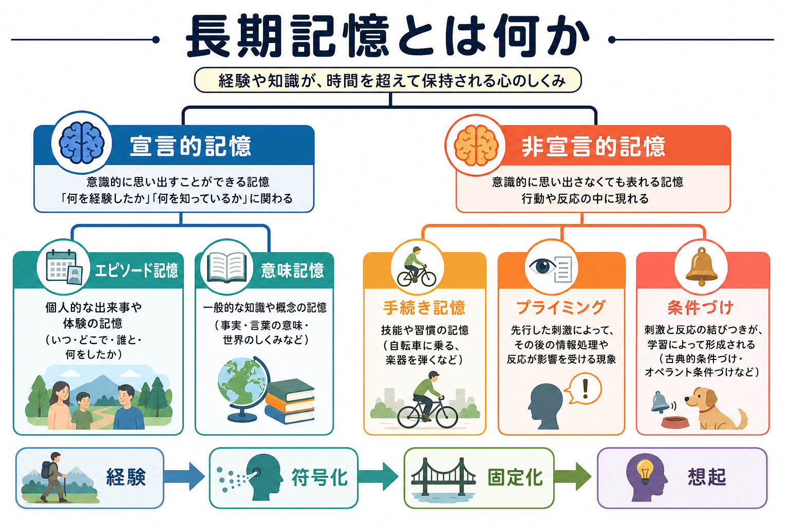
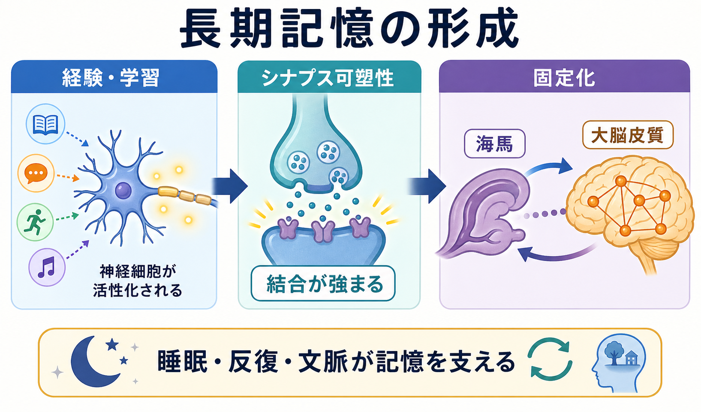
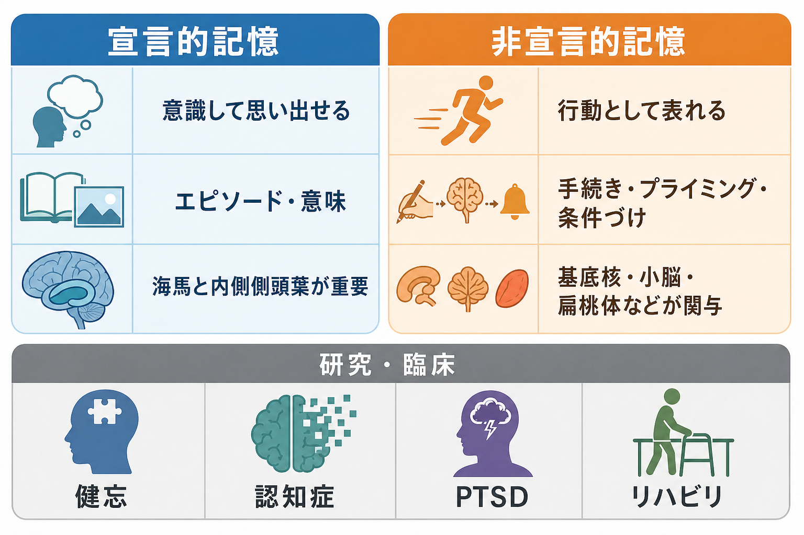

# 長期記憶とは何か

## 要点

- 長期記憶は、数分から生涯にわたって経験・知識・技能を保持し、必要なときに利用できるようにする仕組みである。
- 大きくは、意識的に「思い出せる」[[エピソード記憶とは何か|エピソード記憶]]・[[意味記憶とは何か|意味記憶]]などの**宣言的記憶**と、技能・習慣・プライミング・条件づけのように行動や反応として現れやすい**非宣言的記憶**に分けられる [1]。
- 長期記憶は「保存庫」ではなく、符号化、固定化、想起、再固定化を通じて変化し続ける動的な過程である [5][6][8]。
- 宣言的記憶では海馬と内側側頭葉が重要で、非宣言的記憶では基底核、小脳、扁桃体、感覚運動系など、課題ごとに異なる回路が関与する [1][3]。

## この記事で答える問い

- 長期記憶は短期記憶やワーキングメモリと何が違うのか。
- 宣言的記憶と非宣言的記憶は、何を基準に分けられるのか。
- 経験はどのように脳内で長期的な記憶へ変わるのか。
- 臨床や研究では、長期記憶をどのように理解し、どこに注意するのか。

## まず結論

長期記憶とは、経験から得た情報を、単なる一時保持ではなく、後で再利用できる形へ変換する仕組みである。たとえば「昨日どこで誰と会ったか」はエピソード記憶、「海馬は記憶に関わる」という知識は意味記憶、自転車に乗る技能は手続き記憶に近い。これらはすべて長期記憶だが、同じ場所に同じ形式で保存されるわけではない [1][2]。

重要なのは、長期記憶を「頭の中のファイル」と見なさないことである。記憶は、入力時の注意や意味づけ、海馬を含むネットワークでの符号化、睡眠や反復を含む固定化、想起時の再構成によって形を変える [6][7]。想起はコピーの読み出しではなく、手がかりと現在の文脈に依存する再構成である。

## 背景

記憶研究では、保持時間だけでなく、情報の形式と脳システムの違いが重視される。短期記憶やワーキングメモリは、今使っている情報を一時的に保持・操作する働きを指す。一方、長期記憶は、経験後しばらくしてからも利用できる知識、出来事、技能、情動反応を含む。

古典的な分類では、長期記憶は宣言的記憶と非宣言的記憶に分けられる [1]。この区別は、健忘症例の研究から発展した。海馬や内側側頭葉に損傷がある人では、新しい出来事や事実を意識的に覚えることが難しくなる一方で、技能学習や条件づけの一部は相対的に保たれることがある。この解離が、「記憶」は単一能力ではなく複数システムからなる、という見方を支えた [1][3]。

## 基本概念

### 宣言的記憶

宣言的記憶は、言葉で説明したり、意識的に思い出したりしやすい記憶である。代表例は次の二つである。

| 種類 | 内容 | 例 | 関連ノート |
|---|---|---|---|
| エピソード記憶 | 自分が経験した出来事の記憶 | 「昨日の会議で何を話したか」 | [[エピソード記憶とは何か]] |
| 意味記憶 | 事実、概念、語の意味、一般知識 | 「東京は日本の首都である」 | [[意味記憶とは何か]] |

エピソード記憶は、出来事の内容だけでなく、「いつ・どこで・自分にとってどう経験されたか」という主観的時間と結びつく [2]。意味記憶は、個別の経験から抽象化された知識として使われる。実際の学習では、両者は完全には分離せず、エピソード的な経験が意味知識へ変換されることも多い。

### 非宣言的記憶

非宣言的記憶は、本人が明示的に説明しにくくても、行動や反応の変化として現れる記憶である [1]。

| 種類 | 内容 | 関与しやすい回路の例 |
|---|---|---|
| 手続き記憶 | 技能や習慣の学習 | [[大脳基底核ループとは何か|基底核]]、運動皮質、小脳 |
| プライミング | 先行刺激が後の処理を促進する効果 | 感覚・連合皮質 |
| 条件づけ | 刺激と反応、刺激と情動の結びつき | 扁桃体、小脳など |
| 非連合学習 | 馴化、鋭敏化 | 感覚運動系など |

非宣言的記憶は「無意識の記憶」とだけ言うと粗すぎる。手続き学習の結果を意識的に語れる場合もあるし、宣言的記憶が技能学習を補助する場合もある。分類は、意識の有無だけでなく、課題、測定方法、関与する回路の違いを含めて理解する必要がある。

## 仕組み

### 1. 符号化

符号化とは、経験を記憶として利用できる形に変換する過程である。注意、意味づけ、感情、文脈、既存知識との関連づけが、何が長期的に残りやすいかを左右する。宣言的記憶では、海馬と内側側頭葉が、出来事の要素を結びつけるインデックスのような役割を担うと考えられている [3]。

### 2. シナプス可塑性

記憶の神経基盤を考えるとき、中心になる概念が[[シナプス可塑性とは何か|シナプス可塑性]]である。神経細胞どうしの結合強度は経験に応じて変化し、長期増強（LTP）は学習・記憶のシナプスモデルとして研究されてきた [4]。これは[[Hebb則とは何か|Hebb則]]の直感、すなわち一緒に活動する細胞同士の結合が強まるという考えと対応する。

ただし、LTP が見つかればそのまま「記憶がそこに保存された」と言えるわけではない。長期記憶は、分子変化、シナプス変化、局所回路、広域ネットワーク、行動の各レベルをつなげて理解する必要がある。

### 3. 固定化

[[記憶の固定化とは何か|記憶の固定化]]とは、新しい記憶が時間とともに安定化し、干渉や障害に対して相対的に保たれやすくなる過程である [5]。固定化には、シナプスレベルの変化と、海馬・大脳皮質を含むシステムレベルの再編成が含まれる。

現代的な見方では、固定化は一回で完了する処理ではない。記憶は覚醒中や睡眠中の再活性化を通じて、既存知識へ統合され、別の文脈で使える形へ変換される [6][7]。このため、長期記憶は「安定する」と同時に「変形される」。

### 4. 想起と再固定化

想起は、保存された記録をそのまま取り出す操作ではなく、手がかり、現在の目的、感情状態、文脈に依存した再構成である。さらに、想起された記憶は一時的に不安定になり、再び安定化する場合がある。この過程は再固定化と呼ばれ、恐怖記憶研究で重要な実験的根拠が示された [8]。

再固定化の知見は、PTSD などの恐怖記憶に関する研究へ接続するが、個別の症状に対する治療指示として単純化してはいけない。臨床応用を考える場合は、研究段階の知見、確立した治療、個別支援を区別する必要がある。

## 図解

図の要点は、長期記憶を一つの箱として扱わず、少なくとも「言葉で説明しやすい記憶」と「行動・技能・反応として表れやすい記憶」に分けて見ることである。宣言的記憶は海馬と内側側頭葉に強く依存し、非宣言的記憶は基底核、小脳、扁桃体、感覚運動系など、課題ごとの回路に分散している [1][3]。

## 臨床・研究との接続

長期記憶の分類は、研究デザインと臨床評価の両方で役に立つ。たとえば健忘では、本人が「覚えていない」と訴える内容が、出来事の想起なのか、意味知識なのか、手順の遂行なのかを分けて見る必要がある。認知症の評価でも、エピソード記憶、意味知識、手続き、注意、実行機能は同じものではない。

恐怖記憶や情動記憶は、[[PTSDでは恐怖記憶ネットワークに何が起きているのか|PTSDの恐怖記憶ネットワーク]]と接続する。扁桃体、海馬、前頭前野の相互作用は、何が危険として記憶され、どの文脈で再活性化されるかに関わる。ただし、個別のトラウマ記憶や症状については、この記事の一般的説明から診断や治療方針を導くことはできない。

睡眠研究では、睡眠が記憶を単に「外界から守る」だけでなく、再活性化とシステム固定化に関わる可能性が示されている [7]。この点は[[睡眠障害は脳機能にどのような影響を与えるのか|睡眠障害と脳機能]]、学習、リハビリテーション研究とも接続する。

## よくある誤解

### 誤解1: 長期記憶は一度保存されたら変わらない

長期記憶は安定性を持つが、完全に固定された記録ではない。想起、再解釈、睡眠中の再活性化、新しい知識との統合によって変化する [6][8]。

### 誤解2: 記憶はすべて海馬に保存される

海馬は宣言的記憶の形成や想起に重要だが、すべての記憶が海馬に保存されるわけではない。技能、条件づけ、プライミングは、基底核、小脳、扁桃体、感覚皮質など別の回路にも依存する [1]。

### 誤解3: 言葉で説明できないなら記憶ではない

自転車に乗る、楽器を弾く、反復で反応が速くなる、といった変化も長期記憶に含まれる。本人が明示的に説明できるかどうかは、記憶の一側面にすぎない。

### 誤解4: 忘却は単なる失敗である

忘却は、検索手がかりの不足、干渉、再構成の変化、記憶痕跡の弱化など複数の要因で起こる。不要な情報をすべて保持し続けないことは、認知システムの効率にも関わる。

## 関連ノート

- [[エピソード記憶とは何か]]
- [[意味記憶とは何か]]
- [[記憶の固定化とは何か]]
- [[Hebb則とは何か]]
- [[シナプス可塑性とは何か]]
- [[海馬回路は記憶をどう形成するのか]]
- [[大脳基底核ループとは何か]]
- [[小脳回路は予測と誤差学習にどう関わるのか]]
- [[PTSDでは恐怖記憶ネットワークに何が起きているのか]]
- [[睡眠障害は脳機能にどのような影響を与えるのか]]

## 理解チェック

1. 宣言的記憶と非宣言的記憶は、どのような基準で分けられるか。
2. エピソード記憶と意味記憶の違いを、自分の例で説明できるか。
3. 海馬が重要なのは、すべての記憶なのか、それとも特定の記憶システムなのか。
4. 固定化と再固定化は、どちらも「記憶が安定する」過程だが、何が違うか。
5. 「記憶を取り出す」と「記憶を再構成する」は、どのように違うか。

## 関連ノート候補・MOC更新候補

- MOC 更新候補: `content/00_MOC/MOC｜認知科学・心理学.md`
- 今後の作成候補: 「手続き記憶とは何か」「プライミングとは何か」「記憶の再固定化とは何か」「ワーキングメモリと長期記憶はどう違うのか」

## 未解決問題

- 海馬依存のエピソード記憶が、時間とともにどの程度まで皮質ネットワークへ移るのかについては、単一の合意モデルに収束していない。
- 宣言的記憶と非宣言的記憶は実験上便利な分類だが、実際の生活場面では相互作用が強く、境界は課題依存である。
- 再固定化を臨床応用へつなげる研究は進んでいるが、恐怖記憶やトラウマ記憶への介入を単純な「記憶の消去」として説明するのは不正確である。

## 参考文献

[1] Squire, L. R., & Zola, S. M. (1996). Structure and function of declarative and nondeclarative memory systems. *Proceedings of the National Academy of Sciences*, 93(24), 13515-13522. https://doi.org/10.1073/pnas.93.24.13515

[2] Tulving, E. (2002). Episodic memory: From mind to brain. *Annual Review of Psychology*, 53, 1-25. https://doi.org/10.1146/annurev.psych.53.100901.135114

[3] Squire, L. R., Wixted, J. T., & Clark, R. E. (2007). Recognition memory and the medial temporal lobe: A new perspective. *Nature Reviews Neuroscience*, 8, 872-883. https://doi.org/10.1038/nrn2154

[4] Bliss, T. V. P., & Collingridge, G. L. (1993). A synaptic model of memory: Long-term potentiation in the hippocampus. *Nature*, 361, 31-39. https://doi.org/10.1038/361031a0

[5] McGaugh, J. L. (2000). Memory: A century of consolidation. *Science*, 287(5451), 248-251. https://doi.org/10.1126/science.287.5451.248

[6] Dudai, Y., Karni, A., & Born, J. (2015). The consolidation and transformation of memory. *Neuron*, 88(1), 20-32. https://doi.org/10.1016/j.neuron.2015.09.004

[7] Rasch, B., & Born, J. (2013). About sleep's role in memory. *Physiological Reviews*, 93(2), 681-766. https://doi.org/10.1152/physrev.00032.2012

[8] Nader, K., Schafe, G. E., & LeDoux, J. E. (2000). Fear memories require protein synthesis in the amygdala for reconsolidation after retrieval. *Nature*, 406, 722-726. https://doi.org/10.1038/35021052
