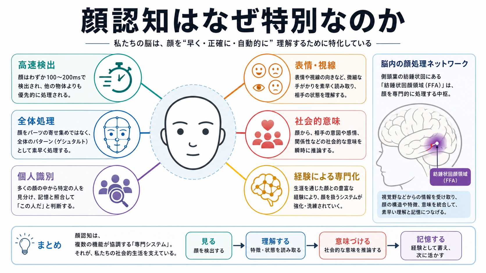
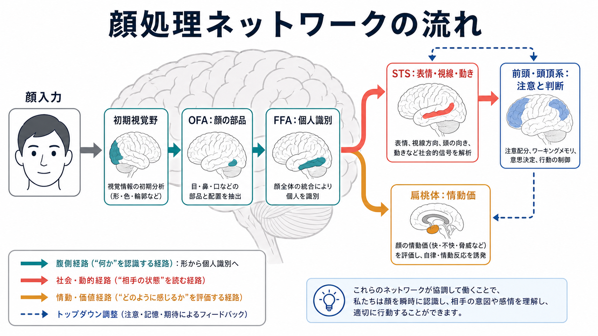
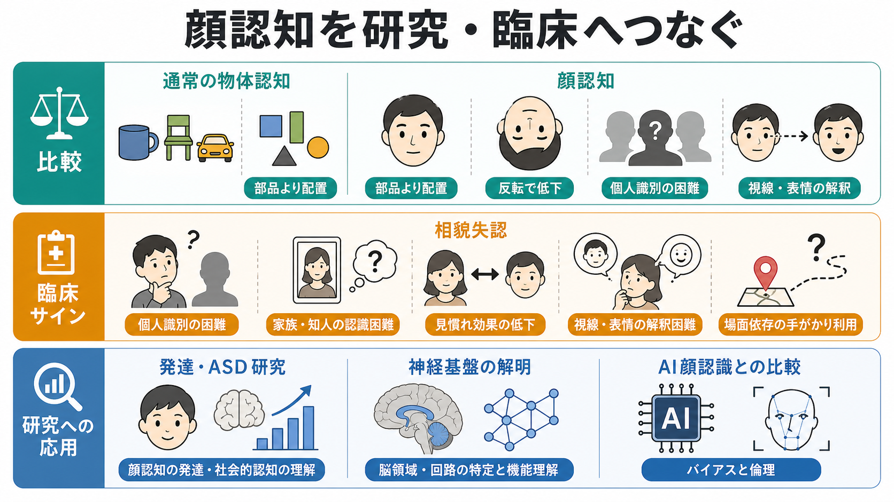

# 顔認知はなぜ特別なのか

## 要点

- 顔認知が「特別」と呼ばれるのは、顔だけを魔法のように処理するからではなく、個人識別、表情、視線、感情価、社会的意味を高速に統合する必要があるからである。
- 顔は部品の寄せ集めではなく、目・鼻・口の配置、距離、全体のまとまりとして処理されやすい。この全体処理・配置処理は、顔を上下反転すると大きく崩れる[5]。
- 紡錘状回顔領域（fusiform face area: FFA）は、物体より顔に強く反応する腹側視覚路の領域として報告され、顔の形態処理と個人識別に重要な役割をもつ[2]。
- ただし、顔認知は FFA だけで完結しない。後頭顔領域、上側頭溝、扁桃体、前頭・頭頂系などを含む分散ネットワークが、顔の不変的特徴と変化する社会的手がかりを分担する[3][4]。
- 相貌失認は、視力や一般知能だけでは説明できない顔識別の困難を示すため、顔認知が比較的独立した処理系をもつことを理解する重要な手がかりになる[8]。

## この記事で答える問い

1. なぜ顔は、椅子や車のような通常の物体とは違って処理されるように見えるのか。
2. FFA は「顔だけの領域」なのか、それともより広い専門的視覚処理の一部なのか。
3. 顔認知の研究は、相貌失認、ASD研究、AI顔認識の理解にどうつながるのか。

## まず結論

顔認知が特別なのは、顔が人間にとってきわめて高密度な社会的信号だからである。顔を見るだけで、私たちは「誰か」「どこを見ているか」「どんな感情か」「こちらに関係があるか」を短時間で推定する。古典的な認知モデルでは、顔から得られる情報は、構造、表情、発話、意味記憶、名前など複数のコードに分かれて処理されると考えられてきた[1]。

神経科学的には、顔処理は腹側視覚路の FFA を中心とする単一モジュールではなく、複数領域の協調として理解するほうがよい。FFA は顔に強く反応する重要なノードだが、視線や表情のような変化しやすい情報には上側頭溝、情動価には扁桃体、注意や判断には前頭・頭頂系が関わる[3][4]。

## 背景

人間は、膨大な視覚情報の中から顔をすばやく見つけ、似た顔どうしを区別し、表情や視線から相手の状態を読む。この能力は日常生活では自然に見えるが、計算課題としては難しい。同じ人物の顔でも、照明、角度、表情、髪型、年齢、部分的な隠れによって画像は大きく変わる。一方で、別人どうしの顔は物体カテゴリとしては非常に似ている。

この難しさは、顔認知が単なる「顔の検出」ではなく、個体識別と社会的意味づけを同時に行う課題であることに由来する。Bruce と Young のモデルは、顔から得られる情報を、表情、顔面発話、個人の意味情報、名前などに分け、顔認識が複数の下位処理からなることを明確にした[1]。

## 基本概念

### 顔検出と顔識別

顔検出は「これは顔である」と見つける処理であり、顔識別は「これは誰の顔か」を見分ける処理である。顔らしい配置は比較的すばやく検出されるが、個人識別には、目・鼻・口の細かな形、配置、顔全体の統合表象、記憶との照合が必要になる。

### 全体処理と配置処理

顔認知では、目や口などの部品だけでなく、それらの相対的位置や顔全体のまとまりが重要になる。配置処理には、顔の基本的な部品関係を検出する処理、部品をひとつのゲシュタルトとしてまとめる全体処理、部品間距離の微妙な違いを読む処理が含まれる[5]。顔を上下反転すると認識が大きく落ちる顔反転効果は、この全体処理が姿勢に敏感であることを示す代表的な現象である。

### FFA

FFA は、fMRI研究で、一般物体よりも顔に強く応答する紡錘状回近傍の領域として同定された[2]。この発見は、顔処理が腹側視覚路の中で部分的に専門化しているという見方を強めた。ただし、FFAを「顔だけを処理する箱」と考えると単純化しすぎである。後続研究では、FFA は顔の個人識別だけでなく、顔の変化しうる側面や経験による専門化とも関係する可能性が議論されている[4][7]。

## 仕組み

顔処理ネットワークは、大まかには次のように分担して働く。

- 初期視覚野は、輝度、輪郭、空間周波数などの基本的特徴を処理する。
- 後頭顔領域（occipital face area: OFA）は、顔の部品や局所的形態の分析に関わる。
- FFA は、顔全体の形態表象と個人識別に関わる。
- 上側頭溝（superior temporal sulcus: STS）は、視線、表情、頭部運動、口の動きなど、変化しやすい社会的信号に関わる。
- 扁桃体や報酬系は、顔の情動価、脅威性、親しみやすさなどの評価に関わる。
- 前頭・頭頂系は、注意、作業記憶、課題要求、社会的判断を通じて顔処理を調整する。

Haxby らの分散モデルは、不変的側面、つまり個人識別に役立つ構造情報と、変化する側面、つまり表情・視線・発話運動などの社会的情報を分けて考える枠組みを示した[3]。その後の改訂モデルでは、顔選択的領域への入力経路、時間特性、動的顔への反応、前方側頭部の顔選択領域などが加えられ、腹側経路と背側・社会的経路の相互作用がより重視されている[4]。

## 図解

上の図では、顔入力が初期視覚野から OFA、FFA へ進む腹側経路と、STS や扁桃体を含む社会的・情動的経路へ分かれていく様子を示している。重要なのは、これらが一方向に流れるだけではない点である。注意、記憶、期待、文脈は、前頭・頭頂系を通じて顔処理を調整する。たとえば、混雑した場所で友人を探すときには、顔の視覚特徴だけでなく、場所、服装、声、状況の予測も使われる。

## 臨床・研究との接続

相貌失認では、顔による個人識別が選択的に困難になる。後天性相貌失認の研究では、両側の後頭側頭病変、とくに紡錘状回を含む病変で有名人の顔の親近性判断が強く障害され、右紡錘状回を含む病変では顔の構造配置の知覚にも問題が生じやすいことが示されている[8]。これは、顔認知が一般的な視覚能力だけでは説明できない比較的専門化した処理系に依存することを示す。

一方で、顔認知の特別性は「顔だけが生得的で、経験は関係ない」という意味ではない。Greeble と呼ばれる人工物体を用いた専門性研究は、類似した個体を見分ける経験によって、顔に似た全体処理や専門的処理が生じうることを示した[7]。そのため、顔認知は、生得的制約、発達、経験、社会的必要性が重なって形成される専門システムとして捉えるのが妥当である。

ASD研究では、顔や視線、表情への注意の向け方、社会的手がかりの使い方が重要な論点になる。ただし、顔認知の違いをそのまま個人の社会性や能力の説明に直結させることはできない。臨床的には、顔認知の困難は、視覚認知、注意、記憶、不安、社会経験、環境調整などと合わせて評価する必要がある。

## よくある誤解

### 誤解1: FFA があるなら、顔認知は FFA だけで説明できる

FFA は重要な領域だが、顔認知全体の一部である。視線、表情、情動価、注意、記憶、文脈を含めると、顔処理は分散ネットワークとして理解する必要がある[3][4]。

### 誤解2: 顔認知は完全に生得的で、経験は関係ない

顔に対する早期からの感受性は重要だが、発達と経験も大きい。全体処理や専門的識別は、発達の中で洗練され、他カテゴリの専門性研究からも経験依存的な側面が示唆される[5][7]。

### 誤解3: 顔が苦手なら相貌失認である

顔の記憶が苦手な理由はさまざまである。注意、視力、記憶、社会不安、関心、文化的経験、環境条件も影響する。相貌失認は教育・研究上重要な概念だが、個別の診断や治療判断は専門的評価に基づく必要がある。

### 誤解4: 顔認知研究はAI顔認識と同じ問題を扱っている

重なる部分はあるが、目的が異なる。人間の顔認知は、個人識別だけでなく、感情、視線、関係性、社会的文脈を含む。AI顔認識では、性能だけでなく、プライバシー、バイアス、誤認、監視利用の倫理も問題になる。

## 関連ノート

- [[視覚ネットワークはどのように階層的に情報処理するのか]]
- [[fMRIは神経活動を直接測っているのか]]
- [[MEGはEEGと何が違うのか]]
- [[選択的注意はどのように働くのか]]
- [[持続的注意とは何か]]
- [[ワーキングメモリ容量はなぜ限られているのか]]

## MOC更新候補

- [[MOC｜認知科学・心理学]]
- [[MOC｜脳・神経科学]]

並列ジョブとの競合を避けるため、この作業ではMOC本体は更新していない。

## 理解チェック

1. 顔認知で「全体処理」が重要だと言われるのは、どのような意味か。
2. FFA は顔認知のどの側面に関わると考えられるか。
3. Haxby らの分散モデルでは、顔の不変的側面と変化する側面はどのように区別されるか。
4. 相貌失認が、顔認知の専門性を考えるうえで重要なのはなぜか。
5. 顔認知の特別性を、生得性だけで説明すると何が抜け落ちるか。

## 未解決問題

- FFA の役割は、顔カテゴリに特化した処理なのか、類似した個体を識別する専門性一般なのか。
- 動的な顔、自然会話、視線共有のような日常場面で、実験室課題の知見はどこまで一般化できるか。
- 顔認知の個人差は、遺伝、発達経験、社会的関心、注意制御、文化差によってどのように形成されるか。
- AI顔認識との比較は、人間の顔認知を理解する助けになる一方で、どのような倫理的リスクを生むか。

## 参考文献

[1] Bruce, V., & Young, A. (1986). Understanding face recognition. *British Journal of Psychology, 77*(3), 305-327. https://doi.org/10.1111/j.2044-8295.1986.tb02199.x

[2] Kanwisher, N., McDermott, J., & Chun, M. M. (1997). The fusiform face area: A module in human extrastriate cortex specialized for face perception. *Journal of Neuroscience, 17*(11), 4302-4311. https://doi.org/10.1523/JNEUROSCI.17-11-04302.1997

[3] Haxby, J. V., Hoffman, E. A., & Gobbini, M. I. (2000). The distributed human neural system for face perception. *Trends in Cognitive Sciences, 4*(6), 223-233. https://doi.org/10.1016/S1364-6613(00)01482-0

[4] Duchaine, B., & Yovel, G. (2015). A revised neural framework for face processing. *Annual Review of Vision Science, 1*, 393-416. https://doi.org/10.1146/annurev-vision-082114-035518

[5] Maurer, D., Le Grand, R., & Mondloch, C. J. (2002). The many faces of configural processing. *Trends in Cognitive Sciences, 6*(6), 255-260. https://doi.org/10.1016/S1364-6613(02)01903-4

[6] Bentin, S., Allison, T., Puce, A., Perez, E., & McCarthy, G. (1996). Electrophysiological studies of face perception in humans. *Journal of Cognitive Neuroscience, 8*(6), 551-565. https://doi.org/10.1162/jocn.1996.8.6.551

[7] Gauthier, I., & Tarr, M. J. (1997). Becoming a “Greeble” expert: Exploring mechanisms for face recognition. *Vision Research, 37*(12), 1673-1682. https://doi.org/10.1016/S0042-6989(96)00286-6

[8] Barton, J. J. S. (2008). Structure and function in acquired prosopagnosia: Lessons from a series of 10 patients with brain damage. *Journal of Neuropsychology, 2*(1), 197-225. https://doi.org/10.1348/174866407X214172
