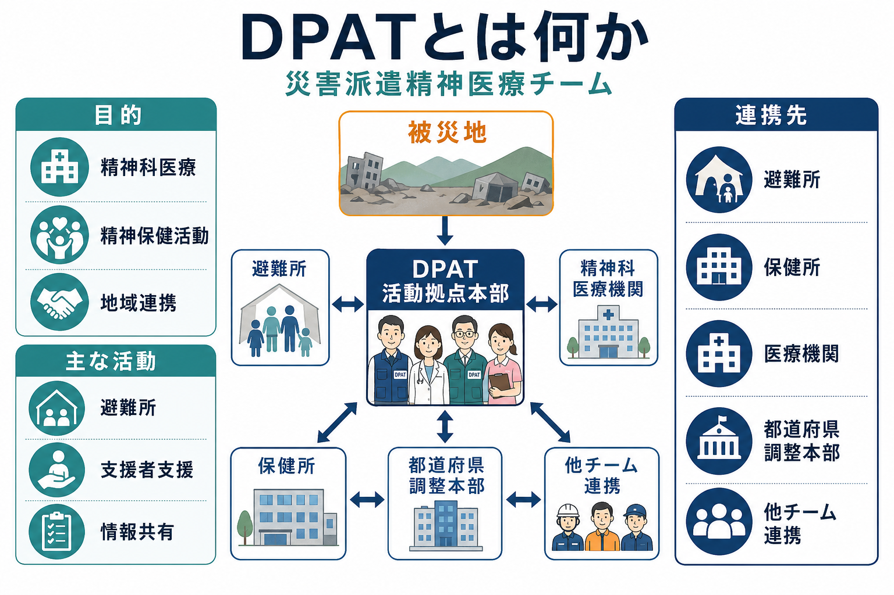
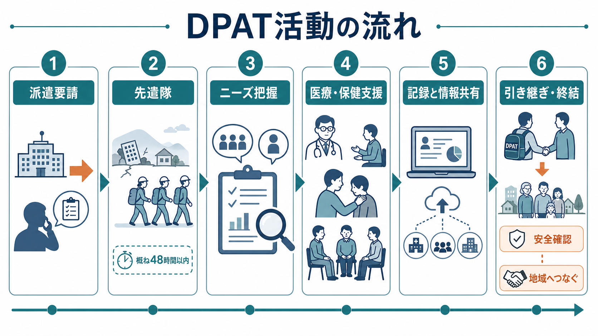
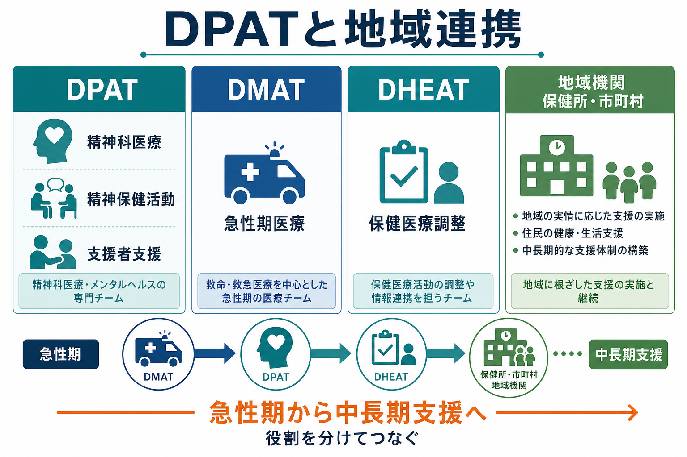

# DPATとは何か

## 要点

- DPAT（Disaster Psychiatric Assistance Team）は、自然災害、事故、犯罪事件などの集団災害後に、被災地域で精神科医療と精神保健活動を支援する専門チームである[1][2]。
- 中心的な役割は、被災地域の精神保健医療ニーズを把握し、既存の精神科医療機関・保健所・避難所・自治体・他の災害医療チームをつなぎながら、専門性の高い支援を補完することである[1][2]。
- 発災直後から活動できる日本DPATは、本部機能の立ち上げ、ニーズアセスメント、急性期の精神科医療ニーズへの対応を担う[2]。
- DPATは「こころのケアを全部引き受ける部隊」ではない。地域の支援者が中長期に支援を続けられるよう、記録、情報共有、引き継ぎ、支援者支援を行う仕組みである[2][3]。
- 医療・精神医学に関する本記事は教育・研究目的の整理であり、個別の診断、治療、派遣判断を指示するものではない。

## この記事で答える問い

1. DPATは、災害時の精神保健医療の中で何を担うのか。
2. 日本DPAT、都道府県等DPAT、活動拠点本部はどのように関係するのか。
3. DPATの活動は、避難所、精神科医療機関、保健所、市町村、他の災害支援チームとどうつながるのか。
4. DPATを理解するとき、どのような誤解を避けるべきか。

## まず結論

DPATとは、災害によって一時的に弱くなった地域の精神保健医療機能を、外から「置き換える」のではなく、急性期から中長期への橋渡しとして補完するチームである。被災地では、既存の精神科医療機関が被災し、通院・服薬・入院医療が途切れ、避難生活や喪失体験によって新たな精神的問題も増える。DPATはこの状況で、精神科医療、精神保健活動、情報収集、調整、支援者支援を組み合わせ、地域の支援体制へ段階的に引き継ぐ[1][2]。

## 背景

災害時のメンタルヘルス支援では、個人の症状だけでなく、住まい、家族、医療継続、薬、避難所環境、地域の支援者の疲弊、情報の断絶が同時に問題になる。IASCの災害時メンタルヘルス・心理社会的支援（MHPSS）ガイドラインも、精神保健は専門家だけの領域ではなく、保健医療、保護、人権、教育、住まい、地域支援などの多部門連携として扱う必要があると整理している[5]。

日本のDPATは、この多部門連携の中で、精神科医療と精神保健活動に専門性を持つチームとして位置づく。DPAT事務局の説明では、DPATは都道府県等によって組織され、専門的な研修・訓練を受けたチームであり、被災地域の精神保健医療ニーズの把握、他の保健医療体制との連携、関係機関とのマネジメント、精神科医療の提供と精神保健活動の支援を行う[1]。

## 基本概念

### DPAT

DPATは、各都道府県等が継続して派遣する災害派遣精神医療チームの総称である。チームは精神科医師、看護師、業務調整員を基本に、ニーズに応じて薬剤師、保健師、精神保健福祉士、公認心理師、児童精神科医などを含むことがある[1][2]。

ここで重要なのは、DPATが「精神科の出張外来」だけではない点である。避難所や在宅の精神疾患をもつ人への医療継続、新たに生じた精神的問題への対応、被災した精神科医療機関の支援、支援者支援、普及啓発、活動記録、引き継ぎまでを含む[2]。この意味で、DPATは[[地域移行支援とは何か]]や[[精神科リハビリテーションとは何か]]と同じく、医療を地域生活の支援網へ接続する発想と近い。

### 日本DPAT

2025年版のDPAT活動マニュアルでは、発災当日から遅くとも48時間以内に、所属都道府県外の被災地域でも活動できる隊を日本DPATとし、本部機能の立ち上げ、ニーズアセスメント、急性期の精神科医療ニーズ対応を主な役割としている[2]。初動で重要なのは、多数の個別相談を抱え込むことではなく、どこにどの程度のニーズがあり、どの機関が動けていて、何を優先すべきかを可視化することである。

### 精神科医療と精神保健活動

精神科医療は、急性精神症状、服薬中断、入院・外来継続、精神科救急、被災した医療機関の支援などに関わる。一方、精神保健活動は、避難生活での不眠・不安・喪失反応への支援、相談体制、心理教育、ハイリスク者の把握、支援者支援などを含む。両者は分けて考える必要があるが、現場では重なり合う。たとえば[[自殺対策基本法とは何か]]で扱うような自殺リスクへの配慮は、医療評価だけでなく、孤立、生活再建、相談先、支援者間の情報共有と結びつく。

## 仕組み

DPATは、原則として被災都道府県等からの派遣要請に基づき、被災地の災害対策本部や保健医療福祉調整本部の指揮調整のもとで活動する[1][4]。現地では、災害拠点病院、災害拠点精神科病院、保健所、避難所などに設置されるDPAT活動拠点本部へ参集し、その調整下で活動する[1][2]。

実務上の流れは、おおむね次のように整理できる。

1. 派遣要請と安全確認  
   被災都道府県等の要請、交通・通信・宿泊・安全状況を確認し、活動可能性を判断する。

2. 先遣隊・日本DPATによる初動  
   本部機能を立ち上げ、被災地域の精神科医療機関、避難所、医療救護所などの状況を把握する[2]。

3. ニーズアセスメント  
   精神科医療の継続困難、薬の不足、入院患者の避難、避難所での相談ニーズ、支援者の疲弊などを整理する。

4. 精神科医療・精神保健活動  
   医療機関支援、避難所・在宅での相談、一般住民への対応、支援者支援、普及啓発を行う[2]。

5. 記録と情報共有  
   災害診療記録や精神保健医療版の記録を用い、活動内容とアセスメントを共有できる形で残す[4]。

6. 引き継ぎと終結  
   医療機関、保健所、市町村、精神保健福祉センター、地域支援者へ段階的に引き継ぎ、DPAT活動を終結する[2][3]。

## 図解

DPATを図で理解するなら、「急性期医療チーム」と「中長期の地域支援」のあいだにある精神保健医療の調整装置として見るとよい。DMATが救命・救急医療を中心に担い、DHEATが保健医療調整の支援を担うのに対し、DPATは精神科医療、精神保健活動、支援者支援に焦点を置く[1][2][4]。ただし、現場では役割が完全に分離するわけではない。避難所、保健所、市町村、精神保健福祉センター、医療機関が同じ情報を見ながら、急性期から中長期支援へつなぐことが重要になる。

## 臨床・研究との接続

臨床では、DPATは「診断名」よりも「支援が途切れる危険」を重視する。たとえば統合失調症や双極性障害の外来通院が途切れる、抗精神病薬や気分安定薬がなくなる、避難所で不眠と興奮が強まる、家族と連絡が取れない、入院患者の転院先が決まらない、といった状況では、医療継続と生活支援を同時に見なければならない。[[医療保護入院とは何か]]や[[措置入院とは何か]]で扱う制度的判断が必要になる場合でも、災害下では安全、本人の意思、家族・地域資源、搬送可能性、医療機関の受け入れ状況が複雑に絡む。

研究上は、DPATの有効性を単純な「派遣数」や「相談件数」だけで評価するのは不十分である。見るべき指標には、精神科医療の中断防止、支援者の負担軽減、避難所・在宅のハイリスク者把握、医療機関間の患者移送、記録の継続性、終結後の地域フォローアップ、住民の相談アクセスなどが含まれる。自治体向けの災害時精神保健医療福祉活動マニュアルも、準備期から中長期・長期まで、支援体制、人材育成、フォローアップ、平時業務への移行を含めて整理している[3]。

また、WHOの心理的応急処置（PFA）は、危機後の人に対して、人道的・支持的・実際的な援助を行い、尊厳、文化、能力を尊重する枠組みを示している[6]。DPATの活動でも、被災者に詳しい体験を無理に語らせるのではなく、安全、基本的ニーズ、情報、社会的支援、必要時の専門支援につなぐ姿勢が重要である。この点は、[[意思決定支援とは何か]]の「本人の意思を支援の中心に置く」考え方とも接続する。

## よくある誤解

### 誤解1: DPATは被災者全員にカウンセリングをするチームである

DPATは個別相談も行うが、全員へのカウンセリング提供を目的とするわけではない。むしろ、ニーズ把握、優先順位づけ、医療継続、地域支援者への引き継ぎを通じて、支援体制全体を機能させることが重要である[1][2]。

### 誤解2: 災害時の精神的反応はすぐ病名に分類すべきである

災害後の不眠、不安、涙もろさ、怒り、ぼんやりする感じは、異常な出来事への自然な反応として生じることがある。もちろん、精神疾患の悪化、自殺リスク、せん妄、物質使用、暴力被害、虐待、重度の解離や精神病症状などには専門的評価が必要である。大切なのは、正常反応を過度に病理化せず、必要な人を見逃さないことである[5][6]。

### 誤解3: DPATが来れば地域の精神保健医療は置き換えられる

DPATは外部支援であり、地域の保健所、市町村、精神保健福祉センター、精神科医療機関、福祉サービスの代替ではない。終結時には、情報と事例を地域へ引き継ぎ、中長期支援へ接続する必要がある[2][3]。

### 誤解4: 支援者支援は余裕があるときの追加活動である

支援者支援は、地域の支援体制を維持するための中核的活動である。自治体職員、保健師、医療従事者、救急隊員、福祉職は、自身も被災者でありながら支援を続けることがある。支援者の疲弊を見ないまま活動を拡大すると、住民支援の持続性が損なわれる[2][3]。

## 関連ノート

- [[精神保健福祉法とは何か]]
- [[地域移行支援とは何か]]
- [[精神科リハビリテーションとは何か]]
- [[医療保護入院とは何か]]
- [[措置入院とは何か]]
- [[自殺対策基本法とは何か]]
- [[意思決定支援とは何か]]

MOC更新候補: `content/00_MOC/` 配下の精神医学、地域精神医療、制度・司法精神医学関連MOCに、本記事 `[[DPATとは何か]]` を追加する。

## 理解チェック

1. DPATの役割を「個別カウンセリング」だけで説明すると、何が抜け落ちるか。
2. 日本DPATが初動で本部機能とニーズアセスメントを重視する理由は何か。
3. DPAT活動の終結時に、どの情報を誰へ引き継ぐ必要があるか。
4. 災害後の精神的反応を、過度に病理化せず、しかし重症例を見逃さないためには何を見るべきか。
5. 支援者支援が住民支援の質に影響する理由は何か。

## 参考文献

[1] DPAT事務局. DPATとは. https://www.dpat.jp/about.php

[2] DPAT事務局. *DPAT活動マニュアル Ver.3.1*. 2025. https://www.dpat.jp/images/dpat_documents/3_250410_c.pdf

[3] 厚生労働科学研究費補助金（障害者政策総合研究事業）. *自治体の災害時精神保健医療福祉活動マニュアル*. 2025. https://www.dpat.jp/images/Document/Document_Pmi6mA5fEj85QBhW_1.pdf

[4] 厚生労働省. 災害時の保健医療福祉活動. https://www.mhlw.go.jp/stf/newpage_71340.html

[5] Inter-Agency Standing Committee. *IASC Guidelines on Mental Health and Psychosocial Support in Emergency Settings*. 2007. https://www.who.int/publications-detail-redirect/iasc-guidelines-for-mental-health-and-psychosocial-support-in-emergency-settings

[6] World Health Organization, War Trauma Foundation, World Vision International. *Psychological first aid: Guide for field workers*. 2011. https://www.who.int/mental_health/publications/guide_field_workers/en/

## 未解決問題

- DPAT派遣の効果を、件数ではなく地域の精神保健医療機能の回復としてどう評価するか。
- 被災者の個人情報保護と、多機関連携のための情報共有をどう両立するか。
- 支援者支援を、災害急性期だけでなく中長期の自治体・医療機関運営にどう組み込むか。
- 児童、高齢者、障害者、外国人、孤立しやすい人へのアウトリーチを、地域の通常支援へどう引き継ぐか。
