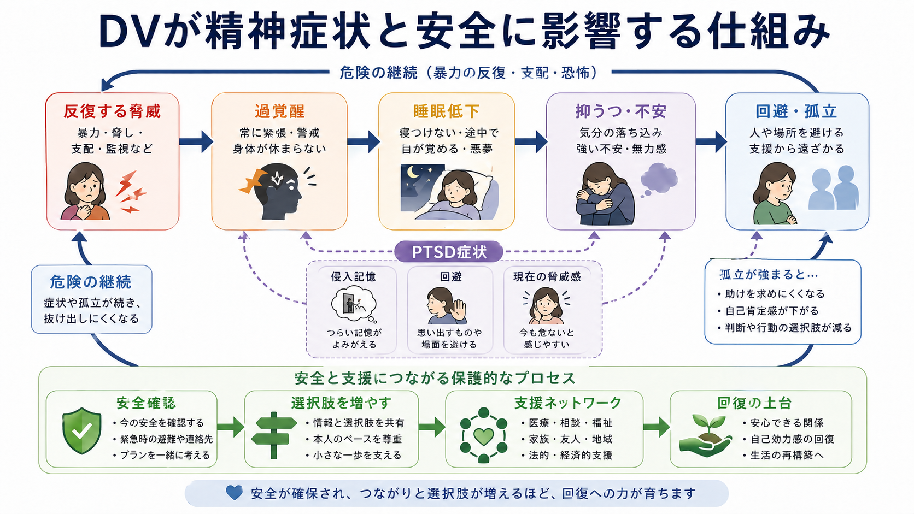
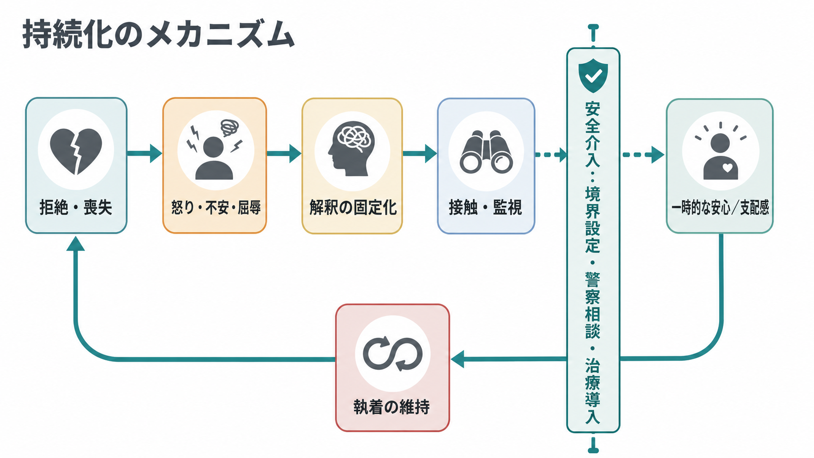
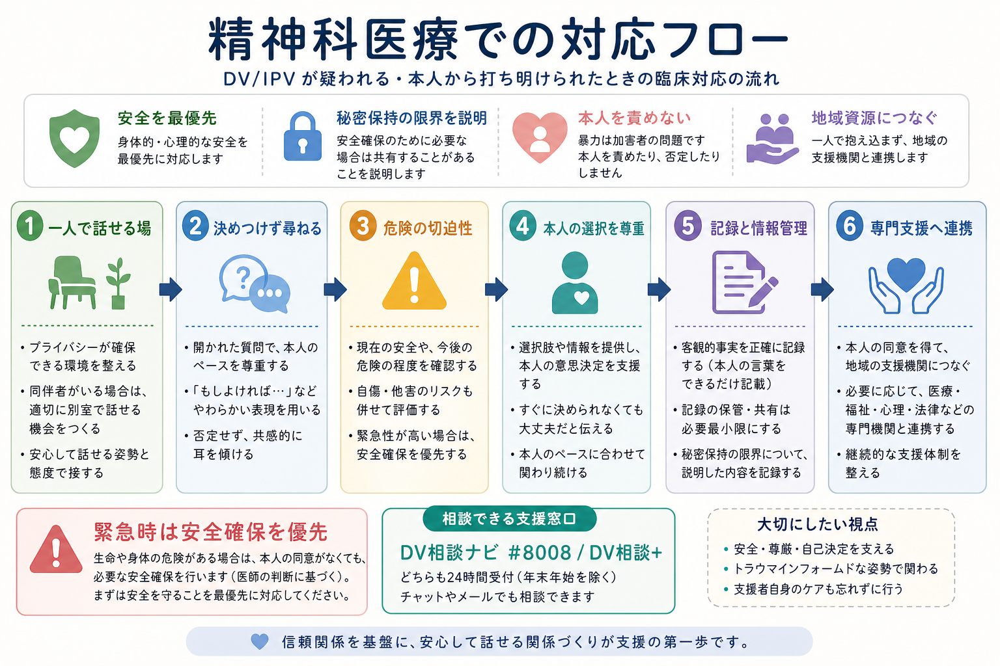

# DVと精神科医療はどう関係するのか

## 要点

- DV（domestic violence）や IPV（intimate partner violence）は、身体的暴力だけでなく、性的暴力、心理的暴力、威圧、監視、孤立化、経済的支配を含む。精神科では、診断名だけでなく「現在も危険が続いているか」を見る必要がある。
- DV は [[PTSDとは何か|PTSD]]、[[うつ病とは何か|うつ病]]、[[不安症群とは何か|不安症]]、睡眠障害、物質使用、自傷・自殺リスクと関連する。これは「本人の弱さ」ではなく、反復する脅威、回避、孤立、支配、支援アクセス低下が重なるためである[1][4][5]。
- 精神科医療の役割は、被害を証明することだけではない。安全確認、本人の選択の尊重、トラウマインフォームドな面接、客観的記録、地域資源への連携、継続的支援を組み合わせることにある[2][3][6]。
- 急性の危険があるときは、心理教育や症状説明より安全確保が優先される。日本では DV相談ナビ `#8008`、DV相談+、配偶者暴力相談支援センターなどの相談資源がある[8]。

## この記事で答える問い

1. DV/IPV は精神症状とどのように関係するのか。
2. 精神科面接では、何をどの順序で確認する必要があるのか。
3. 診断、治療、記録、地域連携はどのように接続されるのか。
4. よくある誤解は何か。

## まず結論

DV と精神科医療の関係を一言でいえば、「暴力が精神症状を生むことがある」だけでなく、「暴力が続く環境では、症状の評価、治療選択、安全確保、情報管理のすべてが変わる」という関係である。

たとえば、不眠、過覚醒、抑うつ、希死念慮、パニック様症状、身体症状、アルコール使用が前景に出ていても、その背後でパートナーからの監視、脅迫、経済的支配、外出制限、受診妨害が続いている場合がある。このとき、症状だけを個人内の問題として扱うと、危険を見落とし、本人の孤立を強める可能性がある。

一方で、DV を疑ったからといって、医療者が一方的に別居、通報、告訴、治療方針を決めてよいわけではない。WHO の臨床ガイドラインは、初期対応として、判断せずに聴く、ニーズと心配を尋ねる、安全性を高める、支援につなぐ、本人の経験を確認するという姿勢を重視する[2][3]。精神科ではこれを、[[精神科面接とは何か|精神科面接]]、[[自殺リスク評価では何を聞くべきか|自殺リスク評価]]、[[地域連携は精神科診療で何を意味するのか|地域連携]]と接続して考える。

## 背景

WHO は、親密なパートナーからの暴力を、女性の健康に影響する主要な公衆衛生・人権上の問題として位置づけている。世界規模の推計では、女性の約3人に1人が、生涯に身体的または性的なパートナー暴力、または非パートナーからの性的暴力を経験しているとされる[1]。この数字は国や調査方法により幅があるが、精神科診療で DV/IPV を「まれな特殊事情」と扱えないことを示している。

精神科医療で問題になるのは、DV が症状と生活機能の両方に影響する点である。DV は抑うつ、PTSD、不安、自殺企図、物質使用などと関連し、精神疾患をもつ人では暴力被害が見逃されやすいことも指摘されている[4][5]。さらに、加害者による監視や脅しがあると、予約を守れない、服薬を隠さざるをえない、オンライン診療で自由に話せない、支援機関への連絡履歴を見られるといった問題が起こる。

したがって、DV と精神科医療の接点は、診断分類だけではなく、面接環境、秘密保持、記録、連携、危機対応、治療継続の設計に広がる。

## 基本概念

### DV と IPV

DV は日本語では家庭内暴力として使われることが多いが、臨床・公衆衛生文献では、親密なパートナー間の暴力を IPV と呼ぶことが多い。ここには、現在または過去の配偶者、交際相手、同居・別居を問わない親密な関係が含まれる。

暴力の形は一つではない。

| 領域 | 例 | 精神科での意味 |
|---|---|---|
| 身体的暴力 | 殴る、蹴る、押さえつける、物を投げる | 身体損傷、恐怖、受診妨害、急性危険 |
| 性的暴力 | 同意のない性行為、避妊の妨害 | PTSD、羞恥、身体疾患、妊娠・感染症リスク |
| 心理的暴力 | 脅し、侮辱、無視、責任転嫁 | 抑うつ、不安、自己評価低下 |
| 支配・監視 | スマートフォン確認、外出制限、交友関係の遮断 | 孤立、支援アクセス低下、面接時の発話制限 |
| 経済的支配 | 生活費を渡さない、就労妨害、借金を負わせる | 逃げにくさ、治療継続困難、福祉連携の必要 |

### 精神症状として現れるもの

DV の影響は、単一の診断名にきれいに収まらない。[[精神疾患とトラウマ反応はどう関係するのか|トラウマ反応]]としては、侵入記憶、回避、過覚醒、解離、現在の脅威感が現れることがある。気分・不安症状としては、抑うつ気分、罪悪感、無力感、予期不安、パニック様症状が前景化することがある。睡眠障害、疼痛、消化器症状、慢性疲労のような身体症状として相談されることもある[1][4][5]。

ここで大切なのは、症状を「DV の証拠」として短絡しないことである。症状には複数の原因があり、DV があっても PTSD になるとは限らない。一方で、DV の文脈を無視すると、症状を本人の性格、認知の歪み、服薬不遵守だけに帰してしまう危険がある。

## 仕組み

DV が精神症状を保つ仕組みは、反復する脅威と支配により、身体、注意、記憶、対人行動、社会資源へのアクセスが同時に変化することとして理解できる。

1. **脅威が続く。**  
   本人にとって危険が過去の出来事ではなく、現在も起こりうるものになる。これにより、警戒、睡眠の浅さ、音や通知への過敏さ、身体緊張が続く。

2. **回避と孤立が強まる。**  
   怒らせないように話題や行動を避ける、外出を控える、友人や家族に相談しなくなる。これは短期的には危険を下げる工夫でも、長期的には支援への接続を弱める。

3. **自己評価と意思決定が揺らぐ。**  
   侮辱や責任転嫁が続くと、「自分が悪い」「相談しても信じてもらえない」という理解が固定化しやすい。これは抑うつや希死念慮と結びつくことがある[4][5]。

4. **治療へのアクセスが制限される。**  
   通院費、交通、スマートフォン、保険証、診察同席、服薬の管理などが支配されると、精神科治療そのものが安全でなくなる場合がある。

## 図解

図1は、DV が精神症状と安全に影響する循環を示している。反復する脅威が過覚醒、睡眠低下、抑うつ・不安、回避・孤立へつながり、孤立が強まるほど危険から抜け出しにくくなる。これは確定した単線的因果ではなく、臨床で見落としやすい維持要因を整理するための枠組みである。

図2は、怒り、不安、屈辱、解釈の固定化、接触・監視、執着の維持という持続化の流れを模式化している。実際の DV では、加害者側の行動、被害者側の安全行動、制度的・経済的制約が複雑に絡むため、単に「離れればよい」とは言えない。

図3は、精神科医療での対応フローである。医療者が最初に行うべきことは、本人を説得することではなく、一人で話せる環境を整え、決めつけずに尋ね、切迫した危険を確認し、本人の選択とペースを尊重しながら、必要時に専門支援へつなぐことである[2][3][6]。

## 臨床・研究との接続

### 1. 面接環境を整える

DV の評価では、誰が同席しているかが重要である。パートナー、家族、通訳、支援者が同席している場で、本人が自由に話せるとは限らない。NICE は、医療・福祉・地域機関が DV を見逃さない体制を整え、職員研修、秘密保持、安全な紹介経路を用意することを推奨している[6]。

精神科では、初診票にチェック項目を置くだけでは不十分である。スマートフォンの通知、オンライン診療の画面外にいる人、診察後に記録や明細を見られる可能性も含めて、安全な聞き方を考える必要がある。

### 2. 決めつけずに尋ねる

WHO の臨床ハンドブックは、本人が暴力を打ち明けたときの初期対応として、傾聴、ニーズ確認、経験の妥当化、安全性確認、支援接続を重視する[3]。精神科面接では、次のような聞き方が使いやすい。

- 「最近、家で安心して過ごせていますか。」
- 「誰かに行動や連絡先を強く制限されている感じはありますか。」
- 「診察で話した内容を、誰かに知られると危険になることはありますか。」
- 「今夜帰る場所は安全ですか。」

これらは診断を決める質問ではなく、安全と支援ニーズを確認する質問である。

### 3. 自殺・自傷リスクと安全を同時に見る

DV と希死念慮が重なる場合、通常の [[自殺リスク評価では何を聞くべきか|自殺リスク評価]] に加えて、加害者からの脅迫、別離時の危険、武器へのアクセス、子どもや同居家族の安全、避難先、連絡手段、受診後の移動経路を確認する。危険が切迫している場合は、通常の外来治療計画より安全確保が優先される。

ただし、本人の意思を無視した介入は、新たな危険を生むことがある。加害者に相談内容が知られる、避難計画が露見する、通院が禁止されるといったリスクがあるため、情報共有は最小限・目的限定で行う必要がある[2][3]。

### 4. 記録は支援にも危険にもなりうる

診療録は、後の支援、紹介、法的手続きで重要な資料になることがある。一方で、本人や加害者が閲覧できる形の記録、紹介状、明細、服薬袋、予約通知が危険を高める場合もある。[[診療録は精神科でどう書くべきか|診療録]]では、本人の言葉、観察された所見、損傷や心理状態、安全確認の内容、説明した選択肢、同意の有無を区別して記載する。

### 5. 薬物療法・心理療法だけで完結しない

抑うつ、不安、不眠、PTSD 症状への薬物療法や心理療法は役立つことがある。しかし、暴力と支配が続く環境で、薬物療法だけを強化しても十分でない場合がある。トラウマ焦点化治療も、現在の安全、生活の安定、支援資源、治療中断リスクを見ながら時期と強度を考える必要がある。

USPSTF は、妊娠中・産後を含む生殖年齢の女性に対する IPV スクリーニングと、陽性時の継続的支援サービスへの紹介を推奨している[7]。ここで重要なのは、スクリーニング単独ではなく、相談、支援、危険評価、制度利用を含む後続支援につなげる点である。

## よくある誤解

### 「DV があるなら、すぐ別れればよい」

これは危険な単純化である。別離や別居の時期は危険が高まることがあり、住居、子ども、経済、在留資格、障害、職場、親族関係、加害者の監視が絡む。精神科医療では、本人の判断を急がせるより、安全な選択肢を増やす支援が重要である。

### 「精神症状がある人の話は信頼できない」

精神症状があることは、暴力被害の訴えを否定する理由にならない。PTSD、抑うつ、不安、解離、物質使用があると語りが断片的になることはあるが、それは被害が存在しないことを意味しない。医療者は、診断名と事実確認を混同せず、本人の安全と支援ニーズを評価する。

### 「加害者にも精神疾患があるなら仕方ない」

精神疾患は暴力を正当化しない。精神症状、物質使用、衝動性、嫉妬妄想、発達特性などが関与する場合でも、被害者の安全確保と責任の所在を曖昧にしないことが必要である。[[精神疾患と暴力リスクはどう関係するのか|暴力リスク]]は診断名だけでは決まらず、過去の暴力、物質使用、支配行動、武器、別離、社会的孤立などの文脈で評価する。

### 「医療者が通報すれば解決する」

通報や法的介入が必要な場面はあるが、すべてのケースで一律に解決策になるわけではない。本人の安全、子どもや高齢者・障害者への虐待リスク、法的義務、地域制度、本人の同意、情報漏洩リスクを分けて検討する必要がある[6][8]。

## 関連ノート

- [[PTSDとは何か]]
- [[複雑性PTSDとは何か]]
- [[トラウマ歴はどのように聞くべきか]]
- [[精神疾患とトラウマ反応はどう関係するのか]]
- [[うつ病とは何か]]
- [[不安症群とは何か]]
- [[自殺リスク評価では何を聞くべきか]]
- [[地域連携は精神科診療で何を意味するのか]]
- [[診療録は精神科でどう書くべきか]]
- [[司法精神医学とは何か]]

### MOC更新候補

- `content/00_MOC/` 配下の「司法・制度・地域精神医療」または「総論・診断・面接」系 MOC があれば、本記事へのリンク追加候補。
- 並列ジョブとの競合を避けるため、本タスクでは MOC 本体は更新しない。

### 今後の作成候補

- DV相談支援と精神科医療
- 性暴力被害と精神科診療
- 加害者プログラムと精神医療
- 別離時リスクとは何か

## 理解チェック

1. DV/IPV には、身体的暴力以外にどのような支配行動が含まれるか。
2. DV があるとき、精神症状だけでなく「現在の安全」を確認する必要があるのはなぜか。
3. 本人の同意や選択を無視した介入が、かえって危険を高める可能性があるのはどのような場合か。
4. 診療録には、本人の発言、医療者の観察、医療者の判断をどのように分けて書くべきか。
5. 精神科医療が単独で完結せず、地域資源との連携が必要になる理由は何か。

## 未解決問題

- DV/IPV のスクリーニングを、過剰な介入や情報漏洩を避けながら、どの診療場面で標準化するのがよいか。
- 精神疾患をもつ被害者への支援で、治療継続、住居、経済支援、法的支援をどの順序で組み合わせると安全性が高まるか。
- 男性、性的マイノリティ、高齢者、障害者、外国籍者、妊娠・産後の人への DV/IPV 支援を、既存制度にどう組み込むか。
- 加害者の精神症状や物質使用を評価しつつ、暴力の責任と被害者の安全を曖昧にしない臨床モデルをどう作るか。

## 参考文献

[1] World Health Organization. (2021). *Violence against women prevalence estimates, 2018: global, regional and national prevalence estimates for intimate partner violence against women and global and regional prevalence estimates for non-partner sexual violence against women.* https://www.who.int/publications/i/item/9789240022256

[2] World Health Organization. (2013). *Responding to intimate partner violence and sexual violence against women: WHO clinical and policy guidelines.* https://www.who.int/publications/i/item/9789241548595

[3] World Health Organization. (2014). *Health care for women subjected to intimate partner violence or sexual violence: a clinical handbook.* https://www.who.int/publications/i/item/WHO-RHR-14.26

[4] Oram, S., Fisher, H. L., Minnis, H., Seedat, S., Walby, S., Hegarty, K., Rouf, K., Angénieux, C., Callard, F., Chandra, P. S., Fazel, S., Garcia-Moreno, C., Henderson, M., Howarth, E., MacMillan, H. L., Murray, L. K., Othman, S., Robotham, D., Rondon, M. B., Sweeney, A., Taggart, D., & Howard, L. M. (2022). The Lancet Psychiatry Commission on intimate partner violence and mental health: advancing mental health services, research, and policy. *The Lancet Psychiatry, 9*(6), 487-524. https://doi.org/10.1016/S2215-0366(22)00008-6

[5] Devries, K. M., Mak, J. Y. T., Bacchus, L. J., Child, J. C., Falder, G., Petzold, M., Astbury, J., & Watts, C. H. (2013). Intimate partner violence and incident depressive symptoms and suicide attempts: a systematic review of longitudinal studies. *PLOS Medicine, 10*(5), e1001439. https://doi.org/10.1371/journal.pmed.1001439

[6] National Institute for Health and Care Excellence. (2014, updated). *Domestic violence and abuse: multi-agency working (Public health guideline PH50).* https://www.nice.org.uk/guidance/ph50

[7] US Preventive Services Task Force. (2025). *Intimate Partner Violence and Caregiver Abuse of Older or Vulnerable Adults: Screening.* https://www.uspreventiveservicestaskforce.org/uspstf/recommendation/intimate-partner-violence-and-abuse-of-elderly-and-vulnerable-adults-screening

[8] 内閣府男女共同参画局. (n.d.). *DV相談ナビ・DV相談+.* https://www.gender.go.jp/policy/no_violence/dv_navi/index.html
