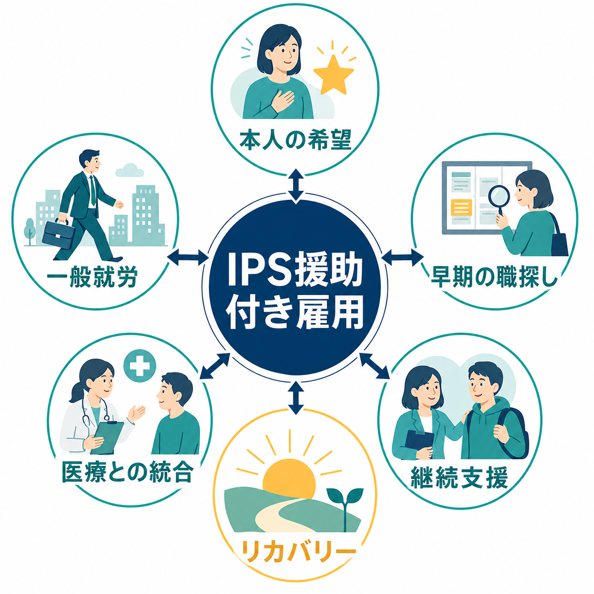
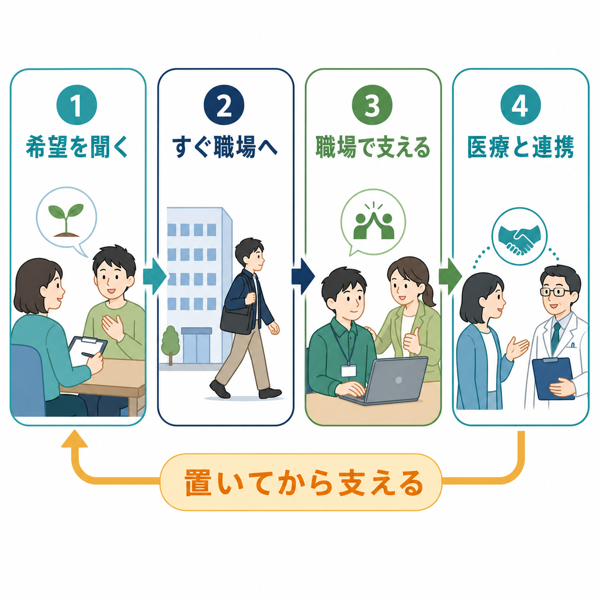
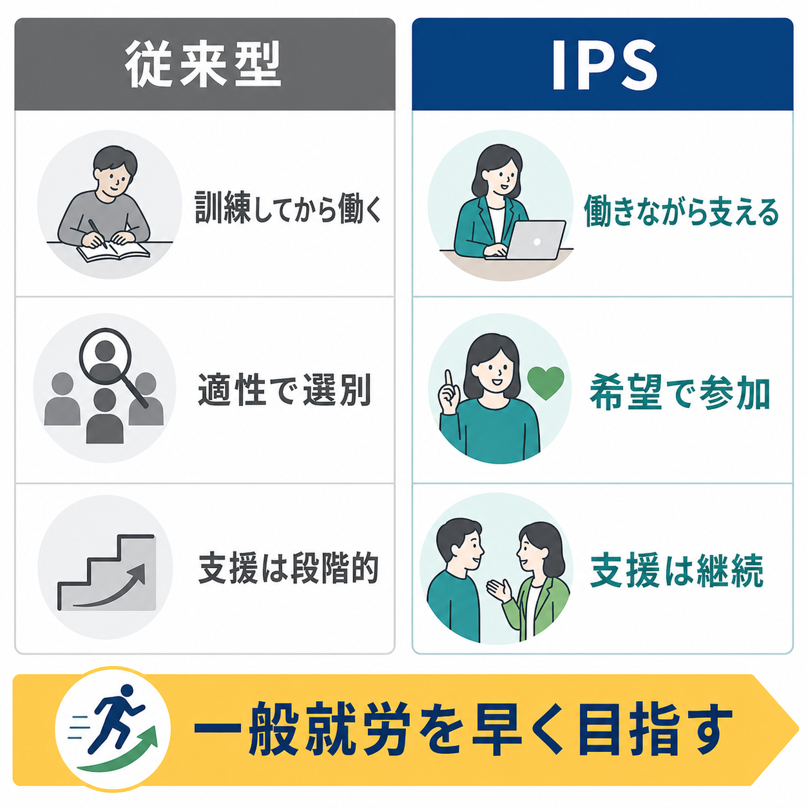

# IPS援助付き雇用とは何か

## 要点

- IPS援助付き雇用は、精神疾患やメンタルヘルス上の困難をもつ人が、本人の希望に基づいて一般就労を得て維持するための、エビデンスに基づく就労支援モデルである[1][2]。
- 中核は「訓練してから働く」ではなく「働く場に早く入り、働きながら支える」という考え方である[2][7]。
- 主要原則には、一般就労への焦点、本人の希望による参加、精神保健サービスとの統合、本人の好みの重視、福利厚生・社会保障の相談、迅速な求職、系統的な職場開発、期限を切らない個別支援が含まれる[2]。
- RCTのメタ解析では、通常支援に比べてIPS群の競争的雇用獲得が高いことが示されている一方、生活の質や精神症状など非就労アウトカムの効果は一貫して強くはない[3][4]。
- 日本では医療、障害福祉、職業リハビリテーション、雇用制度の役割分担が欧米と異なるため、IPS原則を守りつつ制度に合わせた実装とフィデリティ評価が課題になる[7][8]。

## この記事で答える問い

1. IPS援助付き雇用は、通常の就労支援や職業訓練と何が違うのか。
2. なぜ「早く一般就労を目指す」ことが支援として成立するのか。
3. どのような研究根拠があり、どこに限界があるのか。
4. 日本の地域精神医療・障害福祉の文脈では、何に注意して実装すべきか。

## まず結論

IPS援助付き雇用は、就労を治療や生活支援の「後」に置くモデルではない。本人が働きたいと希望するなら、診断名、症状の重さ、過去の失敗、就労準備性だけで排除せず、一般就労を目標に、求職活動を早く始め、就職後も本人・職場・医療生活支援チームをつないで支えるモデルである[1][2]。

ただし、IPSは「とにかく早く就職させる」方法ではない。早さは、本人の希望を軽視するためではなく、長い訓練や選別によって働く機会を失わせないためにある。臨床的には、[[意思決定支援とは何か]]と同じく、本人の価値観、希望、リスク、環境調整を具体化する支援として理解するとよい。

## 背景

精神疾患をもつ人の多くは、働く意欲や能力があっても、症状、偏見、職場調整の不足、医療・福祉・雇用サービスの分断、社会保障への不安によって就労から遠ざけられやすい。従来型の職業リハビリテーションでは、訓練、作業所、準備プログラム、段階的な移行を経てから一般就労へ進む発想が強かった。

IPSはこの順序を組み替える。重い精神障害をもつ人でも、本人が望む仕事に近い実際の職場で、必要な支援を受けながら働くことができるという前提に立つ。Cochraneレビューは、援助付き雇用が競争的雇用の日数や就職までの速さを改善しうるとまとめているが、根拠の質や非就労アウトカムには注意が必要だとしている[4]。

欧州6施設のEQOLISE試験でも、IPS群は通常の職業サービスより競争的雇用に就く割合が高かった。ただし、効果は地域の制度、労働市場、実装の質に左右されるため、単に名称だけを導入しても同じ結果になるとは限らない[5][6]。

## 基本概念

### IPSとは何か

IPSは Individual Placement and Support の略で、日本語では「個別型援助付き雇用」「個別就労支援プログラム」「IPS援助付き雇用」などと訳される。SAMHSAの2025年版ツールキットは、IPSを、精神疾患をもつ人が競争的で意味のある仕事を見つけ、維持するためのエビデンスに基づく援助付き雇用モデルとして整理している[1]。

ここでいう「競争的雇用」または「一般就労」とは、障害者専用に切り出された場だけではなく、地域の通常の労働市場で、他の労働者と同じように応募でき、少なくとも最低賃金以上の賃金が支払われる仕事を指す[2]。

### 8つの原則

IPS Employment Centerは、IPSの8原則を次のように整理している[2]。

| 原則 | 意味 |
|---|---|
| 一般就労への焦点 | ボランティアや保護的就労だけでなく、通常の労働市場での仕事を目標にする |
| 本人の希望による参加 | 症状、診断、過去の失敗、準備性だけで除外しない |
| 医療・生活支援との統合 | 就労支援専門職が精神保健チームと連携する |
| 本人の好みの重視 | 支援者の判断より、本人の希望、強み、関心を出発点にする |
| 福利厚生・社会保障の相談 | 働くことが給付、医療費、生活に与える影響をわかりやすく扱う |
| 迅速な求職 | 長い事前訓練より、早期に職場との接点をつくる |
| 系統的な職場開発 | 本人の希望に沿って雇用主との関係を継続的に開発する |
| 期限を切らない個別支援 | 就職後も本人が必要とする限り支援を調整する |

この原則の組み合わせが重要である。たとえば「迅速な求職」だけを取り出すと、急かす支援になりうる。しかし「本人の好み」「社会保障相談」「医療との統合」「継続支援」と結びつくことで、働く場に出た後も調整し続けるモデルになる。

## 仕組み

IPSの実践は、単線的なステップではなく、本人の希望、求職、職場開発、就職後支援、医療生活支援との連携を循環させる。

### 1. 希望と強みを聞く

最初に確認するのは、働けるかどうかの判定ではなく、本人がどのように働きたいかである。仕事内容、時間、通勤、職場環境、人との関わり、症状との相性、過去の経験、避けたい条件を具体化する。ここでは、本人の希望をそのまま放置するのではなく、実現可能な形に翻訳する支援が必要になる。

### 2. 早く職場との接点をつくる

IPSでは、長期の事前訓練を必須条件にせず、求職活動を早く始める。これは、準備を軽視するという意味ではない。準備を実際の職場、実際の応募、実際の働き方の中で行うという意味である[2]。

### 3. 職場開発を行う

就労支援専門職は、求人情報を渡すだけではなく、本人の希望に合う職場を探し、企業の業務や採用ニーズを理解し、本人と職場の接点をつくる。これは「障害を理由に特別扱いしてもらう」ことではなく、仕事内容、労働時間、コミュニケーション、配慮、業務習得の方法を具体化する作業である。

### 4. 就職後に支える

IPSの特徴は、就職をゴールにしない点にある。就職後に、症状の波、疲労、対人関係、服薬、生活リズム、金銭面、職場での相談の仕方を調整する。支援は時間で一律に打ち切られるのではなく、本人が必要とする限り個別化される[2]。

### 5. 医療・生活支援と統合する

精神科医療、訪問支援、相談支援、障害福祉サービス、職業リハビリテーションが分断されると、就労上の困難が「本人の問題」として扱われやすい。IPSでは、就労支援を治療や生活支援と切り離さず、本人の回復、生活、社会参加の一部として扱う[1][2]。

## 図解

従来型支援とIPSの違いは、「準備してから働く」か「働きながら支える」かの違いとして理解しやすい。ただし、IPSは準備を否定するのではなく、本人の希望に沿った現実の職場経験の中で準備と調整を行う。

| 観点 | 従来型になりやすい支援 | IPS援助付き雇用 |
|---|---|---|
| 参加条件 | 準備性、安定、訓練歴を重視しやすい | 働きたいという本人の希望を重視する |
| 目標 | 訓練、段階的移行、保護的場面 | 一般就労、競争的雇用 |
| 時間軸 | 訓練してから求職 | 早期に求職し、働きながら支える |
| 支援の焦点 | 本人の不足の改善 | 本人の希望、強み、職場環境の調整 |
| 医療との関係 | 就労支援と医療が分かれやすい | 就労支援と精神保健チームを統合する |
| 就職後 | 支援が終了しやすい | 定着・変更・再挑戦を継続支援する |

## 臨床・研究との接続

### 効果研究

2019年のRCTメタ解析では、IPSは通常支援に比べ、競争的雇用を得る割合を高め、就労期間、収入などの就労アウトカムにも有利な結果を示した。一方で、生活の質、全般機能、精神症状などの非就労アウトカムは、IPSに有利な方向ではあっても信頼区間がゼロを含むものがあり、効果を過大評価しない注意が必要である[3]。

Cochraneレビューも、援助付き雇用は就労関連アウトカムを改善しうるとしつつ、研究の質、地域差、長期効果、費用、精神症状、生活の質などには未解決の点が残ると整理している[4]。

### 実装研究

IPSは、原則への忠実度が重要な介入である。名称だけを導入しても、長い準備訓練、職場開発の不足、医療チームとの分断、就職後支援の短期終了があれば、IPSとしての効果は弱くなる。国際比較のレビューは、IPSが米国外にも一般化しうる一方で、制度、労働市場、福祉給付、サービス構造に合わせた実装が必要だと論じている[6]。

### 日本の地域精神医療との接続

日本では、欧米型の地域精神保健センターと同じ構造が一般的ではなく、医療機関、デイケア、就労移行支援、相談支援、ハローワーク、障害者職業センター、企業との役割分担が複雑である。NCNPの解説は、日本では職業紹介の権限や就労支援の提供場所が欧米と異なるため、IPS原則を保ちながら日本版フィデリティ尺度を検討してきたと説明している[8]。

したがって、日本でIPSを考えるときは、[[精神保健福祉法とは何か]]のような医療制度の理解だけでは足りない。障害福祉サービス、雇用政策、企業側の合理的配慮、社会保障相談、地域生活支援をつなぐ制度設計として見る必要がある。

## よくある誤解

### 誤解1: IPSは「症状が安定していない人を無理に働かせる」方法である

IPSは強制就労ではない。本人の希望に基づく参加が原則であり、症状や生活上のリスクを無視するものでもない。むしろ、症状、服薬、睡眠、通院、職場環境を含めて、働くことを生活支援の中に位置づける[1][2]。

### 誤解2: 事前訓練はすべて不要である

IPSは訓練を禁止するモデルではない。長期の訓練を就労の前提条件にしないモデルである。本人が資格取得、技術習得、面接練習、生活リズム調整を望む場合、それらは一般就労への道筋の中で個別に扱われる。

### 誤解3: 就職できれば成功である

就職は重要だが、IPSでは定着、再就職、仕事内容の変更、キャリア形成も支援対象になる。短期の就職件数だけを成果にすると、本人の希望や健康、職場との関係を見落とす。

### 誤解4: IPSは医療ではなく福祉・雇用だけの話である

IPSは医療行為そのものではないが、精神保健サービスとの統合を重視する。症状の変化、薬物療法、心理社会的支援、生活支援、危機対応と切り離すと、就労上の困難が孤立した問題になりやすい。

## 関連ノート

- [[意思決定支援とは何か]]
- [[精神保健福祉法とは何か]]

### 関連ノート候補

- 「リカバリーとは何か」
- 「精神障害者の就労支援とは何か」
- 「合理的配慮とは何か」
- 「就労移行支援とは何か」
- 「地域精神医療とは何か」
- 「ACTと地域生活支援とは何か」

### MOC更新候補

- `content/00_MOC/` 配下の精神医学、地域精神医療、臨床実践、社会福祉・制度関連MOCへの追加候補。
- 並列編集の競合を避けるため、本記事作成時点ではMOC本体は更新しない。

## 理解チェック

1. IPSでいう「一般就労」や「競争的雇用」は、保護的就労や訓練プログラムとどこが違うか。
2. 「迅速な求職」は、なぜ本人の希望を軽視することと同じではないのか。
3. IPSの8原則のうち、どれか一つだけを取り出すと、どのような誤解や実装上の失敗が起こりうるか。
4. 日本でIPSを実装するとき、医療機関、障害福祉、雇用サービス、企業のどの分断が問題になりやすいか。
5. IPSの効果を評価するとき、就職率以外にどのアウトカムを見るべきか。

## 未解決問題

- IPSの就労効果が、生活の質、症状、入院、孤立、自己効力感にどの程度波及するのかは、研究により一貫しない。
- 日本の制度下で、医療機関、就労移行支援、職業紹介、企業支援をどのように接続すればIPS原則に忠実な実装になるかは、地域差を含めて検討が必要である。
- 就職率だけでなく、本人の希望との一致、職場での尊厳、長期的なキャリア形成、再挑戦可能性をどう評価指標に入れるかが課題である。
- 若年者、早期精神病、発達特性、依存症、司法精神医療、ホームレス経験者など、対象集団ごとの適応と限界をさらに整理する必要がある。

## 参考文献

[1] Substance Abuse and Mental Health Services Administration. (2025). *Individual Placement and Support (IPS) - A Supported Employment Model*. https://library.samhsa.gov/product/individual-placement-and-support-ips-supported-employment-model/pep25-01-002

[2] The IPS Employment Center. (2024). *IPS Practice and Principles*. https://ipsworks.org/index.php/documents/ips-practice-and-principles/

[3] Frederick, D. E., & VanderWeele, T. J. (2019). Supported employment: Meta-analysis and review of randomized controlled trials of individual placement and support. *PLOS ONE*, 14(2), e0212208. https://doi.org/10.1371/journal.pone.0212208

[4] Kinoshita, Y., Furukawa, T. A., Kinoshita, K., Honyashiki, M., Omori, I. M., Marshall, M., Bond, G. R., Huxley, P., Amano, N., & Kingdon, D. (2013). Supported employment for adults with severe mental illness. *Cochrane Database of Systematic Reviews*, CD008297. https://doi.org/10.1002/14651858.CD008297.pub2

[5] Burns, T., Catty, J., Becker, T., Drake, R. E., Fioritti, A., Knapp, M., Lauber, C., Rössler, W., Tomov, T., van Busschbach, J., White, S., & Wiersma, D. (2007). The effectiveness of supported employment for people with severe mental illness: A randomised controlled trial. *The Lancet*, 370(9593), 1146-1152. https://doi.org/10.1016/S0140-6736(07)61516-5

[6] Bond, G. R., Drake, R. E., & Becker, D. R. (2012). Generalizability of the Individual Placement and Support (IPS) model of supported employment outside the US. *World Psychiatry*, 11(1), 32-39. https://doi.org/10.1016/j.wpsyc.2012.01.005

[7] 国立精神・神経医療研究センター こころとくらし. 援助付き雇用／個別就労支援プログラム. https://cocokura.ncnp.go.jp/work/technique-ips/

[8] 国立精神・神経医療研究センター 精神保健研究所 地域精神保健・法制度研究部. IPS/日本版個別型援助付き雇用フィデリティ調査. https://www.ncnp.go.jp/nimh/chiiki/research/05.html
