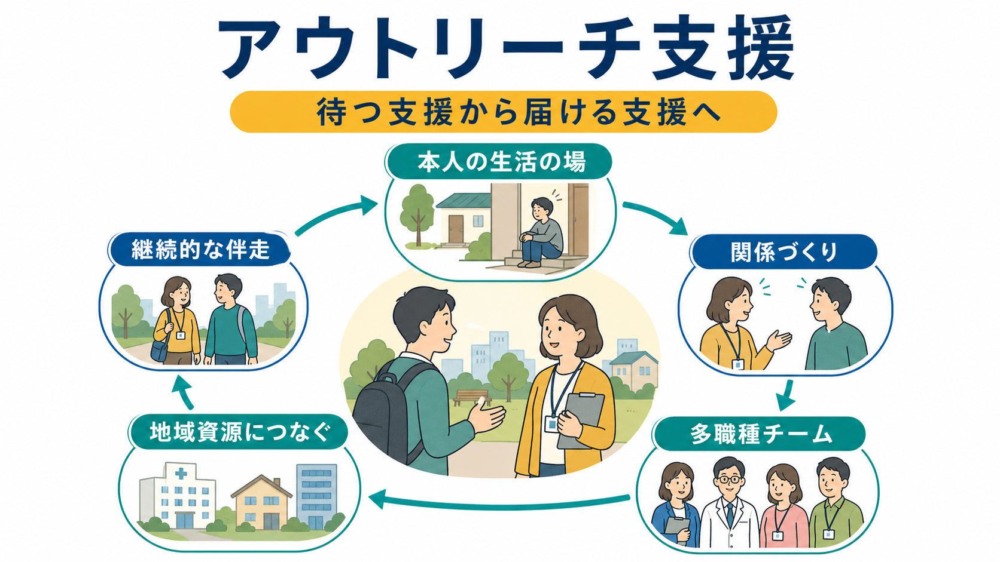

# アウトリーチ支援とは何か

## 要点

- アウトリーチ支援とは、相談窓口や外来に来ることを前提にせず、支援者が本人の生活の場へ出向き、関係づくりから始める支援である。
- 対象は「支援を拒否する人」に限られない。病状、生活困窮、孤立、住まいの不安定さ、過去の支援体験への不信、制度へのアクセス困難などにより、支援につながりにくい人を広く含む。
- 中心にあるのは、診断名よりも生活上の困りごと、本人の希望、安全、権利、地域で暮らし続ける条件である[1][2]。
- 精神保健医療では、ACT（Assertive Community Treatment）や集中ケースマネジメント、地域移行・地域定着支援、訪問看護、市町村の精神保健相談などと重なりながら使われる[3][5]。
- 重要なのは「出向くこと」そのものではなく、本人のペースで信頼を作り、医療、障害福祉、住まい、就労、家族支援、ピアサポートを組み合わせる実装である[3][4]。

## この記事で答える問い

1. アウトリーチ支援とは、普通の外来・相談支援と何が違うのか。
2. 支援につながりにくい人へ、どのような順序で関係を作るのか。
3. 精神科医療、障害福祉、地域包括ケア、ACT 研究とはどう接続するのか。
4. 支援と介入、見守りと放置、危機対応と権利尊重をどう区別すればよいのか。

## まず結論

アウトリーチ支援は、「困っている人を窓口に来させる」支援ではなく、「支援の側が届きにくさを引き受ける」支援である。本人が受診しない、相談予約に来ない、電話に出ない、支援を拒むように見える場合でも、その背景には症状、認知機能、疲弊、貧困、住まい、トラウマ、不信、制度理解の難しさ、家族関係のこじれが重なっていることが多い。アウトリーチは、その複合的な背景に対して、生活の場で小さく接触し、本人の言葉を聞き、支援計画を本人と一緒に作る方法である[1][2]。

精神保健では、アウトリーチ支援は[[ACTとは何か]]、[[地域移行支援とは何か]]、[[地域定着支援とは何か]]、[[意思決定支援とは何か]]と強く関係する。たとえば ACT は、重い精神障害があり入退院を繰り返しやすい人に対して、多職種チームが地域で継続的に関わるモデルであり、アウトリーチ支援を高密度に制度化した一例と考えられる[5][6]。

## 背景

精神医療は長く、病院、外来、相談窓口など「来てもらう場」を中心に組み立てられてきた。しかし、支援が必要な人ほど、自分から窓口にたどり着く力が落ちていることがある。病状が重い、被害的に感じている、生活リズムが崩れている、金銭や住まいの問題で余裕がない、過去の支援で傷ついた、行政や医療への不信がある、といった事情が重なるからである。

WHO は地域精神保健サービスの方向性として、施設中心ではなく、本人中心・権利基盤・地域生活に近い支援を重視している。地域アウトリーチ型の精神保健サービスは、自宅、公的空間、路上など、本人が実際にいる場所でケアと支援を届ける方法として位置づけられている[1][2]。これは、医療だけでなく、住まい、所得、社会参加、孤立、差別といった健康の社会的決定要因を扱う必要があるためである。

日本でも、厚生労働省は「精神障害にも対応した地域包括ケアシステム」として、精神障害の有無や程度にかかわらず、医療、障害福祉・介護、住まい、社会参加、地域の助け合い、教育・普及啓発が包括的に確保される体制を掲げている[3][4]。アウトリーチ支援は、この体制を個別の生活場面に届けるための実践である。

## 基本概念

### 待つ支援から届ける支援へ

アウトリーチ支援の第一の特徴は、支援の入口を本人の側に移すことである。通常の外来や相談では、本人が予約し、移動し、説明し、制度を理解する必要がある。アウトリーチでは、支援者が訪問、同行、電話、手紙、関係者との連携、地域での接触などを通じて、本人がアクセスしやすい形に支援を変える。

ただし、出向けばよいわけではない。突然の訪問は、本人にとって侵入的に感じられることもある。したがって、可能な限り本人の同意、事前説明、関係者からの橋渡し、安全確認、選択肢の提示を組み合わせる。精神科医療や福祉の文脈では、[[精神保健福祉法とは何か]]に関わる強制的な介入とは区別し、原則として本人の意思決定と尊厳を支える関わりとして設計する必要がある。

### 支援拒否ではなく、接続困難として見る

「支援を拒否している」と見える人でも、実際には「支援の形式が合っていない」「怖い」「何をされるかわからない」「過去に傷ついた」「今は考える余力がない」という状態かもしれない。アウトリーチ支援では、拒否を単純に本人の問題と見なさず、支援側の届きにくさ、制度の複雑さ、関係形成の不足として捉え直す。

この視点は、[[医療保護入院とは何か]]や[[措置入院とは何か]]のような危機的局面とも接続する。入院が必要な場面はあり得るが、アウトリーチ支援の意義は、危機が深刻化する前に生活上の困難を見つけ、本人の選択肢を増やし、入院後も地域生活に戻る経路を切らさないことにある。

## 仕組み

アウトリーチ支援は、単発の訪問ではなく、次のような循環として動く。

1. 困りごとの把握  
   本人、家族、近隣、医療機関、行政、福祉サービスなどから、何が起きているかを多面的に把握する。ただし、本人抜きに支援方針を決めない。

2. 安全な初回接触  
   いきなり診断や指導を始めず、誰が、なぜ来たのか、何をしないのかを説明する。本人が断れる余地を残す。

3. 信頼形成  
   約束を守る、急がない、本人のペースを尊重する、生活上の小さな困りごとに応答する。関係形成は治療の前段階ではなく、支援そのものである。

4. 共同アセスメント  
   症状だけでなく、住まい、金銭、食事、睡眠、服薬、身体疾患、家族、孤立、就労、暴力被害、司法・行政手続きなどを一緒に整理する。

5. 小さな支援計画  
   大きな目標より、本人が受け入れやすい小さな行動から始める。例として、書類を一緒に見る、薬を取りに行く、生活保護や障害福祉サービスの相談につなぐ、訪問看護の初回に同行する、などがある。

6. サービス接続  
   医療、相談支援、障害福祉、住まい、就労、ピアサポート、家族支援を組み合わせる。[[IPS援助付き雇用とは何か]]のような就労支援や、[[地域定着支援とは何か]]のような生活継続支援もここに位置づく。

7. 振り返りと調整  
   うまくいかなかった場合、本人の「抵抗」と決めつけず、支援方法、頻度、担当者、場所、説明の仕方を見直す。

## 図解

アウトリーチ支援を文章で図解すると、次のように整理できる。

| 観点 | 従来型の待つ支援 | アウトリーチ支援 |
|---|---|---|
| 入口 | 本人が窓口・外来に来る | 支援者が本人の生活の場へ近づく |
| 主な対象 | 相談意思が明確で、来所できる人 | 支援ニーズはあるが接続しにくい人 |
| 関係形成 | 相談・診療の場で始まる | 訪問、同行、地域接触、関係者の橋渡しで始まる |
| 評価 | 症状・制度利用状況が中心になりやすい | 生活、住まい、金銭、孤立、安全、希望を含める |
| 目標 | 受診・相談・制度利用 | 本人が地域で暮らし続ける条件を整える |
| 倫理的焦点 | 説明と同意 | 説明と同意に加え、接触の仕方そのものの慎重さ |

## 臨床・研究との接続

アウトリーチ支援の研究的基盤として重要なのは、ACT と集中ケースマネジメントである。Cochrane レビューでは、重い精神障害のある人を対象とした集中ケースマネジメントは、標準的ケアと比べて入院を減らし、ケア継続を高める可能性が示されている。特に、もともとの入院利用が高い地域・対象者では、効果が大きくなりやすい[5]。

日本の ACT 研究でも、ACT 群では入院日数、抑うつ症状、利用者満足度などに肯定的な結果が報告されている[6]。さらに、2025年に公表された日本の 7 年追跡研究では、ACT 群で再入院回数が少ない可能性が示され、効果が短期だけでなく長期に現れる可能性が検討されている[7]。ただし、サンプルサイズ、追跡脱落、地域資源の違い、モデル忠実度などの限界があるため、「アウトリーチなら常に有効」と一般化するのは危険である。

臨床的には、アウトリーチ支援は次のような場面で重要になる。

- 入退院を繰り返し、退院後の生活が安定しにくい。
- 外来中断、服薬中断、訪問拒否が続いている。
- ひきこもり、孤立、近隣トラブル、家族疲弊がある。
- 住まい、金銭、就労、身体疾患、依存、司法手続きなどが重なっている。
- 本人が支援を望んでいるが、予約、移動、説明、書類、対人不安が障壁になっている。

このため、アウトリーチ支援は医療単独では成立しにくい。精神科医、看護師、精神保健福祉士、作業療法士、心理職、相談支援専門員、自治体職員、居住支援、就労支援、ピアサポーター、家族支援が、情報共有と役割分担を行う必要がある[3][4]。

## よくある誤解

**誤解1：アウトリーチ支援は、支援拒否の人を説得する技術である。**  
説得よりも、本人にとって支援が安全で意味のあるものになるように形式を変える実践である。本人の拒否には理由があるため、まずは拒否の背景を理解する。

**誤解2：訪問すればアウトリーチ支援である。**  
単なる訪問ではない。生活場面での関係形成、共同アセスメント、サービス接続、継続的な振り返りが必要である。

**誤解3：危険な人を管理する支援である。**  
アウトリーチ支援は管理ではなく、本人の権利と地域生活を支える支援である。安全確保は重要だが、支援全体をリスク管理だけに還元すると、本人の希望や尊厳が見えなくなる。

**誤解4：医療が出向けば生活問題も解決する。**  
医療は重要な一部だが、住まい、所得、孤立、就労、家族、差別、手続きの困難を扱わなければ支援は続かない。地域包括ケアの視点が必要である[3][4]。

**誤解5：本人が来ないなら支援できない。**  
来られないこと自体が支援ニーズである。もちろん、本人の意思に反する接触には慎重さが必要だが、連絡方法、場所、時間、担当者、関係者の橋渡しを変えることで、接点が生まれることがある。

## 関連ノート

- [[ACTとは何か]]
- [[地域移行支援とは何か]]
- [[地域定着支援とは何か]]
- [[意思決定支援とは何か]]
- [[精神保健福祉法とは何か]]
- [[医療保護入院とは何か]]
- [[措置入院とは何か]]
- [[IPS援助付き雇用とは何か]]

MOC 更新候補: `MOC-精神医学`, `MOC-地域精神医療`, `MOC-司法・制度・地域精神医療`

今後の作成候補: ケースマネジメントとは何か、訪問看護と精神科アウトリーチ、ひきこもり支援とアウトリーチ、ピアサポートと地域精神保健、市町村精神保健相談とは何か。

## 理解チェック

1. アウトリーチ支援は、単なる訪問支援とどこが違うか。
2. 「支援拒否」と見える状態を、どのように「接続困難」として捉え直せるか。
3. 本人の意思決定を尊重しながら、危機対応を行うには何を確認すべきか。
4. アウトリーチ支援を医療だけでなく、住まい、福祉、就労、ピアサポートと接続する理由は何か。
5. ACT 研究の知見を、一般的なアウトリーチ支援へ広げるときの注意点は何か。

## 参考文献

[1] World Health Organization. (2021). *Community outreach mental health services: promoting person-centred and rights-based approaches*. WHO. https://www.who.int/publications/i/item/9789240025806

[2] World Health Organization. (2021). *Guidance on community mental health services: promoting person-centred and rights-based approaches*. WHO. https://www.who.int/publications/i/item/9789240025707

[3] 厚生労働省. 精神障害にも対応した地域包括ケアシステムの構築について. https://www.mhlw.go.jp/stf/seisakunitsuite/bunya/chiikihoukatsu.html

[4] 精神障害にも対応した地域包括ケアシステム構築支援情報ポータル. 「にも包括」の概要. https://nimohoukatsu.mhlw.go.jp/aa/1a.html

[5] Dieterich, M., Irving, C. B., Bergman, H., Khokhar, M. A., Park, B., & Marshall, M. (2017). Intensive case management for severe mental illness. *Cochrane Database of Systematic Reviews*, 1, CD007906. https://doi.org/10.1002/14651858.CD007906.pub3

[6] Ito, J., Oshima, I., Nishio, M., Sono, T., Suzuki, Y., Horiuchi, K., Niekawa, N., Ogawa, M., Setoya, Y., Hisanaga, F., Kouda, M., & Tsukada, K. (2011). The effect of Assertive Community Treatment in Japan. *Acta Psychiatrica Scandinavica*, 123(5), 398-401. https://doi.org/10.1111/j.1600-0447.2010.01636.x

[7] Satake, N., Yamaguchi, S., Sato, S., et al. (2025). Long-term outcomes of assertive community treatment in Japan: 7-year follow-up of a randomized controlled trial. *BMC Psychiatry*, 25, 870. https://doi.org/10.1186/s12888-025-07311-3

## 未解決問題

- 日本の自治体・医療圏ごとに、どの程度のアウトリーチ体制が実際に整備されているか。
- 強制的介入を避けながら、危機時の安全確保と本人の権利擁護をどう両立するか。
- ACT のような高密度モデルと、一般的な訪問支援・相談支援をどのように役割分担するか。
- ピアサポーターや家族支援を、本人の同意とプライバシーを守りながらどう組み込むか。
- アウトリーチ支援の成果を、入院日数だけでなく、本人の希望、生活の質、孤立の軽減、権利保障でどう評価するか。
