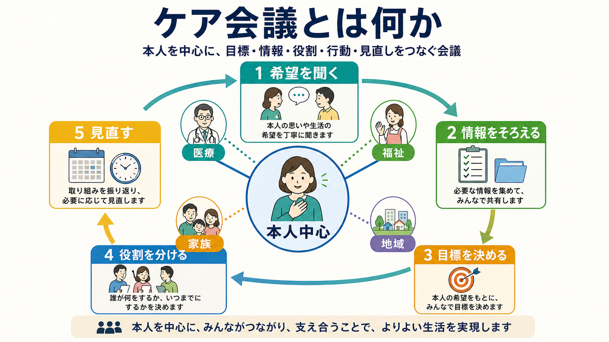
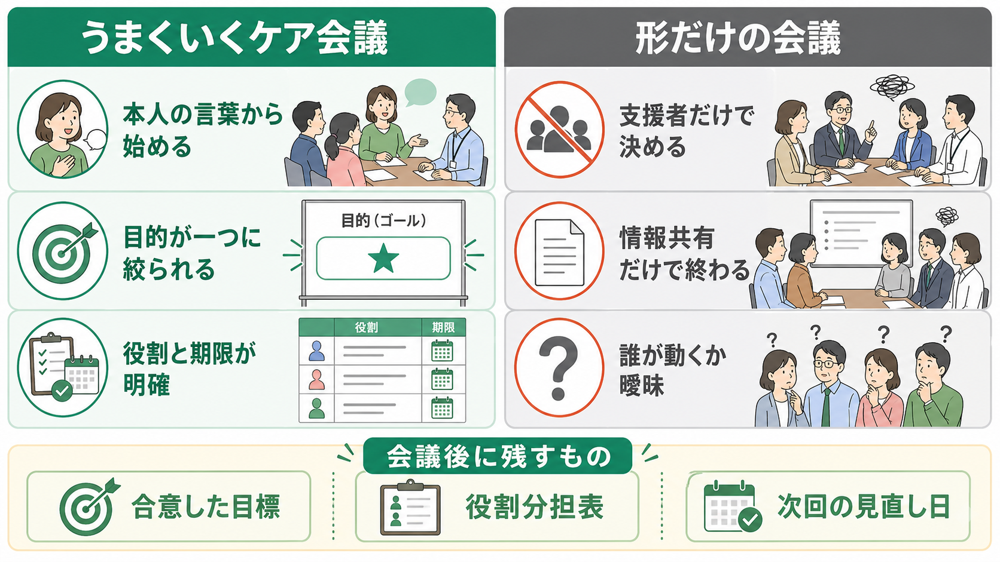

# ケア会議とは何か

## 要点

- ケア会議は、本人の希望や生活目標を出発点に、医療・福祉・介護・住まい・就労・家族・地域資源などの支援者が、目標、役割、期限、見直し方法を共有する会議である。
- 単なる情報共有会議ではなく、「誰が、いつまでに、何をするか」を明確にし、実行後に振り返るためのケアマネジメントの節目である。
- 精神保健医療福祉では、地域生活中心、本人中心、権利尊重、共同意思決定、多職種連携を具体化する場として重要になる[1][2][3]。
- 会議の質は、本人の参加の仕方、支援者間の権力差、記録の具体性、会議後のフォローで大きく変わる。

## この記事で答える問い

この記事では、ケア会議を「本人を中心に、支援の方向と役割分担を合意する実務上の会議」として説明する。特に、[[精神保健福祉法とは何か]]や地域精神医療の文脈で、本人の意思を尊重しながら複数機関が連携するには何を準備し、何を決め、何を記録すればよいのかを整理する。

## まず結論

よいケア会議は、支援者が本人について話し合う場ではなく、本人の言葉を起点に支援を組み直す場である。会議の中心課題は「どのサービスを入れるか」だけではない。本人がどのような生活を望み、いま何に困り、どの支援なら受け入れやすく、どの役割を誰が担うのかを、本人と支援者が同じ紙面で確認できる形にすることである。

厚生労働省は地域包括ケアの文脈で、個人への支援の充実と、それを支える社会基盤整備を同時に進める手法として地域ケア会議を位置づけている[1]。精神障害にも対応した地域包括ケアシステムでは、医療、障害福祉・介護、住まい、社会参加、地域の助け合い、教育などを包括的に確保することが目標とされる[2]。ケア会議は、この大きな理念を一人ひとりの支援計画に落とし込む小さな実践単位である。

## 背景

精神保健医療福祉では、入院医療中心から地域生活中心へという政策転換の中で、病院、自治体、相談支援、訪問看護、障害福祉サービス、家族、ピアサポート、住まい、就労支援などが同じ人の生活に関わる場面が増えている[2]。支援者が増えるほど資源は豊かになるが、同時に「誰が何を見ているのか」「本人は何を望んでいるのか」「次に誰が動くのか」が曖昧になりやすい。

この曖昧さを放置すると、支援が重複したり、逆に大事な支援が抜けたりする。本人から見ると、同じ説明を何度も求められる、支援者ごとに言うことが違う、決まったことが実行されない、という経験になりうる。ケア会議は、この断片化を減らし、本人の生活目標を中心に支援の足並みをそろえるために使われる。

## 基本概念

### 本人中心

本人中心とは、本人がすべてを一人で決めなければならないという意味ではない。本人の価値観、希望、心配、強み、生活上の優先順位を、会議の最初に置くという意味である。NICEは成人メンタルヘルスサービスで、利用者が自分の治療やケアの意思決定の中心に位置づけられ、情報と支援を得ながら共同意思決定に参加することを重視している[3]。これは[[意思決定支援とは何か]]と直結する。

### 多職種連携

多職種連携とは、専門職が多く集まること自体ではない。医師、看護師、精神保健福祉士、相談支援専門員、介護支援専門員、作業療法士、心理職、自治体職員、就労支援員、家族、ピアサポーターなどが、それぞれの見立てを持ち寄り、本人の生活課題に対して矛盾の少ない支援計画をつくることである。WHOも地域精神保健サービスでは、権利に基づき、本人中心で、住まい・教育・雇用・社会保障などとつながる支援ネットワークが重要だとしている[4]。

### 合意形成

ケア会議の合意は、支援者側の多数決ではない。本人の希望、リスク、支援資源、法制度上の制約を並べ、現時点で試せる最小限の行動に落とす作業である。精神科領域の共同意思決定研究では、利用者の参加、選好の確認、情報共有、共同の意思決定が重要な要素とされる一方、介入効果や実装方法にはばらつきがある[5]。したがって、ケア会議でも「共同意思決定をしたことにする」のではなく、本人がどの選択肢をどう理解し、何に同意し、何を保留したかを記録する必要がある。

## 仕組み

### 1. 準備

会議前に、開催目的を一文で決める。例として「退院後2週間の生活を安定させる」「家賃滞納と服薬中断への支援を整理する」「就労再開に向けた無理のない段階を決める」などである。目的が広すぎる場合、会議は情報交換で終わりやすい。

準備では、本人に会議の目的、参加者、話し合う内容、話したくないことを確認する。本人が参加しにくい場合は、事前面談、メモ、代理人、支援者同席、短時間参加、オンライン参加などを検討する。本人不在で行う必要がある場合も、本人の意向をどう反映し、会議後にどう説明するかを決めておく。

### 2. 共有

会議では、最初に本人の言葉を確認する。支援者の見立ては、その後に置く。共有する情報は多いほどよいわけではない。生活目標に関係する情報、本人が困っていること、うまくいっていること、リスク、利用中の制度、連絡先、緊急時の対応に絞る。

### 3. 決定

決めるべきことは、少なくとも次の四つである。

| 項目 | 会議で確認すること |
|---|---|
| 目標 | 本人の生活にとって意味のある短期目標は何か |
| 行動 | 次回までに何を試すか |
| 役割 | 誰が、いつまでに、何をするか |
| 見直し | 何を指標に、いつ再確認するか |

共同ケアや協働ケアの研究では、個別化されたケア計画と共同意思決定は、本人・家族の関与を高める重要な要素とされるが、実際のプログラムで十分に組み込まれていない場合もある[6]。そのため、ケア会議では「支援計画を作成した」だけでなく、本人が計画を受け取り、理解し、次に何が起こるかを確認できることが重要である。

### 4. 実行と見直し

ケア会議の成果は、会議中ではなく会議後に現れる。会議録には、抽象的な方針だけでなく、担当者、期限、連絡方法、本人に渡す説明、次回確認日を残す。次回会議では、できなかったことを責めるのではなく、計画が本人の生活状況に合っていたかを点検する。

## 図解

上の1枚目は、ケア会議を「希望を聞く、情報をそろえる、目標を決める、役割を分ける、見直す」という循環として示している。ケア会議は一回で完結するイベントではなく、本人の変化に合わせて更新されるサイクルである。

2枚目は、会議の質の違いを示している。うまくいく会議では、本人の言葉から始まり、目的が絞られ、役割と期限が残る。形だけの会議では、支援者だけで決める、情報共有だけで終わる、誰が動くか曖昧になる。

## 臨床・研究との接続

臨床的には、ケア会議は危機対応、退院支援、地域移行、再入院予防、住居支援、就労支援、家族支援、虐待や自殺リスクへの対応などで使われる。ただし、リスクが高い場面ほど、本人中心と安全確保の両立が難しくなる。ここで重要なのは、支援者が「安全のため」と言いながら本人の意向を消してしまわないことである。リスク評価、保護、法的手続きが必要な場合でも、本人に説明し、選択肢を示し、異議や不安を記録することが、権利に基づく支援に近づける。

研究的には、ケア会議そのものの効果を単独で測ることは難しい。会議は、共同意思決定、ケアマネジメント、多職種チーム、アウトリーチ、地域包括ケア、本人参加型のケア計画と重なっているからである。共同意思決定介入のレビューでは、意思決定参加や満足度などに一定の改善可能性が示される一方、効果は介入内容やアウトカムにより混在している[5]。したがって、ケア会議の評価では、開催回数よりも、本人参加、計画の具体性、実行率、本人の納得、生活上のアウトカムを見る方が妥当である。

## よくある誤解

### 誤解1: ケア会議は支援者の情報共有会議である

情報共有は必要だが、それだけではケア会議とは言いにくい。本人の目標に結びつかない情報は、会議を長くするだけで支援を進めない。会議の最後に、具体的な役割分担と見直し日が残らない場合は、会議設計を見直す。

### 誤解2: 本人が欠席しても本人中心である

本人が参加できない事情はありうる。しかし、本人の意向確認、欠席理由、代理的に伝える人、会議後の説明方法がないまま進むと、本人中心ではなく支援者中心になりやすい。

### 誤解3: リスクがあると共同意思決定はできない

リスクがあるときほど、説明、選択肢、合意できる範囲、合意できない点を明確にする必要がある。共同意思決定は、支援者が責任を放棄することではなく、本人の価値観と専門的判断を同じ場に置く方法である[3][5]。

### 誤解4: 会議録は詳細であるほどよい

長い会議録より、次に動く人が読んですぐ行動できる記録がよい。記録すべき中心は、本人の希望、合意した目標、役割、期限、連絡方法、未解決点である。

## 関連ノート

- [[意思決定支援とは何か]]
- [[精神保健福祉法とは何か]]
- [[任意入院とは何か]]

### 関連ノート候補

- 地域包括ケアシステムとは何か
- 多職種連携とは何か
- ケアマネジメントとは何か
- 退院支援とは何か
- ピアサポートとは何か
- アウトリーチ支援とは何か

### MOC更新候補

- `content/00_MOC/` 配下の精神医学・地域精神医療系MOCに `[[ケア会議とは何か]]` を追加する候補。
- 並列ジョブとの衝突を避けるため、本記事作成時点ではMOCファイルを直接更新しない。

## 理解チェック

1. ケア会議が「情報共有だけ」で終わらないために、最後に必ず残すべき三つの項目は何か。
2. 本人が会議に参加しにくい場合、本人中心を保つために事前・事後に何を確認できるか。
3. リスクが高い場面で、共同意思決定と安全確保を両立させるために記録すべきことは何か。
4. 次回会議で「できなかったこと」を責めるのではなく、何を点検すべきか。

## 未解決問題

- 日本の地域精神医療で、ケア会議の質を測る標準的な指標はまだ十分に共有されていない。
- 本人不在の会議をどの条件で許容し、どのように本人の意向を反映したと判断するかは、実務上の倫理的課題である。
- 多機関連携では個人情報共有、同意、緊急時対応の境界が難しく、地域ごとの運用ルール整備が必要になる。

## 参考文献

[1] 厚生労働省. 地域包括ケアシステム. https://www.mhlw.go.jp/stf/seisakunitsuite/bunya/hukushi_kaigo/kaigo_koureisha/chiiki-houkatsu/

[2] 厚生労働省. 精神障害にも対応した地域包括ケアシステムの構築について. https://www.mhlw.go.jp/stf/seisakunitsuite/bunya/chiikihoukatsu.html

[3] National Institute for Health and Care Excellence. Quality statement 2: Decision making. Service user experience in adult mental health services. QS14. https://www.nice.org.uk/guidance/qs14/chapter/quality-statement-2-decision-making

[4] World Health Organization. Guidance on community mental health services: Promoting person-centred and rights-based approaches. 2021. https://www.who.int/publications/i/item/9789240025707

[5] Duncan E, Best C, Hagen S. Shared decision making interventions for people with mental health conditions. Cochrane Database of Systematic Reviews. 2022. https://pmc.ncbi.nlm.nih.gov/articles/PMC9650912/

[6] Menear M, Girard A, Dugas M, Gervais M, Gilbert M, Gagnon MP. Personalized care planning and shared decision making in collaborative care programs for depression and anxiety disorders: A systematic review. PLoS One. 2022;17(6):e0268649. https://doi.org/10.1371/journal.pone.0268649
