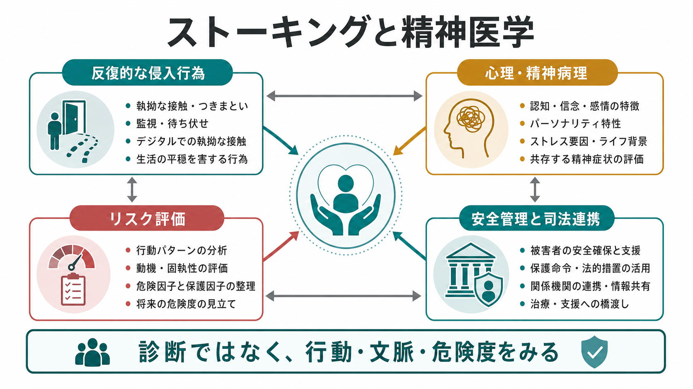
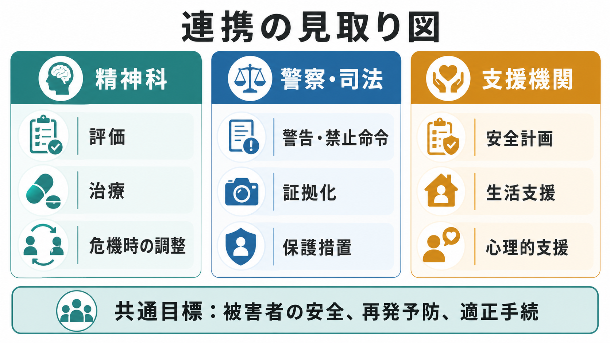

# ストーキングと精神医学はどう関係するのか

## 要点

- ストーキングは、単一の精神疾患名ではなく、反復的で望まれない接触・監視・接近が、相手の安全と生活を侵害する行動パターンである。
- 精神医学は「加害者を診断する」だけでなく、妄想、執着、拒絶への反応、対人関係の破綻、物質使用、衝動性、暴力リスク、被害者の心理的影響を評価するために関わる。
- 危険度は「精神疾患があるか」だけでは判断できない。先行研究では、脅迫、過去の暴力、物質使用、元親密関係、ストーキングの持続性などが重要なリスク情報になる[1][2][3]。
- 臨床対応では、治療・心理教育・物質使用への介入だけでなく、被害者安全、警察相談、証拠化、禁止命令等、支援機関との連携を同時に考える。
- 本記事は教育・研究目的の整理であり、個別事案の診断、危険度判定、法的助言、治療指示ではない。

## この記事で答える問い

1. ストーキングは精神疾患なのか。
2. 妄想、執着、パーソナリティ特性、対人関係の破綻は、どのようにストーキング行動と関係するのか。
3. 暴力化や持続化のリスクは、どのような情報から評価するのか。
4. 精神科医療、警察・司法、被害者支援はどのように役割分担するのか。

## まず結論

ストーキングと精神医学の関係は、「ストーカーは精神疾患である」という単純な関係ではない。重要なのは、行為者の診断名だけではなく、行動の反復性、被害者との関係、拒絶や喪失への反応、信念の固定化、脅迫や接近の有無、物質使用、過去の暴力、被害者の恐怖と生活被害を統合してみることである[1][2]。

精神医学が担うべき役割は、危険な行動を「病気だから仕方ない」と免責することではない。むしろ、[[司法精神医学とは何か]]で扱うように、本人の病態や心理を評価しつつ、被害者の安全、適正手続、再発予防、治療可能性を同時に扱うことである。とくにストーキングでは、被害者への接触が評価や治療の外側で継続しうるため、医療だけで完結しない安全管理が必要になる[2][4]。

## 背景

ストーキング研究では、行為者の動機や関係性に基づく類型化がよく用いられる。Mullenらの臨床研究は、法精神医学サービスに紹介された145例をもとに、拒絶型、親密希求型、求愛不得手型、怨恨型、捕食型という類型を提案した[1]。この分類は、診断名を当てはめるためではなく、動機、対象者との関係、持続性、暴力リスク、介入方針を整理するための臨床的な地図として使われる。

日本では、ストーカー規制法が、つきまとい等、位置情報無承諾取得等、警告、禁止命令等、援助措置などを定めている。2026年4月28日時点では、紛失防止タグ等を用いた位置情報取得への対応や職権での警告などを含む改正も施行済みであり、ストーキングは対面接触だけでなく、デジタルな監視・追跡を含む安全問題として扱われる[7][8]。警察庁の令和6年統計では、ストーカー事案の相談等件数は19,567件で、依然として高い水準とされている[7]。

## 基本概念

### ストーキング

ストーキングは、反復的で望まれない接近、連絡、監視、待ち伏せ、追跡、要求、脅し、デジタルな接触などによって、相手に恐怖や生活上の支障を生じさせる行動パターンである。研究上の定義や法的定義は国や時期で異なるが、「反復性」「望まれなさ」「侵入性」「恐怖・危害・生活妨害」が中核になる[5][6]。

### 妄想と執着

精神医学的には、[[妄想とは何か]]で扱うような訂正困難な信念が、ストーキングの一部に関与することがある。たとえば、相手が自分を愛している、特別な合図を送っている、拒絶は周囲に操作されている、といった確信が持続すると、現実検討の修正が難しくなる。Mullenらの研究では、親密希求型で妄想性障害が比較的多いことが示されている[1]。

ただし、ストーキングの多くを妄想だけで説明するのは不正確である。拒絶後の怒り、支配感の喪失、恥や屈辱、愛着不安、対人スキルの乏しさ、パーソナリティ特性、物質使用、過去の暴力、社会的孤立などが複合する[1][2]。したがって、評価では「妄想か否か」だけでなく、本人の信念、感情調整、対人関係、行動履歴を分けてみる必要がある。

### 被害者安全

ストーキングの臨床評価は、行為者だけを対象にすると不十分になる。被害者は恐怖、睡眠障害、抑うつ、不安、外出や勤務の制限、住居変更、対人関係の縮小などを経験しうる[4][6]。このため、医療者が行為者を診る場合でも、被害者への接触継続、情報漏えい、診察内容の誤用、治療者への操作的説明に注意する必要がある。

## 仕組み

ストーキングが持続する背景には、拒絶や喪失を処理できないこと、認知の固定化、短期的な強化がある。連絡や監視をすると、一時的に不安が下がる、相手を支配できたように感じる、怒りを発散できる、相手の反応を得られる、といった短期的報酬が生じることがある。これが、長期的には被害者の恐怖を増やし、法的介入を招き、本人の生活も悪化させる。

この循環には、[[認知バイアスとは何か]]で扱う選択的注意や確証バイアスが関与しうる。相手の沈黙を「本当は助けを求めている」、拒否を「試されている」、警察相談を「第三者に操られている」と解釈すると、反証情報がむしろ執着を強める。臨床的には、こうした信念を単に否定するだけでなく、接触行動を止めるための具体的な環境調整、危機計画、物質使用への介入、法的制限との整合を取る必要がある[2][3]。

リスク評価では、暴力だけをみるのでは不十分である。Stalking Risk Profileは、暴力、持続、再発、心理社会的損害など、複数のリスク領域を区別して評価する構造化専門判断の枠組みとして知られる[3]。これは、ストーキングが「身体的暴力に至るか」だけでなく、「長く続くか」「再燃するか」「被害者の生活をどれほど壊すか」を問う必要があるためである。

## 図解

ストーキング事案では、精神科、警察・司法、支援機関が同じことをするのではなく、異なる責任を接続する。

| 領域 | 主な問い | 典型的な対応 |
|---|---|---|
| 精神科 | 妄想、衝動性、物質使用、気分症状、パーソナリティ特性、治療可能性はどうか | 評価、治療、心理教育、危機時の調整 |
| 警察・司法 | 法的に禁止・制止すべき行為は何か。被害者安全をどう確保するか | 警告、禁止命令等、検挙、保護措置、証拠化 |
| 支援機関 | 被害者が生活を維持し、安全を回復するには何が必要か | 安全計画、住居・勤務・学校の調整、心理的支援、情報提供 |
| 共通 | 再発をどう防ぎ、被害者の安全と適正手続をどう両立するか | 情報共有、役割分担、記録、継続的なリスク再評価 |

## 臨床・研究との接続

臨床では、まず「ストーキングをやめること」を治療目標として明確化する必要がある。妄想性障害、気分障害、物質使用障害、発達特性、パーソナリティ病理などがあれば、それぞれの治療を行うが、症状治療だけで接触行動が止まるとは限らない。行動契約、連絡手段の遮断、第三者経由の安全な連絡、警察・弁護士・支援機関との調整など、行動レベルの管理が不可欠である[2][3]。

暴力化リスクについては、Rosenfeldのレビューとメタ分析では、脅迫、物質使用、過去の暴力、元親密関係などが重要な相関要因として整理された[5]。McEwanらの研究でも、拒絶された元親密関係の事案では、過去の暴力や脅迫が重要であり、その他の事案では若年、ストーキング時の物質使用、過去の暴力が関連した[2]。このことは、[[リスク下の意思決定はどのように行われるのか]]で扱うような不確実性下の判断を、構造化された情報収集で補う必要があることを示している。

研究上は、ストーキングを単一アウトカムで測りにくい点が課題である。暴力発生、再接触、違反、被害者の恐怖、生活妨害、心理的回復、治療継続、司法措置の遵守は、それぞれ異なるアウトカムである。したがって、評価研究では「誰にとっての改善か」を明確にし、行為者の症状軽減だけでなく、被害者安全と生活回復を含める必要がある。

## よくある誤解

### 「ストーカーはみな精神疾患である」

誤りである。精神疾患が関与する事案はあるが、すべてのストーキングを精神疾患で説明することはできない。診断名がない事案でも、脅迫、接近、過去の暴力、物質使用、支配的関係、デジタル監視があれば危険度は高まりうる[5]。

### 「精神疾患があれば責任は問えない」

これも短絡である。診断名と責任能力、治療必要性、危険性、保護措置は別の問いである。[[責任能力とは何か]]で扱うように、法的責任は行為時の認識・制御能力などを個別に検討する問題であり、精神疾患の有無だけでは決まらない。

### 「被害者が反応しなければ自然に終わる」

自然終息する事案もあるが、持続・再燃・暴力化する事案もある。被害者に沈黙や我慢だけを求めると、安全確保、証拠化、支援アクセスが遅れることがある。公的情報でも、ストーカー被害では警察相談や支援制度の利用が案内されている[8]。

### 「治療すれば司法対応は不要になる」

治療は重要だが、被害者安全を代替しない。治療者は、治療同盟を保ちながらも、接触禁止、警察相談、保護措置、情報管理と矛盾しない対応を取る必要がある。特に急性の妄想、興奮、物質使用、脅迫、接近行動がある場合は、医療・司法・地域支援の連携が優先される[2][3]。

## 関連ノート

- [[司法精神医学とは何か]]
- [[精神保健福祉法とは何か]]
- [[責任能力とは何か]]
- [[妄想とは何か]]
- [[認知バイアスとは何か]]
- [[リスク下の意思決定はどのように行われるのか]]

MOC更新候補: `content/00_MOC/MOC｜精神医学.md`、`content/00_MOC/MOC｜臨床実践・治療.md`、`content/00_MOC/MOC｜倫理・哲学・社会.md`

今後の作成候補: 「DVと精神科医療はどう関係するのか」「被害者安全計画とは何か」「ストーキングリスク評価とは何か」「妄想性障害と対人トラブルはどう関係するのか」

## 理解チェック

1. ストーキングを精神疾患名ではなく行動パターンとして捉える理由は何か。
2. 妄想が関与する事案と、拒絶・支配・怒りが中心の事案では、評価の焦点はどう変わるか。
3. 暴力化リスクを考えるとき、脅迫、過去の暴力、物質使用、元親密関係はなぜ重要か。
4. 精神科医療が被害者安全を損なわないために、警察・司法・支援機関と何を共有し、何を分担すべきか。

## 未解決問題

- 日本のストーキング事案において、精神医学的介入が再発、違反、被害者安全に与える効果を検証した研究は限られている。
- デジタル監視、位置情報追跡、SNS接触の増加により、従来の対面接近中心のリスク評価だけでは不十分になっている。
- 行為者治療の守秘義務と、被害者安全・司法連携の境界をどのように設計するかは、実務上の難題である。
- 被害者の回復指標を、恐怖の軽減、生活再建、司法手続の負担軽減、心理的支援アクセスまで含めて測る必要がある。

## 参考文献

[1] Mullen, P. E., Pathé, M., Purcell, R., & Stuart, G. W. (1999). Study of stalkers. *American Journal of Psychiatry, 156*(8), 1244-1249. https://www.ovid.com/journals/ajps/fulltext/00000465-199908000-00024~study-of-stalkers

[2] McEwan, T. E., Mullen, P. E., MacKenzie, R. D., & Ogloff, J. R. P. (2009). Violence in stalking situations. *Psychological Medicine, 39*(9), 1469-1478. https://doi.org/10.1017/S0033291708004996

[3] MacKenzie, R., McEwan, T. E., Pathé, M., James, D. V., Ogloff, J. R., & Mullen, P. E. (2009). *Stalking Risk Profile: Guidelines for the Assessment and Management of Stalkers*. Monash University. https://research.monash.edu/en/publications/stalking-risk-profile-guidelines-for-the-assessment-and-managemen/

[4] Mullen, P. E., Mackenzie, R., Ogloff, J. R. P., Pathé, M., McEwan, T., & Purcell, R. (2006). Assessing and managing the risks in the stalking situation. *Journal of the American Academy of Psychiatry and the Law, 34*(4), 439-450. https://jaapl.org/content/34/4/439

[5] Rosenfeld, B. (2004). Violence risk factors in stalking and obsessional harassment: A review and preliminary meta-analysis. *Criminal Justice and Behavior, 31*(1), 9-36. https://doi.org/10.1177/0093854803259241

[6] Spitzberg, B. H., & Cupach, W. R. (2007). The state of the art of stalking: Taking stock of the emerging literature. *Aggression and Violent Behavior, 12*(1), 64-86. https://www.ojp.gov/ncjrs/virtual-library/abstracts/state-art-stalking-taking-stock-emerging-literature

[7] 警察庁生活安全局人身安全・少年課. (2025). 令和6年におけるストーカー事案、配偶者からの暴力事案等、児童虐待事案等への対応状況について. https://www.npa.go.jp/bureau/safetylife/stalker/R6_STDVRP_CA_kouhoushiryou.pdf

[8] 政府広報オンライン. (2026). ストーカー行為は犯罪です！迷わず警察に相談を. https://www.gov-online.go.jp/useful/article/202109/1.html
