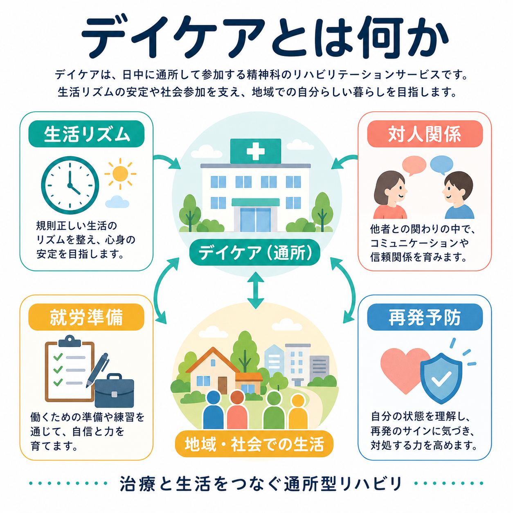
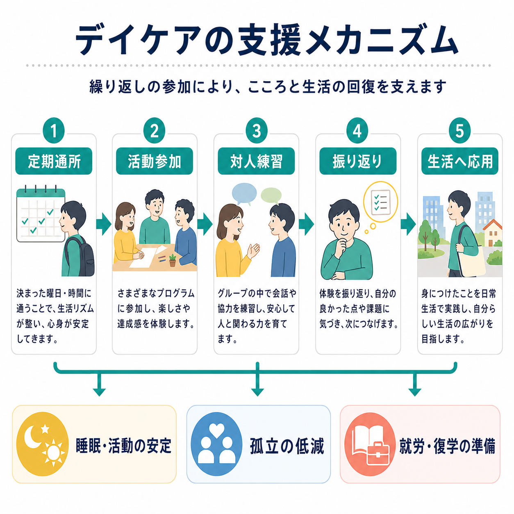
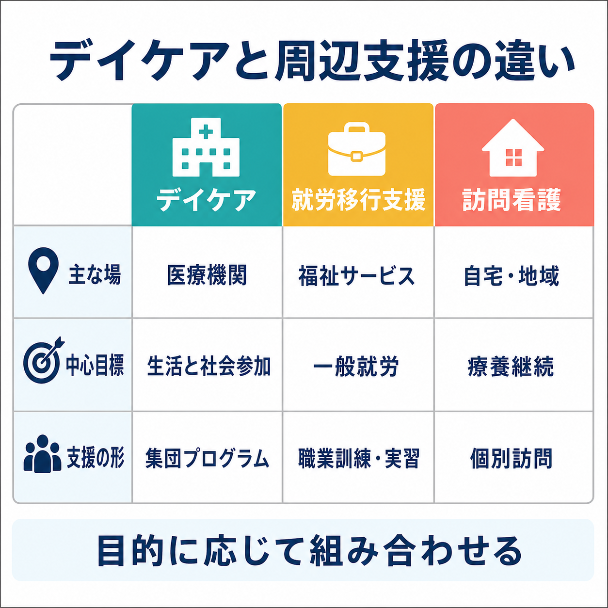

# デイケアとは何か

## 要点

- 精神科デイケアは、精神疾患をもつ人が日中に医療機関へ通い、集団プログラムや個別面談を通じて生活リズム、対人関係、社会参加、就労・復学準備を整える通所型の精神科リハビリテーションである[1][2]。
- 日本の診療報酬上は「精神科デイ・ケア」として位置づけられ、小規模・大規模の区分、施設基準、診療計画、利用期間や回数に関する算定上のルールがある[1]。
- 中核は「居場所」だけではなく、定期通所、活動参加、対人練習、振り返り、日常生活への応用を反復することで、地域生活の足場を作る点にある[2][3]。
- 対人スキルや就労支援の構成要素は、社会技能訓練や援助付き雇用の研究知見と接続できる。ただし、デイケア全体の効果は対象者、プログラム、地域資源との連携に大きく左右される[4][5][6]。
- 本記事は教育・研究目的の整理であり、個別の診断、治療方針、利用可否を判断するものではない。実際の利用は主治医、デイケアスタッフ、地域支援者と相談して決める。

## この記事で答える問い

1. デイケアは「病院に通う場所」なのか、「生活を立て直すリハビリ」なのか。
2. どのような仕組みで生活リズム、対人関係、就労準備に関わるのか。
3. [[精神保健福祉法とは何か]]、[[地域移行支援とは何か]]、[[地域定着支援とは何か]]などの地域精神医療とどうつながるのか。
4. どのような誤解があり、研究や臨床ではどこに注意して評価すべきか。

## まず結論

デイケアは、症状を直接「治す」単独の技法というより、治療と生活の間にあるリハビリテーションの場である。外来診療だけでは扱いにくい睡眠覚醒リズム、日中活動、孤立、対人不安、服薬継続、体力低下、就労・復学への段階づけを、週単位の予定と集団活動のなかで整える[1][2]。

ポイントは、参加者を受け身の患者として固定しないことである。WHO の地域精神保健サービス指針も、施設中心ではなく、本人中心、権利に基づく支援、地域生活への参加を重視する[3]。デイケアもこの観点から見ると、「通うこと」自体が目的ではなく、本人が自分の生活を再設計するための足場になる。

## 背景

精神疾患の回復では、症状の軽減だけでなく、生活の安定、社会的孤立の低減、役割の回復、希望の再形成が重要になる。たとえば[[統合失調症とは何か]]では認知機能、陰性症状、対人関係、就労困難が生活機能に関わり、[[うつ病とは何か]]でも睡眠、活動性、対人回避、復職準備が回復過程を左右する。

通常の外来診療は、診察室で症状、薬、リスク、生活課題を確認する時間として重要である。一方で、生活リズムを実際に作る、他者と一緒に活動する、失敗しても再挑戦する、働く前の体力や対人負荷を確かめるといった課題は、診察室の外で起こる。デイケアはこの隙間を埋める場であり、[[精神科におけるチーム医療とは何か]]と強く結びつく。

日本の制度では、精神科デイ・ケアは精神科専門療法の一つとして診療報酬上に定められ、保険医療機関が施設基準に適合し、必要な届出を行ったうえで実施される[1]。国立精神・神経医療研究センター病院の説明でも、デイケアは集団プログラムを通じて、心身の健康を保つ工夫、活動と休息のバランス、コミュニケーション、協調や自己主張のバランスを身につける場として説明されている[2]。

## 基本概念

### 通所型リハビリテーション

デイケアは入院ではなく、日中に通って参加する支援である。医療機関のプログラムに参加し、終了後は自宅や地域へ戻るため、支援の焦点は「病棟内で安定すること」ではなく「地域生活で使える力を少しずつ増やすこと」に置かれる。

### 生活リズム

精神疾患では、睡眠、食事、外出、活動量が崩れやすい。[[概日リズムの乱れは精神疾患にどう関わるのか]]で扱うように、睡眠覚醒リズムは気分、認知、活動性に影響する。デイケアでは、決まった曜日・時間に通うこと自体が、日中活動のアンカーになる。

### 対人関係

デイケアの集団プログラムでは、雑談、共同作業、役割分担、意見表明、断り方、助けを求める練習が生じる。社会技能訓練のレビューでは、統合失調症の人を対象にした社会技能プログラムが社会的パフォーマンスや対人上の困難に一定の効果をもつ可能性が示されている[4]。デイケアは、こうした技能を実際の集団場面で試す場になりうる。

### 就労・復学準備

デイケアは就職先を直接紹介する制度ではないが、出席の安定、疲労の把握、対人負荷への慣れ、作業への集中、面談での振り返りを通じて、[[精神疾患と就労困難はどう関係するのか]]や[[就労支援とは何か]]につながる準備段階になる。重い精神疾患をもつ人の就労支援では、援助付き雇用、特に IPS が競争的雇用の獲得に有効であることが複数のレビューで示されており、デイケアはその前後の生活基盤を整える支援として位置づけられる[5][6]。

## 仕組み

デイケアの仕組みは、単に「長く通う」ことではない。重要なのは、次の循環を個別目標に合わせて回すことである。

1. 定期通所  
   決まった曜日・時間に通うことで、睡眠、起床、外出、食事、服薬確認、移動のリズムを作る。
2. 活動参加  
   調理、運動、創作、心理教育、SST、認知機能トレーニング、リワーク、就労準備、ミーティングなど、施設ごとのプログラムに参加する。
3. 対人練習  
   スタッフや参加者とのやり取りを通じて、話す、聞く、断る、相談する、協力する、距離をとる練習を行う。
4. 振り返り  
   参加後に疲労、達成感、困った場面、症状変化、生活で試せる工夫を確認する。
5. 生活へ応用  
   家事、通院、買い物、家族関係、学業、就労、地域活動へ少しずつ広げる。

この循環は、[[精神疾患とリカバリー志向支援はどう関係するのか]]でいう「本人にとって意味のある生活」に近づくための実践である。プログラムの目的は、全員を同じゴールへ向かわせることではなく、本人の希望、症状、体力、認知機能、対人負荷、家族・地域資源に合わせて、現実的な次の一歩を作ることにある。

## 図解

デイケアは、似た名前の支援と混同されやすい。精神科デイケア、就労移行支援、訪問看護はいずれも地域生活を支えるが、主な場、中心目標、支援の形が異なる。

| 支援 | 主な場 | 中心目標 | 支援の形 |
|---|---|---|---|
| 精神科デイケア | 医療機関 | 生活機能、社会参加、再発予防、就労・復学準備 | 集団プログラムと医療チームによる支援 |
| 就労移行支援 | 障害福祉サービス事業所 | 一般就労への移行 | 職業訓練、実習、就職活動支援 |
| 精神科訪問看護 | 自宅・地域 | 療養継続、生活上の困りごとの把握 | 個別訪問、服薬・症状・生活相談 |
| 地域移行・地域定着支援 | 施設・病院・地域 | 退院・退所後の地域生活の継続 | 住まい、連絡体制、福祉サービス調整 |

## 臨床・研究との接続

### 臨床での見立て

臨床では、デイケアを「勧めるかどうか」だけでなく、何を目的に使うのかを明確にする必要がある。たとえば、目的が孤立の低減なのか、睡眠覚醒リズムの安定なのか、復職前の負荷確認なのか、再発サインの早期把握なのかで、参加頻度、プログラム選択、面談内容は変わる。

また、通所できないことを単純に「意欲が低い」と解釈しないことが重要である。背景には、陰性症状、抑うつ、不安、認知機能障害、交通手段、経済的負担、家族関係、身体疾患、発達特性、過去の対人傷つきがありうる。評価では、本人の希望と困難を分けて聞く必要がある。

### 研究での評価

デイケアの研究評価は難しい。理由は、プログラム内容、対象疾患、重症度、参加頻度、地域資源、就労支援との接続、アウトカムの定義が施設ごとに異なるからである。再入院率だけを見ると、生活の質、孤立、本人の希望、就労・復学準備、家族負担、権利擁護を見落としやすい。

社会技能訓練や援助付き雇用の研究は、デイケアに含まれる要素を理解する補助線になる。社会技能訓練は対人行動の練習、援助付き雇用は早期の競争的雇用と継続支援を重視する[4][5][6]。したがって、デイケアを設計・評価する際は、「どの要素が、どの対象者に、どのアウトカムへ効いているのか」を分けて見る必要がある。

### 地域精神医療との接続

デイケアは、[[地域移行支援とは何か]]や[[地域定着支援とは何か]]と競合するものではない。退院後の生活、住まい、訪問看護、福祉サービス、就労支援、家族支援、ピアサポートと組み合わせることで、地域の支援ネットワークの一部になる。WHO の地域精神保健サービス指針が重視するように、支援は本人中心で、地域に根ざし、権利を尊重する方向へ設計される必要がある[3]。

## よくある誤解

### 誤解1: デイケアは単なる居場所である

居場所としての安心感は重要だが、それだけではない。定期通所、活動参加、対人練習、振り返り、生活への応用を通じて、生活機能と社会参加を支えるリハビリテーションである[2]。

### 誤解2: 毎日通えば早くよくなる

頻度が多いほどよいとは限らない。疲労、症状、移動負担、家庭生活、就労準備とのバランスを見ながら、本人に合う頻度を調整する必要がある。通所が過負荷になれば、かえって回避や中断につながる。

### 誤解3: デイケアに通っている間は就労支援を考えなくてよい

就労や復学が本人の希望に含まれるなら、デイケア内の準備と外部の就労支援を切り離さない方がよい。援助付き雇用の研究では、働く場へ早くつながり、継続的な個別支援を受けるモデルが職業アウトカムを改善しやすいことが示されている[5][6]。

### 誤解4: 参加できないのは本人の努力不足である

参加困難は、症状、認知機能、対人不安、経済的負担、交通、家族関係、身体疾患などの結果として起こることがある。支援者は「来られない理由」を責めるのではなく、何が障壁なのかを具体化し、短時間参加、個別面談、訪問支援、他サービスとの併用を検討する。

## 関連ノート

- [[精神保健福祉法とは何か]]
- [[地域移行支援とは何か]]
- [[地域定着支援とは何か]]
- [[精神科におけるチーム医療とは何か]]
- [[精神疾患とリカバリー志向支援はどう関係するのか]]
- [[精神疾患と就労困難はどう関係するのか]]
- [[就労支援とは何か]]
- [[概日リズムの乱れは精神疾患にどう関わるのか]]

MOC更新候補: `content/00_MOC/MOC｜精神医学.md`、地域精神医療・制度系 MOC、臨床実践・リハビリテーション系 MOC。並列生成ジョブとの競合を避けるため、本タスクでは MOC 本体は更新しない。

## 理解チェック

1. デイケアを「治療と生活をつなぐ場」と説明できるか。
2. 生活リズム、対人関係、就労準備のそれぞれについて、デイケア内で起こる具体的な支援を一つずつ挙げられるか。
3. デイケア、就労移行支援、訪問看護の違いを、主な場と中心目標から説明できるか。
4. デイケアの効果を再入院率だけで評価すると、何を見落としうるか。

## 未解決問題

- 日本の精神科デイケアについて、プログラム構成、対象者、利用頻度、地域資源との連携を標準化して比較する研究はまだ十分とはいえない。
- 「居場所」と「卒業を見据えたリハビリ」のバランスを、本人の希望と安全性を尊重しながらどう設計するかは実践上の課題である。
- デイケアから就労支援、訪問看護、地域定着支援、ピアサポートへ移るタイミングを、どの指標で判断するかはさらに検討が必要である。

## 参考文献

[1] 厚生労働省. 診療報酬の算定方法, I009 精神科デイ・ケア. https://www.mhlw.go.jp/web/t_doc?dataId=84aa9729&dataType=0&pageNo=11

[2] 国立精神・神経医療研究センター病院. 精神科デイケア. https://hsp.ncnp.go.jp/clinical/program_day_care.php

[3] World Health Organization. (2021). *Guidance on community mental health services: Promoting person-centred and rights-based approaches*. https://www.who.int/publications/i/item/9789240025707

[4] Almerie, M. Q., Okba Al Marhi, M., Jawoosh, M., Alsabbagh, M., Matar, H. E., Maayan, N., & Bergman, H. (2015). Social skills programmes for schizophrenia. *Cochrane Database of Systematic Reviews*, CD009006. https://www.cochrane.org/CD009006/SCHIZ_social-skills-programmes-for-people-with-schizophrenia

[5] Suijkerbuijk, Y. B., Schaafsma, F. G., van Mechelen, J. C., Ojajärvi, A., Corbière, M., & Anema, J. R. (2017). Interventions for obtaining and maintaining employment in adults with severe mental illness, a network meta-analysis. *Cochrane Database of Systematic Reviews*, CD011867. https://doi.org/10.1002/14651858.CD011867.pub2

[6] Frederick, D. E., & VanderWeele, T. J. (2019). Supported employment: Meta-analysis and review of randomized controlled trials of individual placement and support. *PLOS ONE*, 14(2), e0212208. https://doi.org/10.1371/journal.pone.0212208
