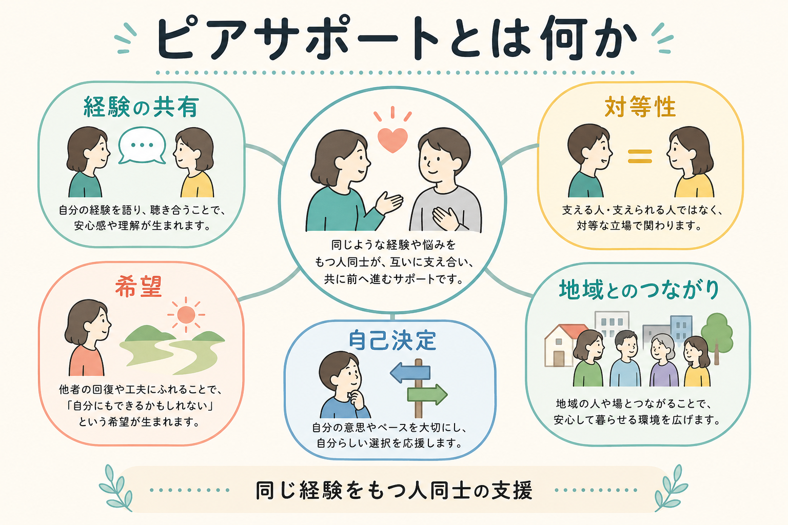
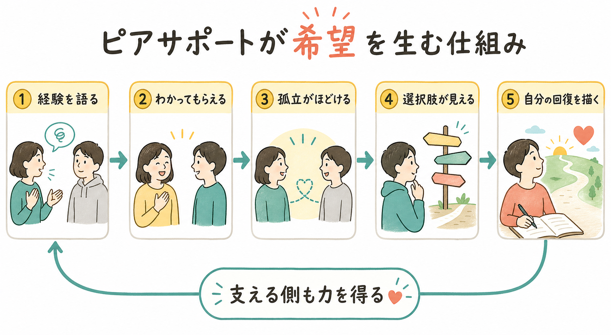

# ピアサポートとは何か

## 要点

- ピアサポートとは、同じような困難や生活経験をもつ人同士が、経験知、共感、希望、実用的な工夫を持ち寄って支え合う営みである。
- 精神保健領域では、ピアサポーターやピアサポートワーカーが、本人の回復、自己決定、地域生活、サービス利用の橋渡しを支える役割を担う。
- 効果研究では、自己報告のリカバリー、エンパワメント、社会的支援などには小から中程度の可能性が示される一方、症状改善や入院抑制への効果は一貫しない。
- ピアサポートは専門職支援の代替ではなく、[[共同意思決定とは何か]]、[[意思決定支援とは何か]]、[[地域移行支援とは何か]]、[[地域定着支援とは何か]]と組み合わせて機能する。
- 医療・福祉制度に組み込む場合は、対等性、任意性、境界、守秘、スーパービジョン、合理的配慮を明確にする必要がある。

## この記事で答える問い

この記事では、ピアサポートを「経験を共有する人同士の支援」として捉え、その独自性、回復や希望に働く仕組み、専門職支援との違い、研究上わかっていることと限界を整理する。個別の診断や治療方針を決めるためではなく、地域精神医療・障害福祉・当事者活動を理解するための基礎ノートである。

## まず結論

ピアサポートの核は、「同じような経験をもつ人だからこそ届く支援」である。SAMHSAは、ピアサポートワーカーを、回復過程の経験をもち、似た状況にいる人を支える人として説明し、共有された理解、尊重、相互のエンパワメントが回復過程への参加を支えると整理している[1]。WHOも、精神保健サービスにおけるピアサポートを、経験の共有、希望、エンパワメント、人権尊重を促す地域精神保健サービスの一部として位置づけている[2]。

ただし、ピアサポートは「体験談を聞かせること」だけではない。本人が何を大切にし、どのような生活を望み、どの支援を受けたいかを一緒に考える実践であり、[[精神疾患とリカバリー志向支援はどう関係するのか]]と深く関係する。支援の焦点は、症状を直接治すことだけでなく、孤立をほどき、希望を見える形にし、本人が選べる選択肢を増やすことにある。

## 背景

精神医療は長く、診断、治療、リスク管理、入院制度を中心に発展してきた。その一方で、当事者運動、セルフヘルプグループ、リカバリー運動は、「専門家が支援する人、患者が支援される人」という一方向の関係だけでは見落とされる経験知を可視化してきた。

リカバリー研究では、回復は単に症状が消えることではなく、つながり、希望、アイデンティティ、意味、エンパワメントを含む個人的なプロセスとして整理されている[4]。この CHIME の枠組みで見ると、ピアサポートは「つながり」と「希望」を作る入口になりやすい。すでに回復途上を歩いている人の存在は、「自分にも別の可能性があるかもしれない」という将来像を具体化する。

日本でも、厚生労働省は障害者ピアサポート体制加算・実施加算、研修事業、研修テキスト、合理的配慮の資料を公開しており、障害福祉サービスの中でピアサポートを評価・実装する制度的枠組みが整えられてきた[3]。

## 基本概念

ピアサポートの「ピア」とは、同じ経験、近い立場、共通する困難をもつ仲間を指す。精神保健領域では、精神疾患、精神的苦痛、入院、福祉サービス利用、家族としての経験、依存症からの回復などが、ピア性の基盤になる。

ピアサポートには少なくとも三つの形がある。

1. 相互支援としてのピアサポート  
   当事者会、セルフヘルプグループ、家族会などで、参加者同士が語り、聴き、情報や生活の工夫を交換する。

2. 役割化されたピアサポート  
   ピアサポーター、ピアスタッフ、ピアサポートワーカーとして、研修やスーパービジョンを受けながら、医療・福祉・地域支援の場で活動する。

3. 協働実践としてのピアサポート  
   専門職、行政、地域資源と協働し、[[ACTとは何か]]、[[IPS援助付き雇用とは何か]]、地域移行・地域定着支援などの中で本人の目標を支える。

ここで重要なのは、ピアサポーターが「小さな専門職」になることではない。専門職は診断、評価、治療計画、リスク対応などの専門知を担う。一方、ピアサポートは経験知、対等性、希望のモデル、生活の工夫を担う。この二つは競合ではなく、本人の生活を中心に協働する関係である。

## 仕組み

ピアサポートが回復や希望に働く仕組みは、単一の技法では説明できない。Gillard らの質的研究は、ピアワーカーによる変化の中心機序として、共有された lived experience に基づく信頼関係、回復のロールモデル、サービスや地域への参加促進を挙げている[5]。

その流れを簡略化すると、次のようになる。

1. 経験を語る  
   「自分だけではなかった」と感じられる語りが、孤立感や恥を弱める。

2. わかってもらえる  
   同じような経験をもつ人の応答は、説明し尽くさなくても伝わる感覚を生む。

3. 孤立がほどける  
   安全な関係の中で、本人が再び人や場所につながる準備ができる。

4. 選択肢が見える  
   制度、生活の工夫、通院、就労、住まい、家族との関係など、実際に試された選択肢を知る。

5. 自分の回復を描く  
   他者の回復を見て、自分なりの生活目標、ペース、支援の使い方を考えられる。

この過程では、支える側も一方的な提供者ではない。ピアサポートには、支えることで自分の経験に意味を見いだし、自己理解や社会的役割を取り戻す側面がある。ただし、支える側の負担や再体験、境界のあいまいさも生じうるため、活動の任意性、役割の明確化、相談できる体制が不可欠である。

## 図解

ピアサポートと専門職支援の違いは、どちらが上かではなく、使っている知識と関係性の軸が違う点にある。専門職支援は、医学・心理学・福祉制度に基づく評価と介入を担う。ピアサポートは、経験知と対等な関係を通じて、本人が支援を選び、地域で暮らすための橋渡しになる。

## 臨床・研究との接続

研究上、ピアサポートの効果は「希望に満ちた万能薬」とは言えない。Cochrane レビューでは、統合失調症など重い精神疾患を対象にしたピアサポート研究について、利用可能なデータが限られ、エビデンスの質が非常に低いため、効果を支持も否定もできないと結論づけている[7]。

一方、より広い精神保健サービスを対象にした一対一ピアサポートのシステマティックレビューでは、自己報告のリカバリーやエンパワメントには控えめな肯定的効果が示される一方、臨床症状やサービス利用には明確な効果が見られにくいと報告されている[6]。2024年のアンブレラレビューも、回復、自己効力感、特定の臨床アウトカムには可能性があるが、結果は混在しており、実装には共同設計、明確な役割、研修、スーパービジョン、組織文化が重要だと整理している[8]。

したがって、ピアサポートの研究的評価では、症状尺度や再入院率だけでなく、本人の回復感、希望、自己効力感、つながり、サービスへのアクセス、意思決定参加、生活の安定を測る必要がある。これは、[[精神科入院で患者の権利をどう守るのか]]や[[精神保健福祉法とは何か]]のような制度的論点とも接続する。本人の経験を制度設計に組み込むことは、権利擁護と支援の質の両方に関わる。

## よくある誤解

### 誤解1: ピアサポートは専門職支援の代わりである

代わりではない。ピアサポートは経験知と対等性を提供するが、診断、薬物療法、心理療法、法的入院判断、リスク評価を単独で担うものではない。専門職支援とピアサポートは、本人の目標を中心に組み合わせる。

### 誤解2: 同じ病名なら誰でもピアになれる

病名が同じであることだけでは十分ではない。語ってよい経験、語らない方がよい経験、相手の選択を尊重する態度、守秘、境界、危機時の連携を学ぶ必要がある。SAMHSAのコアコンピテンシーも、リカバリー志向、本人中心、任意性、関係性、トラウマインフォームドな実践を基礎原則としている[1]。

### 誤解3: 体験談は常に相手を励ます

体験談は希望の資源になりうるが、使い方を誤ると「私もこうしたからあなたもこうすべき」という圧力になる。よいピアサポートでは、体験は処方箋ではなく、本人が自分の選択肢を考えるための材料として差し出される。

### 誤解4: ピアサポーターはいつも元気でなければならない

ピアサポーターも回復の途上にあり、支援の仕事や活動の中で疲弊することがある。だからこそ、スーパービジョン、ピア同士の相談、休む権利、役割の明確化、合理的配慮が必要である[3][8]。

## 関連ノート

既存ノートとして、次のノートと接続しやすい。

- [[精神疾患とリカバリー志向支援はどう関係するのか]]
- [[共同意思決定とは何か]]
- [[意思決定支援とは何か]]
- [[地域移行支援とは何か]]
- [[地域定着支援とは何か]]
- [[ACTとは何か]]
- [[IPS援助付き雇用とは何か]]
- [[精神科入院で患者の権利をどう守るのか]]
- [[精神保健福祉法とは何か]]

今後の作成候補としては、「セルフヘルプグループとは何か」「リカバリーカレッジとは何か」「家族ピアサポートとは何か」「当事者研究とは何か」「トラウマインフォームドケアとは何か」がある。

MOC更新候補: `content/00_MOC/` 配下の精神医学・地域精神医療・リカバリー関連MOCに追加する。

## 理解チェック

1. ピアサポートの強みは、専門知ではなく、どのような知識や関係性に基づいているか。
2. ピアサポートが希望を生む過程を、「経験の共有」「孤立」「選択肢」という語を使って説明できるか。
3. ピアサポートと専門職支援は、どの点で異なり、どの点で協働できるか。
4. 研究上、ピアサポートの効果について、どのアウトカムでは可能性があり、どのアウトカムでは慎重な解釈が必要か。
5. ピアサポーターを制度内に配置するとき、本人とピアサポーター双方を守るために何が必要か。

## 参考文献

[1] Substance Abuse and Mental Health Services Administration. (2026). *Peer Support Workers for Those in Recovery*; *Core Competencies for Peer Workers*. https://www.samhsa.gov/technical-assistance/brss-tacs/peer-support-workers

[2] World Health Organization. (2021). *Peer support mental health services: Promoting person-centred and rights-based approaches*. ISBN: 9789240025783. https://www.who.int/publications/i/item/9789240025783

[3] 厚生労働省. 障害者ピアサポート. https://www.mhlw.go.jp/stf/newpage_41994.html

[4] Leamy, M., Bird, V., Le Boutillier, C., Williams, J., & Slade, M. (2011). Conceptual framework for personal recovery in mental health: Systematic review and narrative synthesis. *The British Journal of Psychiatry, 199*(6), 445-452. https://doi.org/10.1192/bjp.bp.110.083733

[5] Gillard, S., Gibson, S. L., Holley, J., & Lucock, M. (2015). Developing a change model for peer worker interventions in mental health services: A qualitative research study. *Epidemiology and Psychiatric Sciences, 24*(5), 435-445. https://doi.org/10.1017/S2045796014000407

[6] White, S., Foster, R., Marks, J., Morshead, R., Goldsmith, L., Barlow, S., Sin, J., & Gillard, S. (2020). The effectiveness of one-to-one peer support in mental health services: A systematic review and meta-analysis. *BMC Psychiatry, 20*, 534. https://doi.org/10.1186/s12888-020-02923-3

[7] Chien, W. T., Clifton, A. V., Zhao, S., & Lui, S. (2019). Peer support for people with schizophrenia or other serious mental illness. *Cochrane Database of Systematic Reviews, 2019*(4), CD010880. https://doi.org/10.1002/14651858.CD010880.pub2

[8] Cooper, R. E., Saunders, K. R. K., Greenburgh, A., Shah, P., Appleton, R., Machin, K., Jeynes, T., Barnett, P., Allan, S. M., Griffiths, J., Stuart, R., Mitchell, L., Chipp, B., Jeffreys, S., Lloyd-Evans, B., Simpson, A., & Johnson, S. (2024). The effectiveness, implementation, and experiences of peer support approaches for mental health: A systematic umbrella review. *BMC Medicine, 22*, 72. https://doi.org/10.1186/s12916-024-03260-y

## 未解決問題

- 日本の障害福祉・地域精神医療におけるピアサポートの効果を、どのアウトカムで評価するのが妥当か。
- 有償ピアサポーターとボランタリーな当事者活動の関係を、制度化によって損なわずに支えるにはどうすればよいか。
- 専門職中心の組織文化の中で、ピアサポートの独自性を保ちながら安全な協働を実装する条件は何か。
- ピアサポーター自身のウェルビーイング、キャリア、再発予防、合理的配慮をどう保障するか。
