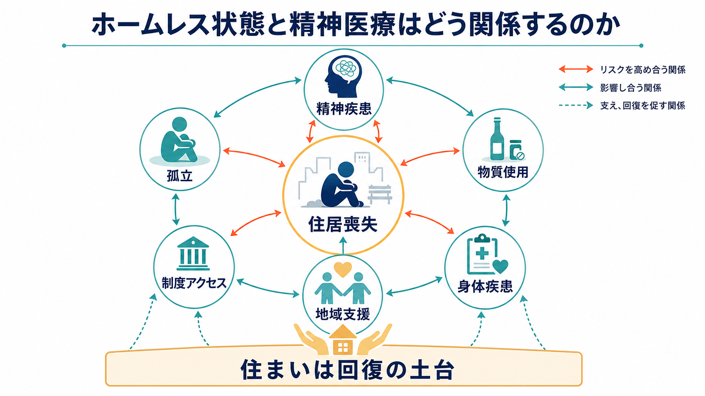
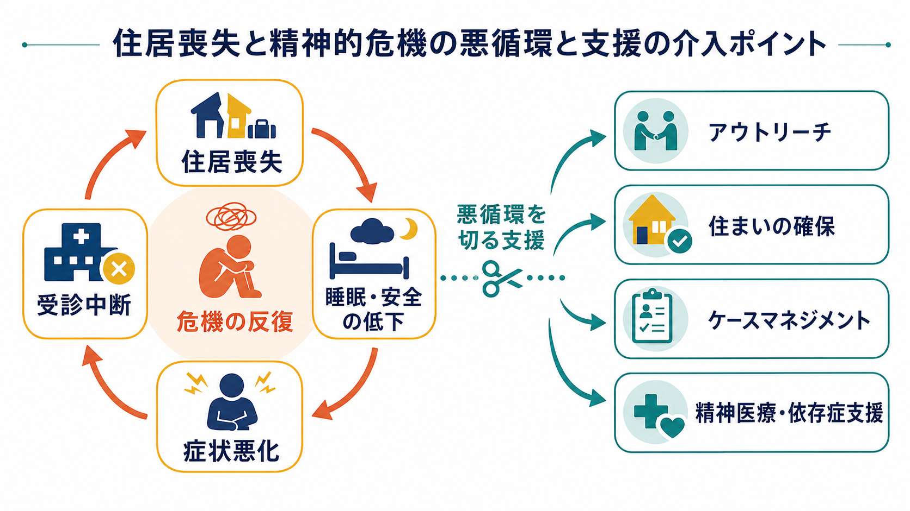
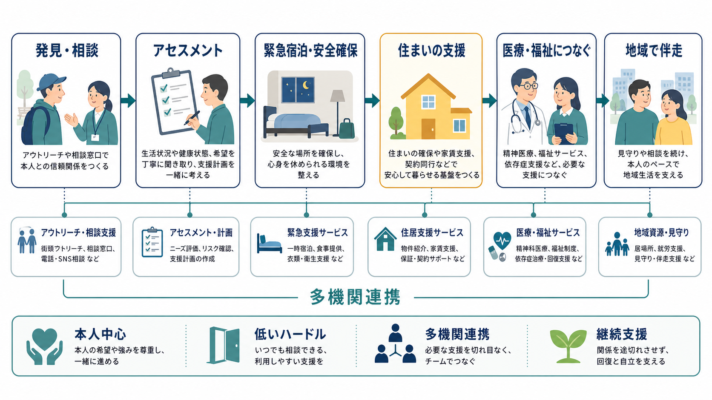

# ホームレス状態と精神医療はどう関係するのか

## 要点

- ホームレス状態は「住まいがない」という単一問題ではなく、貧困、孤立、身体疾患、精神疾患、物質使用、制度アクセスの失敗が重なった状態として理解する。
- 精神疾患や物質使用はホームレス状態のリスクにも結果にもなりうる。高所得国のメタ分析では、ホームレス状態にある人では精神疾患と物質使用障害の有病率が一般人口より高いことが示されている[1]。
- 介入の中心は、診断名だけで人を選別することではなく、安全な住まい、低いハードルの相談、アウトリーチ、依存症支援、身体医療、福祉制度、地域生活支援をつなぐことである[2][3]。
- 日本では、ホームレス自立支援施策、生活困窮者自立支援制度、生活保護、居住支援、精神障害にも対応した地域包括ケアシステムを組み合わせて考える必要がある[4][5][6]。

## この記事で答える問い

1. ホームレス状態と精神疾患・物質使用は、どのように影響しあうのか。
2. 精神科医療は、住居喪失の問題にどこまで関わるべきなのか。
3. 地域支援では、どの制度・支援をどの順番でつなぐとよいのか。

## まず結論

精神医療から見ると、ホームレス状態は「治療につながらない人」の問題ではなく、「治療・福祉・住まい・生活保障が分断されたときに、もっとも不利な人へ負荷が集中する」問題である。路上生活や不安定居住では、睡眠、安全、服薬保管、通院、身分証・連絡手段、金銭管理、対人関係の維持がすべて難しくなる。その結果、症状悪化、救急受診、入退院、警察・司法との接触、再び住まいを失うことが循環しやすい。

したがって精神科医療の役割は、単に診断と処方を行うことに留まらない。本人の意思を尊重しながら、アウトリーチ、危機介入、ケースマネジメント、依存症支援、身体医療、生活保護・生活困窮者支援、居住支援を同じ支援計画の中に置くことが必要になる。[[ACTとは何か|ACT]] や Housing First 型支援は、この「住まいと支援を同時に届ける」発想を具体化した代表的モデルである[7][8]。

## 背景

日本の行政統計でいう「ホームレス」は、都市公園、河川、道路、駅舎その他の施設を故なく起居の場所として日常生活を営む人を指す。令和8年1月の概数調査では、確認された人数は2,481人で、前年より110人減少した。一方で、この調査は目視調査であり、ネットカフェ、知人宅、簡易宿泊所、車中泊、一時宿泊施設などを行き来する「見えにくい住居不安定」は十分に捉えにくい[4]。

精神医療にとって重要なのは、路上か屋内かという二分法ではなく、住居が生活の基盤として機能しているかである。住所がない、連絡先がない、保険証や身分証を失っている、家賃滞納や退去の危機がある、暴力や搾取から逃れている、退院後の住まいがない、といった状態も精神医療の継続性を大きく損なう。

## 基本概念

**ホームレス状態**  
単なる「家がない状態」ではなく、安定した住まいを基盤に、睡眠、衛生、服薬、食事、金銭管理、対人関係、通院、行政手続きが継続できない状態を含む。日本の法制度上の定義より広く、臨床では「住居不安定」として把握した方が実践的である。

**重複困難**  
精神疾患、物質使用障害、知的障害・発達特性、高齢化、身体疾患、外傷体験、DV、借金、刑事司法との接触、外国籍・言語障壁などが重なる状態を指す。本人の「意欲の欠如」と見える行動の背後に、認知機能、トラウマ、睡眠不足、栄養不良、制度不信があることも多い。

**低いハードルの支援**  
禁酒・断薬、通院継続、書類完備、集団生活への適応を支援開始の条件にしすぎない設計をいう。本人が来所できない場合には、街頭、シェルター、無料低額宿泊所、救急外来、警察、福祉事務所などに支援者側が出向く。

**住まいを治療の前提にする発想**  
Housing First は、治療や断酒を達成してから住まいを得るのではなく、まず恒久的な住まいを確保し、必要な支援を継続的に届ける考え方である。重度精神疾患をもつホームレス状態の人を対象にした複数都市RCTでは、通常支援より住居安定性を改善する結果が報告されている[8]。

## 仕組み

住居喪失と精神症状は、直線的な因果ではなく循環として起こる。失業や家族関係の破綻、家賃滞納、退院後の住居未確保があると、睡眠と安全が損なわれる。睡眠不足や慢性ストレスは、抑うつ、幻聴・妄想、不安、衝動性、飲酒・薬物使用を悪化させやすい。症状が悪化すると、予約受診、服薬、書類提出、金銭管理、対人交渉が難しくなり、さらに住まいから遠ざかる。

この循環を断つには、次の4点を同時に見る必要がある。

1. **安全の確保**  
   急性精神症状、自殺リスク、暴力被害、寒暑、低栄養、感染症、離脱症状を確認する。ここでは診断の精密さより、生命・安全・休息の確保が優先される。

2. **住まいの確保**  
   一時宿泊、シェルター、生活保護による住宅扶助、住居確保給付金、居住支援法人、公営住宅、支援付き住宅などを検討する。生活困窮者自立支援制度は、住まいの支援、就労準備、家計改善、居住支援を組み合わせる制度的入口になる[6]。

3. **継続支援の設計**  
   退院・退所・宿泊先確保の時点で支援が切れると、再び路上化しやすい。[[地域定着支援とは何か]]、[[地域移行支援とは何か]]、訪問看護、相談支援、福祉事務所、保健所、NPO、居住支援法人をつなぐ。

4. **本人中心の目標設定**  
   断酒、就労、服薬、家計管理は重要だが、支援者側の順番を押し付けると関係が切れやすい。まず「今夜眠れる場所」「なくした書類」「痛み」「借金」「会いたくない相手から離れる」など、本人の切迫した課題から始める。

## 図解

上の図の要点は、支援を「医療につなげば終わり」にしないことである。発見・相談、アセスメント、緊急宿泊、住まい、医療、福祉、地域伴走のどこか一つが欠けても、支援は途切れやすい。精神科医療はこの全体の中で、症状評価、危機介入、薬物療法、心理社会的支援、依存症支援、意思決定支援、地域チームとの情報共有を担う。

## 臨床・研究との接続

高所得国のメタ分析では、ホームレス状態にある人の現在の精神疾患有病率は高く、特にアルコール使用障害、薬物使用障害、統合失調症スペクトラム障害、うつ病が重要な課題として報告されている[1]。ただし、これを「ホームレス状態の人は危険である」という意味に読んではならない。むしろ、精神疾患や物質使用がある人ほど、住まいを失った後に回復資源から切り離されやすいという構造的リスクを示している。

ACTのメタ分析では、重度精神疾患をもつホームレス状態の人に対して、通常のケースマネジメントよりホームレス状態の減少と症状改善に利点があると報告された[7]。ACTは、少人数担当、チーム責任、アウトリーチ、24時間対応、医療と生活支援の統合を特徴とする。日本の実装では制度・財源・人員配置が異なるため、海外モデルの名称だけを輸入するのではなく、[[ACTとは何か]]、訪問看護、相談支援、生活保護ケースワーク、居住支援を地域内でどう組むかが重要になる。

Housing First 型のRCTでは、住居の安定性の改善が一貫して示されている一方、精神症状、物質使用、救急利用、QOLへの効果は対象者、支援強度、地域資源、追跡期間によってばらつく[8]。これは「住まいだけで全てが解決する」という意味ではない。住まいは回復の土台だが、孤立、依存症、トラウマ、身体疾患、債務、就労、家族関係には継続的支援が必要である。

日本の制度では、ホームレス自立支援施策が雇用、保健医療、福祉を総合的に進める方針を示し、生活困窮者自立支援制度が住まい・就労・家計・相談の入口を担う[5][6]。さらに、精神障害にも対応した地域包括ケアシステムでは、医療、障害福祉・介護、住まい、社会参加、地域の助け合い、教育を包括的に確保する理念が示されている[3]。ホームレス状態への精神医療は、この複数制度の接点で実践される。

## よくある誤解

**誤解1: 精神疾患があるからホームレスになる**  
精神疾患はリスクの一つだが、家賃、雇用、家族関係、差別、退院支援、社会保障、住宅市場も同じくらい重要である。精神疾患だけに原因を還元すると、住まいと所得保障の問題が見えなくなる。

**誤解2: まず治療意欲を確認してから支援するべき**  
重い不眠、寒暑、空腹、恐怖、離脱症状がある状況で、安定した治療意欲を求めるのは非現実的である。信頼関係は、本人が必要としている具体的支援を届ける中で形成される。

**誤解3: 住まいを提供すると物質使用が悪化する**  
Housing First は「支援なしに部屋だけ渡す」方法ではない。住まいを確保したうえで、依存症支援、精神医療、ケースマネジメント、ピアサポートを継続する設計である[2][8]。

**誤解4: 精神科病院に入院すれば解決する**  
入院は急性期の安全確保には有用だが、退院後の住まい、所得、通院、服薬、地域支援がなければ再び危機化する。入院の出口である[[地域移行支援とは何か|地域移行支援]]と[[地域定着支援とは何か|地域定着支援]]が重要になる。

## 関連ノート

- [[ACTとは何か]]
- [[地域移行支援とは何か]]
- [[地域定着支援とは何か]]
- [[精神保健福祉法とは何か]]
- [[精神科入院で患者の権利をどう守るのか]]
- [[意思決定支援とは何か]]
- [[IPS援助付き雇用とは何か]]

## MOC更新候補

- `content/00_MOC/` 配下の地域精神医療・制度系MOCに、本記事へのリンクを追加する候補。
- 並列ジョブとの競合を避けるため、本記事作成時点ではMOCファイル本体は更新しない。

## 理解チェック

1. ホームレス状態を「住所がない」だけでなく、生活基盤の喪失として見る理由は何か。
2. 住居喪失と精神症状・物質使用の悪循環を断つ支援には、どの機関が関わる必要があるか。
3. Housing First と「治療を終えてから住まいを得る」モデルは、支援の順番がどう違うか。
4. 精神科医療がホームレス支援に関わるとき、診断と処方以外にどの役割があるか。

## 参考文献

[1] Gutwinski, S., Schreiter, S., Deutscher, K., & Fazel, S. (2021). The prevalence of mental disorders among homeless people in high-income countries: An updated systematic review and meta-regression analysis. *PLOS Medicine, 18*(8), e1003750. https://doi.org/10.1371/journal.pmed.1003750

[2] Substance Abuse and Mental Health Services Administration. (2025). *Homelessness Programs and Resources*. https://www.samhsa.gov/homelessness-programs-resources

[3] 厚生労働省. 精神障害にも対応した地域包括ケアシステムの構築について. https://www.mhlw.go.jp/stf/seisakunitsuite/bunya/chiikihoukatsu.html

[4] 厚生労働省. (2026). ホームレスの実態に関する全国調査（概数調査）結果について（令和8年1月調査）. https://www.mhlw.go.jp/stf/newpage_72779.html

[5] 厚生労働省・国土交通省. (2023). ホームレスの自立の支援等に関する基本方針（令和5年7月31日告示第1号）. https://www.mhlw.go.jp/web/t_doc?dataId=00013030&dataType=0&pageNo=1

[6] 厚生労働省. 生活困窮者自立支援制度. https://www.mhlw.go.jp/stf/seisakunitsuite/bunya/0000059425.html

[7] Coldwell, C. M., & Bender, W. S. (2007). The effectiveness of assertive community treatment for homeless populations with severe mental illness: A meta-analysis. *American Journal of Psychiatry, 164*(3), 393-399. https://doi.org/10.1176/ajp.2007.164.3.393

[8] Aubry, T., Goering, P., Veldhuizen, S., et al. (2016). A multiple-city RCT of Housing First with assertive community treatment for homeless Canadians with serious mental illness. *Psychiatric Services, 67*(3), 275-281. https://doi.org/10.1176/appi.ps.201400587

## 未解決問題

- 日本で、Housing First 型支援をどの制度財源で安定的に運用するか。
- 精神科救急、生活保護、居住支援、依存症支援、刑事司法が共有できる同意・情報連携の設計。
- 女性、若年者、LGBTQ+、外国籍、知的障害・発達特性をもつ人の「見えにくい住居不安定」をどう把握するか。
- 住居確保後の孤立、近隣トラブル、再入院、再路上化を減らす継続支援の評価指標。

## 更新ログ

- 2026-04-28: 初版作成。ホームレス状態、精神疾患、物質使用、住居支援、地域精神医療の接点を整理。
