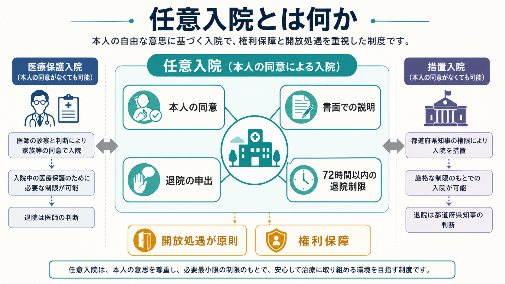
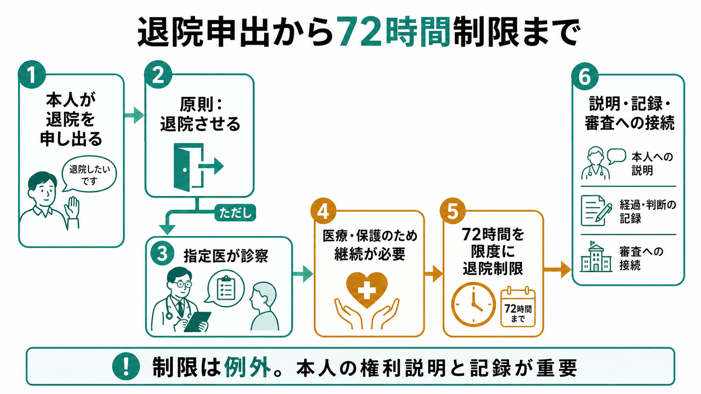
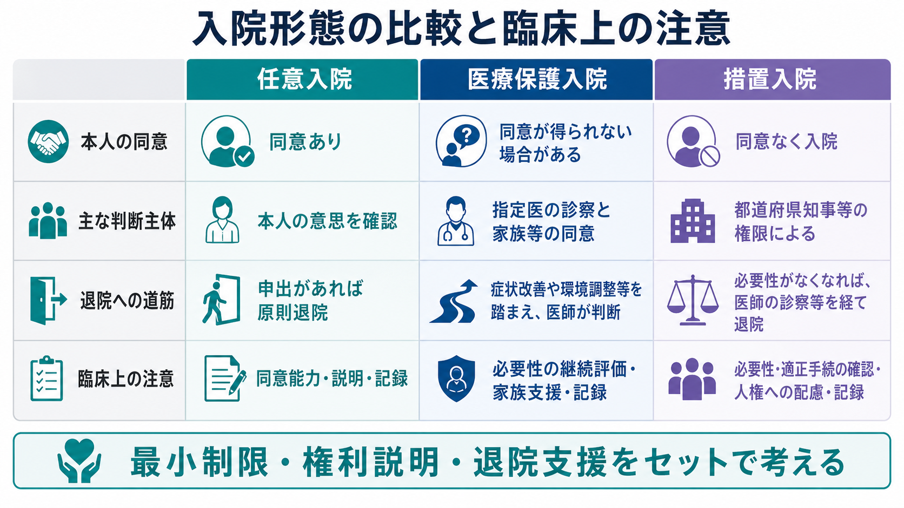

# 任意入院とは何か

## 要点

- 任意入院とは、精神科病院への入院を本人が同意し、自ら入院する形態である。精神保健福祉法は、精神障害者を入院させる場合には本人の同意に基づく入院が行われるよう努めるべきことを定めている[1]。
- 入院時には、退院等の請求に関することなどを本人へ書面で知らせ、本人から自ら入院する旨を記載した書面を受ける必要がある[1][2]。
- 任意入院者から退院の申出があれば、原則として退院させなければならない。ただし、指定医の診察で医療及び保護のため入院継続が必要と認められる場合、72時間を限度に退院させないことができる[1]。
- 臨床上は、単に「同意書があるか」ではなく、[[同意能力の評価はどのように行うのか|同意能力]]、説明の理解、退院申出への対応、開放処遇、記録、退院支援を一体として見る必要がある。

## この記事で答える問い

1. 任意入院は、医療保護入院や措置入院と何が違うのか。
2. 任意入院の入院時手続きでは、何を説明し、何を記録するのか。
3. 本人が退院を申し出たとき、どのような原則と例外があるのか。
4. 臨床では、同意能力、開放処遇、退院支援、入院形態の切替えをどう考えるべきか。

## まず結論

任意入院は、精神科入院の中で最も本人の意思を中心に置く入院形態である。したがって、中心にあるのは「病院が入院させること」ではなく、「本人が説明を受け、入院に同意し、退院を申し出る権利を保ったまま治療を受けること」である[1][4]。

ただし、任意入院は「完全に自由で、病院側には何の制限もできない」という制度ではない。本人が退院を申し出た場合でも、指定医の診察により医療及び保護のため入院継続が必要と認められるときは、72時間を限度に退院制限が可能である[1]。重要なのは、この例外を通常運用のように扱わず、理由、診察、説明、記録、権利保障を明確にすることである[3]。

## 背景

精神科入院は、本人の自由、身体の安全、治療の必要性、家族・地域の支援、社会的リスクが重なり合う場面で使われる。日本の精神科入院制度では、本人が入院に同意する任意入院、本人の同意が得られない場合に一定の要件で行われる医療保護入院、自傷他害のおそれに対して都道府県知事等の権限で行われる措置入院などが区別される[4]。

この区別は、単なる事務分類ではない。入院形態は、本人の意思をどの程度尊重できているか、誰が入院の必要性を判断するか、どのような権利保障が必要かを示す枠組みである。任意入院は、本人の治療参加と[[共同意思決定とは何か|共同意思決定]]に最も近い形態だが、精神症状、危機状況、家族関係、社会資源の不足によって、実際の同意が形式化しやすい。

## 基本概念

### 本人の同意に基づく入院

任意入院の基本は、本人が入院に同意していることである。精神保健福祉法第20条は、精神科病院の管理者に対し、精神障害者を入院させる場合には本人の同意に基づいて入院が行われるよう努めることを求めている[1]。

ここでの同意は、単に署名があるという意味だけではない。臨床的には、本人が入院の目的、見通し、代替案、入院しない場合に起こりうること、退院を申し出る権利を理解し、自分の状況に照らして考えられることが重要である。患者の自己決定と必要な情報提供は、医療倫理上も中核的な患者の権利として位置づけられる[5]。これは[[インフォームドコンセントは精神科でどう行うのか|インフォームドコンセント]]や[[意思決定能力とは何か|意思決定能力]]の問題と直結する。

### 書面による説明

任意入院では、病院管理者は入院に際して、退院等の請求に関することなど厚生労働省令で定める事項を本人へ書面で知らせ、本人から自ら入院する旨を記載した書面を受ける必要がある[1]。厚生労働省は、令和6年度以降に用いる任意入院同意書、任意入院に際してのお知らせ、任意入院者を退院制限した場合の記録、開放処遇の制限に関するお知らせなどの様式を示している[2]。

したがって、任意入院の説明は「入院に同意してください」で終わらない。少なくとも、入院形態、開放処遇が原則であること、退院申出や退院等請求の方法、退院制限がありうる場合、相談・審査の道筋を本人が確認できる形にする必要がある。

### 開放処遇が原則

任意入院者は、本人の意思に基づいて入院しているため、基本的に開放的な環境で処遇されるものとされている[3]。開放処遇を制限する場合には、本人の医療及び保護を図る観点から、症状からみて制限しなければ治療が確保できないと判断される場合に限られる。制裁、懲罰、見せしめとして開放処遇を制限することは許されない[3]。

この点は、[[精神科におけるスティグマをどう扱うか|スティグマ]]や[[精神科面接で境界設定はなぜ必要なのか|境界設定]]とも関係する。安全確保を理由にする場合でも、本人の尊厳、説明、見直し、記録を欠くと、治療関係そのものを損ないうる。

## 仕組み

### 入院時

任意入院の開始時には、本人の同意、書面による説明、本人が自ら入院する旨を記載した書面が要点となる[1][2]。臨床的には、次の点を確認する。

| 確認すること | 臨床上の意味 |
|---|---|
| 入院目的 | 休養、症状評価、薬物療法調整、安全確保、生活再建などを具体化する |
| 本人の理解 | 入院の理由、見通し、退院の道筋を本人の言葉で確認する |
| 同意能力 | 理解、認識、比較検討、選択表明が保たれているかを見る |
| 退院申出の権利 | 退院したいときに誰へ、どのように伝えればよいかを説明する |
| 記録 | 説明内容、本人の反応、同意の根拠、支援者同席の有無を残す |

### 退院申出

任意入院者から退院の申出があった場合、病院管理者は原則として退院させなければならない[1]。この原則は、任意入院の根幹である。本人が同意して入院している以上、その同意を撤回する意思表示は制度上重く扱われる。

ただし、指定医による診察の結果、医療及び保護のため入院継続が必要と認められる場合には、72時間を限度に退院させないことができる[1]。厚生労働省の指導監督資料では、退院請求があった場合に医師の診察に基づき適切に対処しているか、72時間以内の退院制限を行った場合に精神保健指定医の診察に基づく診療録記載があるかが確認項目として挙げられている[3]。

### 退院等請求・処遇改善請求

任意入院者を含む入院者には、退院等の請求や処遇改善の請求という権利保障の仕組みがある。精神保健福祉法第38条の4は、本人または一定の関係者が、都道府県知事等に退院または処遇改善を求められることを定めている[1]。請求は、病院内だけで完結しない外部審査への接続であり、本人の権利を守る重要な安全弁である。

臨床では、退院等請求を「治療への反抗」とみなすのではなく、本人が制度上の権利を行使しているものとして扱う必要がある。説明を受けたか、請求先を知っているか、書類や電話へのアクセスが妨げられていないかも確認点になる。

## 図解

任意入院は、同意、説明、退院申出、72時間以内の退院制限、開放処遇、権利保障をまとめて理解すると混乱しにくい。

| 入院形態 | 本人の同意 | 主な判断主体 | 退院への道筋 | 注意点 |
|---|---:|---|---|---|
| 任意入院 | あり | 本人の同意と医療者の説明 | 退院申出があれば原則退院 | 同意能力、説明、開放処遇、記録 |
| 医療保護入院 | 得られない場合がある | 指定医の診察と家族等の同意など | 法定手続きと退院支援 | 本人の権利説明、家族等同意の適正性 |
| 措置入院 | 本人同意を前提としない | 都道府県知事等と複数指定医 | 措置症状の消退等 | 自傷他害のおそれ、行政処分性、権利保障 |

## 臨床・研究との接続

### 同意能力を過大評価しない

任意入院では、本人が「入院します」と言っているため、同意能力の評価が浅くなりやすい。しかし、急性精神症状、強い不安、希死念慮、家族からの圧力、住居や経済的困難、薬物・アルコールの影響がある場合、本人の選択がどの程度理解と比較検討に支えられているかは慎重に見る必要がある。

逆に、精神疾患の診断があることだけで同意能力がないと決めるのも誤りである。必要なのは、特定の入院判断について、本人が何を理解し、何を重視し、どのような理由で同意しているかを具体的に確認することである。

### 退院申出を治療関係の情報として扱う

退院申出は、単なる手続きではなく、本人の苦痛、不信、環境への不適応、薬物療法への不安、家族関係、仕事や学業への懸念を示す臨床情報でもある。したがって、退院したい理由を聞くことは、退院を妨げるためではなく、本人の困りごとを理解し、外泊、環境調整、家族面接、地域支援、危機計画へつなぐために行う。

この点は、[[精神科治療計画はどのように立てるのか|治療計画]]、[[精神科で多職種連携はなぜ重要なのか|多職種連携]]、[[地域連携は精神科診療で何を意味するのか|地域連携]]と結びつく。任意入院は、退院を遅らせる制度ではなく、退院後の生活に接続する治療環境として設計されるべきである。

### 記録は防衛ではなく説明責任の道具

任意入院では、説明内容、本人の理解、同意の根拠、退院申出への対応、退院制限の理由、指定医診察の内容、開放処遇制限の理由と見直しを記録することが重要である[2][3]。[[診療録は精神科でどう書くべきか|診療録]]は、後から責任を回避するためだけの文書ではなく、本人の権利、治療判断、チーム内共有、外部審査に耐える説明責任を支える道具である。

### 研究上の注意

精神科入院制度を研究する場合、入院形態だけをアウトカムや重症度の代理変数として使うと誤解が生じる。任意入院であっても重症例はあり、医療保護入院であっても短期で退院する場合がある。入院形態は、症状、同意能力、家族・地域資源、病院の運用、法制度、地域差が重なった結果として観察される。

そのため、研究では入院形態、退院までの日数、再入院、退院支援、身体拘束・隔離、本人の経験、権利説明の有無、地域資源への接続などを分けて扱う必要がある。

## よくある誤解

### 誤解1：任意入院なら、本人はいつでも即時に退院できる

原則として、本人から退院申出があれば退院させなければならない。しかし、指定医の診察で医療及び保護のため入院継続が必要と認められる場合には、72時間を限度に退院制限が可能である[1]。ただし、これは例外であり、診察、理由、説明、記録、権利保障が伴わなければならない[3]。

### 誤解2：同意書があれば任意入院として十分である

同意書は重要だが、それだけで臨床的に十分とはいえない。本人が説明を理解したか、退院申出の権利を知っているか、同意が強い圧力のもとで形式化していないか、入院後も同意が維持されているかを確認する必要がある。

### 誤解3：退院を申し出る人は病識がない

退院申出には、病識の乏しさが関係する場合もあるが、それだけではない。病棟環境への不安、仕事や家族への責任、薬への不信、睡眠困難、過去の入院体験、経済的負担など、多くの理由がありうる。理由を聞くことは、本人を説得するためではなく、治療と支援を再設計するために必要である。

### 誤解4：任意入院から医療保護入院への切替えは、家族が希望すればできる

入院形態の切替えは、本人の同意が失われた、医療及び保護の必要性がある、法定要件を満たすなどの条件に基づいて慎重に判断されるべきである。厚生労働省の指導監督資料でも、病状の悪化がないのに家族の要望等で医療保護入院に切り替えていないかが確認項目とされている[3]。

## 関連ノート

- [[司法精神医学とは何か]]
- [[インフォームドコンセントは精神科でどう行うのか]]
- [[同意能力の評価はどのように行うのか]]
- [[意思決定能力とは何か]]
- [[共同意思決定とは何か]]
- [[精神科救急では何を優先するべきか]]
- [[精神科治療計画はどのように立てるのか]]
- [[診療録は精神科でどう書くべきか]]
- [[地域連携は精神科診療で何を意味するのか]]

### MOC更新候補

- `content/00_MOC/MOC｜精神医学.md` の `司法・制度・地域精神医療` 領域に追加候補。
- 今後、医療保護入院、措置入院、応急入院、精神医療審査会、退院等請求の個別ノートを作成したうえで、精神科入院制度の小索引を作るとよい。

## 理解チェック

1. 任意入院で入院時に本人へ書面で知らせる必要があるのは、どのような事項か。
2. 任意入院者が退院を申し出たときの原則は何か。
3. 72時間以内の退院制限が認められるのは、どのような場合か。
4. 任意入院において、開放処遇を制限する場合に特に注意すべき点は何か。
5. 任意入院の同意を評価するとき、署名以外に何を確認すべきか。

## 未解決問題

- 任意入院の同意が、本人の自発性と支援環境のどの程度に支えられているかを、臨床現場でどのように安定して評価するか。
- 退院申出後の72時間以内の退院制限が、地域・病院・病棟ごとにどのように運用されているか。
- 任意入院者の開放処遇制限、隔離、身体拘束、退院支援の実態を、本人の経験を含めてどう可視化するか。
- 精神科入院の権利説明を、急性期の認知負荷が高い場面でどのように理解しやすく設計するか。

## 参考文献

[1] e-Gov法令検索. 精神保健及び精神障害者福祉に関する法律（昭和二十五年法律第百二十三号）. https://elaws.e-gov.go.jp/document?lawid=325AC0100000123

[2] 厚生労働省. 精神保健福祉法に基づく入院に関する各種様式（令和6年度4月1日以降に用いるもの）. https://www.mhlw.go.jp/stf/seisakunitsuite/bunya/hukushi_kaigo/shougaishahukushi/kaisei_seisin/youshiki.html

[3] 厚生労働省. 精神科病院に対する指導監督等の徹底について. https://www.mhlw.go.jp/content/001680855.pdf

[4] 国立精神・神経医療研究センター. こころの情報サイト「精神科の入院制度」. https://kokoro.ncnp.go.jp/support_hospitalizatio.php

[5] World Medical Association. WMA Declaration of Lisbon on the Rights of the Patient. https://www.wma.net/policies-post/wma-declaration-of-lisbon-on-the-rights-of-the-patient/
