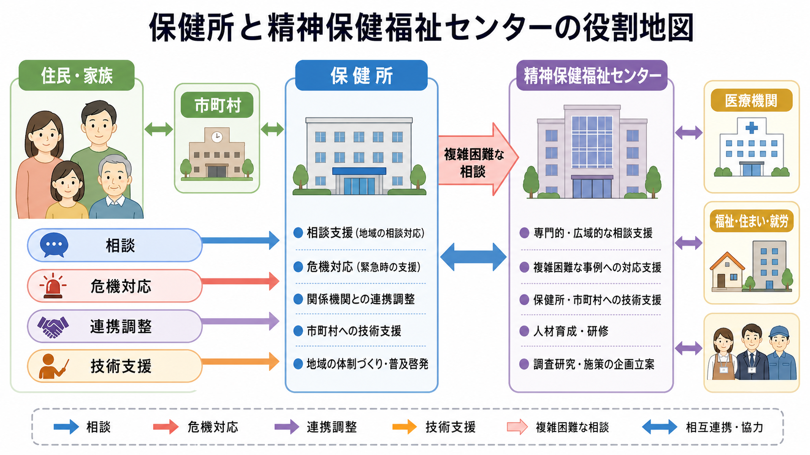
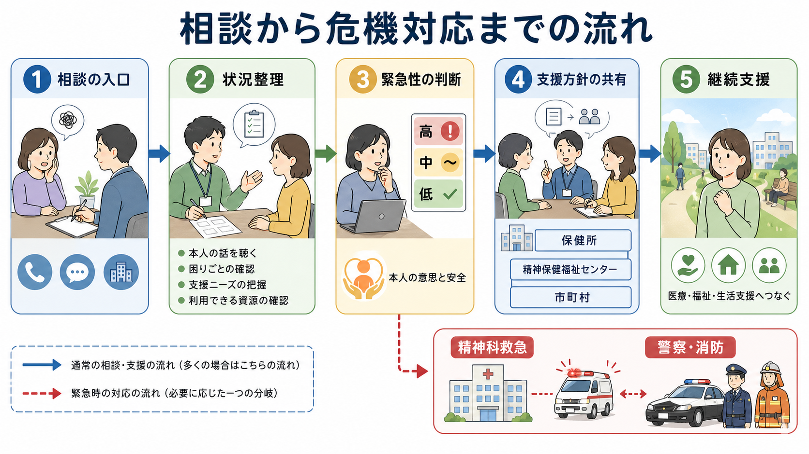
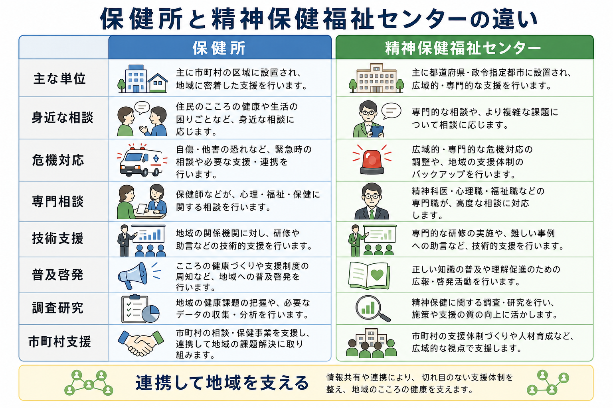

# 保健所と精神保健福祉センターは何をするのか

## 要点

- 保健所は、地域保健法に基づく地域保健の拠点であり、精神保健では住民・家族・関係機関からの相談、訪問、危機時の初期調整、医療・福祉・市町村との連携を担う。
- 精神保健福祉センターは、精神保健福祉法第6条に基づく都道府県・指定都市の専門的な技術センターであり、複雑困難な相談、技術援助、研修、普及啓発、調査研究、精神医療審査会関連事務などを担う[1][2]。
- どちらも「本人を強制的に入院させる機関」ではない。入院制度や危機対応に関わることはあるが、中心は相談、評価、調整、継続支援である。
- 地域精神保健では、市町村、医療機関、障害福祉、介護、住まい、就労、教育、警察・消防などをつなぐ機能が重要である[6][7]。

## この記事で答える問い

1. 保健所と精神保健福祉センターは、地域精神保健で何を担当するのか。
2. 相談、危機対応、入院制度、退院後支援、地域包括ケアの中で、どのように連携するのか。
3. 臨床・研究では、これらの行政機関をどのように理解すればよいのか。

## まず結論

保健所は、地域の現場に近い「広域的・専門的な相談と調整の拠点」である。精神保健の相談を受け、家庭訪問や関係機関連絡を行い、必要に応じて医療機関、福祉サービス、市町村、警察・消防などにつなぐ。地域保健の中核施設として、感染症や母子保健などと同じく、精神保健も地域住民の健康課題として扱う[3][4]。

精神保健福祉センターは、都道府県・指定都市レベルの「専門的な技術センター」である。住民からの相談も受けるが、より特徴的なのは、保健所・市町村・関係機関への技術援助、研修、複雑困難な相談、普及啓発、調査研究である。つまり、保健所が地域現場の調整点になり、精神保健福祉センターが専門性と広域調整を支える、という分担で理解するとよい[2][4]。

## 背景

日本の精神保健医療福祉は、長く入院医療中心の構造をもってきた。しかし近年は、精神障害の有無や程度にかかわらず、地域の一員として安心して暮らせることを目標に、医療、障害福祉・介護、住まい、社会参加、地域の助け合い、教育を包括的に確保する「精神障害にも対応した地域包括ケアシステム」が政策理念として整理されている[6]。

この流れの中で、行政機関の役割も「制度の窓口」だけではなくなった。相談を受ける、危機を見立てる、医療と生活支援をつなぐ、関係機関の協議の場を作る、地域資源を育てる、偏見を減らす、といった複数の機能が求められる[6][7]。

## 基本概念

### 保健所

保健所は、地域住民の健康を支える中核施設であり、地域保健法に基づいて都道府県、指定都市、中核市、特別区などに設置される。厚生労働省は、保健所を疾病予防、衛生向上、地域住民の健康保持増進に関する業務を行う施設として説明している[3]。

精神保健の領域では、保健所は次のような役割を担う。

| 機能 | 内容 |
|---|---|
| 相談 | 本人、家族、近隣、支援者からのこころの健康、受診、生活上の困難に関する相談 |
| 訪問・アウトリーチ | 必要に応じて家庭や関係機関に出向き、状況を確認する |
| 危機対応の調整 | 自傷他害のおそれ、急性精神症状、家族の限界などの場面で、医療・警察・消防・福祉と調整する |
| 入院制度との接続 | [[措置入院とは何か]]、[[応急入院とは何か]]などの行政手続に関わる場面がある |
| 地域連携 | 市町村、相談支援、医療機関、学校、職場、福祉サービスとの連絡調整 |

ただし、保健所はすべてを単独で解決する機関ではない。多くの場合、保健所の仕事は「本人や家族を制度に乗せる」ことではなく、困りごとを整理し、緊急性を見立て、利用可能な支援へつなぐことにある。

### 精神保健福祉センター

精神保健福祉センターは、精神保健福祉法第6条に基づき、都道府県が置くものとされる機関である[1]。運営要領では、精神保健福祉センターを、都道府県・指定都市における精神保健及び精神障害者福祉の「総合的技術センター」と位置づけている[2]。

主な業務は、企画立案、技術指導・技術援助、教育研修、普及啓発、調査研究、資料の収集・分析・提供、精神保健福祉相談、組織育成、精神医療審査会関連事務、精神障害者保健福祉手帳や自立支援医療に関する専門的事務などである[2]。

特に重要なのは、「複雑困難な相談」と「支援者支援」である。依存症、ひきこもり、思春期、発達障害、自殺関連、災害精神保健、トラウマ、家族支援など、一般窓口だけでは扱いにくい課題で専門性を提供する[4]。

## 仕組み

### 1. 相談の入口は一つではない

精神保健の相談は、保健所、精神保健福祉センター、市町村、医療機関、障害福祉、学校、職場、警察、消防、民間支援団体など、複数の入口から始まる。2022年の精神保健福祉法改正以降、都道府県・市町村が実施する精神保健相談支援の対象は、精神障害者だけでなく「精神保健に関する課題を抱える者」に広げて理解されている[6]。

これは、診断名がつく前から相談できる、という意味で重要である。不眠、孤立、家族内の緊張、ひきこもり、依存症、強い不安、希死念慮、近隣トラブルなどは、医療だけでなく生活・家族・地域の問題として整理される。

### 2. 危機対応は「強制入院」だけではない

危機対応では、まず緊急性と安全性を見立てる。自傷他害のおそれ、意識障害や身体疾患、薬物・アルコール、虐待やDV、住まいの喪失、家族の疲弊などが関係する。必要に応じて精神科救急、身体救急、警察・消防、福祉、児童・高齢・障害部門が連携する[7]。

入院が必要な場合でも、最初に検討されるべきは本人の意思を尊重した受診・入院である。[[任意入院とは何か]]、[[措置入院とは何か]]、[[応急入院とは何か]]などの制度は、本人の同意、緊急性、診察体制、行政手続、権利擁護の条件が異なる。保健所や都道府県はこれらの手続に関わるが、制度の目的は罰や排除ではなく、医療と安全確保を法的条件のもとで行うことにある[1]。

### 3. 支援は「受診につなげて終わり」ではない

地域精神保健では、受診につながった後も支援は続く。服薬や診察だけでは、住まい、収入、家族関係、孤立、仕事、学校、介護、司法的課題は解決しないことが多い。精神障害にも対応した地域包括ケアシステムでは、医療、障害福祉・介護、住まい、社会参加、地域の助け合い、教育を包括的に確保することが重視される[6]。

このため、保健所や精神保健福祉センターは、個別相談だけでなく、協議の場づくり、研修、事例検討、地域資源の把握、関係者間の役割整理にも関わる。支援の質は、個々の専門職の力量だけでなく、地域のネットワーク設計に左右される。

## 図解

| 比較軸 | 保健所 | 精神保健福祉センター |
|---|---|---|
| 法的位置づけ | 地域保健法に基づく地域保健の拠点 | 精神保健福祉法に基づく都道府県・指定都市の専門機関 |
| 主な射程 | 地域住民の健康、保健医療、生活上の相談と調整 | 精神保健福祉の専門相談、技術支援、研修、調査研究 |
| 精神保健での強み | 住民・家族・関係機関との近接性、訪問、危機時の地域調整 | 複雑困難事例、依存症・ひきこもり等の専門性、支援者支援 |
| 連携先 | 市町村、医療機関、福祉、警察・消防、学校、職場 | 保健所、市町村、医療・福祉・教育・労働機関、当事者団体 |
| 誤解されやすい点 | 入院させる窓口だけではない | 住民相談だけの窓口ではない |

## 臨床・研究との接続

臨床では、保健所や精神保健福祉センターを「行政の外部機関」とだけ見ると、支援の設計を見誤りやすい。急性期症状の評価、入院制度、退院後支援、家族支援、自殺リスク、依存症、ひきこもり、虐待、住まいの問題は、診療室の中だけでは完結しない。[[意思決定支援とは何か]]や権利擁護の観点からも、本人の希望、安全、生活環境を同時に扱う必要がある。

研究では、地域差と実装過程が重要になる。同じ制度名でも、保健所の所管人口、精神科救急の受け皿、訪問支援の有無、市町村の相談力、障害福祉サービスの密度、家族会・当事者団体の活動、精神保健福祉センターの専門プログラムによって、実際の支援経路は大きく変わる。したがって、制度研究やサービス研究では、単に「保健所相談あり・なし」を測るだけでなく、相談後にどの機関へつながり、どの程度継続し、本人の生活上のアウトカムに何が起きたかを見る必要がある。

国際的にも、WHO は地域に根ざした本人中心・権利基盤型のメンタルヘルスサービスを重視している[8]。日本の保健所・精神保健福祉センターを理解する際にも、危機管理と権利擁護、医療アクセスと地域生活支援を対立させずに設計する視点が必要である。

## よくある誤解

### 誤解1: 保健所に相談すると、すぐ強制入院になる

誤りである。保健所相談の多くは、困りごとの整理、受診相談、家族支援、関係機関連携、生活支援への接続である。[[措置入院とは何か]]に関わる場面はあるが、それは法的要件と手続に基づく例外的な危機対応であり、相談一般と同一視してはならない[1]。

### 誤解2: 精神保健福祉センターは、精神科病院の紹介窓口である

これも狭すぎる理解である。精神保健福祉センターは、相談だけでなく、保健所・市町村・関係機関への技術援助、研修、普及啓発、調査研究を担う。個別相談を支える「地域の支援力」を高める機関でもある[2][4]。

### 誤解3: 市町村、保健所、精神保健福祉センターのどこに相談するかを、住民が正確に判断しなければならない

実際には、住民が最初から制度を正確に見分ける必要はない。重要なのは、どこかの入口につながった後に、関係機関が適切に役割分担し、必要な支援へつなぐことである。精神保健福祉相談員のような職員は、相談対応や訪問指導を通じて、この接続を支える[5]。

### 誤解4: 危機対応は本人の権利と対立する

危機対応は、本人の自由を制限する場面を含みうるため、権利擁護と緊張関係にある。しかし、だからこそ手続、説明、最小限性、退院後支援、[[精神科医療における行動制限最小化とは何か]]が重要になる。危機対応の目的は、本人を地域から排除することではなく、安全を確保しながら生活に戻る道を作ることである。

## 関連ノート

- [[精神保健福祉法とは何か]]
- [[措置入院とは何か]]
- [[応急入院とは何か]]
- [[任意入院とは何か]]
- [[精神科入院で患者の権利をどう守るのか]]
- [[意思決定支援とは何か]]
- [[自殺対策基本法とは何か]]

## 理解チェック

1. 保健所と精神保健福祉センターの違いを、「身近な相談・危機調整」と「専門的技術センター」という観点から説明できるか。
2. 精神保健の相談が、診断名や入院制度だけでなく、住まい、家族、福祉、就労、教育と関係する理由を説明できるか。
3. 危機対応を、強制入院だけでなく、評価、説明、連携、継続支援の流れとして説明できるか。
4. 「精神障害にも対応した地域包括ケアシステム」が、保健所・精神保健福祉センターの役割にどのような意味を持つか説明できるか。

## 関連ノート候補・MOC更新候補

- 関連ノート候補: 「精神科救急とは何か」「保健所における精神保健相談とは何か」「精神保健福祉センターとは何か」「退院後支援とは何か」「地域精神保健における協議の場とは何か」。
- MOC更新候補: `content/00_MOC/MOC｜精神医学.md`、地域精神医療・制度関連 MOC。並列生成ジョブとの競合を避けるため、本タスクでは MOC 本体は更新しない。

## 未解決問題

- 市町村の相談支援体制が強化される中で、保健所と精神保健福祉センターの役割分担を地域差を踏まえてどう再設計するか。
- 危機対応における権利擁護、本人参加、安全確保、家族支援を同時に評価する指標をどう作るか。
- 相談支援や技術援助の効果を、入院率や再入院率だけでなく、生活の質、孤立の減少、支援継続、本人の経験からどう測定するか。

## 参考文献

[1] e-Gov法令検索. 精神保健及び精神障害者福祉に関する法律. https://laws.e-gov.go.jp/law/325AC0100000123

[2] 厚生労働省. 精神保健福祉センター運営要領. https://www.mhlw.go.jp/content/001172621.pdf

[3] 厚生労働省. 地域保健. https://www.mhlw.go.jp/stf/seisakunitsuite/bunya/tiiki/

[4] 厚生労働省 e-ヘルスネット. 精神保健福祉センターと保健所. https://kennet.mhlw.go.jp/information/information/heart/k-08-003.html

[5] 厚生労働省. 精神保健福祉相談員について. https://www.mhlw.go.jp/stf/seisakunitsuite/bunya/seishinhokenfukushisoudanin.html

[6] 厚生労働省. 精神障害にも対応した地域包括ケアシステムの構築について. https://www.mhlw.go.jp/stf/seisakunitsuite/bunya/chiikihoukatsu.html

[7] 厚生労働省. 「精神障害にも対応した地域包括ケアシステムの構築に係る検討会」報告書. https://www.mhlw.go.jp/stf/shingi2/0000152029_00003.html

[8] World Health Organization. (2021). *Guidance on community mental health services: Promoting person-centred and rights-based approaches*. https://www.who.int/publications/i/item/9789240025707
