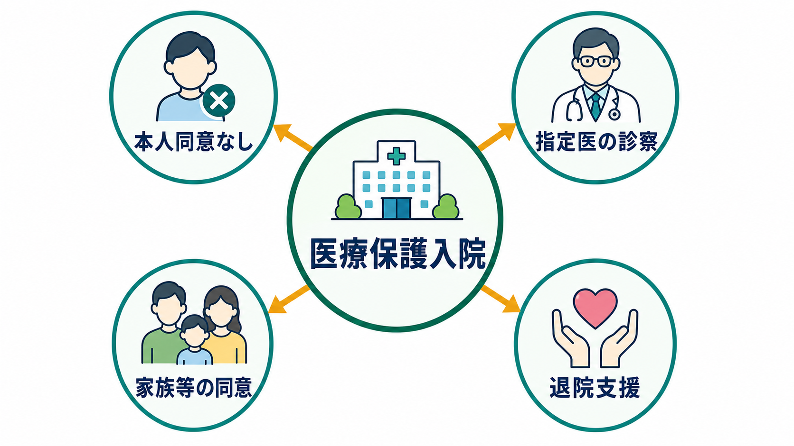
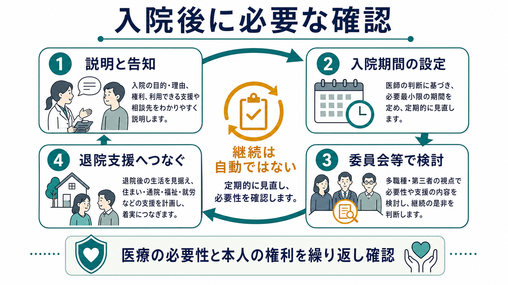
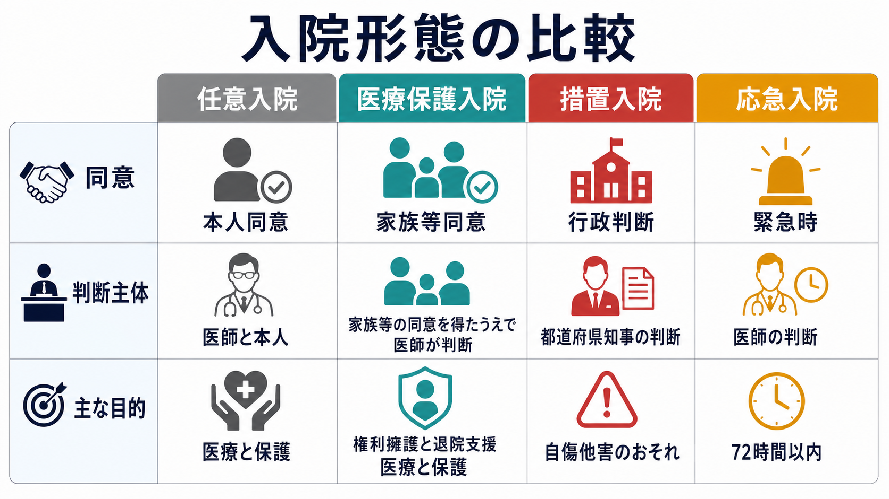

# 医療保護入院とは何か

## 要点

- 医療保護入院は、本人の同意による入院ができない場合に、精神保健指定医が「入院による医療及び保護が必要」と判断し、家族等または市町村長の同意を得て行う精神科入院である[1][2]。
- 制度の目的は「説得して従わせること」ではなく、本人の安全・治療機会・生活再建を確保しつつ、自由の制約を最小化することである[1][3]。
- 2024年4月施行の改正では、医療保護入院の期間を定め、更新時に要件を再確認する仕組みが強められた[2][3]。
- 倫理的には、本人の意思、[[意思決定能力とは何か]]、[[共同意思決定とは何か]]、権利擁護、退院支援を同時に考える必要がある[4][5]。
- 本記事は教育・研究目的の概説であり、個別事例の診断、入院適否、法的判断を指示するものではない。

## この記事で答える問い

1. 医療保護入院は、[[任意入院とは何か]]や措置入院と何が違うのか。
2. 「本人同意がない入院」を、どのような要件で正当化しているのか。
3. 家族等の同意は、本人の意思の代替なのか、制度上の要件なのか。
4. 臨床では、どこに倫理的な注意点があるのか。
5. 退院支援と権利擁護は、なぜ入院開始時から考えるべきなのか。

## まず結論

医療保護入院は、本人の同意が得られない精神障害者について、指定医の医学的判断と家族等または市町村長の同意を組み合わせ、精神科病院への入院を可能にする制度である[1]。ただし、これは「本人の意思を無視してよい制度」ではない。むしろ、本人同意が得られないという重い状況だからこそ、説明、記録、退院支援、第三者的な検討、権利救済の導線を強く要求する制度として理解する必要がある[2][3]。

## 背景

精神科入院には、本人が同意して入院する任意入院、本人同意が得られないが医療と保護が必要な場合の医療保護入院、自傷他害のおそれを行政が判断する措置入院、緊急性に対応する応急入院などがある[1][6]。医療保護入院は、その中でも「本人同意がないが、措置入院ほどの行政的危険性判断ではなく、医療と保護の必要性が中心になる」入院形態である。

ここで重要なのは、入院形態が診断名だけで決まるわけではない点である。統合失調症、双極症、重度うつ病、認知症、物質使用関連障害など、さまざまな状態で医療保護入院が検討されうるが、診断名そのものではなく、本人の意思表示、同意能力、医療上の必要性、安全、家族や地域支援の状況を合わせて判断する[1][3]。

## 基本概念

### 本人同意が得られない

医療保護入院の出発点は、本人の同意による入院、すなわち任意入院が成立しないことである[1]。ただし「本人が入院したくないと言った」だけで直ちに医療保護入院になるわけではない。説明の仕方、時間の置き方、苦痛や不信への対応、家族・支援者の同席、身体疾患や薬物影響の確認など、本人が理解しやすく意思を表明しやすい条件を整えることが先にある。

本人が拒否している場合でも、その拒否が十分に理解・比較・推論された意思なのか、急性精神症状、せん妄、強い恐怖、被害妄想、躁状態、希死念慮、認知機能低下などに強く左右されているのかは分けて考える必要がある。この点は[[意思決定能力とは何か]]と密接に関係する。

### 医療及び保護の必要

精神保健福祉法上、医療保護入院は、精神保健指定医によって入院による医療及び保護が必要と判断されることが要件になる[1]。ここでの「保護」は、本人を社会から隔離するという意味ではなく、放置すれば本人の生命・健康・生活が大きく損なわれる状況に対し、安全な治療環境を確保するという意味で理解するべきである。

臨床的には、急性精神病症状による著しい判断低下、重度の自傷リスク、食事・水分摂取の著しい低下、服薬や診療の完全中断、家庭内での重大な破綻、身体合併症を伴う精神症状などが検討対象になりうる。ただし、入院以外の支援で対応できるなら、より制限の少ない選択肢を優先するのが倫理的原則である[4][5]。

### 家族等または市町村長の同意

医療保護入院では、家族等のうち一定の者、または家族等がいない・意思表示できないなどの場合には市町村長の同意が要件になる[1][2]。この同意は、本人の価値観を完全に代替する魔法の署名ではない。制度上は入院を開始するための要件であり、臨床上は本人の生活史、普段の意思、支援資源、退院後の生活を確認する重要な接点である。

したがって家族等に対しても、本人の状態、入院の目的、想定される期間、退院支援、権利救済の仕組みを説明する必要がある。家族が疲弊している場合、家族の安全や支援負担も評価しつつ、家族の希望だけで本人の権利を制限しないよう注意する。

## 仕組み

典型的な流れは、本人への説明と意思確認、任意入院の可否の検討、精神保健指定医による診察、家族等または市町村長の同意、管理者による入院手続き、都道府県知事等への届出、入院後の定期的な検討と退院支援である[1][2]。

2024年4月施行の改正により、医療保護入院は入院期間を定めて行い、継続が必要な場合には更新手続きを通じて要件を再確認する枠組みになった[2][3]。これは、医療保護入院を「一度入れば継続される状態」ではなく、「必要性を繰り返し説明・検討すべき状態」として扱う方向への改正である。

### 任意入院との違い

[[任意入院とは何か]]では、本人の同意が中核になる。本人が入院に同意し、退院請求の権利も保持する。医療保護入院では、本人同意が得られない点が大きく異なる。そのため、説明責任、権利擁護、退院支援、外部審査への接続がいっそう重要になる。

### 措置入院との違い

措置入院は、精神障害のため自傷他害のおそれがある場合に、都道府県知事等の行政判断で行われる入院である[1][6]。医療保護入院は、行政による自傷他害のおそれの判断ではなく、医療及び保護の必要性と家族等同意を中心に構成される。したがって、両者はどちらも本人同意を欠きうるが、判断主体と制度目的が異なる。

### 応急入院との違い

応急入院は、急速を要し、家族等の同意を得る時間がない場合などに、短時間に限って行われる入院形態である[1][6]。医療保護入院は、応急的な時間制限付き対応ではなく、家族等または市町村長の同意を得たうえで、医療と保護を継続的に行う枠組みである。

## 図解

図1は、医療保護入院を「本人同意なし」「指定医の診察」「家族等の同意」「退院支援」の4要素で整理した概念地図である。制度の焦点は、単に同意者を探すことではなく、本人同意が得られない状況で、医療の必要性と本人の権利をどう両立するかにある。

図2は、入院後に必要な確認を示している。医療保護入院では、入院開始の要件を満たしたあとも、説明、入院期間、委員会等での検討、退院支援を繰り返す必要がある[2][3]。

図3は、入院形態の比較である。任意入院、医療保護入院、措置入院、応急入院は、いずれも精神科入院制度だが、本人同意、判断主体、緊急性、行政関与の程度が異なる。

## 臨床・研究との接続

### 権利擁護

医療保護入院は、本人の自由を制約するため、[[精神科入院で患者の権利をどう守るのか]]と切り離せない。本人への告知、退院請求、処遇改善請求、面会・通信、隔離・身体的拘束の最小化、診療録への記録、第三者的な審査へのアクセスが重要になる[1][3]。

権利擁護は、制度上の書類を整えるだけでは不十分である。本人が「なぜ入院になったのか」「何が変われば退院できるのか」「誰に相談できるのか」を理解できる形で説明されているかが、臨床上の質を左右する。

### 退院支援

医療保護入院は、入院を開始する制度であると同時に、退院を準備する制度として考える必要がある。退院後の住まい、外来通院、訪問看護、福祉サービス、家族支援、危機時対応、服薬支援、就労・就学の調整を、入院初期から検討することが望ましい[2][3]。

「退院できる状態になるまで待つ」のではなく、「退院できる条件を治療と支援で作る」と考える方が、医療保護入院の長期化を防ぎやすい。この発想は[[精神疾患とリカバリー志向支援はどう関係するのか]]や[[クライシスプランとは何か]]とも接続する。

### 研究上の注意

統計や研究で医療保護入院を扱う場合、入院形態を単純に重症度の代理変数として使うのは危うい。医療保護入院の発生には、症状の重さだけでなく、地域資源、家族関係、病院の受け入れ体制、自治体運用、社会的孤立、経済状況が影響する。厚生労働省関連の精神保健福祉資料は入院形態の把握に役立つが、制度運用の背景まで解釈する必要がある[6][7]。

## よくある誤解

### 誤解1: 医療保護入院は家族が入院を決める制度である

家族等の同意は必要要件の一部だが、入院の医学的必要性を判断するのは精神保健指定医であり、手続きの責任は病院管理者にある[1]。家族の希望だけで医療保護入院が成立するわけではない。

### 誤解2: 本人が拒否すれば、必ず医療保護入院になる

拒否があっても、任意入院に向けた説明や支援、外来・地域支援、身体疾患の評価、危機介入など、より制限の少ない選択肢を検討する必要がある。医療保護入院は、本人同意が得られない状況で、入院以外では医療と保護を確保できない場合に検討される[1][4]。

### 誤解3: 医療保護入院は一度始まると自然に続く

2024年4月施行の改正では、医療保護入院に期間設定と更新の考え方が導入され、継続の必要性を繰り返し確認する方向が明確になった[2][3]。臨床的にも、症状、リスク、本人の意思、退院後支援を繰り返し見直す必要がある。

### 誤解4: 医療保護入院は倫理的に悪い制度だから、常に避けるべきである

本人の自由を制限する制度である以上、濫用は避けなければならない。一方で、急性期の精神症状、強い自殺リスク、セルフネグレクト、重篤な身体合併症などでは、本人の生命と回復可能性を守るために入院が必要になる場合もある。重要なのは、制度の使用を正当化する要件を厳密に確認し、最小限・最短化・退院支援・権利擁護を同時に行うことである[4][5]。

## 関連ノート

既存ノート:

- [[任意入院とは何か]]
- [[精神科入院で患者の権利をどう守るのか]]
- [[精神科医療における行動制限最小化とは何か]]
- [[意思決定能力とは何か]]
- [[共同意思決定とは何か]]
- [[精神疾患とリカバリー志向支援はどう関係するのか]]
- [[クライシスプランとは何か]]
- [[精神科救急では何を優先するべきか]]

今後の作成候補:

- 措置入院とは何か
- 応急入院とは何か
- 精神医療審査会とは何か
- 医療保護入院における家族等同意とは何か
- 精神科入院における退院支援委員会とは何か

MOC更新候補: `content/00_MOC/` 配下の精神医学、司法・制度・地域精神医療、精神科入院制度関連 MOC。並列ジョブとの競合を避けるため、本タスクでは MOC 本体は更新しない。

## 理解チェック

1. 医療保護入院が任意入院と異なる最も重要な点は何か。
2. 家族等の同意は、本人の意思を完全に代替するものと言えるか。
3. 医療保護入院と措置入院では、判断主体と制度目的がどう違うか。
4. 2024年4月施行の改正で、医療保護入院の継続判断について何が重視されたか。
5. 退院支援を入院初期から考えるべき理由は何か。

## 参考文献

[1] e-Gov法令検索. 精神保健及び精神障害者福祉に関する法律（昭和二十五年法律第百二十三号）. https://laws.e-gov.go.jp/law/325AC0100000123

[2] 厚生労働省. 精神保健福祉法に基づく入院に関する各種様式（令和6年4月1日以降に用いるもの）. https://www.mhlw.go.jp/stf/seisakunitsuite/bunya/hukushi_kaigo/shougaishahukushi/kaisei_seisin/youshiki.html

[3] 厚生労働省. 精神科病院に対する指導監督等の徹底について. https://www.mhlw.go.jp/content/001680855.pdf

[4] World Health Organization. (2021). *Guidance on community mental health services: Promoting person-centred and rights-based approaches*. https://www.who.int/publications/i/item/9789240025707

[5] World Health Organization. (2019). *WHO QualityRights guidance and training tools*. https://www.who.int/publications/i/item/who-qualityrights-guidance-and-training-tools

[6] 国立精神・神経医療研究センター. こころの情報サイト「精神科の入院制度」. https://kokoro.ncnp.go.jp/support_hospitalizatio.php

[7] 厚生労働省. 精神保健福祉資料（いわゆる630調査）. https://www.mhlw.go.jp/stf/seisakunitsuite/bunya/0000212395.html

