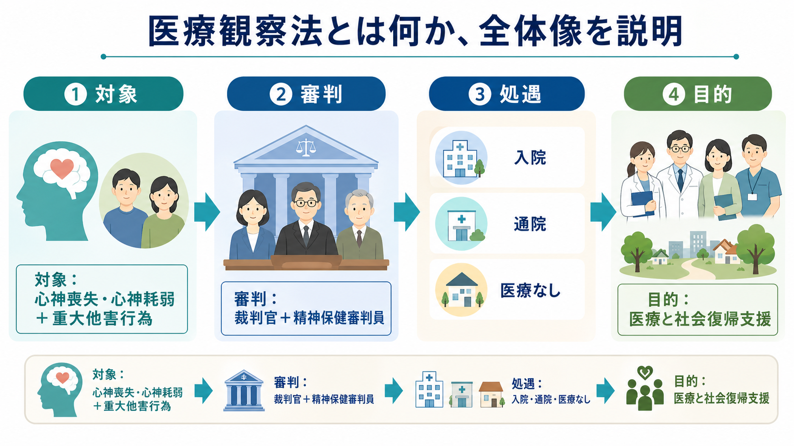
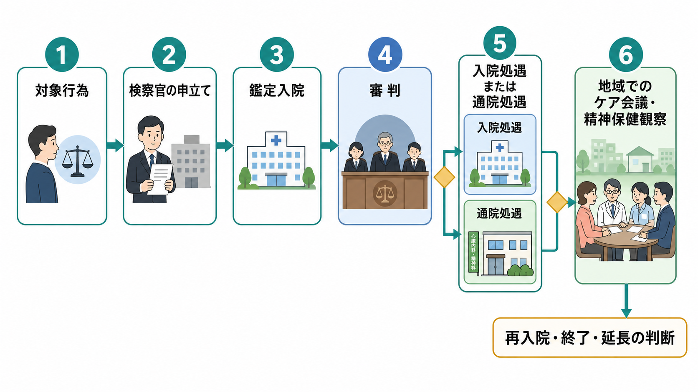

# 医療観察法とは何か

## 要点

- 医療観察法は、心神喪失または心神耗弱の状態で重大な他害行為を行い、通常の刑事責任を問えない、または刑が大きく減軽される人に対して、司法の審判を通じて医療と社会復帰支援を組み立てる制度である[1][2]。
- 目的は「処罰」ではなく、病状の改善、同様の行為の再発防止、社会復帰の促進である。ただし、重大な他害行為と結びつくため、本人の治療権・地域生活・被害者等への配慮・公共安全が同時に問題になる[1][3]。
- 対象行為は、殺人、放火、強盗、不同意性交等、不同意わいせつ、傷害などで、検察官の申立てを受けて地方裁判所が審判を行う[1][2]。
- 審判では、裁判官と精神保健審判員が合議体をつくり、鑑定、生活環境、入院医療の必要性などを踏まえて、入院処遇、通院処遇、医療なしのいずれかを決定する[2][4]。
- 通院処遇や退院後支援では、指定通院医療機関、保護観察所、社会復帰調整官、自治体、福祉サービスが処遇実施計画に沿って連携する[2][5]。

## この記事で答える問い

1. 医療観察法は、刑罰、措置入院、一般の精神科医療と何が違うのか。
2. 誰が対象になり、どのような手続で処遇が決まるのか。
3. 入院処遇・通院処遇・地域処遇では、何が行われるのか。
4. 臨床、司法精神医学、地域精神医療、研究では何を見落としやすいのか。

## まず結論

医療観察法は、精神障害と重大な他害行為が交差した事案に対して、刑罰だけでも一般医療だけでも扱いきれない課題を、司法審判、専門医療、地域支援の組み合わせで扱う制度である。正式名称は「心神喪失等の状態で重大な他害行為を行った者の医療及び観察等に関する法律」で、2003年に公布され、2005年に施行された[3]。

重要なのは、この制度が「危険人物を隔離する制度」と単純化できない点である。法律上の目的は、継続的かつ適切な医療、観察、指導によって、病状の改善と同様の行為の再発防止を図り、社会復帰を促進することである[1]。一方で、対象行為が重大であるため、本人の権利保障、被害者等への情報提供、地域の不安、治療継続、再入院判断をどう調整するかが常に課題になる[2][6]。

## 背景

医療観察法が扱うのは、「重大な他害行為があった」ことと、「その行為時に心神喪失または心神耗弱の状態にあった」ことが重なる場面である。これは、精神疾患一般を危険視する制度ではない。[[精神疾患と暴力リスクはどう関係するのか|精神疾患と暴力リスク]]を考えるときと同じく、診断名だけで危険性を判断するのではなく、症状、治療中断、物質使用、生活環境、支援の途切れ、過去の行動などを分けて見る必要がある。

制度の特徴は、処遇の入口が医療機関や行政の判断ではなく、検察官の申立てと地方裁判所の審判に置かれることである[2][3]。NCNP はこの制度を、わが国で初めての司法精神医療に関する法律と説明している[3]。つまり、臨床的には精神科医療の制度でありながら、手続的には司法の枠組みを強く持つ。

## 基本概念

### 心神喪失と心神耗弱

心神喪失・心神耗弱は、精神医学診断そのものではなく、刑事責任能力に関する法的判断である。ある人が[[統合失調症とは何か|統合失調症]]、双極性障害、物質使用障害、知的障害などをもつとしても、それだけで医療観察法の対象になるわけではない。対象になるには、対象行為、行為時の責任能力、検察官の申立て、審判での判断が必要になる[1][2]。

### 対象行為

法律上の対象行為は、殺人、放火、不同意性交等、不同意わいせつ、傷害、強盗などに対応する犯罪類型である[1]。NCNP の解説も、重大な他害行為を6種類に整理し、傷害は重いものに限られ、傷害以外は未遂も含まれると説明している[3]。たとえば[[放火症とは何か|放火症]]のような診断名が問題になる場合でも、医療観察法の対象になるかどうかは、診断名だけではなく、対象行為と責任能力判断によって決まる。

### 処遇の三つの出口

審判の主な出口は、入院処遇、通院処遇、医療観察法による医療を行わない決定の三つである。裁判所は鑑定を基礎にし、入院医療の必要性や生活環境を考慮して決定する[4]。この点は、一般の精神科入院、[[守秘義務とは何か|守秘義務]]上の危機対応、措置入院、刑罰とは制度目的も手続も異なる。

## 仕組み

### 1. 検察官の申立て

対象行為を行ったとされる人について、心神喪失または心神耗弱が認められ、不起訴処分または無罪等の確定裁判があった場合、検察官は原則として地方裁判所に申立てを行う[2][4]。ただし、医療観察法による医療の必要が明らかにない場合などは別である。

### 2. 鑑定入院と鑑定

申立てを受けた裁判所は、必要が明らかにない場合を除き、鑑定その他の医療的観察のため鑑定入院を命じることができる。鑑定では、精神障害の有無だけでなく、行為時の病状、過去の病歴、治療状況、将来の症状予測、対象行為の内容、過去の他害行為、性格などが考慮される[4]。

### 3. 審判

審判は、1人の裁判官と1人の精神保健審判員による合議体で扱われる[1]。対象者には付添人を選任する権利があり、必要な場合には弁護士である付添人が付される[4]。審判期日は原則として公開されないが、被害者等については一定の手続のもとで傍聴や通知が認められる場合がある[4][6]。

### 4. 入院処遇

入院決定を受けた人は、厚生労働大臣が定める指定入院医療機関で医療を受ける[4]。指定入院医療機関では、病状の改善、再発防止、社会復帰に向けた治療・看護・心理社会的支援が行われる。入院が長期に固定されないよう、入院継続や退院許可は裁判所の関与を受け、指定入院医療機関の管理者による申立てなどを通じて見直される[4]。

### 5. 通院処遇と地域処遇

通院処遇は、原則3年間で、裁判所は通じて2年を超えない範囲で延長できる[4]。通院処遇中は、指定通院医療機関による医療に加え、保護観察所による精神保健観察が行われる。保護観察所の長は、指定通院医療機関、都道府県、市町村と協議して処遇実施計画を定め、医療、精神保健観察、福祉的援助を計画に基づいて実施する[5]。

## 図解

| 局面 | 主な担い手 | 何を判断・実施するか | 注意点 |
|---|---|---|---|
| 申立て | 検察官 | 対象行為と心神喪失・心神耗弱の判断を踏まえ、地方裁判所へ申立てる | 刑罰の代替ではなく、医療観察法上の処遇要否を問う |
| 鑑定 | 鑑定医、裁判所 | 精神障害、行為時・現在の病状、治療必要性、生活環境を評価する | 診断名だけでなく、動的リスクと支援可能性を見る |
| 審判 | 裁判官、精神保健審判員、精神保健参与員、付添人 | 入院・通院・医療なしを決める | 本人の手続保障と被害者等への配慮が必要 |
| 入院処遇 | 指定入院医療機関、保護観察所 | 専門医療、退院後の生活環境調整 | 入院継続・退院は裁判所の関与を受ける |
| 通院・地域処遇 | 指定通院医療機関、社会復帰調整官、自治体、福祉サービス | 処遇実施計画、精神保健観察、生活支援 | 医療だけでなく住居・福祉・家族支援を接続する |

## 臨床・研究との接続

### 司法精神医学

医療観察法は、司法精神医学の中心的制度の一つである。臨床家は、診断、症状、責任能力、治療可能性、再発防止、生活環境を混同しない必要がある。特に「精神障害があるから危険」「対象行為が重大だから治療不能」といった単純化は避けるべきである。[[精神疾患とスティグマはどう関係するのか|スティグマ]]を強める説明は、本人の受療、地域参加、家族支援、被害者等との社会的理解のいずれにも悪影響を及ぼしうる。

### 地域精神医療

通院処遇は、病院で完結しない。社会復帰調整官は、生活環境調査、生活環境調整、精神保健観察、関係機関連携を担う専門職として制度に位置づけられている[1][7]。ここでは多職種連携、住居支援、服薬継続、家族支援、就労・日中活動、危機時の連絡体制が重要になる。

### 研究

研究上は、再他害の有無だけをアウトカムにすると制度の一部しか見えない。病状改善、入院期間、通院継続、地域定着、身体健康、本人のリカバリー、家族負担、被害者等への情報提供、地域資源の偏在も評価対象になる。第7回医療観察法の医療体制に関する懇談会では、医療体制の現状等が議題となり、制度の運用・医療体制が継続的な検討課題であることが示されている[8]。

## よくある誤解

### 誤解1: 医療観察法は刑罰である

医療観察法は刑罰ではない。法律の目的は、継続的かつ適切な医療、観察、指導による病状改善、同様の行為の再発防止、社会復帰の促進である[1]。ただし、司法審判を通じて処遇が決まるため、本人の自由に重大な制約を及ぼしうる制度である。

### 誤解2: 精神疾患があれば対象になる

対象になるには、精神疾患があることだけでは足りない。対象行為、行為時の心神喪失・心神耗弱、刑事事件の処理、検察官の申立て、審判での処遇必要性が必要である[2][4]。

### 誤解3: 入院すれば制度は終わる

入院処遇は出口ではなく、地域生活に戻るための準備期間でもある。入院期間中から保護観察所の社会復帰調整官が退院後の生活環境調整を行い、退院後は通院医療、精神保健観察、自治体・福祉サービスとの連携が続く[2][5]。

### 誤解4: 地域処遇は監視だけである

精神保健観察には、生活状況や医療継続を見守り、継続的な医療を受けるための指導や措置を行う役割がある[5]。しかし実務的には、監視だけではなく、住居、家族、福祉、通院、危機対応をつなぐ支援の設計が重要である。

## 関連ノート

- [[精神疾患と暴力リスクはどう関係するのか]]
- [[精神疾患とスティグマはどう関係するのか]]
- [[放火症とは何か]]
- [[守秘義務とは何か]]
- [[重症精神障害とは何か]]

MOC更新候補: `content/00_MOC/MOC｜精神医学.md` の「司法・制度・地域精神医療」周辺に追加する候補。ただし並列ジョブとの競合を避けるため、本記事では MOC 本体を更新しない。

## 理解チェック

1. 医療観察法の対象になるには、精神疾患の診断名だけでは不十分である。どの条件が追加で必要か。
2. 医療観察法における審判で、裁判官と精神保健審判員が合議体をつくる理由は何か。
3. 通院処遇において、指定通院医療機関、保護観察所、自治体はそれぞれ何を担うか。
4. 医療観察法を説明するとき、精神疾患へのスティグマを強めないために、どのような表現を避けるべきか。

## 参考文献

[1] 厚生労働省. 心神喪失等の状態で重大な他害行為を行った者の医療及び観察等に関する法律. https://www.mhlw.go.jp/web/t_doc?dataId=80aa5120&dataType=0&pageNo=1

[2] 厚生労働省. 心神喪失者等医療観察法: 医療観察法制度の概要について. https://www.mhlw.go.jp/stf/seisakunitsuite/bunya/hukushi_kaigo/shougaishahukushi/sinsin/gaiyo.html

[3] 国立精神・神経医療研究センター 精神保健研究所 地域精神保健・法制度研究部. 医療観察法について. https://www.ncnp.go.jp/nimh/chiiki/mtsa/

[4] 厚生労働省. 心神喪失等の状態で重大な他害行為を行った者の医療及び観察等に関する法律 第33条-第51条. https://www.mhlw.go.jp/web/t_doc?dataId=80aa5120&dataType=0&pageNo=1

[5] 厚生労働省. 心神喪失等の状態で重大な他害行為を行った者の医療及び観察等に関する法律 第101条-第109条. https://www.mhlw.go.jp/web/t_doc?dataId=80aa5120&dataType=0&pageNo=1

[6] 法務省. 医療観察制度における被害者等に対する対象者の処遇段階等に関する情報の提供について. https://www.moj.go.jp/hogo1/soumu/hogo07_00002.html

[7] 法務省. 社会復帰調整官を目指す方へ. https://www.moj.go.jp/hogo1/soumu/hogo_hogo17.html

[8] 厚生労働省. 第7回医療観察法の医療体制に関する懇談会. https://www.mhlw.go.jp/stf/iryoukansatuhou.kondankai.7th.shiryou

## 未解決問題

- 地域ごとの指定通院医療機関、住居資源、福祉サービスの偏在をどう縮小するか。
- 本人のリカバリー、地域の安全、被害者等への配慮を、制度運用上どのように同時に評価するか。
- 入院長期化や通院処遇終了後の支援の空白を、どの指標で早期に見つけるか。
- 医療観察法の対象者に関する研究で、再他害だけでなく生活の質、身体健康、社会参加をどう測定するか。
