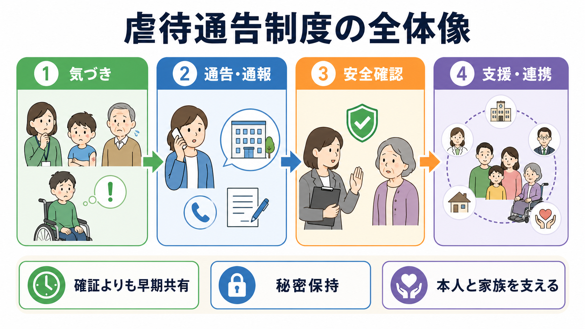
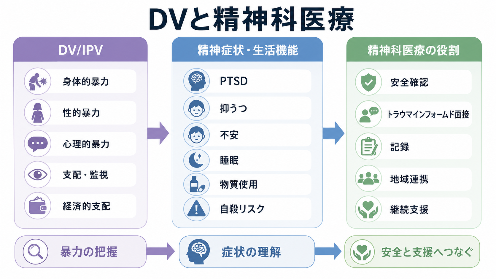

# 医療観察法病棟では何を行うのか

## 要点

- 医療観察法病棟は、刑罰を行う場所ではなく、心神喪失または心神耗弱の状態で重大な他害行為を行った人に対して、病状改善、同様の行為の再発防止、社会復帰を目指す指定入院医療の場である[1]。
- 入院処遇はおおむね「急性期」「回復期」「社会復帰期」の3期に分けられ、標準的には18か月以内の退院を目指すが、実際の期間は病状、生活能力、地域支援の整備状況によって変わる[2][3]。
- 治療は、医師、看護師、心理士、作業療法士、精神保健福祉士などの多職種チームで行われ、治療評価会議、運営会議、外部評価会議などを通じて透明性と継続評価を担保する[2]。
- 「リスク評価」は危険人物を固定的に分類する作業ではなく、病状、生活機能、服薬・通院継続、ストレス対処、地域支援、危機時対応を含む再発予防の設計である[2][7]。

## この記事で答える問い

この記事では、[[司法精神医学とは何か]]の具体例として、医療観察法病棟で何が行われているのかを説明する。とくに、治療プログラム、リスク評価、退院準備、通院処遇への移行を一連の流れとして整理する。個別事例の診断や処遇判断ではなく、教育・研究目的の制度理解を目的とする。

## まず結論

医療観察法病棟で行われる中心的な仕事は、「症状を落ち着かせる」「対象行為に至った病状・生活状況を理解する」「同じ危機を繰り返さないための具体的な手段を作る」「地域で暮らす条件を整える」の4つである。したがって、病棟での治療は薬物療法だけでは完結しない。心理教育、作業療法、生活技能訓練、内省を促す面接、外出・外泊訓練、家族・地域機関との調整が組み合わされる[2][3]。

## 背景

医療観察法の正式名称は「心神喪失等の状態で重大な他害行為を行った者の医療及び観察等に関する法律」である。法律上の目的は、適切な処遇を決定する手続を定め、継続的かつ適切な医療、観察、指導を行うことで、病状改善と同様の行為の再発防止を図り、社会復帰を促進することにある[1]。

この制度では、対象者の処遇は医療機関だけで決まるわけではない。地方裁判所の審判で入院処遇、通院処遇、不処遇などが決定される。入院処遇が決まった場合、対象者は国または都道府県などが設置する指定入院医療機関に入院する[3]。この点で、医療観察法は一般の[[精神保健福祉法とは何か]]に基づく入院医療とも、刑事施設での処遇とも異なる。

## 基本概念

### 指定入院医療機関

指定入院医療機関とは、医療観察法に基づく入院医療を担当する病院として厚生労働大臣が指定した医療機関である[1]。医療観察法病棟は、その中で入院対象者を専門的に処遇する病棟であり、入院処遇ガイドラインに沿って運営される[2]。

### 多職種チーム

病棟治療は、多職種チームを基本にする。入院処遇ガイドラインでは、治療評価会議は医師、看護師、臨床心理技術者、作業療法士、精神保健福祉士を基本構成とし、必要に応じて社会復帰調整官や本人も参加するとされる[2]。これは、精神症状だけでなく、生活機能、対人関係、服薬自己管理、金銭管理、住居、福祉サービス、危機時対応まで扱うためである。

### 改訂版共通評価項目

入院処遇では、標準化された評価が重視される。厚労省の治療評価シートには、入院時基本管理シート、治療評価会議シート、運営会議シート、退院前情報管理シートなどが含まれ、入院処遇ガイドラインは「改訂版共通評価項目」を評価・記録の枠組みとして位置づけている[4][2]。評価の狙いは、単に「危険性」を点数化することではなく、どの要因が再発予防や地域生活の安定に関わるかをチームで共有することにある。

## 仕組み

### 1. 急性期

急性期では、病的体験や精神状態の改善、身体的回復、治療への動機づけ、治療関係の形成が中心になる。ガイドライン上は12週、つまり約3か月以内に回復期へ移行することが目標とされる[2]。[[初回エピソード精神病とは何か]]や[[治療抵抗性統合失調症とは何か]]で扱うような精神病症状が背景にある場合でも、ここで重要なのは診断名だけではなく、対象行為に至った具体的な病状、生活歴、支援不足、物質使用、対人葛藤を把握することである。

### 2. 回復期

回復期では、病識、自己コントロール、日常生活能力、治療プログラムへの参加が焦点になる。標準的には36週、約9か月以内に社会復帰期へ移ることが目標である[2]。心理教育、作業療法、集団プログラム、個別面接、服薬自己管理、ストレス対処、対象行為に関する振り返りなどが行われる。物質使用が関係する場合には、[[物質使用障害とは何か]]や[[物質誘発性精神病とは何か]]に関連する再使用予防も重要になる。

### 3. 社会復帰期

社会復帰期では、院外外出、外泊、地域機関との調整、退院後の医療・福祉サービスの設計が中心になる。ガイドラインでは24週、約6か月以内で退院に向かうことが目標とされる[2]。この時期の評価は、「病状が安定しているか」だけでなく、「必要な医療を自律的に求められるか」「退院後の援助体制が整っているか」「緊急時の介入方法が地域で共有されているか」を含む[2]。

## 図解

医療観察法病棟の実践は、次のように見ると理解しやすい。

| 観点 | 病棟で行うこと | 目的 |
|---|---|---|
| 治療 | 薬物療法、心理教育、作業療法、生活技能訓練、個別面接 | 病状安定と生活機能の回復 |
| 評価 | 改訂版共通評価項目、治療評価会議、運営会議、退院前評価 | 再発予防要因と支援課題の共有 |
| 権利保障 | 説明と同意、倫理会議、外部評価会議、透明性の確保 | 懲罰的医療の回避と人権配慮 |
| 地域移行 | 外出・外泊、ケア会議、社会復帰調整官との連携、指定通院医療機関への引継ぎ | 退院後の治療継続と生活安定 |

## 臨床・研究との接続

医療観察法病棟は、精神科治療、リハビリテーション、リスクマネジメント、地域精神医療が交差する場所である。臨床的には、[[攻撃行動を伴う精神疾患には何があるのか]]のような問題を、個人の性格や診断名だけに還元せず、精神症状、生活環境、対人関係、物質使用、支援アクセスの組み合わせとして扱う。

研究面では、退院後の再他害や再入院、長期入院化の要因、通院処遇での問題行動が検討されている。全国28病院から退院した526人を追跡した研究では、累積再犯率は1年で2.5%、3年で7.5%、重大再犯率は1年で0.4%、3年で2.0%と報告された一方、地域精神科病院への再入院は退院後6か月で21.8%、1年で37.6%と高かった[5]。これは、病棟内での治療だけでなく、退院後の地域支援の厚みがアウトカムを左右することを示唆する。

また、2025年の研究では、医療観察法病棟で1.5年入院していた210人を対象に長期入院化の要因を検討し、精神症状と生活障害が入院継続と関連したと報告している[6]。つまり、退院可能性を考えるときは、症状の軽快だけでなく、住居、服薬、金銭管理、日中活動、危機時相談といった生活上の支えを見る必要がある。

通院処遇の研究でも、退院後の地域生活には問題行動や自殺関連行動への継続的な注意が必要であることが示されている[7][8]。これは、医療観察法病棟が「退院させて終わり」の場所ではなく、指定通院医療機関、保護観察所、自治体、福祉サービスへ引き継ぐための準備機関であることを意味する。

## よくある誤解

### 誤解1：医療観察法病棟は刑罰の代わりである

医療観察法の目的は、病状改善、再発防止、社会復帰促進である[1]。入院処遇ガイドラインも、懲罰的に医療を行っていると誤解されないよう、適切な治療法を選択することを求めている[2]。ただし、重大な対象行為が背景にあるため、安全確保と権利保障の両方を丁寧に扱う必要がある。この点は[[精神科入院で患者の権利をどう守るのか]]とも接続する。

### 誤解2：リスク評価は「危険な人」を見つけるためだけにある

リスク評価は、固定的な烙印ではない。医療観察法病棟での評価は、病状、生活能力、治療継続、地域支援、危機時対応を確認し、再発を防ぐための計画に変換する作業である[2]。[[精神疾患とスティグマはどう関係するのか]]で扱うように、診断名や過去の行為だけで人を説明すると、治療可能性や支援設計を見失いやすい。

### 誤解3：退院は病状がよくなれば自動的に決まる

退院には、病状の安定に加えて、必要な医療を自律的に求められること、退院後の治療と支援体制が整っていること、緊急時対応が準備されていることが求められる[2]。指定入院医療機関が退院許可を申し立て、裁判所が判断する点も重要である[3]。

## 関連ノート

- [[司法精神医学とは何か]]
- [[精神保健福祉法とは何か]]
- [[精神科入院で患者の権利をどう守るのか]]
- [[攻撃行動を伴う精神疾患には何があるのか]]
- [[物質使用障害とは何か]]
- [[精神疾患とスティグマはどう関係するのか]]
- [[MOC｜精神医学]]
- [[MOC｜臨床実践・治療]]

## MOC更新候補

- `content/00_MOC/MOC｜精神医学.md`
- `content/00_MOC/MOC｜臨床実践・治療.md`
- `content/00_MOC/MOC｜倫理・哲学・社会.md`

## 理解チェック

1. 医療観察法病棟の目的を、「治療」「再発防止」「社会復帰」の3語を使って説明できるか。
2. 急性期、回復期、社会復帰期では、それぞれ何を重視するか。
3. 「リスク評価」が、固定的な危険性判定ではなく支援計画に結びつく評価である理由を説明できるか。
4. 退院後に指定通院医療機関、社会復帰調整官、地域福祉サービスが必要になる理由を説明できるか。

## 未解決問題

- 医療観察法病棟から退院した後の地域精神医療・福祉サービスの不足をどう補うか。
- 長期入院化するケースで、精神症状、生活障害、地域受け皿不足をどのように切り分けて評価するか。
- 安全確保、本人の権利、被害者・地域社会への配慮を、実践上どのように両立させるか。
- 医療観察法病棟で得られた多職種チーム医療やリスクマネジメントの知見を、一般精神医療へどう還元するか。

## 参考文献

[1] 厚生労働省. 心神喪失等の状態で重大な他害行為を行った者の医療及び観察等に関する法律. https://www.mhlw.go.jp/web/t_doc?dataId=80aa5120&dataType=0&pageNo=1

[2] 厚生労働省. 入院処遇ガイドライン. https://www.mhlw.go.jp/content/001684651.pdf

[3] 国立精神・神経医療研究センター 精神保健研究所 地域精神保健・法制度研究部. 医療観察法の入院処遇. https://www.ncnp.go.jp/nimh/chiiki/mtsa/02.html

[4] 厚生労働省. 心神喪失者等医療観察法に係る各種ガイドライン等. https://www.mhlw.go.jp/stf/seisakunitsuite/bunya/hukushi_kaigo/shougaishahukushi/sinsin/gidelines.html

[5] Nagata T, Tachimori H, Nishinaka H, Takeda K, Matsuda T, Hirabayashi N. Mentally disordered offenders discharged from designated hospital facilities under the medical treatment and supervision act in Japan: Reoffending and readmission. *Criminal Behaviour and Mental Health*. 2019;29(3):157-167. https://doi.org/10.1002/cbm.2117

[6] Takeda N, Kashiwagi H, Watanabe N, Hirabayashi N. Evaluation of severe and chronic factors for extended stays in Japanese medical treatment and supervision act wards. *Frontiers in Psychiatry*. 2025;16:1653427. https://doi.org/10.3389/fpsyt.2025.1653427

[7] Ando K, Soshi T, Nakazawa K, Noda T, Okada T. Risk Factors for Problematic Behaviors among Forensic Outpatients under the Medical Treatment and Supervision Act in Japan. *Frontiers in Psychiatry*. 2016;7:144. https://doi.org/10.3389/fpsyt.2016.00144

[8] Ando K, Nakazawa K, Matsunaga S, Okada T. Overview of forensic outpatients on the Medical Treatment and Supervision Act in Japan. *International Journal of Law and Psychiatry*. 2025;100:102074. https://doi.org/10.1016/j.ijlp.2025.102074
