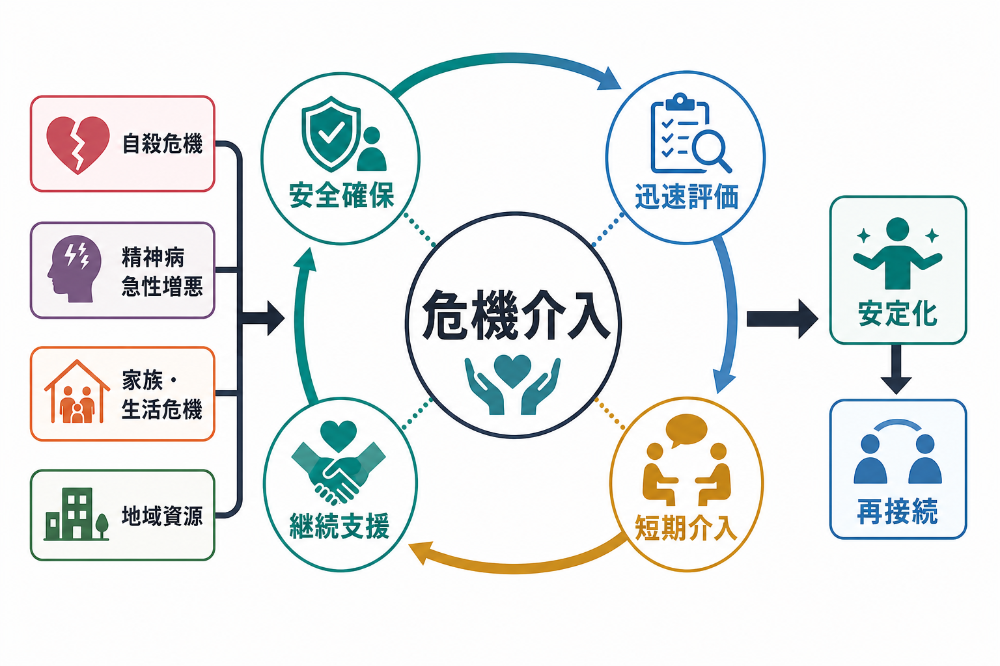
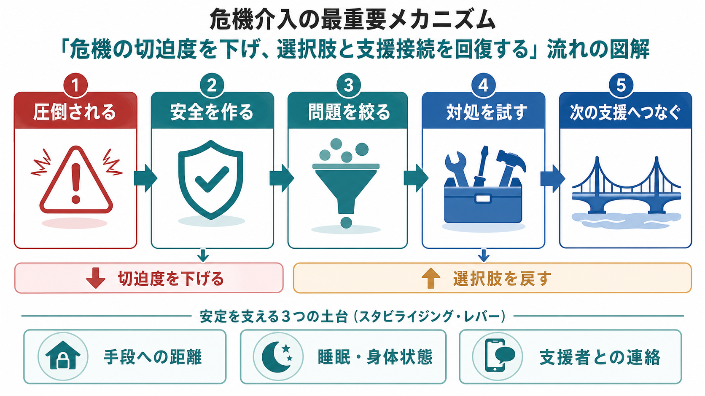
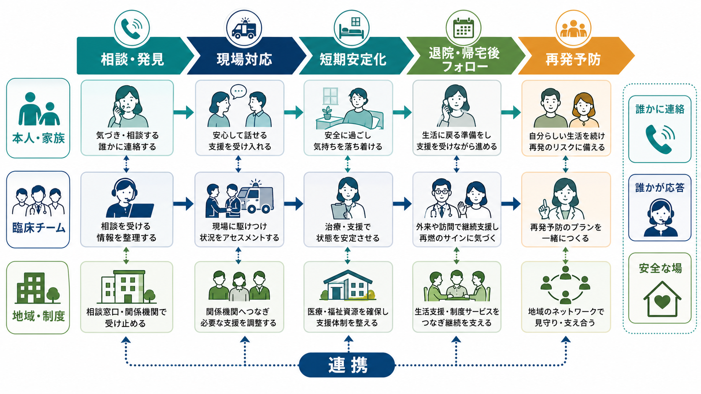

# 危機介入とは何か

## 要点

- 危機介入は、危険が高まった短い時間帯に、安全を作り、混乱を下げ、本人と周囲が次の支援へつながれるようにする短期集中的な対応である。
- 対象は、自殺危機、精神病の急性増悪、強い興奮、虐待・暴力、家族崩壊、住居喪失、治療中断などであり、診断名よりも「いま何が失われそうか」を優先して見る。
- 中核は、危険の低減、迅速な生物心理社会的評価、協働的な問題整理、現実的な対処、フォローアップである[1][5]。
- 自殺危機では、リスクを点数だけで分類するのではなく、本人のニーズ、心理的・身体的安全、安全計画、手段へのアクセス低減、継続接触を組み合わせる[2][3][7][8]。
- 精神病急性増悪では、地域で支えられる範囲と入院が必要な範囲を分け、危機解決・在宅治療、家族支援、必要時の入院を連続した選択肢として考える[4]。

## この記事で答える問い

1. 危機介入は、通常の面接や長期治療と何が違うのか。
2. 自殺危機・精神病急性増悪・家族崩壊では、何を優先して介入するのか。
3. 「安全確保」と「本人の意思決定」をどう両立させるのか。
4. 危機介入を地域精神医療、救急、家族支援、再発予防へどう接続するのか。

## まず結論

危機介入は、「危機を完全に解決する技法」ではない。より正確には、危機の切迫度を下げ、本人が選べる選択肢を回復し、支援の網から落ちないようにするための時間限定の実践である。したがって、危機介入の成功は「その場で症状が消えたか」だけでは測れない。本人と周囲の安全が保たれ、次の診療、地域支援、家族支援、住まい、福祉制度、フォローアップに接続できたかが重要になる[1][7]。

このノートは教育・研究目的の整理であり、個別の診断や治療指示ではない。差し迫った自傷他害、意識障害、重い身体症状、暴力、虐待が疑われる場合は、地域の救急・警察・医療機関・相談窓口につなぐ必要がある。

## 背景

精神医学で「危機」と呼ぶ状態は、単に症状が強い状態ではない。本人の対処資源、家族・支援者、住居、身体状態、経済、制度的保護が一時的に追いつかず、危険が急に高まった状態である。たとえば、自殺念慮が強まる、幻覚妄想が悪化して生活が崩れる、躁状態で睡眠と金銭管理が破綻する、家族内の暴力や虐待が明らかになる、退院直後に支援が途切れる、といった場面で危機介入が必要になる。

SAMHSAの危機ケア指針は、地域の危機対応を「誰かに連絡できる」「誰かが応答する」「安全に助けを受けられる場所がある」という3要素で整理している[1]。これは、危機介入を個人面接だけに閉じないために重要である。本人が電話できる窓口、現場へ出向くチーム、短期安定化の場、退院・帰宅後のフォローがそろってはじめて、危機介入は地域の仕組みとして機能する。

## 基本概念

### 危機介入は「短期の安定化」である

RobertsとOttensの危機介入モデルは、急速だが十分な生物心理社会的評価、ラポール形成、主要問題の同定、感情の扱い、代替的対処、行動計画、フォローアップを段階的に整理する[5]。ここでいう段階は、機械的なチェックリストではなく、危機の場で見失いやすい作業を順番に思い出すための枠組みである。

通常の心理療法やケースワークでは、生活史、認知パターン、関係性、制度利用を時間をかけて扱える。しかし危機介入では、まず切迫した危険を下げる。本人が安全に話せる場所を作る、危険な手段から距離を置く、身体疾患や中毒を見落とさない、支援者を呼ぶ、次の受診や訪問を決める。深い理解は重要だが、危機の最中には「理解を進めること」より「いま壊れそうな安全を支えること」が優先される。

### 危機は診断名ではなく状況である

危機介入の対象は、うつ病、統合失調症、双極性障害、物質使用、認知症、発達特性、トラウマ、身体疾患など多様である。したがって、[[精神科救急では何を優先するべきか]]と同じく、診断名を急いで固定するより、安全、身体状態、意識、物質使用、自傷他害、生活基盤を同時に見る必要がある。

精神病急性増悪では、NICEの精神病・統合失調症ガイドラインが、急性エピソード時の地域危機解決・在宅治療チーム、入院前の地域治療、早期介入、家族支援を一連のサービスとして位置づけている[4]。つまり危機介入は、薬物療法だけでも、入院だけでも、説得だけでもない。本人の状態、家族の負担、地域サービスの容量、法制度上の要件を合わせて考える必要がある。

### 安全確保は不信ではない

安全確保は、本人を罰することでも、自由を奪うことでもない。危機の時間帯には、衝動性、絶望感、幻覚妄想、睡眠不足、物質使用、疼痛、家族内葛藤によって、ふだん使える対処が使えなくなる。安全確保は、この短い時間帯を生き延びるために環境を整える作業である。

同時に、過剰な制限は本人の尊厳と信頼を傷つける。興奮や暴力リスクがある場面でも、Project BETAの脱エスカレーション声明は、まず言語的介入、尊重、選択肢の提示、刺激の低減、協働を重視する[6]。制限的介入は、他の方法では差し迫った危険を避けられない場合の最小限の手段として位置づけるべきである。これは[[身体拘束とは何か]]や[[隔離とは何か]]の問題とも直結する。

## 仕組み

危機介入の仕組みは、次の5つの動きとして理解できる。

1. **安全を作る**  
   本人、家族、支援者、スタッフの安全を確認する。場所、距離、刺激、危険物、薬物・アルコール、身体症状、緊急連絡先を見る。自殺危機では、手段へのアクセスを減らし、本人を孤立させないことが重要になる[2][3]。

2. **切迫度を評価する**  
   自殺念慮、計画、手段、準備行動、過去の企図、精神病症状、興奮、被害妄想、物質使用、せん妄、身体疾患、虐待、家族内暴力を確認する。ここでは[[自殺リスク評価では何を聞くべきか]]で扱うように、危険因子と保護因子を単に数えるのではなく、いま何が危険を上げ、何が下げられるかを定式化する。

3. **問題を絞る**  
   危機では問題が一気に押し寄せる。借金、家族葛藤、不眠、幻聴、通院中断、失職、住居不安をすべて同時に解こうとすると、本人も支援者も圧倒される。まず「今日から明日にかけて危険を下げるために必要なこと」を絞る。

4. **対処と支援を組み合わせる**  
   休息、食事、水分、服薬確認、危険物の距離、相談先、家族や支援者の役割、受診、訪問、福祉制度、短期入院、保護的な場を組み合わせる。本人だけに自己管理を求めず、支援者側の行動も計画に入れる。

5. **フォローアップへつなぐ**  
   危機介入は、その場で終わらない。安全計画介入と構造化フォローアップを組み合わせた研究では、救急部門で自殺関連患者に介入した群で、その後6か月の自殺行動が少なく、外来メンタルヘルス受診への接続が高かった[7]。危機直後の数日から数週間は、支援から脱落しやすい時間帯として扱う必要がある。

## 図解

図1は、危機介入を「安全確保」「迅速評価」「短期介入」「継続支援」の循環として示している。危機介入は、自殺危機、精神病急性増悪、家族・生活危機を別々の箱に閉じ込めるのではなく、危険を下げて再接続する共通構造として考えると理解しやすい。

図2は、危機の切迫度を下げ、選択肢を戻す流れを示している。圧倒された状態では、本人の判断能力や支援要請能力が一時的に狭くなる。安全な場を作り、問題を絞り、対処を小さく試し、次の支援へつなぐことで、危機は「一人で耐える状態」から「支えながら進む状態」へ移行する。

図3は、本人・家族、臨床チーム、地域・制度の3層を並べている。危機介入がうまく働くには、本人が助けを求めるだけでなく、受け止める窓口、現場対応、短期安定化の場、帰宅後フォロー、再発予防が連携している必要がある[1]。

## 臨床・研究との接続

### 自殺危機

自殺危機で重要なのは、「リスクが高い人を当てる」ことだけではない。NICEは、自傷後の対応でリスク尺度や低・中・高の全体分類を、将来の自殺や治療提供・退院判断の根拠として単独使用しないよう勧め、本人のニーズと心理的・身体的安全に焦点を当てたリスクフォーミュレーションを求めている[3]。VA/DoDのガイドラインも、急性リスクの同定から管理までを、共有意思決定と安全計画を含む臨床プロセスとして扱う[8]。

実践上は、危険な手段から距離を置く、孤立を減らす、支援者に役割を持ってもらう、次の接触時刻を決める、救急・夜間連絡先を明確にすることが中心になる。WHO mhGAPも、自傷・自殺リスクのある人に対して、安全で支援的な環境、単独にしないこと、手段の除去、心理社会的支援、定期的接触とフォローアップを重視している[2]。

### 精神病急性増悪

精神病急性増悪では、幻覚妄想やまとまりにくい思考そのものだけでなく、不眠、食事・水分、服薬中断、物質使用、家族の疲弊、近隣トラブル、経済・住居不安を同時に見る。急性期の混乱が強いほど、本人の説明だけでは全体像がつかみにくいため、本人の同意と安全に配慮しながら、家族・支援者・診療録・地域チームから情報を集める。

地域で支えられる場合は、危機解決・在宅治療、訪問、家族支援、服薬調整、睡眠の回復、刺激の少ない環境を組み合わせる。地域で安全が保てない場合や、本人・周囲の危険が高い場合は、[[任意入院とは何か]]、[[医療保護入院とは何か]]、[[応急入院とは何か]]、[[措置入院とは何か]]など、法制度に沿った入院判断が問題になる。ここでも、入院は目的ではなく、安全と治療機会を確保する手段である。

### 家族崩壊・生活危機

危機介入は、個人の症状だけを扱うものではない。家族内の暴力、介護負担、親子分離、住居喪失、経済破綻、虐待通告、治療中断が重なると、本人だけでなく家族システム全体が危機に入る。[[家族システムとは何か]]の視点で見ると、危機は「誰か一人の問題」ではなく、役割、負担、連絡、境界、支援資源の崩れとして現れる。

この場合の危機介入では、家族を説得するだけでは不十分である。誰が今日安全確認をするのか、誰が薬や危険物を管理するのか、誰が夜間に連絡を受けるのか、家族が限界を超えている場合にどの制度へつなぐのかを具体化する必要がある。虐待や暴力が疑われる場合には、家族内解決に閉じず、[[虐待通告制度とは何か]]や地域の保護制度へ接続する。

### 地域精神医療との接続

危機介入は、[[ACTとは何か]]、地域移行支援、地域定着支援、訪問看護、相談支援、生活保護、住居支援、ピアサポートと相性がよい。危機のたびに救急と入院だけに頼ると、本人の生活は分断されやすい。逆に、地域支援だけで危険を抱え込みすぎると、本人と支援者の安全が損なわれる。

したがって、危機介入の設計では「どこまで地域で支えるか」と「いつ医療・救急・法制度へつなぐか」の境界を明確にする必要がある。これは[[精神保健福祉法とは何か]]、[[精神科入院で患者の権利をどう守るのか]]、[[意思決定支援とは何か]]とも関係する。

## よくある誤解

### 危機介入は、本人を落ち着かせる会話術である

会話は重要だが、それだけではない。危機介入には、身体評価、環境調整、手段へのアクセス低減、家族・支援者の動員、制度利用、入院判断、フォローアップが含まれる。言葉だけで安全が作れないときは、支援体制を変える必要がある。

### 自殺危機は、リスクスコアで低・中・高に分ければよい

スコアは情報整理に役立つことがあるが、処遇判断の代わりにはならない。重要なのは、いま何が危険を上げ、何を変えれば危険が下がり、誰がいつ何をするかを記録することである[3][8]。

### 家族がいれば安全である

家族は強い保護因子になることがあるが、常に安全資源とは限らない。家族が疲弊している、本人との関係が悪化している、暴力や虐待がある、夜間対応ができない、本人が家族に話せない場合には、家族だけに安全確保を任せるのは危険である。

### 入院すれば危機介入は終わる

入院は危機介入の一部であり、終点ではない。入院中の安全、治療関係、家族支援、退院後の住まい、通院、訪問、服薬、生活支援がつながらなければ、退院直後に危機が再燃しやすい。

### 非自発的介入は、危機介入の失敗である

非自発的介入は、本人の権利と尊厳に大きく関わるため、厳格な法的・倫理的条件が必要である。しかし、差し迫った自傷他害や重いセルフネグレクトがあり、他の方法で安全が保てない場合には、最小限の制限として検討される。重要なのは、非自発的介入を安易に使わないことと、必要時に使う場合でも説明、記録、再評価、権利擁護を徹底することである。

## 関連ノート

既存ノート:

- [[精神科救急では何を優先するべきか]]
- [[精神科救急でみる疾患・症候群には何があるのか]]
- [[自殺リスク評価では何を聞くべきか]]
- [[ACTとは何か]]
- [[意思決定支援とは何か]]
- [[精神保健福祉法とは何か]]
- [[身体拘束とは何か]]
- [[隔離とは何か]]
- [[家族システムとは何か]]
- [[5Pモデルとは何か]]
- [[治療関係とは何か]]

今後の作成候補:

- 自殺安全計画とは何か
- 危機解決・在宅治療チームとは何か
- 精神科救急における家族支援とは何か
- 退院直後の自殺リスクをどう下げるのか
- 危機介入におけるピアサポートとは何か

MOC更新候補:

- `content/00_MOC/` 配下の精神医学、臨床実践、地域精神医療、精神科救急関連MOCに、本記事へのリンクを追加する候補。
- 並列実行時の競合を避けるため、本ジョブではMOC本文は更新しない。

## 理解チェック

1. 危機介入を「長期治療」ではなく「短期安定化」と捉える理由は何か。
2. 自殺危機で、リスクスコアだけでは不十分な理由は何か。
3. 精神病急性増悪で、本人の症状以外に見るべき生活・家族・制度上の要因は何か。
4. 安全確保と本人の意思決定支援を両立させるには、どのような説明と記録が必要か。
5. 危機介入後のフォローアップを設計しないと、どのようなリスクが残るか。

## 未解決問題

- 日本の地域精神科救急では、相談窓口、現場対応、短期安定化、退院後フォローの地域差が大きく、標準モデルをそのまま適用しにくい。
- 自殺危機の短期予測には限界があり、予測精度を上げる研究だけでなく、安全計画、手段へのアクセス低減、継続接触を実装する研究が必要である。
- 家族支援は重要だが、家族がいない人、家族が加害・被害関係にある人、家族が疲弊している人を前提から外さない設計が必要である。
- 非自発的介入を最小化しながら安全を守るためには、個人の面接技術だけでなく、人員配置、環境設計、地域資源、権利擁護の仕組みが必要である。

## 参考文献

[1] Substance Abuse and Mental Health Services Administration. (2025). *National Behavioral Health Crisis Care Guidance*. https://library.samhsa.gov/product/national-behavioral-health-crisis-care-guidance/pep24-01-037

[2] World Health Organization. (2016). *mhGAP Intervention Guide for mental, neurological and substance use disorders in non-specialized health settings: Version 2.0*. https://iris.who.int/bitstream/handle/10665/250239/9789241549790-eng.pdf

[3] National Institute for Health and Care Excellence. (2022). *Self-harm: assessment, management and preventing recurrence* (NICE guideline NG225), recommendations. https://www.nice.org.uk/guidance/ng225/chapter/recommendations

[4] National Institute for Health and Care Excellence. (2014). *Psychosis and schizophrenia in adults: prevention and management* (Clinical guideline CG178), recommendations. https://www.nice.org.uk/guidance/cg178/chapter/recommendations

[5] Roberts, A. R., & Ottens, A. J. (2005). The seven-stage crisis intervention model: A road map to goal attainment, problem solving, and crisis resolution. *Brief Treatment and Crisis Intervention, 5*(4), 329-339. https://doi.org/10.1093/brief-treatment/mhi030

[6] Richmond, J. S., Berlin, J. S., Fishkind, A. B., et al. (2012). Verbal de-escalation of the agitated patient: Consensus statement of the American Association for Emergency Psychiatry Project BETA De-escalation Workgroup. *Western Journal of Emergency Medicine, 13*(1), 17-25. https://pmc.ncbi.nlm.nih.gov/articles/PMC3298202/

[7] Stanley, B., Brown, G. K., Brenner, L. A., et al. (2018). Comparison of the Safety Planning Intervention with follow-up vs usual care of suicidal patients treated in the emergency department. *JAMA Psychiatry, 75*(9), 894-900. https://doi.org/10.1001/jamapsychiatry.2018.1776

[8] Department of Veterans Affairs & Department of Defense. (2024). *VA/DoD Clinical Practice Guideline for Assessment and Management of Patients at Risk for Suicide*. https://www.healthquality.va.gov/guidelines/mh/srb/
