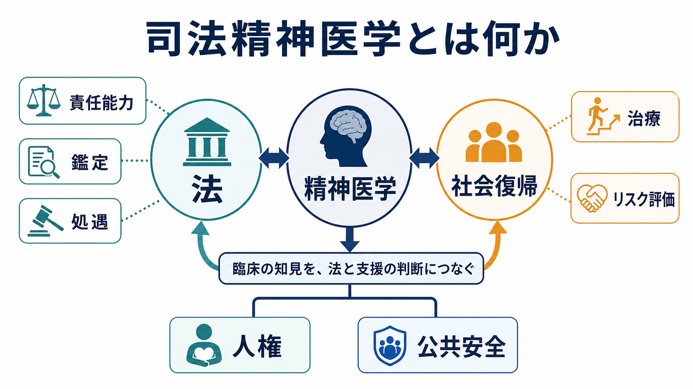
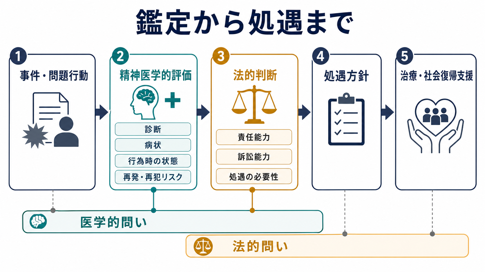
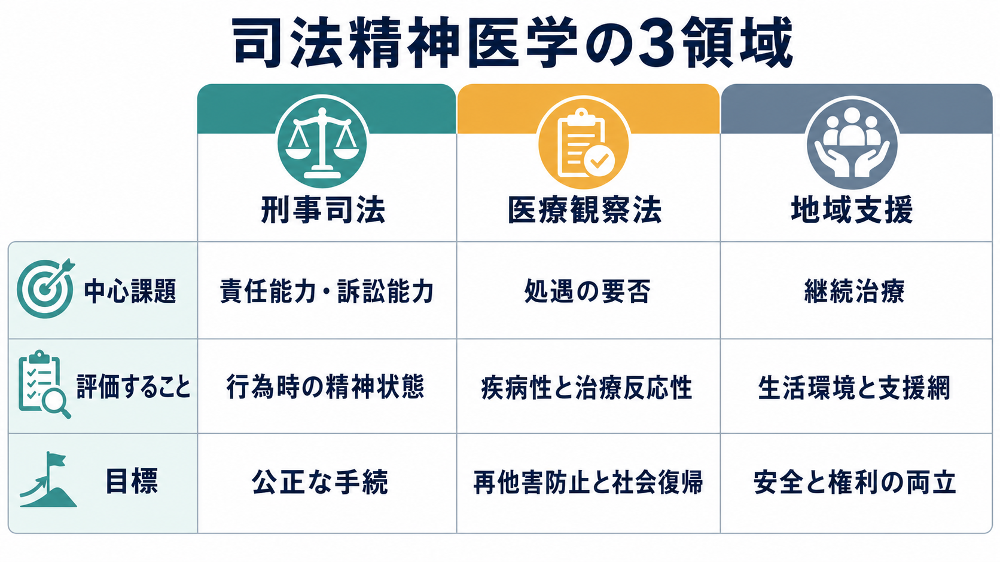

# 司法精神医学とは何か

## 要点

- 司法精神医学は、精神疾患・精神症状・認知機能・意思決定能力を、刑事司法、民事司法、医療観察法、矯正・保護、地域支援の文脈で評価する領域である。
- 中心課題は「精神疾患があるか」だけではなく、「その状態が行為、責任能力、訴訟能力、処遇、再発・再他害リスク、社会復帰支援にどう関係するか」を説明することである[1][2]。
- 日本では、心神喪失・心神耗弱の状態で重大な他害行為を行った人に対し、医療と観察を通じて社会復帰を促進する医療観察法が、司法精神医療の重要な制度的柱になっている[3][4]。
- リスク評価は「危険人物を当てる」作業ではなく、変化しうるリスク因子と保護因子を見つけ、治療・環境調整・支援計画に接続する作業である[5]。

## この記事で答える問い

この記事では、次の問いに答える。

1. 司法精神医学は通常の精神科臨床と何が違うのか。
2. 責任能力、訴訟能力、処遇、リスク評価はどのようにつながるのか。
3. 医療観察法は司法精神医学の中でどの位置にあるのか。
4. 研究・臨床・地域支援では、どのような誤解に注意すべきか。

## まず結論

司法精神医学とは、精神医学の知見を法的・制度的な判断に翻訳する実践領域である。通常の臨床では、主な目的は苦痛の軽減、診断、治療、生活支援である。司法精神医学ではそれに加えて、法的責任、公正な手続、本人の権利、被害者・社会の安全、再発防止、社会復帰という複数の価値を同時に扱う。

そのため、司法精神医学の評価は「診断名をつけること」で終わらない。行為時にどのような精神状態だったのか、症状が判断・行動制御にどの程度影響したのか、現在の手続参加能力はどうか、どの処遇なら治療可能性と社会復帰可能性を高められるのかを、資料、面接、検査、周辺情報から検討する[1][2]。

## 背景

精神疾患と犯罪の関係は、社会的に誤解されやすい。精神疾患があることは、それだけで犯罪の原因でも、危険性の証明でも、責任能力の否定でもない。一方で、急性精神病症状、躁状態、重度の物質使用、知的・認知機能の障害、治療中断、孤立、生活困窮などが重なると、本人の判断や行動制御、危機対応に影響する場合がある。

司法精神医学は、この複雑な関係を単純化しないための領域である。本人の病状と生活史を丁寧に評価しつつ、法的問いに答えられる形へ整理する。たとえば、[[MSEで思考内容をどう評価するか]]、[[MSEで病識と判断力をどう評価するか]]、[[ケースフォーミュレーションとは何か]]で扱う観察や定式化は、司法場面では「行為時の認識」「現実検討」「意思決定」「リスク管理」に接続される。

日本では、2005年施行の医療観察法により、心神喪失または心神耗弱の状態で重大な他害行為を行った人について、地方裁判所が処遇を決定し、指定入院医療機関・指定通院医療機関・保護観察所などが連携する仕組みが整備された[3][4]。この制度の最終目的は、病状改善と再他害防止を通じた社会復帰の促進である[4]。

## 基本概念

### 司法精神医学

司法精神医学は、精神医学と法制度が交差する場面で、評価、鑑定、治療、処遇、リスク管理、研究、教育を行う領域である。刑事事件だけでなく、医療観察法、民事の意思能力、成年後見、矯正施設の精神医療、保護観察、地域移行支援も含みうる。

### 責任能力

責任能力は、ある行為について刑事責任を問えるだけの弁識能力や制御能力があったかをめぐる法的概念である。精神鑑定は、診断名そのものではなく、行為時の精神状態、症状と行為の関連、動機、計画性、現実検討、前後の行動、周辺資料との整合性を検討する[1]。

したがって、「[[統合失調症とは何か|統合失調症]]があるから責任能力がない」とは言えない。逆に、診断名が軽く見えるから責任能力が保たれているとも限らない。重要なのは、個別事案における精神障害と行為の機能的関係である。

### 訴訟能力

訴訟能力は、被告人が刑事手続を理解し、弁護人と相談し、防御に参加できるかという現在時点の能力である。AAPLの実務資料では、訴訟能力は裁判に限らず、刑事手続全体への参加能力として扱われる[2]。これは「行為時に責任能力があったか」とは別の問いである。

### 医療観察法

医療観察法は、心神喪失または心神耗弱の状態で重大な他害行為を行い、不起訴や無罪等となった人について、検察官の申立てを受け、裁判所が医療観察法による処遇の要否と内容を決める制度である[3]。NCNPの解説では、処遇判断では「疾病性」「治療反応性」「社会復帰要因」の3要件を検討することが重要とされる[4]。

### リスク評価

司法精神医学におけるリスク評価は、将来の暴力や再他害を単純に予言するものではない。構造化されたリスク評価ツールは有用な補助になりうるが、2023年の系統的レビュー・メタ解析では、司法精神医療領域の暴力リスク評価ツールの予測性能にはばらつきがあり、研究のバイアスも大きいと報告されている[5]。そのため、[[他害リスク評価では何を見るべきか]]で扱うように、評価は管理可能な要因と支援計画へ結びつけて使う必要がある。

## 仕組み

司法精神医学の実務は、医学的問いと法的問いを分けて考えると理解しやすい。

| 層 | 主な問い | 使う情報 | 出力 |
|---|---|---|---|
| 精神医学的評価 | どのような精神症状、診断、認知機能、生活背景があるか | 面接、MSE、心理検査、診療録、家族・関係者情報 | 診断、病状、機能評価、定式化 |
| 行為時評価 | 行為時に症状や障害は判断・行動制御へどう影響したか | 供述、捜査資料、目撃情報、前後の行動、治療歴 | 責任能力鑑定の基礎情報 |
| 手続参加能力 | 現在、手続を理解し弁護人と相談できるか | 現在の病状、認知機能、理解力、意思疎通 | 訴訟能力評価 |
| 処遇判断 | 入院、通院、地域支援など、どの処遇が必要か | 疾病性、治療反応性、社会復帰要因、支援網 | 処遇方針 |
| リスク管理 | 再発・再他害リスクを下げるために何を変えるか | 静的因子、動的因子、保護因子、環境 | 治療計画、危機計画、地域連携 |

医療観察法では、入院処遇、通院処遇、地域処遇が制度として組み合わされる。厚生労働省は、地域処遇、指定入院医療機関運営、入院処遇、指定通院医療機関運営、通院処遇などのガイドラインを公表している[6]。このことは、司法精神医学が単発の鑑定だけでなく、継続的な治療評価、社会復帰支援、関係機関連携を含む領域であることを示している。

## 図解

司法精神医学を一枚で見ると、「法」「精神医学」「社会復帰」の三角形として理解できる。法は責任能力や手続の公正性を問う。精神医学は診断、病状、認知機能、治療可能性を評価する。社会復帰は、本人の生活、支援網、再発予防、地域安全を扱う。

この三角形のどこか一つだけを見ると、判断は歪みやすい。法だけを見ると、治療可能性や生活支援が見えにくくなる。医学だけを見ると、法的責任や被害者・社会の関心を過小評価しやすい。安全だけを見ると、本人の権利や回復可能性が後景化しやすい。

## 臨床・研究との接続

### 臨床との接続

司法精神医学は、一般精神科臨床と切り離された特殊領域ではない。むしろ、一般臨床で行う評価を、法的・制度的文脈でより明示的に使う領域である。たとえば、病識、判断力、衝動性、物質使用、服薬中断、家族関係、住居、就労、支援者との関係は、通常診療でも重要だが、司法場面では処遇や再発予防に直結する。

同時に、司法精神医学では治療者役割と鑑定者役割を混同しないことが重要である。鑑定者は本人の利益だけを代表するわけではなく、裁判所や依頼機関に対して専門的意見を提出する。したがって、面接の目的、秘密保持の限界、情報の使われ方を説明する必要がある[1]。この点は、[[インフォームドコンセントは精神科でどう行うのか]]とも接続する。

### 研究との接続

研究では、リスク評価ツール、処遇効果、再入院・再他害、治療継続、地域移行、スティグマ、権利擁護などが重要テーマになる。医療観察法領域では、指定入院医療機関の診療情報を匿名化して集積するデータベース事業も行われており、医療水準の向上と社会復帰促進を目的に統計作成や研究利用が進められている[7]。

ただし、司法精神医学の研究ではアウトカム設定に注意が必要である。再犯だけをアウトカムにすると、生活の質、治療同盟、権利、地域包摂、支援アクセスが見落とされる。逆に、主観的回復だけを見ても、被害予防や公共安全の観点が弱くなる。複数の価値を同時に測る設計が求められる。

### 矯正・拘禁環境との接続

司法精神医学は、刑事司法に接触した人の精神保健も扱う。WHO欧州地域の刑務所保健資料は、拘禁された人にも地域と同等水準の医療を提供するという「同等性の原則」と、地域機関との連携による治療継続を強調している[8]。刑務所・拘置所・留置場・保護観察・地域医療の間で治療が途切れると、症状悪化、再発、生活不安定化が起こりやすい。

## よくある誤解

### 誤解1：精神疾患がある人は犯罪を起こしやすい

精神疾患と犯罪を直接結びつける理解は不正確で、スティグマを強める。リスクは診断名だけで決まらず、急性症状、物質使用、治療中断、過去の暴力、生活困窮、孤立、被害体験、支援不足などが重なって形成される。評価は個人をラベル化するのではなく、変えられる要因を見つけるために行う。

### 誤解2：診断名があれば責任能力は否定される

責任能力は診断名から自動的に決まらない。焦点は、行為時にその精神状態が善悪の弁識や行動制御へどのように影響したかである[1]。同じ診断名でも、症状の程度、行為との関連、薬物影響、計画性、行為前後の振る舞いによって評価は異なる。

### 誤解3：リスク評価は将来の危険性を当てる技術である

リスク評価は予言ではない。構造化ツールも臨床判断も不確実性を含む。重要なのは、リスクを固定的属性として扱うのではなく、治療、服薬支援、住居、家族支援、危機時対応、物質使用対策、地域連携などの具体的介入に変換することである[5]。[[クライシスプランとは何か]]は、この臨床的な接続点になる。

### 誤解4：司法精神医学は処罰を軽くするための医学である

司法精神医学は、免責や減刑のためだけの領域ではない。本人の権利、公正な手続、適切な治療、被害予防、社会復帰支援を同時に扱う。ときには責任能力が保たれていると評価することもあり、ときには医療的処遇の必要性を示すこともある。役割は結論を誘導することではなく、精神医学的事実を法的問いに対して透明に説明することである。

## 関連ノート

- [[他害リスク評価では何を見るべきか]]
- [[ケースフォーミュレーションとは何か]]
- [[MSEで病識と判断力をどう評価するか]]
- [[MSEで思考内容をどう評価するか]]
- [[インフォームドコンセントは精神科でどう行うのか]]
- [[詐病とは何か]]
- [[重症精神障害とは何か]]
- [[覚醒剤使用障害とは何か]]
- [[統合失調症とは何か]]
- [[クライシスプランとは何か]]

## 理解チェック

1. 司法精神医学が「診断名」だけでなく「行為時の精神状態」や「手続参加能力」を重視するのはなぜか。
2. 責任能力と訴訟能力は、時間軸と法的問いの点でどう違うか。
3. 医療観察法における「疾病性」「治療反応性」「社会復帰要因」は、処遇判断にどう関係するか。
4. リスク評価を、スティグマではなく支援計画に変換するには何を見るべきか。

## 関連ノート候補・MOC更新候補

- 関連ノート候補: 「医療観察法とは何か」「責任能力とは何か」「精神鑑定とは何か」「訴訟能力とは何か」「司法精神医療における多職種連携」
- MOC更新候補: `content/00_MOC/` 配下の精神医学、司法・制度・地域精神医療、臨床実践関連MOC。並列ジョブとの競合回避のため、本記事作成時点ではMOC本体は更新しない。

## 未解決問題

- リスク評価ツールを、日本の医療観察法・刑事司法・地域支援の文脈でどの程度妥当に使えるか。
- 再他害防止だけでなく、本人の生活の質、権利、地域包摂をどうアウトカム化するか。
- 鑑定者役割と治療者役割を、地域医療の限られた資源の中でどう分担するか。
- 精神疾患と犯罪をめぐるスティグマを減らしつつ、被害予防と支援体制をどう両立するか。

## 参考文献

[1] Janofsky, J. S., Hanson, A., Candilis, P. J., Myers, W. C., Zonana, H., & AAPL Task Force. (2014). AAPL Practice Guideline for Forensic Psychiatric Evaluation of Defendants Raising the Insanity Defense. *Journal of the American Academy of Psychiatry and the Law*, 42(4 Supplement), S3-S76. https://jaapl.org/content/42/4_Supplement/S3

[2] Wall, B. W., Ash, P., Keram, E., Pinals, D. A., & Thompson, C. R. (2018). AAPL Practice Resource for the Forensic Psychiatric Evaluation of Competence to Stand Trial. *Journal of the American Academy of Psychiatry and the Law*, 46(3 Supplement), S4-S79. https://doi.org/10.29158/JAAPL.003778-18

[3] 厚生労働省. 心神喪失者等医療観察法. https://www.mhlw.go.jp/stf/seisakunitsuite/bunya/hukushi_kaigo/shougaishahukushi/sinsin/gaiyo.html

[4] 国立精神・神経医療研究センター 精神保健研究所 地域精神保健・法制度研究部. 医療観察法について. https://www.ncnp.go.jp/nimh/chiiki/mtsa/

[5] Ogonah, M. G. T., Seyedsalehi, A., Whiting, D., & Fazel, S. (2023). Violence risk assessment instruments in forensic psychiatric populations: a systematic review and meta-analysis. *The Lancet Psychiatry*, 10(10), 780-789. https://doi.org/10.1016/S2215-0366(23)00256-0

[6] 厚生労働省. 心神喪失者等医療観察法に係る各種ガイドライン等. https://www.mhlw.go.jp/stf/seisakunitsuite/bunya/hukushi_kaigo/shougaishahukushi/sinsin/gidelines.html

[7] 国立精神・神経医療研究センター病院. 医療観察法データベースを二次利用した研究の実施. https://www.ncnp.go.jp/hospital/patient/mtsa.html

[8] World Health Organization Regional Office for Europe. *Health in prisons: a WHO guide to the essentials in prison health*. https://iris.who.int/bitstream/handle/10665/107829/9789289072809-eng.pdf
