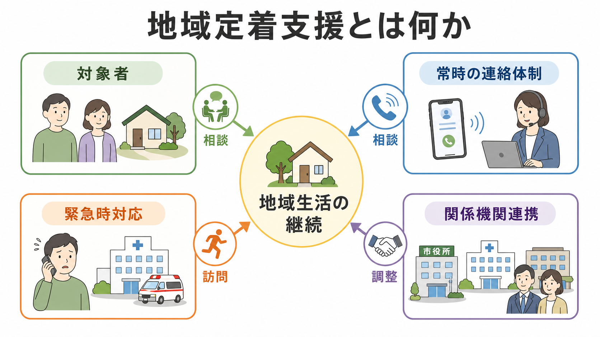
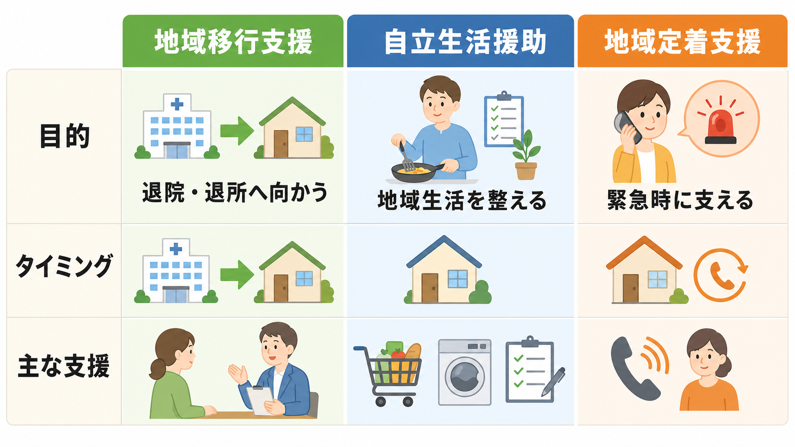

# 地域定着支援とは何か

## 要点

- 地域定着支援は、退院・退所後、一人暮らしへの移行後、または地域生活が不安定な障害者が、地域生活を継続できるようにする地域相談支援である。
- 中核は「常時の連絡体制」と「緊急時の相談・訪問・調整」であり、日常生活すべてを代行するサービスではない。
- [[精神科救急では何を優先するべきか]]と同じく危機対応を含むが、目的は入院や強制的介入の前段で、生活上の不調を早期に受け止めることである。
- 研究的には、地域アウトリーチ、集中的ケースマネジメント、支援付き生活、権利に基づく地域精神保健と接続して理解できる。

## この記事で答える問い

1. 地域定着支援は何を支える制度なのか。
2. 地域移行支援や自立生活援助とは何が違うのか。
3. 精神科退院後の地域生活では、どのような危機対応と多機関連携が必要になるのか。
4. 臨床・研究の視点から、どのような限界と未解決問題があるのか。

## まず結論

地域定着支援は、精神科病院や入所施設を出たあと、あるいは家族同居から単身生活へ移ったあとに、本人が地域で暮らし続けるための「危機対応付きの相談支援」である。障害者総合支援法上は、地域相談支援の一部であり、地域移行支援と並ぶ制度として位置づけられる[1]。厚生労働省の説明でも、地域定着支援は退所・退院した人、一人暮らしに移行した人、地域生活が不安定な人などに対し、地域生活の継続を支えるものとされている[2]。

したがって、地域定着支援は「退院させるための支援」だけではない。むしろ退院後に起こりやすい、服薬中断、孤立、生活リズムの崩れ、家賃・金銭・近隣関係のトラブル、不安や症状悪化、救急受診の迷いを早めに拾い、相談、訪問、医療・福祉・行政との調整に結びつける仕組みである。

## 背景

精神科医療では、長期入院から地域生活への移行が重要な政策課題であり続けてきた。退院そのものは大きな節目だが、退院後の地域生活は、住まい、医療継続、日中活動、所得保障、家族関係、孤立、危機時の連絡先といった複数の条件に左右される。[[精神科治療計画はどのように立てるのか]]で扱う治療計画が医療内の見通しを整えるものだとすれば、地域定着支援は生活の場で起こる揺らぎを受け止める支援である。

厚生労働省の「地域定着支援の手引き」は、精神疾患の症状が日常生活上の困難を生み、その結果として医療を受けにくくなり、さらに症状や生活困難が増悪する悪循環を指摘している[3]。この悪循環を断つには、医療だけでも福祉だけでも不十分で、保健医療職と福祉職が協働する多職種支援が必要になる[3]。この点は[[精神科におけるチーム医療とは何か]]と強く接続する。

## 基本概念

障害者総合支援法では、「相談支援」は基本相談支援、地域相談支援、計画相談支援を含むものとして整理され、地域相談支援は地域移行支援と地域定着支援から成る[1]。地域定着支援は、単身その他の省令で定める状況で居宅生活を送る障害者に対して、常時の連絡体制を確保し、障害特性に起因する緊急事態などに相談その他の便宜を供与するものと定義される[1]。

実務上は、次の3点を押さえると理解しやすい。

| 観点 | 地域定着支援で見ること |
|---|---|
| 対象 | 単身生活、家族から緊急時支援を見込めない状況、退院・退所後で不安定な地域生活など |
| 支援の核 | 常時の連絡体制、相談、緊急訪問、関係機関との調整 |
| 目的 | 地域生活の継続、危機の早期把握、再入院・生活破綻の予防 |

ここでいう「定着」は、本人を地域に固定するという意味ではない。本人が選んだ暮らしを続けられるように、危機時に孤立しない仕組みを作るという意味である。本人の価値観や意思を尊重する点では、[[意思決定支援とは何か]]とも重なる。

## 仕組み

地域定着支援の仕組みは、平時と危機時に分けると整理しやすい。

平時には、相談支援専門員や事業者が本人の生活状況、医療継続、住まい、金銭、家族・近隣関係、支援ネットワークを把握し、危機が起きたときの連絡先や対応手順を共有する。これは「何か起きたら相談できる」だけでなく、「何が起きたら誰が動くのか」を事前に決める作業である。

危機時には、本人からの連絡、周囲からの相談、事業者側の気づきなどを入口にして、電話相談、訪問、医療機関への連絡、行政・家族・住居関係者との調整を行う。厚生労働省の制度説明でも、常時の連絡体制と、障害特性に起因して生じた緊急事態への相談その他必要な支援が中核とされている[2]。

地域定着支援は、地域移行支援や自立生活援助と混同されやすい。大まかには、地域移行支援は「病院・施設から地域へ向かう準備」、自立生活援助は「居宅生活の課題に定期訪問などで対応」、地域定着支援は「緊急時に支える連絡体制と対応」と考えるとよい。地域定着支援の給付決定期間は原則1年間までで、必要性が認められれば更新可能とされる[2]。

## 図解

地域定着支援を文章で図解すると、次のような流れになる。

| 段階 | 支援の焦点 | 例 |
|---|---|---|
| 退院・退所前後 | 支援関係の接続 | 相談支援、医療機関、行政、住居、家族との情報共有 |
| 平時 | 危機予防 | 定期的な相談、生活課題の把握、緊急時連絡先の確認 |
| 変化の兆候 | 早期把握 | 眠れない、服薬が乱れる、家賃滞納、近隣トラブル、孤立 |
| 緊急時 | 介入と調整 | 電話相談、訪問、受診調整、福祉サービス調整 |
| 事後 | 再発予防 | 対応の振り返り、支援計画の見直し、関係者会議 |

ポイントは、危機を「本人の問題」としてだけ見ないことである。危機は、本人の症状、生活環境、支援資源の不足、関係機関の連絡不全が重なった結果として起こることが多い。したがって、支援者は本人を説得するだけでなく、環境と支援網を再調整する必要がある。

## 臨床・研究との接続

臨床的には、地域定着支援は再入院予防だけを目的にするものではない。より広く、本人が地域で安全に暮らし、医療や福祉につながり、危機時にも孤立しないための支援である。[[精神科診療における保護因子とは何か]]でいう保護因子のうち、相談できる相手、安定した住まい、医療継続、日中活動、家族以外の支援者は、地域定着支援の実務で直接扱われる。

研究的には、地域定着支援は集中的ケースマネジメントやAssertive Community Treatment（ACT）と同じ問題領域にある。Cochraneレビューでは、重い精神疾患をもつ人への集中的ケースマネジメントは、標準的ケアと比べて入院の減少、ケア継続、社会機能の改善などに有益である可能性が示されている。ただし、エビデンスの質は非常に低いものから中等度までであり、国や支援システムの違いに注意が必要である[4]。

WHOは、地域精神保健サービスについて、本人中心で権利に基づく支援、地域アウトリーチ、支援付き生活、包括的なサービスネットワークの重要性を強調している[5]。この視点から見ると、地域定着支援は単独の制度ではなく、精神科医療、障害福祉、住まい、所得、就労、家族支援、危機対応を結ぶ地域ネットワークの一部である。

## よくある誤解

### 誤解1: 地域定着支援は退院支援そのものである

退院・退所に向けた準備は主に地域移行支援の領域である。地域定着支援は、退院後や地域生活開始後に、生活が不安定になったときの相談・危機対応を支える。

### 誤解2: 24時間いつでも何でもしてくれるサービスである

地域定着支援は常時の連絡体制を確保するが、家事、介護、金銭管理、医療処置をすべて代行するサービスではない。必要に応じて、居宅介護、訪問看護、自立生活援助、生活保護、住居支援などへつなぐ調整が重要になる。

### 誤解3: 危機対応は入院につなげることだけである

危機対応には入院調整が含まれることもあるが、それだけではない。本人が地域で暮らし続けられるように、不調の早期把握、短期的な訪問、受診調整、生活課題の再整理、支援者間の役割分担を行うことが中心である。

### 誤解4: 家族がいれば地域定着支援は不要である

家族と同居していても、家族の障害・疾病、関係性、生活環境の変化などにより緊急時支援が見込めない場合がある。厚生労働省の対象者説明でも、単身者だけでなく、家族同居でも緊急時支援が見込めない場合や、退院・退所後に手厚い支援を要する場合が挙げられている[2]。

## 関連ノート

- [[精神保健福祉法とは何か]]
- [[任意入院とは何か]]
- [[措置入院とは何か]]
- [[精神科救急では何を優先するべきか]]
- [[精神科におけるチーム医療とは何か]]
- [[精神科治療計画はどのように立てるのか]]
- [[意思決定支援とは何か]]
- [[精神科診療における保護因子とは何か]]

## MOC更新候補

- `content/00_MOC/` 配下に「地域精神医療」「精神科制度」「障害福祉制度」のMOCがある場合、本記事を追加候補とする。
- 並列生成ジョブとの競合を避けるため、本タスクではMOCファイル本体は更新しない。

## 理解チェック

1. 地域定着支援と地域移行支援の違いを、退院前後の時間軸で説明できるか。
2. 「常時の連絡体制」と「何でも代行する支援」はなぜ違うのか。
3. 退院後に服薬中断、家賃滞納、近隣トラブルが重なった場合、どの関係機関と何を調整する必要があるか。
4. 地域定着支援を、本人の権利と意思決定支援の観点からどう評価できるか。

## 未解決問題

- 地域定着支援の利用実績は、指定事業所数に比べて十分とは言いにくい地域がある。令和7年度資料では、地域定着支援の実指定事業所数4,283に対し、実算定事業所数636、実算定割合14.85%とされており、制度があっても実際に使われるとは限らないことが示唆される[6]。
- 「緊急時」の判断基準は、本人、家族、支援者、医療機関でずれることがある。過介入を避けつつ、孤立や重症化を見逃さない評価が必要である。
- ACTや集中的ケースマネジメントの国際的知見を、日本の障害福祉サービス体系、医療保険、自治体差の中でどう実装するかは、引き続き検討が必要である。

## 参考文献

[1] 厚生労働省. 障害者の日常生活及び社会生活を総合的に支援するための法律（平成17年法律第123号）. https://www.mhlw.go.jp/web/t_doc?dataId=83aa7574&dataType=0

[2] 厚生労働省. 障害のある人に対する相談支援について. https://www.mhlw.go.jp/stf/seisakunitsuite/bunya/hukushi_kaigo/shougaishahukushi/service/soudan_shien.html

[3] 厚生労働省社会・援護局障害保健福祉部精神・障害保健課. 地域定着支援の手引き. https://www.mhlw.go.jp/kokoro/docs/nation_area_01.pdf

[4] Dieterich M, Irving CB, Bergman H, Khokhar MA, Park B, Marshall M. Intensive case management for severe mental illness. *Cochrane Database of Systematic Reviews*. 2017; Issue 1. Art. No.: CD007906. https://doi.org/10.1002/14651858.CD007906.pub3

[5] World Health Organization. Guidance on community mental health services: Promoting person-centred and rights-based approaches. 2021. https://www.who.int/publications/i/item/9789240025707

[6] 厚生労働省. 令和7年度参考資料（地域移行支援・自立生活援助・地域定着支援の実指定事業所数・実算定事業所数）. https://www.mhlw.go.jp/content/12200000/001593973.pdf
