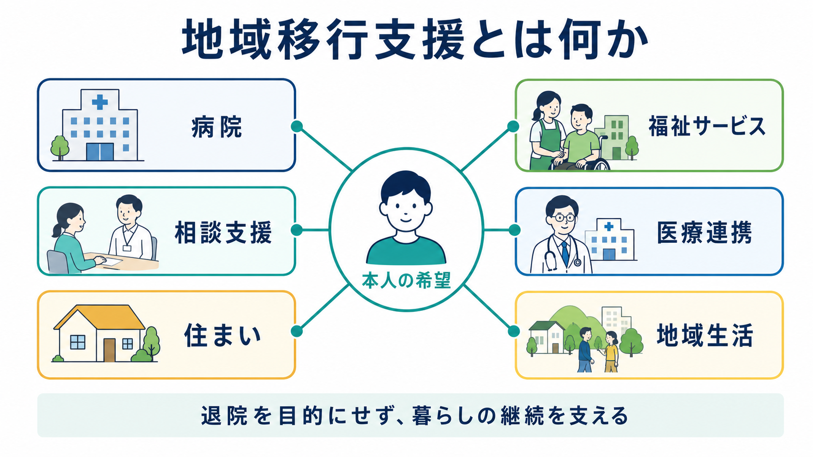
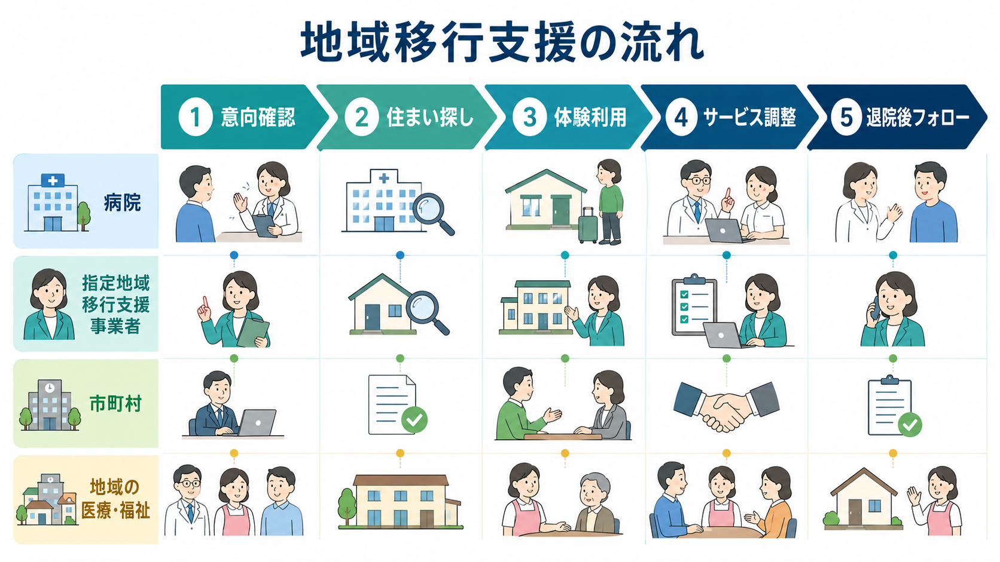
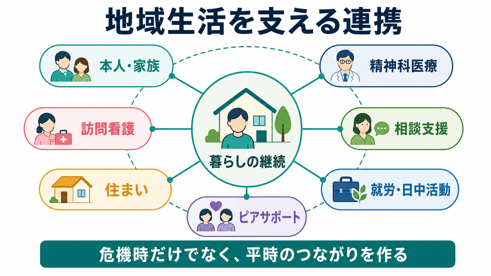

# 地域移行支援とは何か

## 要点

- 地域移行支援とは、精神科病院や障害者支援施設などから地域生活へ移るために、住まいの確保、外出・体験利用、福祉サービス調整、医療との連携を行う相談支援である[1]。
- 退院そのものをゴールにする制度ではない。中心にあるのは、本人がどこで、誰と、どのような支援を使って暮らしたいかを具体化し、退院後も生活が途切れないようにすることである[1][2]。
- 精神科医療では、[[精神保健福祉法とは何か|精神保健福祉法]]上の入院制度、退院後生活環境相談員、自治体、指定一般相談支援事業者、訪問看護、住まい、日中活動が重なり合うため、[[精神科で多職種連携はなぜ重要なのか|多職種連携]]が実質的な支援の質を左右する。
- 地域移行は「病院から出す」政策ではなく、「入院医療中心から地域生活中心へ」という地域精神保健医療福祉の転換と、精神障害にも対応した地域包括ケアシステムの一部として理解する必要がある[3]。
- 研究上は、退院率や再入院率だけでなく、住居の安定、本人の選好、生活の質、社会参加、危機時の連絡体制、権利保障を含めて評価する必要がある[4][5]。

## この記事で答える問い

1. 地域移行支援とは、法律・制度上どのような支援なのか。
2. 長期入院患者が地域生活へ移るとき、住居、福祉、医療はどのようにつながるのか。
3. 地域移行支援と地域定着支援、自立生活援助、退院支援はどう違うのか。
4. 臨床・研究では、どのような成果指標と限界を見ればよいのか。

## まず結論

地域移行支援は、長期入院患者を単に「退院させる」ための手続きではない。本人の希望を起点に、病院内での退院準備、住まい探し、外出や宿泊の体験、障害福祉サービスの調整、退院後の医療・訪問看護・相談支援との接続を組み立てる支援である[1][2]。

したがって、地域移行支援の成否は「退院日が決まったか」だけでは判断できない。むしろ、本人が地域で孤立せず、困ったときに連絡でき、必要な医療と生活支援に再接続できるかが重要である。精神科臨床では、[[任意入院とは何か|任意入院]]や医療保護入院などの入院形態だけでなく、退院後生活環境相談員、指定地域移行支援事業者、市町村、家族、住まい、訪問看護、ピアサポートを含む支援網として考える必要がある。

## 背景

日本の精神科医療では、長期入院、退院後の孤立、住居確保の困難、地域資源の不足が長く課題になってきた。厚生労働省は、平成16年の「精神保健医療福祉の改革ビジョン」以降、「入院医療中心から地域生活中心へ」という方向を掲げ、平成29年度からは「精神障害にも対応した地域包括ケアシステム」の構築を推進している[3]。

この地域包括ケアシステムは、精神障害の有無や程度にかかわらず、誰もが安心して自分らしく暮らすために、医療、障害福祉・介護、住まい、社会参加、地域の助け合い、教育・普及啓発を包括的に確保する考え方である[3]。地域移行支援は、その中で「病院・施設から地域生活へ移る入口」を担う制度である。

長期入院の実態を把握する基盤としては、精神保健福祉資料、いわゆる630調査がある。630調査は、6月30日時点の精神保健医療福祉の実態を把握する調査で、精神病床を有する医療機関、自治体、訪問看護などに関する集計を公表している[4]。地域移行支援を考えるとき、このようなモニタリング資料は、地域ごとの入院長期化、退院支援体制、訪問看護や外来機能の整備を点検する基礎になる。

## 基本概念

### 地域移行支援

厚生労働省の相談支援制度の説明では、地域移行支援は、入所施設や精神科病院などから退所・退院するにあたり支援を要する人に対し、施設・病院内の地域移行の取組と連携しながら、地域移行に向けた支援を行うものとされる[1]。

対象には、精神科病院に入院している精神障害者、障害者支援施設などに入所している障害者、救護施設・更生施設の入所者、刑事施設や少年院、更生保護施設などにいる障害者が含まれる[1]。精神科臨床で特に問題になるのは、長期入院により退院先、金銭管理、服薬継続、対人関係、日中活動、孤立への不安が複合している人である。

### 地域定着支援

地域定着支援は、退所・退院後、または一人暮らしへ移行した後に、地域生活を継続するための支援である[1]。常時の連絡体制を確保し、緊急に支援が必要な事態が生じたときに相談や関係機関との連絡調整を行う[2]。

地域移行支援が「地域生活に移る準備」であるのに対し、地域定着支援は「地域生活を続けるための危機時・平時の支え」である。この区別は重要である。退院直後だけ手厚くしても、数か月後に孤立、家賃滞納、服薬中断、近隣トラブル、身体疾患の悪化が起きれば、再入院につながりうるからである。

### 自立生活援助・計画相談・退院支援との違い

地域移行支援は、指定一般相談支援事業者が行う地域相談支援の一部である。計画相談支援は障害福祉サービス等の利用計画を作る支援であり、自立生活援助は一人暮らしなどを始めた後に、定期的な巡回や随時対応を通じて生活上の課題を把握・助言するサービスとして位置づけられる。

病院内の退院支援は、治療チーム、退院後生活環境相談員、精神保健福祉士などが担う。一方、地域移行支援は、病院の外側にいる指定地域移行支援事業者が、本人の地域生活の選択肢を広げる役割を持つ。両者は競合するものではなく、本人の希望を中心に接続されるべきものである。

## 仕組み

指定地域移行支援の基本方針は、利用者が地域で自立した日常生活または社会生活を営めるよう、住居の確保など地域生活への移行に関する相談や必要な支援を、保健、医療、福祉、就労支援、教育などの関係機関との密接な連携の下で行うことである[2]。同時に、利用者の意思と人格を尊重し、常に利用者の立場に立つことも求められている[2]。

実務では、次のような流れになりやすい。

1. 本人の意向確認  
   退院したいか、どこで暮らしたいか、家族と暮らすか、一人暮らしか、グループホームか、何が不安かを確認する。ここで[[共同意思決定とは何か|共同意思決定]]と意思決定支援が重要になる。

2. 生活課題のアセスメント  
   症状、身体疾患、服薬、金銭管理、家事、対人関係、家族関係、トラブル時の連絡先、日中活動、生活保護や年金などを整理する。

3. 住まいの確保  
   自宅復帰、賃貸住宅、グループホーム、宿泊型自立訓練、救護施設、居住支援法人との連携などを検討する。住まいは単なる住所ではなく、生活の安全性、近隣関係、支援者の訪問可能性、本人の安心感に関わる。

4. 体験利用・体験宿泊  
   外出同行、障害福祉サービスの体験的利用、体験宿泊などを通じて、本人と支援者が「本当に暮らせるか」を具体的に確認する[2]。

5. サービス調整  
   訪問看護、外来、デイケア、就労継続支援、生活介護、ヘルパー、相談支援、金銭管理支援、家族支援を組み合わせる。

6. 退院後のフォロー  
   地域定着支援、自立生活援助、訪問看護、外来、相談支援、ピアサポートなどにつなぎ、危機時の連絡体制を作る。

## 図解

地域移行支援を一枚の図にすると、「本人の希望」を中心に、病院、相談支援、住まい、福祉サービス、医療連携、地域生活が結びつく構造になる。重要なのは、どれか一つの機関が全責任を負うのではなく、本人の生活目標を共有しながら役割を分けることである。

| 領域 | 主な問い | 典型的な支援 |
|---|---|---|
| 本人の希望 | どこで、誰と、どのように暮らしたいか | 面接、意思決定支援、ピアサポート |
| 住まい | 退院先は現実的か、安全か | 住居探し、グループホーム見学、体験宿泊 |
| 医療 | 外来・薬・危機時対応はつながるか | 外来予約、訪問看護、退院前カンファレンス |
| 福祉 | 日常生活を支えるサービスはあるか | 計画相談、ヘルパー、日中活動、就労支援 |
| 権利保障 | 本人の意思が置き去りにされていないか | 説明と同意、記録、苦情対応、虐待防止 |
| 地域定着 | 退院後に困ったとき戻れる回路はあるか | 常時連絡体制、緊急訪問、再調整 |

## 臨床・研究との接続

### 臨床での見方

臨床では、地域移行支援を「退院先探し」と狭く考えると失敗しやすい。長期入院者では、症状が落ち着いていても、長い入院生活そのものによって生活技能、自己効力感、社会的接点、地域での役割が弱くなっていることがある。したがって、退院支援は、症状安定、服薬、金銭管理、買い物、食事、近隣関係、孤独、身体疾患管理を一体として扱う必要がある。

WHOの地域精神保健サービス指針は、精神保健サービスを人権基盤・本人中心に転換し、地域での支援、住まい、アウトリーチ、ピアサポート、包括的なサービスネットワークを重視している[5]。Supported living の技術文書も、住居を得て維持する支援と、法的能力・自己決定の尊重を結びつけている[6]。これは、日本の地域移行支援を「空き部屋を見つけること」ではなく、「本人が地域で生活を続ける条件を整えること」と読む根拠になる。

### 研究での見方

研究では、退院支援や地域移行支援の効果を単純に測りにくい。なぜなら、退院後の生活は、疾患重症度、入院期間、家族関係、地域資源、住居市場、生活保護、訪問看護、本人の希望など、多くの要因に左右されるからである。

精神科退院後の移行期介入に関するシステマティックレビューでは、退院前後をつなぐ介入は、ケースマネジメント、心理教育、認知行動療法、ピアサポートなどを含みうるが、再入院率低下についての証拠は限定的で、介入群の再入院オッズ比は 0.76、95%信頼区間 0.55-1.05 と報告されている[7]。これは「効果がない」というより、介入内容、対象者、追跡期間、地域資源が不均一で、単一指標で評価しにくいことを示している。

一方、重い精神疾患をもつ人の supported accommodation に関するレビューでは、住居の安定、生活環境への満足、社会機能、再入院、生活の質など、複数の成果を分けて検討する必要が示されている[8]。地域移行支援でも、退院率だけでなく、地域での生活継続、本人の満足、危機時対応、孤立の減少、権利保障を併せて見るべきである。

### 医療安全と権利保障

地域移行支援は、本人の自己決定を尊重する支援であるが、単に「本人が退院したいと言ったから退院」とすることでもない。本人が選んだ生活を実現するために、リスクを言語化し、支援で小さくし、本人と共有する必要がある。

たとえば、服薬中断や自傷他害リスク、希死念慮、身体疾患、虐待、経済的搾取、近隣トラブル、孤立がある場合、それらを理由に地域移行を止めるだけでは不十分である。何が起きると危険なのか、誰が気づくのか、どこへ連絡するのか、緊急時に一時的に使える場所はあるかを具体化することが支援である。

## よくある誤解

### 誤解1: 地域移行支援は「退院させる制度」である

地域移行支援の目的は、病床を空けることではない。本人が地域で自立した日常生活または社会生活を営めるように、住居の確保や生活移行の活動を支える制度である[1][2]。退院日だけが先に決まり、退院後の医療・福祉・住まいが未調整なら、地域移行支援としては不十分である。

### 誤解2: 住まいが決まれば地域移行は終わる

住まいは必要条件だが、十分条件ではない。家賃、食事、服薬、通院、近隣関係、孤独、危機時の連絡先、日中活動が整っていなければ、生活はすぐ不安定になる。地域定着支援や自立生活援助との接続が重要である。

### 誤解3: 家族がいれば支援は少なくてよい

家族同居は支援資源になることもあるが、家族だけに退院後支援を背負わせると、再燃、介護負担、関係悪化につながることがある。家族がいる場合でも、本人の意思、家族の限界、第三者の相談先、危機時対応を明確にする必要がある。

### 誤解4: 症状が完全に消えてからでないと退院できない

地域生活は、症状が完全に消えた人だけのものではない。必要なのは、症状や障害特性を前提に、生活上のリスクと支援を調整することである。WHOの地域精神保健サービス指針も、施設中心から、地域で人権を尊重しながら支援する方向を重視している[5]。

## 関連ノート

- [[精神保健福祉法とは何か]]
- [[任意入院とは何か]]
- [[精神科入院で患者の権利をどう守るのか]]
- [[精神科で多職種連携はなぜ重要なのか]]
- [[地域連携は精神科診療で何を意味するのか]]
- [[共同意思決定とは何か]]
- [[精神疾患とリカバリー志向支援はどう関係するのか]]

MOC更新候補: `content/00_MOC/` 配下の精神医学、地域精神医療、制度・司法精神医学関連 MOC に追加する。

## 理解チェック

1. 地域移行支援と地域定着支援の違いを、自分の言葉で説明できるか。
2. 長期入院患者の退院支援で、「住まい」以外に確認すべき生活条件を5つ挙げられるか。
3. 退院率だけで地域移行支援を評価すると、どのような点を見落とすか。
4. 本人の希望と医療安全上の懸念がずれるとき、どのように共同意思決定へつなげるか。

## 未解決問題

- 地域移行支援の質を、退院率や再入院率以外にどの指標で測るべきか。
- 地域ごとの住居資源、訪問看護、相談支援、ピアサポートの差をどのように補正して評価するか。
- 長期入院による生活技能低下と、もともとの障害特性をどのように区別して支援計画へ反映するか。
- 本人のリスクを理由に地域移行が先送りされる場合、誰が、どの時点で、どの根拠に基づいて再検討するか。

## 参考文献

[1] 厚生労働省. 障害のある人に対する相談支援について. https://www.mhlw.go.jp/stf/seisakunitsuite/bunya/hukushi_kaigo/shougaishahukushi/service/soudan_shien.html

[2] 厚生労働省. 障害者の日常生活及び社会生活を総合的に支援するための法律に基づく指定地域相談支援の事業の人員及び運営に関する基準（平成24年厚生労働省令第27号）. https://www.mhlw.go.jp/web/t_doc?dataId=83ab2664&dataType=0&pageNo=1

[3] 厚生労働省. 精神障害にも対応した地域包括ケアシステムの構築について. https://www.mhlw.go.jp/stf/seisakunitsuite/bunya/chiikihoukatsu.html

[4] 国立精神・神経医療研究センター 精神保健研究所. 精神保健福祉資料（630調査）. https://www.ncnp.go.jp/nimh/seisaku/data/

[5] World Health Organization. (2021). *Guidance on community mental health services: Promoting person-centred and rights-based approaches*. https://www.who.int/publications/i/item/9789240025707

[6] World Health Organization. (2021). *Supported living services for mental health: Promoting person-centred and rights-based approaches*. https://www.who.int/publications-detail-redirect/9789240025820

[7] Hegedüs, A., Kozel, B., Richter, D., & Behrens, J. (2020). Effectiveness of transitional interventions in improving patient outcomes and service use after discharge from psychiatric inpatient care: A systematic review and meta-analysis. *Frontiers in Psychiatry*, 10, 969. https://doi.org/10.3389/fpsyt.2019.00969

[8] McPherson, P., Krotofil, J., & Killaspy, H. (2018). Mental health supported accommodation services: A systematic review of mental health and psychosocial outcomes. *BMC Psychiatry*, 18, 128. https://doi.org/10.1186/s12888-018-1725-8
