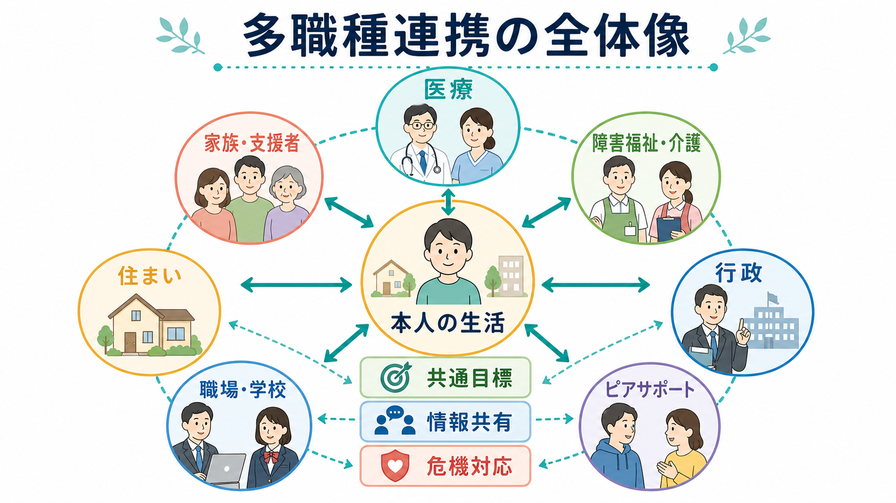
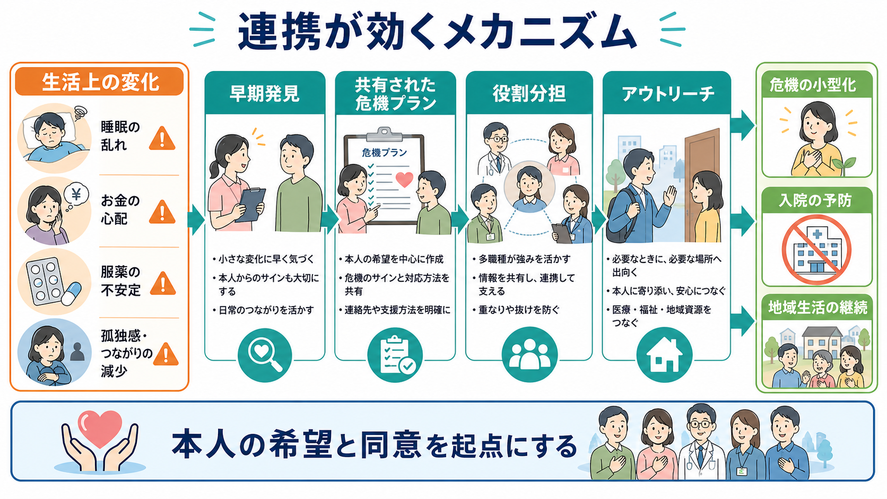
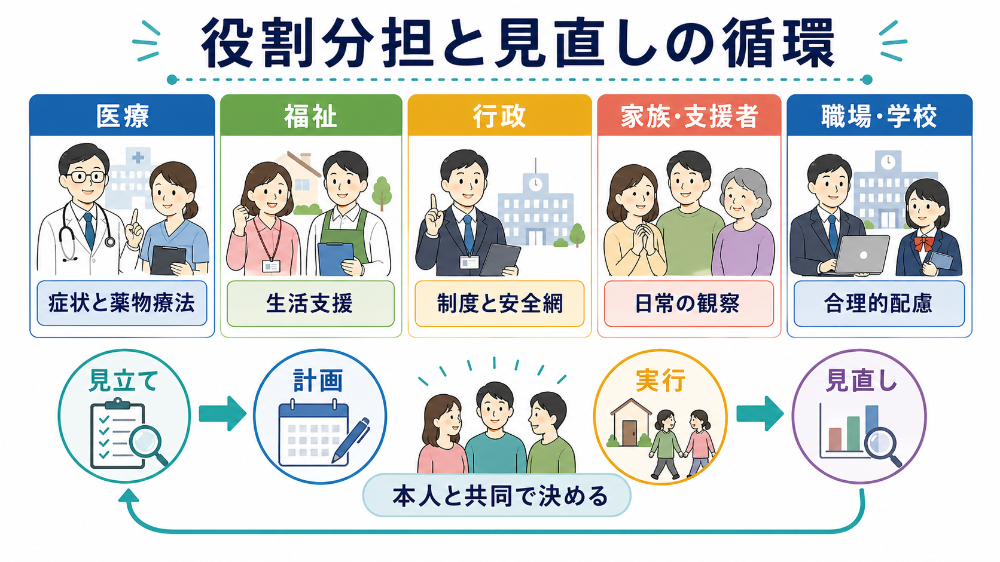

# 多職種連携は地域精神医療でなぜ重要なのか

## 要点

- 地域精神医療の目的は、症状を下げるだけでなく、本人が住まい、家族、仕事、学校、福祉制度、地域資源の中で暮らし続けられるようにすることである。
- 多職種連携は、精神科医療、訪問看護、障害福祉、行政、家族、職場・学校、ピアサポートが「別々に善意で動く」状態を、共通目標・役割分担・情報共有・危機対応に変える仕組みである。
- エビデンス上も、地域に基盤を置くチーム、集中的ケースマネジメント、危機介入、Assertive Community Treatment（ACT）は、入院日数や支援の途切れを減らしうる。ただし、効果は対象者、地域資源、チームの忠実度によって変わる[5][6][7][8]。
- 連携の中心は専門職ではなく本人である。本人の希望、同意、意思決定支援、権利擁護を抜きにした連携は、支援ではなく管理になりやすい[2][3]。
- このノートは教育・研究目的の整理であり、個別の診断、入院判断、治療指示ではない。

## この記事で答える問い

1. なぜ地域精神医療では、医療だけでなく福祉・行政・家族・職場との連携が必要になるのか。
2. 多職種連携は、再発、再入院、孤立、生活困難をどのような仕組みで小さくするのか。
3. 連携をするとき、本人の権利と自己決定をどう守るべきか。
4. 研究や制度の観点から、どこまでが確立した知見で、どこに限界があるのか。

## まず結論

多職種連携が重要なのは、精神疾患による困難が「症状」だけで完結しないからである。たとえば、幻聴や抑うつが軽くなっても、住まいが不安定で、服薬を続けにくく、家族が疲弊し、職場に合理的配慮がなく、支援制度の申請が途切れれば、地域生活は簡単に不安定になる。逆に、医療、福祉、行政、家族、職場・学校、ピアサポートが同じ目標を共有すると、小さな変化を早く拾い、本人の希望に沿って支援を組み替え、危機が大きくなる前に介入できる。

WHO は、精神保健サービスを病院中心から、地域に根ざし、本人中心で、権利に基づく支援へ移行する必要を強調している[2][3]。日本でも、厚生労働省は「精神障害にも対応した地域包括ケアシステム」を、医療、障害福祉・介護、住まい、社会参加、地域の助け合い、教育などが包括的に確保された体制として整理している[1]。つまり多職種連携は、親切な付加サービスではなく、地域精神医療そのものの骨格である。

## 背景

精神医療は長く、急性期症状を病院で治療するモデルに偏りやすかった。しかし、精神疾患の回復は退院時点で終わらない。退院後には、通院、服薬、睡眠、金銭管理、対人関係、家族との距離、就労・就学、孤立、身体疾患、スティグマ、制度利用が同時に問題になる。これは[[地域精神医療とは何か]]、[[精神疾患と再入院はどう関係するのか]]、[[精神疾患と孤立はどう関係するのか]]とも接続する。

地域生活を支えるには、病院の診察室だけでは見えにくい情報が必要になる。本人が「眠れていない」と言う前に家族や訪問看護師が生活リズムの乱れに気づくことがある。支援者が金銭管理の困難を把握して、福祉サービスにつなげることもある。職場の負荷が再発の引き金になっていれば、産業保健や就労支援との調整が必要になる。こうした情報を統合しないと、医療は「症状だけを診る」形になり、福祉は「生活だけを支える」形になり、行政は「制度だけを案内する」形になってしまう。

## 基本概念

### 多職種連携

多職種連携とは、複数の専門職や支援者が、本人の生活目標に沿って、評価、計画、実行、見直しを共同で行うことである。精神科医、看護師、精神保健福祉士、心理職、作業療法士、薬剤師、相談支援専門員、保健師、行政職、訪問看護、就労支援員、家族、ピアサポーターなどが関わる。

重要なのは、単に人数が多いことではない。多職種がいても、情報が分断され、誰が何を担うか不明で、本人の希望が置き去りにされていれば連携とは言いにくい。むしろ「誰が何を見るか」「どの変化を共有するか」「危機時に誰へ連絡するか」「本人が望まない共有をどう扱うか」を合意することが中核である。これは[[地域連携は精神科診療で何を意味するのか]]、[[精神科で多職種連携はなぜ重要なのか]]、[[ケア会議とは何か]]と重なる。

### 地域精神医療

地域精神医療は、病院外の生活を中心に、治療、リハビリテーション、生活支援、危機介入、権利擁護を組み合わせる考え方である。WHO の文書では、地域に根ざした包括的な精神保健サービスネットワークが、入院中心の制度からの転換として位置づけられている[3]。その意味で、地域精神医療は「外来を増やすこと」だけではなく、住まい、日中活動、就労、家族支援、社会参加を含む生活基盤の設計である。

### ケースマネジメント

[[ケースマネジメントとは何か]]は、本人のニーズを評価し、必要なサービスを調整し、支援が途切れないように見直す方法である。重症精神障害では、単にサービスを紹介するだけでなく、本人の生活場面に出向くアウトリーチ、危機時の連絡体制、継続的な関係形成が重要になる。集中的ケースマネジメントに関する Cochrane レビューでは、標準的ケアに比べて入院日数を減らす可能性が示されているが、効果は地域の標準ケアの質や対象者の入院リスクによって変わる[6]。

### 本人中心と権利

連携は、本人を取り囲んで管理するための仕組みではない。WHO は、精神保健サービスの転換において、本人中心、リカバリー志向、権利に基づく支援を強調している[2][3]。情報共有にも、本人の同意、プライバシー、説明、拒否する権利への配慮が必要である。[[意思決定支援とは何か]]、[[共同意思決定とは何か]]、[[精神医療における権利擁護とは何か]]は、この点を理解するための基礎になる。

## 仕組み

### 1. 小さな変化を早く拾う

再発や危機は、突然ゼロから起きるとは限らない。睡眠の乱れ、服薬の中断、孤立、金銭トラブル、家族との衝突、職場での過負荷、身体疾患の悪化など、生活上の変化が先に見えることが多い。医療だけでは月1回の診察でしか把握できない変化も、訪問看護、家族、相談支援、職場、学校が関わると早く検出できる。

### 2. 支援の抜けと重なりを減らす

連携が弱いと、「医療は福祉が見ていると思っていた」「福祉は家族が対応していると思っていた」「家族は病院に伝わっていると思っていた」という空白が生じる。逆に、複数機関が同じ助言を別々に行い、本人が疲弊することもある。[[ケア会議とは何か]]や個別支援計画は、役割の空白と重複を見える化するための実務的な道具である。

### 3. 危機対応を事前に設計する

[[クライシスプランとは何か]]は、調子を崩すサイン、本人が望む対応、避けたい対応、連絡先、緊急時の選択肢を事前に共有する方法である。危機介入に関する Cochrane レビューでは、急性危機への地域ベースの対応が入院を減らし、本人や家族の満足度を高める可能性が示されている[7]。ただし、十分な人員、24時間対応の設計、リスク評価、入院が必要な場合の接続がなければ機能しない。

### 4. 入院と地域生活をつなぐ

地域精神医療では、入院は地域生活から切り離された出来事ではない。退院支援、地域移行支援、地域定着支援、訪問看護、デイケア、就労支援がつながることで、退院後の孤立や支援中断を減らしやすくなる。NICE の複雑な精神病に対するリハビリテーションのガイドラインも、地域生活を支える多職種チーム、ケアコーディネーション、住まい、身体健康、就労・社会参加を含む支援を重視している[4]。

### 5. 家族と職場を「治療者」にしすぎない

家族や職場は重要な支援資源だが、専門職の代替ではない。家族支援では、病気の説明、危機時対応、休息、相談先、境界設定が必要になる。職場・学校との連携では、本人の同意のもとで、勤務時間、業務量、休憩、通院配慮、再発サインへの対応を調整する。[[家族への説明で何に注意するべきか]]、[[精神疾患と家族負担はどう関係するのか]]、[[就労支援とは何か]]、[[IPS援助付き雇用とは何か]]と接続する。

## 図解

多職種連携は、次のような循環として理解しやすい。

1. **見立て**: 症状、生活機能、希望、リスク、強み、環境を評価する。
2. **計画**: 本人と共同で、短期目標、役割分担、連絡方法、危機時対応を決める。
3. **実行**: 医療、福祉、行政、家族、職場・学校が、それぞれの役割で支える。
4. **見直し**: うまくいった点、負担が大きい点、本人の希望の変化を確認する。

| 領域 | 主な役割 | 連携で見落としやすい点 |
|---|---|---|
| 医療 | 診断、薬物療法、心理社会的治療、身体合併症、リスク評価 | 生活上の困難を症状だけに還元しない |
| 福祉 | 相談支援、住まい、日中活動、家計、移動、地域資源 | 医療情報なしに支援困難を「本人の意欲不足」と見ない |
| 行政 | 制度、保健所、精神保健福祉センター、権利擁護、安全網 | 危機時だけでなく平時の接続を作る |
| 家族・支援者 | 日常変化の観察、情緒的支援、危機時の協力 | 家族に過大な責任を背負わせない |
| 職場・学校 | 合理的配慮、復職・復学支援、負荷調整 | 本人の同意なしに病名や詳細を共有しない |
| ピアサポート | 経験に基づく希望、孤立の緩和、制度利用の知恵 | 専門職と同じ役割を求めすぎない |

## 臨床・研究との接続

臨床では、多職種連携は「重症例だけの特別対応」ではない。初発精神病、双極性障害、うつ病、依存症、発達特性を背景にした生活困難、認知機能障害を伴う精神疾患、身体合併症、ホームレス状態、自殺リスクなど、多くの場面で必要になる。[[精神疾患と治療中断はどう関係するのか]]、[[精神疾患と服薬アドヒアランス不良はどう関係するのか]]、[[精神疾患とホームレス状態はどう関係するのか]]にも関わる。

研究面では、地域精神医療のアウトカムは単純ではない。症状尺度だけでなく、入院日数、再入院、住居の安定、就労・就学、生活の質、本人満足度、家族負担、権利侵害の少なさ、支援継続、身体健康を同時に見る必要がある。Cochrane の地域精神保健チームのレビューでは、地域チームが病院中心の標準ケアより受容性や満足度を改善しうる一方、症状や社会機能への効果は明確でない部分もある[5]。これは「連携は万能薬ではない」が、「医療だけでは扱えないアウトカムを扱うための基盤である」という読み方が妥当である。

ACT は、重い精神疾患があり、入退院や支援中断を反復しやすい人に対して、低いケースロード、多職種チーム、アウトリーチ、24時間に近い危機対応、チーム全体での責任共有を重視するモデルである。SAMHSA の ACT ツールキットは、精神科医、看護、ケースマネジャー、就労支援、物質使用支援、ピア支援などを含むチーム構成と、地域での直接支援を重視している[8]。ただし ACT の有効性は、通常ケアが乏しい地域ほど大きく見えやすく、既存の地域支援が充実している地域では追加効果が小さくなる可能性がある[6][8]。

## よくある誤解

### 誤解1: 連携とは、情報を全部共有することである

情報共有は必要だが、何でも共有すればよいわけではない。本人の同意、目的、共有範囲、緊急性を確認する必要がある。共有の目的は支援の質を上げることであり、本人を監視することではない。

### 誤解2: 家族がいれば地域支援は足りる

家族は重要な支援者だが、家族だけに危機対応、服薬管理、金銭管理、見守りを負わせると、家族負担が増え、関係が悪化しやすい。家族支援は、家族を専門職の代替にすることではなく、家族も支援対象として位置づけることである。

### 誤解3: 連携すれば入院は不要になる

連携は入院を減らしうるが、入院が必要な場面を否定するものではない。強い自傷他害リスク、著しい判断力低下、重い身体合併症、地域で安全を確保できない危機では、入院が本人の安全と回復を支える選択肢になる。重要なのは、入院を地域生活の失敗とみなさず、退院後の支援へつなぐことである。

### 誤解4: 多職種会議を開けば連携できている

会議は手段であって目的ではない。会議後に、誰が、いつまでに、何をするかが明確でなければ、本人にとっての変化は起きにくい。会議の質は、議事録の美しさより、本人の生活上の問題が実際に小さくなったかで評価する。

## 関連ノート

- [[地域精神医療とは何か]]
- [[地域連携は精神科診療で何を意味するのか]]
- [[精神科で多職種連携はなぜ重要なのか]]
- [[精神科におけるチーム医療とは何か]]
- [[ケースマネジメントとは何か]]
- [[ケア会議とは何か]]
- [[精神科訪問看護とは何か]]
- [[アウトリーチ支援とは何か]]
- [[クライシスプランとは何か]]
- [[地域移行支援とは何か]]
- [[地域定着支援とは何か]]
- [[ピアサポートとは何か]]
- [[就労支援とは何か]]
- [[精神保健福祉法とは何か]]
- [[障害者総合支援法とは何か]]
- [[意思決定支援とは何か]]

## MOC更新候補

- `content/00_MOC/` 配下の精神医学、地域精神医療、社会福祉・制度関連 MOC に追加候補。
- 並列生成ジョブとの競合を避けるため、この作業では MOC 本体は更新しない。

## 理解チェック

1. 地域精神医療において、症状が改善しても生活が不安定になる理由を3つ挙げる。
2. 多職種連携で共有すべき情報と、本人の同意なく安易に共有すべきでない情報を分けて説明する。
3. 「家族支援」と「家族に責任を背負わせること」は何が違うか。
4. 危機対応を事前に設計することが、なぜ再入院予防につながりうるのか。
5. ACT や集中的ケースマネジメントの効果を読むとき、地域の通常ケアの質を考慮すべき理由は何か。

## 未解決問題

- 日本の地域精神医療で、多職種連携の質をどの指標で測るべきかは十分に標準化されていない。
- 個人情報保護、本人同意、家族支援、危機対応をどう両立するかは、制度と現場実践の両方で継続課題である。
- ACT、訪問看護、相談支援、就労支援、ピアサポートを地域差なく利用できる体制には、まだ資源格差がある。
- 連携が支援ではなく管理や強制に傾くリスクを、どのように評価し予防するかが重要である。

## 参考文献

[1] 厚生労働省. 「精神障害にも対応した地域包括ケアシステムの構築について」. https://www.mhlw.go.jp/stf/seisakunitsuite/bunya/chiikihoukatsu.html

[2] World Health Organization. (2021). *Guidance on community mental health services: promoting person-centred and rights-based approaches*. https://www.who.int/publications/i/item/9789240025707

[3] World Health Organization. (2021). *Comprehensive mental health service networks: promoting person-centred and rights-based approaches*. https://www.who.int/publications/i/item/9789240026209

[4] National Institute for Health and Care Excellence. (2020). *Rehabilitation for adults with complex psychosis: NICE guideline NG181*. https://www.nice.org.uk/guidance/ng181

[5] Malone, D., Marriott, S., Newton-Howes, G., Simmonds, S., & Tyrer, P. (2007). Community mental health teams for people with severe mental illnesses and disordered personality. *Cochrane Database of Systematic Reviews*, CD000270. https://doi.org/10.1002/14651858.CD000270.pub2

[6] Dieterich, M., Irving, C. B., Park, B., & Marshall, M. (2017). Intensive case management for severe mental illness. *Cochrane Database of Systematic Reviews*, CD007906. https://doi.org/10.1002/14651858.CD007906.pub3

[7] Murphy, S. M., Irving, C. B., Adams, C. E., & Driver, R. (2015). Crisis intervention for people with severe mental illnesses. *Cochrane Database of Systematic Reviews*, CD001087. https://doi.org/10.1002/14651858.CD001087.pub5

[8] Substance Abuse and Mental Health Services Administration. *Assertive Community Treatment: Evidence-Based Practices KIT*. https://store.samhsa.gov/product/assertive-community-treatment-act-evidence-based-practices-ebp-kit/sma08-4345
