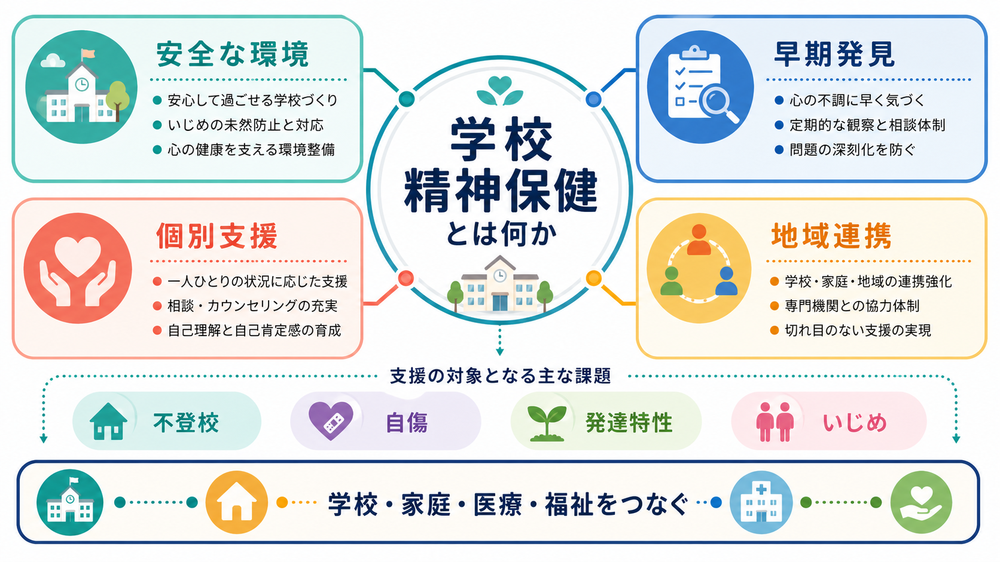
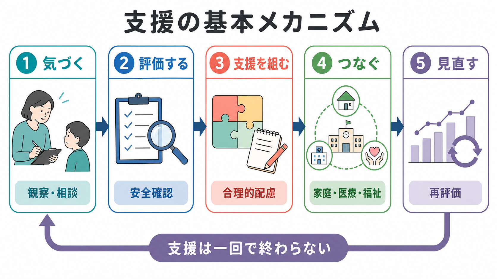
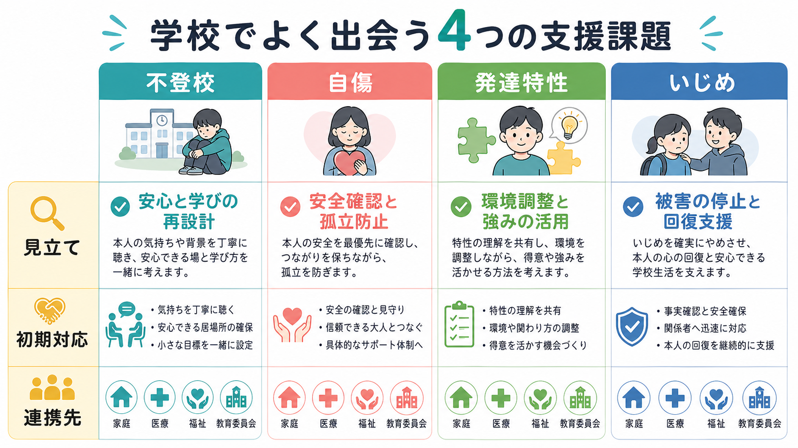

# 学校精神保健とは何か

## 要点

- 学校精神保健は、児童生徒のこころの問題を「本人の内面」だけに閉じ込めず、学級・家庭・地域・医療福祉サービスを含む環境全体で支える実践である。
- 中核は、普遍的な環境づくり、早期発見、個別支援、危機対応、外部連携、支援の見直しである。
- 不登校、自傷、発達特性、いじめは別々の課題に見えるが、安心できる場、本人の声、安全確認、合理的配慮、関係機関との連携という共通の支援原理をもつ。
- 学校は診断や治療を代替する場所ではない。教育の場としてできる支援と、医療・福祉・児童相談・教育委員会につなぐ判断を分ける必要がある。

## この記事で答える問い

この記事では、学校精神保健を「学校で精神疾患を見つけること」ではなく、「子どもが安心して学び、関係を保ち、必要な支援に接続されるための仕組み」として整理する。特に、不登校・自傷・発達特性・いじめという学校現場で出会いやすい課題を、[[児童精神医学とは何か]]、[[児童青年期の自傷行為はどう理解するのか]]、[[発達特性と二次障害とは何か]]、[[いじめは精神健康にどう影響するのか]]と接続して読むための入口にする。

## まず結論

学校精神保健とは、学校を「健康を損なわない場」にとどめず、「健康と学びを同時に促進する場」に変えるための実践である。WHOとUNESCOのヘルスプロモーティング・スクールの考え方では、教育制度は児童生徒・職員・地域の健康とウェルビーイングを促進してこそ十分に機能するとされる[1]。この発想を日本の学校制度に置き換えると、担任、養護教諭、生徒指導、特別支援教育コーディネーター、スクールカウンセラー、スクールソーシャルワーカー、管理職、家庭、医療、福祉、教育委員会が役割を分けながら連携する体制を指す。

重要なのは、学校精神保健を「問題が起きた児童生徒への個別対応」だけにしないことである。相談しやすい雰囲気、いじめを許さない構造、発達特性に応じた授業・評価の調整、欠席中も学びと関係を切らない工夫が、危機が深まる前の予防になる。

## 背景

学校は、子どもが長い時間を過ごす生活環境であり、学力だけでなく睡眠、食事、友人関係、家庭状況、身体症状、気分、注意、衝動性、自己評価が表れやすい場所である。WHO/UNESCOは、学校を健康増進の戦略的な場と位置づけ、個人への教育だけでなく、学校方針、物理的環境、社会的環境、地域連携を含めた全校的アプローチを重視している[1]。

日本では、スクールカウンセラーは児童生徒へのカウンセリング、教職員・保護者への助言、校内研修、危機時の心のケアなどに関わる。スクールソーシャルワーカーは、家庭・福祉・地域資源との調整、関係機関とのネットワーク形成、校内チーム支援を担う[2]。したがって学校精神保健は、心理職だけの活動ではなく、学校組織のリスクマネジメント、教育相談、特別支援教育、地域連携を束ねる実践である。

## 基本概念

### 1. 普遍的支援・選択的支援・個別支援

学校精神保健は、支援対象の広さで三層に分けると理解しやすい。

| 層 | 対象 | 例 |
|---|---|---|
| 普遍的支援 | すべての児童生徒 | 相談窓口の周知、いじめ予防、心理教育、安心できる教室環境 |
| 選択的支援 | リスクが高い児童生徒 | 欠席増加、孤立、家庭困難、発達特性が疑われる子への早期相談 |
| 個別支援 | すでに困難が顕在化した児童生徒 | 支援会議、個別の教育支援計画、医療・福祉との連携、安全計画 |

学校内の支援は、診断名よりも「今、何が学びと生活を妨げているか」から始める方が実践的である。例えば、同じ欠席でも、睡眠相の乱れ、いじめ、家庭内葛藤、抑うつ、社交不安、発達特性に伴う感覚過敏、学習困難では支援の入口が異なる。

### 2. 本人の声と安全確認

学校精神保健では、本人の希望を聞くことと、安全を確認することを同時に行う。本人の意思を尊重することは、リスクを放置することではない。自傷や自殺念慮が疑われる場合は、秘密保持を約束しすぎず、本人に説明したうえで保護者・管理職・医療につなぐ。NICEの自傷ガイドラインも、自傷を「意図にかかわらない自己中毒または自己損傷」と広く捉え、子ども・若者を含むすべての領域で評価と再発予防を行う必要を示している[4]。これは[[自傷と自殺企図はどう違うのか]]や[[自殺リスク評価では何を聞くべきか]]と合わせて理解したい。

### 3. 合理的配慮と環境調整

発達特性への支援は、本人を「標準」に近づけることだけではない。通常の学級にも、学習面または行動面で著しい困難を示し、特別な教育的支援を必要とする児童生徒が一定数いることが文部科学省調査で示されている。ただし、この調査は担任等の回答に基づく支援ニーズの把握であり、医学的診断の割合を示すものではない[5]。支援では、座席、視覚的手がかり、課題量、評価方法、休憩、感覚刺激、対人場面の予告など、環境を調整して二次的な不安・抑うつ・不登校を減らす。

## 仕組み

学校精神保健の支援は、次の循環として設計すると実装しやすい。

1. **気づく**  
   欠席、遅刻、保健室利用、成績急落、友人関係の変化、身だしなみ、睡眠不足、怒りっぽさ、自傷痕、SNSトラブルなどを、非難ではなく観察情報として共有する。

2. **評価する**  
   何が危険で、何が困りごとで、何が保護因子かを分ける。自傷・自殺念慮、虐待、いじめ、性被害、家庭内暴力、急性精神病症状が疑われる場合は、通常の教育相談ではなく危機対応として扱う。

3. **支援を組む**  
   本人の希望、保護者の認識、学校で可能な配慮、医療・福祉の必要性を整理する。支援は「登校させる」だけではなく、学び、休息、対人関係、進路、身体安全をどう再設計するかで考える。

4. **つなぐ**  
   校内では担任、養護教諭、管理職、特別支援教育コーディネーター、SC、SSWが役割分担する。校外では医療機関、児童相談所、市区町村、教育支援センター、警察、法務局、民間支援団体などが関係する。

5. **見直す**  
   支援計画は一度作って終わりではない。出席日数、睡眠、安心できる大人の数、本人の自己効力感、危険行動の頻度、学習参加、家庭負担などを見直し、支援強度を調整する。

## 図解

不登校・自傷・発達特性・いじめへの初期対応は異なるが、共通して「本人を責めない」「安全を先に確保する」「学校だけで抱え込まない」という原則をもつ。

| 課題 | 初期の見立て | 学校での初期対応 | 連携の目安 |
|---|---|---|---|
| 不登校 | 欠席の背景は単一ではない | 登校のみを目標にせず、安心・学び・社会的自立を再設計する | 教育支援センター、医療、福祉、民間支援 |
| 自傷 | 苦痛調整、孤立、希死念慮の有無を分ける | 叱責せず安全確認、保護者・管理職・医療と共有 | 児童精神科、救急、地域保健、児童相談 |
| 発達特性 | 診断名より支援ニーズを見る | 合理的配慮、構造化、感覚・対人負荷の調整 | 特別支援教育、医療、療育、福祉 |
| いじめ | 本人が苦痛を感じているかを重視する | 被害の停止、安全確保、事実確認、組織対応 | 教育委員会、SC/SSW、警察、法務局 |

文部科学省の不登校支援通知は、不登校支援を「学校に登校する」という結果だけを目標にせず、児童生徒が自らの進路を主体的に捉え、社会的に自立することを目指す必要があるとする[3]。この考え方は、休養や学び直しを含む柔軟な支援を可能にする一方で、孤立や学習機会の喪失を放置しない視点も求める。

いじめについては、いじめ防止対策推進法が、本人が心身の苦痛を感じている行為をいじめとして定義し、学校に組織的対応、早期発見、相談体制、重大事態への調査を求めている[6]。いじめ被害は、不安、抑うつ、自傷、自殺関連行動、身体症状、学業・対人機能の低下と関連することがメタ分析でも示されており、単なる「友人トラブル」として扱うべきではない[7]。

## 臨床・研究との接続

学校精神保健は、臨床実践と公衆衛生の中間にある。個別の児童生徒には、[[児童青年期うつ病とは何か]]、[[児童青年期の不安症はどう現れるのか]]、[[神経発達症とは何か]]、[[非自殺性自傷とは何か]]の知識が必要になる。一方で学校全体には、全校的な予防、相談アクセス、教職員研修、危機対応マニュアル、地域資源との連携が必要になる。

学校ベースのメンタルヘルス介入については、厳格なRCTを対象にしたメタ分析で、抑うつ・不安の軽減に小さいが有意な効果が示されている。特に認知行動療法を含むプログラム、臨床家が関与する介入、中高生を対象にした介入で効果が大きい傾向が報告されている[8]。ただし、学校で行う介入は万能ではなく、プログラムの質、実施者の訓練、文化的適合、リスク児童の個別対応、医療への接続が効果を左右する。

研究上は、次の問いが重要である。

- 不登校支援で、登校日数以外にどのアウトカムを測るべきか。
- 自傷を開示した児童生徒への学校内対応は、どの条件で再自傷や医療アクセスを改善するか。
- 発達特性への合理的配慮は、二次障害やいじめ被害をどの程度減らすか。
- いじめ対応で、被害停止、関係修復、再被害予防をどう評価するか。
- SC/SSW配置の量だけでなく、校内チームの機能をどう測定するか。

## よくある誤解

### 誤解1: 学校精神保健はスクールカウンセラーの仕事である

スクールカウンセラーは重要だが、学校精神保健は心理職だけで完結しない。担任の観察、養護教諭の身体症状への気づき、管理職の危機判断、SSWの福祉連携、特別支援教育の環境調整がそろって初めて機能する。

### 誤解2: 不登校支援の目的は登校再開である

登校再開は一つの成果だが、唯一の目的ではない。本人の休養、学習機会、社会的自立、安心できる関係、進路選択を同時に見る必要がある[3]。

### 誤解3: 自傷は注目を引くためなので、反応しない方がよい

自傷には苦痛の調整、解離からの回復、自己罰、援助希求、希死念慮との重なりなど複数の意味がありうる。叱責や無視ではなく、安全確認、孤立防止、本人の説明、医療につなぐ判断が必要である[4]。

### 誤解4: 発達特性は診断がついてから支援すればよい

学校で必要なのは、診断名を確定することではなく、学びと生活を妨げている条件を調整することである。診断がなくても、困難が明らかな場合には教育的支援を検討できる[5]。

### 誤解5: いじめは双方の話し合いで解決すればよい

いじめは力関係と安全の問題を含む。まず被害の停止と安全確保を行い、学校内の組織で対応する。重大事態や犯罪性が疑われる場合は、学校外機関との連携が必要である[6]。

## 関連ノート

- [[児童精神医学とは何か]]
- [[児童青年期の自傷行為はどう理解するのか]]
- [[思春期の自殺リスクはどう評価するのか]]
- [[非自殺性自傷とは何か]]
- [[自傷と自殺企図はどう違うのか]]
- [[自殺リスク評価では何を聞くべきか]]
- [[発達特性と二次障害とは何か]]
- [[神経発達症とは何か]]
- [[いじめは精神健康にどう影響するのか]]
- [[地域連携は精神科診療で何を意味するのか]]
- [[精神保健福祉士とは何をする職種なのか]]
- [[自殺対策基本法とは何か]]

## MOC更新候補

- `content/00_MOC/MOC｜精神医学.md`
- `content/00_MOC/MOC｜発達・愛着・社会心理.md`
- 司法・制度・地域精神医療の索引がある場合は、本記事を「学校・地域・制度」系の項目として追加する。

## 理解チェック

1. 学校精神保健を、単なる「児童生徒の問題への個別対応」として捉えると何が抜け落ちるか。
2. 不登校支援で、登校日数以外に確認すべきアウトカムは何か。
3. 自傷を打ち明けられた教職員が、秘密保持について注意すべき点は何か。
4. 発達特性への支援で、診断名より先に確認すべき学校生活上の条件は何か。
5. いじめ対応で、当事者同士の話し合いより先に行うべきことは何か。

## 未解決問題

- 日本の学校で、SC/SSWの配置時間、校内支援会議の質、児童生徒のアウトカムを結びつけた評価研究はまだ十分ではない。
- 不登校支援では、学習保障、休養、社会的自立、家族負担を統合した評価指標が必要である。
- 自傷・自殺リスク対応では、学校と医療の情報共有、緊急時対応、本人の同意・保護者関与の境界を実践的に整える必要がある。
- いじめや発達特性への支援では、本人の主観的安全感と、学校組織が記録・検証できる安全確保をどう両立するかが課題である。

## 参考文献

[1] World Health Organization & UNESCO. (2021). *Making every school a health-promoting school: global standards and indicators*. World Health Organization. https://iris.who.int/handle/10665/341907

[2] 文部科学省. スクールカウンセラー等活用事業; スクールソーシャルワーカー活用事業. https://www.mext.go.jp/a_menu/shotou/seitoshidou/1328010.htm ; https://www.mext.go.jp/a_menu/shotou/seitoshidou/1416474_00001.htm

[3] 文部科学省. (2019). 「不登校児童生徒への支援の在り方について」令和元年10月25日. https://www.mext.go.jp/a_menu/shotou/seitoshidou/1422155.htm

[4] National Institute for Health and Care Excellence. (2022). *Self-harm: assessment, management and preventing recurrence* (NICE guideline NG225). https://www.nice.org.uk/guidance/ng225

[5] 文部科学省. (2022). 通常の学級に在籍する特別な教育的支援を必要とする児童生徒に関する調査結果（令和4年）について. https://www.mext.go.jp/b_menu/houdou/2022/1421569_00005.htm

[6] 文部科学省. いじめの問題に対する施策; いじめ防止対策推進法（概要）. https://www.mext.go.jp/a_menu/shotou/seitoshidou/1302904.htm ; https://www.mext.go.jp/a_menu/shotou/seitoshidou/1337288.htm

[7] Moore, S. E., Norman, R. E., Suetani, S., Thomas, H. J., Sly, P. D., & Scott, J. G. (2017). Consequences of bullying victimization in childhood and adolescence: A systematic review and meta-analysis. *World Journal of Psychiatry, 7*(1), 60-76. https://doi.org/10.5498/wjp.v7.i1.60

[8] Zhang, Q., Wang, J., & Neitzel, A. (2023). School-based mental health interventions targeting depression or anxiety: A meta-analysis of rigorous randomized controlled trials for school-aged children and adolescents. *Journal of Youth and Adolescence, 52*, 195-217. https://doi.org/10.1007/s10964-022-01684-4
