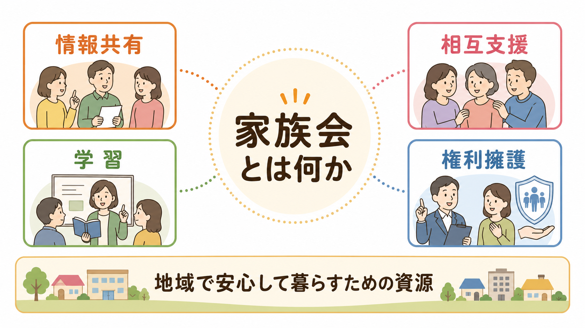
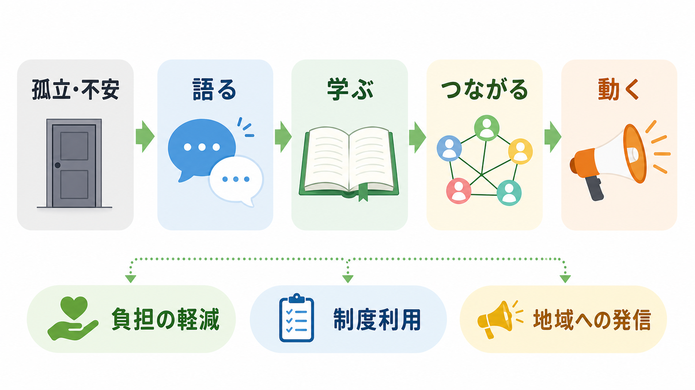
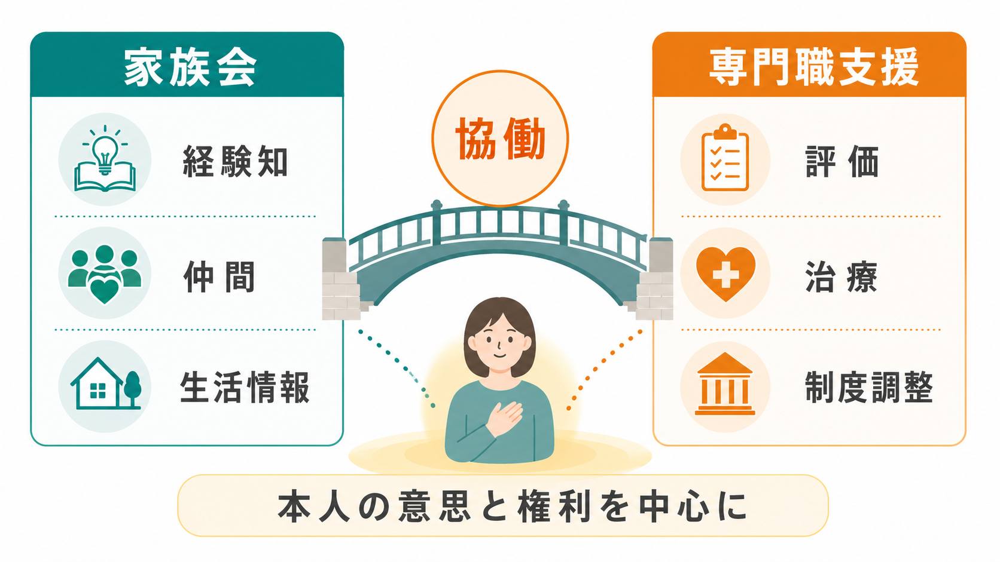

# 家族会とは何か

## 要点

- 家族会とは、精神疾患や精神障害のある本人を身近に支える家族が集まり、経験を語り、情報を交換し、互いに支え合う会である。
- 役割は「情報共有」「相互支援」「学習」「地域資源への接続」「権利擁護・政策提言」に分けると理解しやすい。
- 専門職による家族心理教育・家族介入とは別物だが、孤立の軽減、知識の獲得、相談先の発見という点で臨床・地域支援と接続する。
- 家族会は本人の治療を代行する場ではなく、本人の意思と権利を中心に、家族自身の生活と支援力を守るための地域資源である。

## この記事で答える問い

1. 家族会は何をする場なのか。
2. 家族会は医療・福祉・行政の支援とどう違うのか。
3. 家族会は地域精神医療や家族介入のエビデンスとどう接続するのか。
4. 家族会を利用・紹介するときに、何に注意すべきか。

## まず結論

家族会は、家族が「同じ立場の人」と出会い、体験知と制度情報を共有し、孤立を下げ、地域で暮らすための見通しを得る場である。全国精神保健福祉会連合会（みんなねっと）は、家族会を、精神疾患をもつ人を身内にかかえる家族が集まり、悩みを語り合い、互いに支え合う会として説明している[1]。

ただし、家族会は医療機関でも、行政窓口でも、個別ケースの治療方針を決める場でもない。むしろ、[[精神保健福祉法とは何か]]、障害福祉サービス、[[地域移行支援とは何か]]、[[地域定着支援とは何か]]、相談支援、権利擁護などの制度と、家族の日常経験をつなぐ「地域の中間的な資源」として位置づけるとよい。

## 背景

日本の精神保健医療福祉政策は、2004年の改革ビジョン以降、「入院医療中心から地域生活中心」への転換を掲げてきた。近年は「精神障害にも対応した地域包括ケアシステム」として、医療、障害福祉・介護、住まい、社会参加、地域の助け合い、教育・普及啓発を包括的に確保することが目標とされている[2]。

この枠組みでは、本人だけでなく、家族、当事者・ピアサポーター、居住支援関係者、医療機関、地域援助事業者、行政などの重層的な連携が重視される[3]。家族会は、この連携の中で、家族の経験知を可視化し、孤立しがちな家族を地域資源へつなぎ、制度改善の声を集める役割を担う。

## 基本概念

### 家族会の定義

家族会とは、精神疾患や精神障害のある本人の家族が、継続的に集まり、語り合い、学び合い、支え合う任意の団体・集まりである。形態は地域によって異なり、病院を基盤とする病院家族会、地域を基盤とする地域家族会、自治体・保健所・精神保健福祉センターと連携する会、オンラインで交流する会などがある[1]。

ここでいう「家族」は、血縁や戸籍上の親族に限られない。実際の生活で本人を支える人、本人が家族のように信頼している人、ケアラーとして関わる人を含めて考える方が、現在の地域支援には合っている。

### 何を共有するのか

家族会で共有される内容は、病名や薬の一般知識だけではない。むしろ重要なのは、日常生活の中で起きる困りごとを、経験者の言葉で整理できる点である。

| 領域 | 共有されやすい内容 | 注意点 |
|---|---|---|
| 病気・症状の理解 | 症状への向き合い方、再発サイン、受診の工夫 | 診断や治療判断は専門職と相談する |
| 生活 | 金銭、住まい、就労、ひきこもり、家事、通院 | 家族の価値観を本人に押しつけない |
| 制度 | 障害福祉サービス、年金、相談窓口、入退院支援 | 地域差が大きいので最新情報を確認する |
| 家族自身 | 疲弊、罪悪感、怒り、孤立、きょうだい・親亡き後 | 家族自身の生活と安全も支援対象にする |
| 権利擁護 | 本人の意思、差別、入院中の権利、地域生活の保障 | [[意思決定支援とは何か]]と接続して考える |

## 仕組み

家族会の仕組みは、単なる「雑談の場」ではない。経験を語ること、他者の経験を聞くこと、制度情報を得ること、地域の支援者と接続することが循環し、家族の孤立を下げる。

この循環は、次のように整理できる。

1. **孤立の言語化**：家族は「自分だけが困っている」という感覚を抱きやすい。似た経験を聞くことで、問題を個人の失敗ではなく支援課題として捉え直しやすくなる。
2. **経験知の交換**：どの窓口に相談したか、どの制度が使えたか、どの説明が本人に届きやすかったかなど、生活に近い知識が共有される。
3. **専門知への接続**：医師、看護師、精神保健福祉士、相談支援専門員、行政職員などを招いた学習会を通じて、経験知が制度・臨床知識と結びつく。
4. **権利擁護と政策提言**：個々の困りごとが集まることで、地域のサービス不足、入院中の権利、相談体制、親亡き後の支援などが社会的課題として見えやすくなる。

## 図解

家族会は、専門職支援の代替ではなく、家族の立場から地域支援を補完する資源である。

| 観点 | 家族会 | 専門職支援 |
|---|---|---|
| 中心にある知 | 経験知、生活知、地域情報 | 評価、治療、制度調整、リスク管理 |
| 関係性 | 同じ立場の相互性 | 職責に基づく支援関係 |
| 強み | 孤立の軽減、語りやすさ、継続的なつながり | 専門的評価、危機対応、制度利用の具体化 |
| 限界 | 医療判断はできない。会の質や雰囲気に差がある | 予約・制度・職域の制約を受けやすい |
| 接点 | 学習会、相談先紹介、地域課題の共有 | 家族支援、家族心理教育、地域連携会議 |

## 臨床・研究との接続

臨床ガイドラインでは、精神病・統合失調症において、本人と家族への情報提供、ケアラー支援、家族介入が重視されている。NICEガイドラインは、ケアラーに診断・マネジメント、回復、支援の種類、危機時の相談先などを分かりやすく伝えること、本人と家族の情報共有のあり方を早期に話し合うこと、家族介入を本人が同居または密接に接触する家族へ提供することを推奨している[4]。

家族介入のエビデンスも、家族会を理解する補助線になる。Cochraneレビューでは、統合失調症または類似疾患の本人と家族に対する家族ベース介入が、標準ケアと比べて短期の再発を減らす可能性、ケアラー負担を下げる可能性、家族の高い感情表出を低下させる可能性が示されている。ただし、研究の質には限界があり、効果の確実性はアウトカムによって異なる[5]。また、ネットワークメタ解析では、複数モデルの家族介入が通常治療より再発予防に有効である可能性が示されたが、モデル間比較の確実性には幅がある[6]。

重要なのは、これらの研究は主に専門職が構造化して行う「家族介入」「家族心理教育」を扱っており、地域の家族会そのものの効果を直接証明するものではない点である。家族会は、臨床的介入というより、支援への入り口、学習の継続、家族の孤立予防、権利擁護の基盤として理解する方が妥当である。

WHOの地域精神保健サービスに関するガイダンスも、地域で暮らす権利、回復志向、本人中心、権利基盤の支援を重視している[7]。家族会もこの観点から、本人を管理するための組織ではなく、本人と家族が地域で孤立しないための社会的インフラとして位置づける必要がある。

日本神経精神薬理学会の患者・家族・支援者向けガイドも、診療ガイドラインを臨床現場の意思決定の判断材料として使えるように平易化する意図で作成されている[8]。家族会の学習活動も、このような信頼できる資料をもとに、経験談と科学的知識を切り分けて扱うことが望ましい。

## よくある誤解

### 誤解1：家族会は「家族が治療を学ぶ場所」である

学習は重要だが、家族会は治療技法を家族に肩代わりさせる場ではない。治療の判断は本人と専門職の協働が基本であり、家族は本人の同意や希望を尊重しながら、生活上の支え方と自分自身の限界を整理する。

### 誤解2：参加すれば家族の問題は解決する

家族会は万能ではない。会の雰囲気、世代構成、対象疾患、運営方針、地域資源との距離によって合う・合わないがある。初回参加で合わなくても、別の会、個別相談、精神保健福祉センター、市町村相談、医療機関の家族教室など、複数の選択肢を考えてよい。

### 誤解3：家族会は本人抜きで家族だけが決める場である

家族が安心して語る場は必要だが、本人の生活や権利に関わることを本人抜きで決めてよいわけではない。特に入院、住まい、金銭管理、服薬、就労、情報共有をめぐる判断では、[[精神科入院で患者の権利をどう守るのか]]や意思決定支援の視点が欠かせない。

### 誤解4：家族会とピアサポートは同じである

両者は重なるが同じではない。ピアサポートは、本人同士の経験知に基づく支援を指すことが多い。一方、家族会は家族・ケアラーの経験知に基づく支援である。地域支援では、本人のピアサポート、家族会、専門職支援が互いを尊重し、本人中心の支援に向かうことが重要である。

## 利用・紹介するときの実践ポイント

家族会を紹介するときは、「困ったら行ってください」と丸投げするより、本人と家族の状況に合わせて選択肢として提示する方がよい。

- 家族が強い孤立感や罪悪感を抱いている場合：同じ立場の人と話せることを中心に紹介する。
- 制度情報が必要な場合：地域家族会、精神保健福祉センター、相談支援事業所、市町村窓口を合わせて案内する。
- 本人が家族会に不信感をもつ場合：本人の情報が無断で共有されないこと、本人の意思を尊重することを確認する。
- 家族内に暴力、虐待、深刻な支配関係がある場合：家族会だけで抱えず、危機対応、虐待通告、専門相談につなぐ。
- 医療上の判断が必要な場合：家族会の経験談をそのまま適用せず、主治医や支援チームと相談する。

## 関連ノート

- [[精神保健福祉法とは何か]]
- [[地域移行支援とは何か]]
- [[地域定着支援とは何か]]
- [[意思決定支援とは何か]]
- [[精神科入院で患者の権利をどう守るのか]]

## MOC更新候補

- `content/00_MOC/` 配下の精神医学・地域精神医療・制度関連MOCに、本記事 `[[家族会とは何か]]` を追加する。
- 並列記事生成との競合を避けるため、本記事作成時点ではMOC本体は更新しない。

## 理解チェック

1. 家族会の主要機能を4つ挙げると何か。
2. 家族会と専門職による家族介入は、どこが同じでどこが違うか。
3. 本人の意思と権利を守るために、家族会で注意すべき情報共有の原則は何か。
4. 家族会だけでは対応しにくい状況には、どのようなものがあるか。

## 未解決問題

- 地域家族会そのものが、家族の孤立、ケアラー負担、本人の地域生活、権利擁護に与える効果を、どのように評価するか。
- オンライン家族会、若年層・きょうだい・配偶者・子どもの立場の家族会を、従来型の親中心の家族会とどう接続するか。
- 本人のプライバシー、家族の語る権利、専門職の守秘義務を、地域の学習会や連携会議でどう調整するか。
- 家族会が制度改善を求めるとき、本人の声、家族の声、専門職の声をどう対等に扱うか。

## 参考文献

[1] 公益社団法人全国精神保健福祉会連合会（みんなねっと）. 「家族会について」. https://seishinhoken.jp/profile/families

[2] 厚生労働省. 「精神障害にも対応した地域包括ケアシステムの構築について」. https://www.mhlw.go.jp/stf/seisakunitsuite/bunya/chiikihoukatsu.html

[3] 精神障害にも対応した地域包括ケアシステム構築支援情報ポータル. 「『にも包括』の概要」. https://nimohoukatsu.mhlw.go.jp/aa/1a.html

[4] National Institute for Health and Care Excellence. *Psychosis and schizophrenia in adults: prevention and management* (CG178). 2014. https://www.nice.org.uk/guidance/cg178/chapter/recommendations

[5] Ma CF, Chien WT, Bressington DT. Are interventions aimed at people with schizophrenia and their families more effective than standard care? *Cochrane Database of Systematic Reviews*. 2023; CD013541. https://www.cochrane.org/evidence/CD013541_are-interventions-aimed-people-schizophrenia-and-their-families-more-effective-standard-care

[6] Rodolico A, Bighelli I, Avanzato C, et al. Family interventions for relapse prevention in schizophrenia: a systematic review and network meta-analysis. *The Lancet Psychiatry*. 2022;9(3):211-221. https://doi.org/10.1016/S2215-0366(21)00437-5

[7] World Health Organization. *Guidance on community mental health services: promoting person-centred and rights-based approaches*. 2021. https://iris.who.int/handle/10665/341648

[8] 日本神経精神薬理学会. 『統合失調症薬物治療ガイド―患者さん・ご家族・支援者のために―』. 2018. https://www.jsnp-org.jp/csrinfo/img/szgl_guide.pdf
