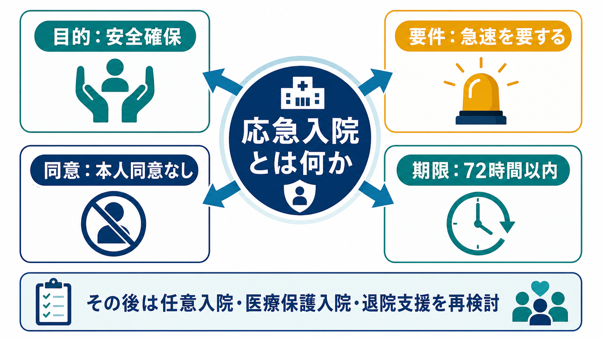
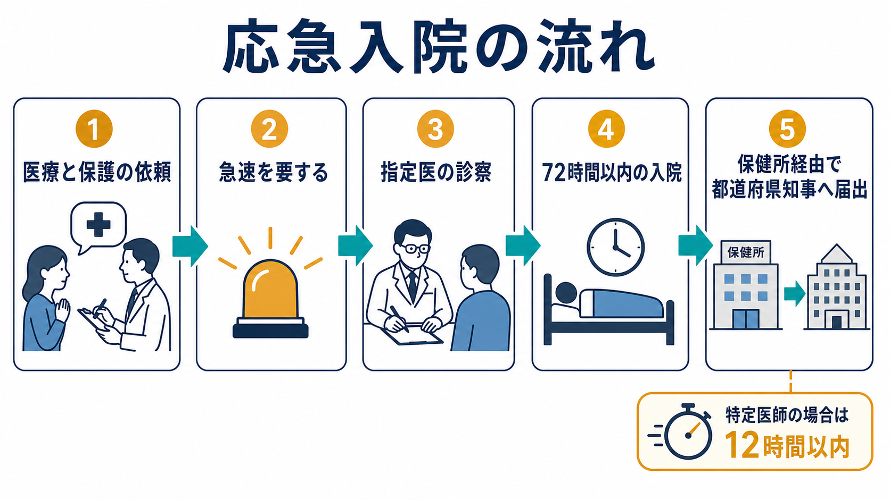

# 応急入院とは何か

## 要点

- 応急入院は、精神障害があり、直ちに入院させなければ医療と保護を図るうえで著しい支障があるが、本人同意による[[任意入院とは何か|任意入院]]ができず、家族等の同意もすぐ得られない場合に限って使われる短期の入院形態である[1][2]。
- 精神保健指定医の診察に基づく場合は72時間以内に限られる。一定の要件を満たす特定医師の診察に基づく場合は12時間以内である[1][5]。
- 本人の同意なしに入院できる制度であるため、告知、記録、届出、時間制限、応急入院指定病院の基準などが重要な安全装置になる[3][4]。
- 応急入院は「とりあえず長く入院させる制度」ではなく、危機を短時間で受け止め、本人の意思確認、身体・精神状態の評価、家族等や地域支援との調整、他の入院形態または退院支援への接続を急いで行う制度である。

## この記事で答える問い

1. 応急入院は、どのような場面で使われるのか。
2. 任意入院、医療保護入院、措置入院とは何が違うのか。
3. 72時間という時間制限には、どのような意味があるのか。
4. 本人の権利を守るために、どの手続きが重要なのか。

## まず結論

応急入院は、精神科救急や急性期の混乱場面で、本人の同意も家族等の同意もすぐには整わないが、入院を先送りすると本人の医療・保護に重大な支障が生じるときに使われる例外的な制度である[1][2]。本人の同意なしに自由を制約するため、制度の中心は「入院させる権限」ではなく、「短時間に限る」「専門医が判断する」「告知・届出を行う」「次の方針を速やかに決める」という制限と手続きにある。

このノートは教育・研究目的の整理であり、個別事例の法的判断、診断、治療指示を代替しない。実務では、現行法令、自治体運用、院内規程、精神保健指定医・多職種チームの判断を確認する必要がある。

## 背景

精神科入院は、できる限り本人の同意に基づいて行われることが望ましい。NCNP「こころの情報サイト」も、精神科の入院形態として任意入院、医療保護入院、措置入院を説明したうえで、本人が自ら選択する任意入院が最も望ましいと整理している[2]。しかし実際の救急場面では、激しい精神症状、せん妄や物質使用との鑑別、身体合併症、家族等と連絡が取れない状況、本人の強い拒否、夜間・休日の搬送などが重なり、通常の同意手続きだけでは安全確保が間に合わないことがある。

応急入院は、この隙間に置かれた制度である。つまり、[[精神保健福祉法とは何か|精神保健福祉法]]上の本人同意原則と、急迫した医療・保護の必要性との間で、最小限の時間だけ強制性を認める仕組みとして理解できる[1]。

## 基本概念

### 応急入院の中核

精神保健福祉法上、応急入院では、精神障害者であり、直ちに入院させなければ医療及び保護を図るうえで著しい支障があり、当該精神障害のために任意入院が行われる状態にないことが問題になる[1][5]。さらに、急速を要し、家族等の同意を得ることができないことが制度の前提である[2][5]。

ここで重要なのは、単に「本人が拒否した」だけでは足りないという点である。本人同意が得られないこと、家族等の同意がすぐ得られないこと、急速性、医療・保護上の著しい支障、専門的診察という複数の条件が重なって初めて、応急入院が検討される。

### 医療保護入院との違い

医療保護入院は、本人の同意が得られない場合に、精神保健指定医の診察と家族等または市町村長の同意などを要件として行われる入院形態である[2]。一方、応急入院は、その家族等の同意を得ることができない急迫場面で、72時間以内という短い上限のもとに行われる。したがって、応急入院は医療保護入院の簡略版ではなく、同意取得が間に合わない場合の短期ブリッジと考えるほうがよい。

### 措置入院・緊急措置入院との違い

措置入院は、自傷他害のおそれがある場合に、都道府県知事等の権限で行われる行政処分としての入院である[2]。応急入院は、本人の医療と保護の必要性が中心であり、必ずしも措置入院のような自傷他害のおそれを要件とするものではない。臨床的には危機対応という点で重なるが、判断主体、法的性質、要件が異なる。

## 仕組み

応急入院の流れは、概念的には次のように整理できる。

| 段階 | 確認すること | 意味 |
|---|---|---|
| 入口 | 精神症状、身体状態、安全、環境を評価する | 入院が本当に必要かを確認する |
| 急速性 | 待機や外来対応では医療・保護に著しい支障があるか | 応急性を確認する |
| 同意状況 | 本人同意による任意入院ができるか、家族等の同意が得られるか | より制限の少ない手段を検討する |
| 専門的判断 | 精神保健指定医または特定医師の診察があるか | 権利制限を専門判断にかける |
| 時間制限 | 72時間以内、特定医師では12時間以内か | 短期の例外措置にとどめる |
| 告知・届出 | 本人への書面告知、応急入院届等が整っているか | 透明性と外部確認につなげる |

厚生労働省は、精神科医療・精神保健福祉法に関する通知や入院関連様式をまとめて公開している[6]。令和6年度以降の入院関連様式には、「入院（応急入院）に際してのお知らせ」「応急入院届」「特定医師による応急入院届及び記録」が含まれている[3]。これは、応急入院が単なる現場判断ではなく、本人への告知と行政への届出を伴う制度であることを示している。

また、応急入院を行う病院には、応急入院者等を診療できる態勢、病床確保、速やかな検査体制、事後審査委員会など、厚生労働大臣が定める基準が置かれている[4]。短時間の入院であっても、受け入れ体制と事後確認がなければ、権利制限の適正性を保てないためである。

## 図解

1枚目の図は、応急入院を「安全確保」「急速性」「本人同意なし」「72時間以内」という4点から眺める概念地図である。2枚目の図は、医療と保護の依頼から、指定医診察、短時間入院、保健所経由の届出までを流れとして示している。

補足すると、図は制度理解のための概略であり、個別事例での法的判断を置き換えるものではない。実務では、本人の意思表明、身体疾患の除外、薬物・アルコール、認知症やせん妄、虐待・DV、未成年者、家族関係、地域の精神科救急体制などを同時に確認する必要がある。

## 臨床・研究との接続

臨床では、応急入院は危機介入、精神科救急、権利擁護、地域連携が交差する場面で現れる。本人が強く拒否していても、まずは本人が理解できる形で説明し、同意可能性を繰り返し評価する必要がある。[[インフォームドコンセントは精神科でどう行うのか|インフォームドコンセント]]は、同意書の有無だけでなく、説明、理解、意思表明、代替手段の検討を含むプロセスである。

研究では、応急入院の件数や比率だけを「重症度」の単純な代理指標として扱うと誤解が生じる。応急入院の発生は、症状の急性度だけでなく、家族等と連絡が取れるか、夜間休日の救急体制、地域の病床、応急入院指定病院の配置、自治体運用、退院後支援資源にも左右される。したがって、精神科救急のアウトカム研究では、入院形態、時間帯、搬送経路、身体合併症、地域支援、退院先を合わせて読む必要がある。

権利擁護の観点では、応急入院は[[精神科入院で患者の権利をどう守るのか|精神科入院における患者の権利]]と直結する。本人には入院形態や権利に関する説明が必要であり、通信・面会、退院請求、処遇改善請求、外部相談へのアクセスが重要になる[2][3]。必要に応じて[[隔離とは何か|隔離]]や身体的拘束が問題になる場合もあるが、それらは別の法的・臨床的要件に基づいて、必要最小限かつ継続的に見直されるべきである。

## よくある誤解

### 誤解1: 応急入院は、家族がいない人を長く入院させる制度である

応急入院は、家族等の同意がすぐ得られない急迫場面で使われる短期制度であり、精神保健指定医の診察に基づく場合でも72時間以内に限られる[1][5]。長期入院を正当化する制度ではない。

### 誤解2: 本人が拒否したら、すぐ応急入院になる

本人が拒否していることだけでは不十分である。任意入院ができる状態にないこと、直ちに入院させなければ医療・保護上著しい支障があること、急速を要し家族等の同意を得られないこと、専門的診察があることが問題になる[1][5]。

### 誤解3: 応急入院は措置入院と同じである

措置入院は、自傷他害のおそれに対する行政処分としての入院であり、応急入院とは要件も判断主体も異なる[2]。危機対応として似た場面で議論されることはあるが、制度上は区別して理解する必要がある。

### 誤解4: 72時間は「様子を見るための猶予時間」である

72時間は、本人の自由を制約できる上限であり、漫然と観察する時間ではない。身体・精神状態の再評価、本人への説明、家族等や地域支援との調整、退院可能性、任意入院や医療保護入院への移行の可否を急いで判断するための時間である。

## 関連ノート

- [[精神保健福祉法とは何か]]
- [[任意入院とは何か]]
- [[精神科入院で患者の権利をどう守るのか]]
- [[インフォームドコンセントは精神科でどう行うのか]]
- [[守秘義務とは何か]]
- [[隔離とは何か]]

関連ノート候補: 医療保護入院とは何か、措置入院とは何か、緊急措置入院とは何か、精神保健指定医とは何か、精神医療審査会とは何か、退院請求とは何か、処遇改善請求とは何か、精神科救急とは何か。

MOC更新候補: `MOC｜精神医学.md`、精神科入院制度の小索引、司法・制度・地域精神医療のMOC。

## 理解チェック

1. 応急入院が「短期のブリッジ」と言える理由は何か。
2. 応急入院と医療保護入院では、家族等の同意の扱いがどう違うか。
3. 応急入院と措置入院では、制度目的と要件がどう違うか。
4. 72時間以内という制限は、本人の権利擁護にどう関係するか。
5. 応急入院後に、多職種チームが早急に確認すべき生活・地域支援上の課題は何か。

## 未解決問題

- 応急入院の地域差は、精神科救急体制、病床、応急入院指定病院の配置、家族支援、自治体運用のどれに強く左右されるのか。
- 短時間の入院中に、本人への説明と意思決定支援をどのように実質化できるか。
- 応急入院後の退院支援や地域連携を、医療保護入院への移行だけに偏らせず、本人中心に設計するには何が必要か。

## 参考文献

[1] e-Gov法令検索. 精神保健及び精神障害者福祉に関する法律（昭和二十五年法律第百二十三号）. https://laws.e-gov.go.jp/law/325AC0100000123/

[2] 国立精神・神経医療研究センター精神保健研究所. 精神科の入院制度. こころの情報サイト. https://kokoro.ncnp.go.jp/support_hospitalizatio.php

[3] 厚生労働省. 精神保健福祉法に基づく入院に関する各種様式（令和6年度4月1日以降に用いるもの）. https://www.mhlw.go.jp/stf/seisakunitsuite/bunya/hukushi_kaigo/shougaishahukushi/kaisei_seisin/youshiki.html

[4] 厚生労働省. 精神保健及び精神障害者福祉に関する法律第三十三条の六第一項の規定に基づき厚生労働大臣の定める基準（昭和63年厚生省告示第127号）. https://www.mhlw.go.jp/web/t_doc?dataId=80133000&dataType=0&pageNo=1

[5] 厚生労働省. 押印を求める手続の見直しのための通知様式等の改正について（障発1225第1号, 令和2年12月25日）. https://www.mhlw.go.jp/content/000712887.pdf

[6] 厚生労働省. 精神科医療・精神保健福祉法について. https://www.mhlw.go.jp/stf/newpage_25203.html
